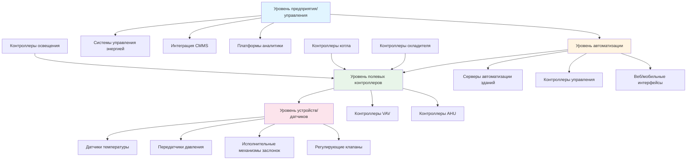

## Обзор

Архитектура систем автоматизации зданий (BAS) определяет взаимодействие устройств управления, сетей и программных уровней для управления оборудованием HVAC, освещением, безопасностью и другими системами здания. Выбор архитектуры влияет на масштабируемость системы, надежность, затраты на установку и долгосрочное обслуживание. Современные конструкции BAS следуют иерархическим структурам со стандартизированными протоколами связи, главным образом BACnet (ASHRAE 135) для обеспечения совместимости.

## Классификация архитектур

### Централизованная архитектура

Централизованные системы концентрируют логику управления и обработку в единственном контроллере управления или центральном контроллере установки. Полевые устройства функционируют как удаленные точки ввода-вывода, передавая данные датчиков центральному контроллеру и получая командные выходы.

**Характеристики:**
- Единственная точка управления и программирования
- Все алгоритмы управления выполняются на центральном процессоре
- Полевые устройства работают как сборщики данных и драйверы исполнительных механизмов
- Упрощенная наладка и обновления
- Более высокая уязвимость к отказу центрального контроллера

**Типичные применения:**
- Небольшие и средние здания (менее 9290 м²)
- Кампусы с одним объектом
- Проекты модернизации с унаследованными пневматическими системами
- Применения, требующие тесной центральной координации

### Распределенная архитектура

Распределенные системы распределяют интеллект по нескольким полевым контроллерам. Каждый контроллер выполняет локальные циклы управления независимо, одновременно взаимодействуя между собой для скоординированных последовательностей.

**Характеристики:**
- Интеллект, распределенный по полевым панелям и специализированным контроллерам приложений
- Контроллеры работают автономно в случае отказа сети
- Связь "точка-к-точке" через BACnet или аналогичные протоколы
- Масштабируемость от малых до больших установок
- Более высокие начальные затраты на программирование

**Типичные применения:**
- Большие коммерческие здания (более 9290 м²)
- Кампусы с несколькими зданиями
- Критически важные объекты, требующие высокой доступности
- Сложные системы с разнообразными типами оборудования

### Гибридная архитектура

Гибридные архитектуры сочетают централизованное управление функциональностью с распределенным полевым интеллектом. Центральный сервер автоматизации здания предоставляет пользовательский интерфейс, тренды, расписание и оптимизацию, в то время как полевые контроллеры выполняют циклы управления в реальном времени.

**Характеристики:**
- Центральный сервер для мониторинга, расписания и оптимизации
- Распределенные контроллеры для управления оборудованием в реальном времени
- Баланс между центральной координацией и автономией поля
- Наиболее распространена в современных коммерческих установках
- Облегчает интеграцию различных протокольных сред

**Типичные применения:**
- Средние и большие коммерческие здания
- Лечебные и учебные заведения
- Центры обработки данных и лабораторные здания
- Модернизация, интегрирующая новые системы с существующим управлением

## Уровни иерархии BAS

### Уровень 1: Уровень предприятия/управления

Уровень предприятия обеспечивает агрегирование данных на уровне всего объекта, управление энергией и интеграцию с бизнес-системами. Этот уровень включает:

- Системы управления энергией (EMS)
- Компьютеризованные системы управления техническим обслуживанием (CMMS)
- Платформы обнаружения и диагностики неисправностей (FDD)
- Продвинутые движки аналитики и оптимизации
- Корпоративные панели мониторинга и инструменты отчетности

Протоколы связи: OPC, веб-сервисы, базы данных SQL, REST API.

### Уровень 2: Уровень автоматизации

Уровень автоматизации размещает управление функциональностью, пользовательские интерфейсы и координацию на уровне системы. Компоненты включают:

- Серверы автоматизации зданий (рабочие станции)
- Контроллеры управления для оптимизации установки
- Веб-интерфейсы графического отображения
- Системы управления сигналами тревоги и уведомлений
- Базы данных тренда исторических данных

Протоколы связи: BACnet/IP, BACnet/Ethernet, Modbus TCP/IP.

### Уровень 3: Уровень полевых контроллеров

Полевые контроллеры выполняют алгоритмы управления в реальном времени для конкретного оборудования или зон. Этот уровень включает:

- Полевые панели прямого цифрового управления (DDC)
- Специализированные контроллеры приложений (ASC) для упакованного оборудования
- Контроллеры концевых блоков переменного воздушного объема (VAV)
- Программируемые логические контроллеры (PLC) для специализированных последовательностей
- Контроллеры унитарного оборудования с интерфейсами BACnet

Протоколы связи: BACnet MS/TP, BACnet/IP, LonWorks, Modbus RTU.

### Уровень 4: Уровень устройств/датчиков

Уровень устройства содержит датчики, исполнительные механизмы и окончательные элементы управления. Эти устройства интерфейсируют с физическими процессами:

- Датчики температуры, влажности, давления, расхода
- Исполнительные механизмы заслонок и клапанов
- Частотные приводы (VFD)
- Датчики присутствия и освещения
- Электросчетчики и вспомогательные счетчики

Связь: аналоговые сигналы (0–10 VDC, 4–20 мА), цифровой ввод-вывод или собственный протокол (BACnet, LonWorks).

## Сравнение архитектур

| Критерий | Централизованная | Распределенная | Гибридная |
|-----------|-------------|-------------|--------|
| **Обработка управления** | Центральный контроллер | Полевые контроллеры | Оба уровня |
| **Зависимость от сети** | Высокая | Низкая | Средняя |
| **Доступность системы** | Нижняя (единственная точка отказа) | Выше (автономная работа) | Высокая |
| **Масштабируемость** | Ограниченная | Отличная | Отличная |
| **Начальное программирование** | Ниже | Выше | Средний |
| **Время наладки** | Короче | Дольше | Среднее |
| **Совместимость** | Ограниченная | Высокая (с BACnet) | Высокая |
| **Типичный размер здания** | <9290 м² | >9290 м² | Все размеры |
| **Капитальные затраты** | Ниже | Выше | Средние |
| **Операционные затраты** | Средние | Ниже (энергоэффективность) | Ниже |

## Вопросы топологии сети

**Звездообразная топология:** Все полевые устройства подключаются к центральному концентратору или коммутатору. Упрощает поиск неисправностей, но создает единственную точку отказа в концентраторе.

**Последовательная топология:** Устройства подключаются последовательно по основному кабелю (обычно для BACnet MS/TP). Экономична в проводке, но весь магистраль отказывает при повреждении кабеля.

**Гибридная ячеистая топология:** Объединяет звездообразную топологию на уровне автоматизации (коммутаторы Ethernet) с последовательной или стационарной проводкой на полевом уровне. Обеспечивает избыточность где критично, при минимизации затрат.

## Стандарты протокола BACnet

Стандарт ASHRAE 135 (BACnet) определяет интероперабельную связь для автоматизации зданий. Ключевые архитектурные соображения:

- **BACnet/IP:** Маршрутизируется через стандартные ИТ-сети, подходит для уровней автоматизации и предприятия
- **BACnet MS/TP:** Главный-подчиненный/передача маркера по RS-485, типична для уровня полевых контроллеров
- **Устройства управления трансляцией BACnet (BBMD):** Включают маршрутизацию между сетями IP и MS/TP
- **BACnet/SC (Secure Connect):** Появляющийся стандарт для зашифрованной, дружественной к брандмауэру связи

## Принципы проектирования

1. **Изолируйте сети управления от ИТ-сетей**, используя VLAN или физически отдельную инфраструктуру для поддержания детерминированной производительности
2. **Реализуйте избыточные серверы управления** для критически важных объектов
3. **Распределите интеллект на полевой уровень**, чтобы обеспечить продолжение работы при отказе сети
4. **Стандартизируйте на BACnet** для максимальной совместимости и независимости от поставщика
5. **Планируйте для горизонтальной масштабируемости**, проектируя модульные сегменты сети, которые могут расширяться
6. **Документируйте архитектуру сети**, включая схемы IP-адресации, расположение магистралей MS/TP и адреса устройств

Правильный выбор архитектуры согласует возможности системы с требованиями операционной деятельности здания, уравновешивая начальные затраты с производительностью жизненного цикла и обслуживаемостью.
