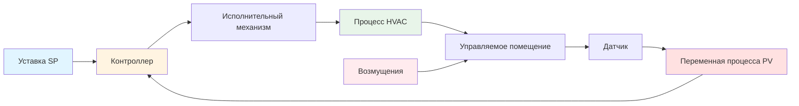

Теория управления обеспечивает математическую и концептуальную основу для понимания и проектирования эффективных систем управления HVAC. Эти принципы регулируют взаимодействие датчиков, контроллеров и исполнительных механизмов для поддержания уставок, компенсации возмущений и оптимизации производительности системы. Надлежащее применение теории управления обеспечивает точный контроль окружающей среды, энергетическую эффективность и стабильную работу системы при изменяющихся нагрузках и условиях.

## Терминология систем управления

Понимание стандартной терминологии управления обеспечивает четкую коммуникацию и систематический анализ систем управления HVAC.

**Уставка (SP):** Желаемое целевое значение управляемой переменной. В системе управления температурой зоны уставка представляет желаемую температуру помещения, обычно 22°C для охлаждения или 21°C для отопления.

**Переменная процесса (PV):** Измеренное значение контролируемой величины. Переменная процесса представляет фактическое состояние системы, обнаруженное датчиками. Для управления температурой переменная процесса — это измеренная температура помещения от датчика помещения.

**Управляемая переменная (MV):** Выход системы управления, который влияет на процесс. Она представляет положение исполнительного механизма или сигнал, который контроллер корректирует для приведения переменной процесса к уставке. Примеры включают положение клапана холодной воды (0–100%), скорость вентилятора подачи (%), или угол заслонки (градусы).

**Ошибка управления (e):** Отклонение между уставкой и переменной процесса, вычисляемое как e = SP − PV. Алгоритм управления обрабатывает эту ошибку для определения надлежащей коррекции управляемой переменной.

**Возмущение:** Внешние воздействия, влияющие на переменную процесса без действия контроллера. Возмущения HVAC включают нагрузки от людей, солнечные прибыли, инфильтрацию и условия погоды.

## Управление без обратной связи и с обратной связью

Системы управления работают в принципиально различных конфигурациях, которые определяют их способность компенсировать возмущения и достигать точного управления.

### Управление без обратной связи

Системы без обратной связи выполняют действия управления без измерения результирующей переменной процесса. Контроллер применяет заранее определенный выход на основе входных данных или расписаний, без обратной связи для проверки результата.

Характеристики управления без обратной связи:
- Отсутствие измерения управляемой переменной
- Невозможность автоматической компенсации возмущений
- Более простая реализация с меньшей стоимостью
- Производительность полностью зависит от точного моделирования системы
- Отсутствие проблем со стабильностью

**Пример HVAC:** Управление прогревом по времени, которое запускает систему отопления на полную мощность в течение фиксированной длительности, независимо от фактической температуры помещения. Система работает в течение запланированного времени без обратной связи о том, достигла ли помещение желаемую температуру.

### Управление с замкнутым контуром (обратной связью)

Системы с обратной связью непрерывно измеряют переменную процесса, сравнивают ее с уставкой и корректируют управляемую переменную для минимизации ошибки. Эта конфигурация обратной связи обеспечивает автоматическую компенсацию возмущений и саморегулирование.

Характеристики управления с обратной связью:
- Непрерывное измерение переменной процесса
- Автоматическая компенсация возмущений
- Достижение точного слежения за уставкой несмотря на ошибки моделирования
- Требует тщательного проектирования для обеспечения стабильности
- Более высокая сложность реализации

**Пример HVAC:** Управление температурой зоны, при котором термостат непрерывно измеряет температуру помещения, сравнивает ее с уставкой и модулирует клапан додогрева для поддержания желаемой температуры несмотря на изменяющиеся нагрузки от людей или солнечные прибыли.

## Режимы управления и их применение

Системы управления HVAC используют различные режимы управления в зависимости от требований процесса, допустимого отклонения и динамики системы. Каждый режим предлагает отличительные преимущества и ограничения.

| Режим управления | Описание | Преимущества | Недостатки | Типичные применения HVAC |
|------------------|---------|-------------|-----------|-------------------------|
| **Двухпозиционное (Вкл/Выкл)** | Выход переключается между полностью включено и полностью выключено на основе пересечения ошибкой нуля | Простой, низкая стоимость, не требует настройки | Колебания температуры, механический износ, дискомфорт | Жилые печи, модульные обогреватели, малые блочные установки |
| **Плавающее** | Выход увеличивается или уменьшается на основе величины ошибки без обратной связи положения | Простая реализация, низкая стоимость | Медленный отклик, смещение положения со временем | Электрические ступени отопления, старые пневматические системы |
| **Пропорциональное (P)** | Выход пропорционален текущей ошибке: MV = Kp × e | Быстрый отклик, плавное управление, стабильное | Смещение в установившемся режиме (пропорциональный коридор), невозможно исключить ошибку | Сброс температуры приточного воздуха, управление статическим давлением |
| **Пропорционально-интегральное (PI)** | Добавляет интегральное действие для исключения смещения: MV = Kp × e + Ki × ∫e dt | Нулевая ошибка в установившемся режиме, хорошая компенсация возмущений | Может вызвать перерегулирование и колебания при плохой настройке | Управление температурой зоны, управление холодной водой, большинство модулирующих приложений |
| **Пропорционально-интегрально-дифференциальное (PID)** | Добавляет дифференциальное действие для предсказательного управления: MV = Kp × e + Ki × ∫e dt + Kd × de/dt | Более быстрый отклик, уменьшенное перерегулирование, лучшие запасы стабильности | Чувствительно к шуму измерения, более сложная настройка | Быстрые тепловые процессы, каскадные контуры, критичные приложения управления |

## Архитектура ПИД-управления

Пропорционально-интегрально-дифференциальное управление представляет наиболее широко внедряемый алгоритм в приложениях HVAC. Уравнение управления объединяет три члена, реагирующие на различные аспекты сигнала ошибки:

**MV(t) = Kp × e(t) + Ki × ∫e(t)dt + Kd × de(t)/dt**

Где:
- Kp = коэффициент пропорционального усиления (безразмерный)
- Ki = коэффициент интегрального усиления (1/время)
- Kd = коэффициент дифференциального усиления (время)
- e(t) = сигнал ошибки (SP − PV)

**Пропорциональное действие:** Производит выход, пропорциональный текущей величине ошибки. Большие ошибки генерируют большие управляющие воздействия. Коэффициент пропорционального усиления определяет, насколько агрессивно контроллер реагирует, но пропорциональное действие само по себе не может исключить ошибку в установившемся режиме — фундаментальное ограничение, называемое пропорциональным коридором или смещением.

**Интегральное действие:** Накапливает ошибку во времени, увеличивая выход управления до тех пор, пока существует ошибка. Это действие продолжается до тех пор, пока ошибка не достигнет нуля, исключая смещение в установившемся режиме. Интегральное действие обеспечивает память, которая приводит систему к точной уставке. Чрезмерный интегральный коэффициент вызывает перерегулирование и устойчивые колебания.

**Дифференциальное действие:** Реагирует на скорость изменения ошибки, обеспечивая предсказательное управление, которое предсказывает тенденции будущих ошибок. Дифференциальное действие демпфирует колебания и снижает перерегулирование, позволяя более агрессивные коэффициенты пропорционального и интегрального усиления. Однако дифференциальное действие усиливает высокочастотный шум измерения, требуя фильтрации в практических реализациях.

Каждый режим управления вносит отличительные характеристики в поведение системы. Пропорциональное управление само по себе обеспечивает быстрый отклик, но оставляет постоянное смещение между уставкой и фактическим значением. Добавление интегрального действия исключает это смещение, но может вводить колебания при плохой настройке. Дифференциальное действие демпфирует колебания и позволяет более агрессивные коэффициенты пропорционального и интегрального усиления, но усиливает шум измерения.

Надлежащая настройка параметров ПИД определяет общую производительность системы. Агрессивная настройка обеспечивает быстрый отклик, но рискует нестабильностью, в то время как консервативная настройка обеспечивает стабильность в ущерб медленному отклику и плохой компенсации возмущений. Методы настройки варьируются от эмпирических правил до аналитических методов на основе идентификации системы.

## Динамика системы и передаточные функции

Передаточные функции обеспечивают математические представления динамики системы, связывая выходные отклики на входные изменения. Эти модели в частотной области позволяют анализировать стабильность системы, коэффициент усиления в установившемся режиме, постоянные времени и частотный отклик без решения сложных дифференциальных уравнений.

Системы первого порядка проявляют экспоненциальный отклик на ступенчатые входы, характеризуясь одной постоянной времени. Большинство тепловых процессов HVAC ведут себя приблизительно как системы первого порядка в их рабочем диапазоне. Системы второго порядка могут проявлять колебательное поведение в зависимости от коэффициента демпфирования, что актуально для анализа контуров управления с каскадной динамикой или интегральным действием.

Мертвое время представляет задержку между управляющим действием и его наблюдаемым эффектом на измеренную переменную. Задержки транспортировки в трубопроводных системах и задержки отклика датчика способствуют мертвому времени, которое принципиально ограничивает достижимую производительность управления. Системы со значительным мертвым временем относительно их постоянных времени требуют тщательного проектирования контроллера для поддержания стабильности.

## Анализ стабильности и производительности

Стабильность представляет наиболее критическое требование для любой системы управления. Нестабильная система проявляет растущие колебания, которые могут повредить оборудование и создать опасные условия. Методы анализа стабильности оценивают, достигнет ли система управления установившегося состояния после возмущений или изменений уставки.

Запас амплитуды и запас по фазе количественно определяют, насколько близко к нестабильности работает стабильная система. Адекватные запасы обеспечивают, что система переносит изменения коэффициентов процесса, шум измерения и неопределенности моделирования. Консервативные запасы повышают надежность, но могут пожертвовать производительностью.

Метрики производительности оценивают, насколько хорошо система управления соответствует спецификациям и требованиям комфорта жильцов:

| Метрика производительности | Определение | Значение для HVAC | Типичная спецификация |
|----------------------------|-------------|-------------------|----------------------|
| **Время нарастания** | Время для достижения PV 90% от конечного значения после изменения уставки | Определяет, насколько быстро зоны достигают комфортных условий при запуске | 5–15 минут для температуры зоны |
| **Время устаканивания** | Время, в течение которого PV остается в пределах ±2% от уставки | Указывает, когда система достигает стабильного управления после возмущения | 15–30 минут для температуры зоны |
| **Перерегулирование** | Максимальное превышение PV за уставку, выраженное в процентах | Влияет на комфорт и потери энергии от избыточного охлаждения/нагрева | <5% для критичных помещений, <10% для общих приложений |
| **Ошибка в установившемся режиме** | Постоянное отклонение между SP и PV в равновесии | Определяет точность управления температурой, давлением или потоком | ±0,3°C для температуры, ±25 Па для давления |
| **Коэффициент затухания** | Отношение амплитуд последовательных колебаний | Количественно определяет качество демпфирования—более низкие коэффициенты указывают на лучшее демпфирование | <0,25 для хорошо демпфированных систем |

Различные приложения приоритизируют различные аспекты производительности в зависимости от требований процесса и ограничений. Критичные среды, такие как лаборатории или хирургические кабинеты, требуют строгих спецификаций для всех метрик, в то время как обычные офисные помещения допускают более релаксированную производительность.

## Продвинутые стратегии управления

Каскадное управление использует несколько контроллеров в иерархической структуре, где внешний первичный контроллер устанавливает уставку для внутреннего вторичного контроллера. Эта архитектура улучшает компенсацию возмущений, когда возмущения влияют на вторичное измерение раньше первичной переменной. Распространенные приложения HVAC включают управление температурой приточного воздуха в каскаде с управлением положением клапана.

Управление с опережением измеряет возмущения непосредственно и компенсирует их до того, как они повлияют на управляемую переменную. В отличие от управления с обратной связью, которое реагирует на ошибки после их возникновения, управление с опережением обеспечивает упреждающее действие, которое минимизирует отклонения. Эффективное управление с опережением требует точного измерения возмущений и моделей процесса.

Управление соотношением поддерживает фиксированную зависимость между двумя переменными, обычно используется для координации заслонок наружного и рециркуляционного воздуха. Адаптивное управление корректирует параметры контроллера на основе измеренного поведения системы, приспосабливаясь к нелинейностям и времяизменяемой динамике, распространенной в системах HVAC.

## Характеристики клапанов и заслонок

Характеристики управляемых клапанов и заслонок определяют соотношение между выходом контроллера и фактическим потоком. Линейные характеристики обеспечивают равное изменение потока на единицу движения исполнительного механизма, в то время как равнопроцентные характеристики производят изменения потока, пропорциональные текущему потоку. Характеристики быстрого открытия обеспечивают максимальное изменение потока при низких положениях.

Установленные характеристики клапана отличаются от собственных характеристик из-за эффектов сопротивления системы. Полномочие клапана, отношение перепада давления на клапане к полному перепаду давления в системе, количественно определяет, насколько близко установленные характеристики соответствуют собственным характеристикам. Низкие полномочия ухудшают качество управления, производя чрезмерную чувствительность при высоких потоках и вялый отклик при низких потоках.

Характеристики заслонок зависят от геометрии и конфигурации лопастей. Противоположные лопастные заслонки обеспечивают лучшее управление потоком, чем параллельные лопастные заслонки, особенно на промежуточных положениях. Надлежащая калибровка исполнительного механизма обеспечивает достаточный крутящий момент для преодоления сил давления воздуха при сохранении точного контроля положения.

## Применение к системам HVAC

Принципы теории управления применяются во всех системах HVAC, от управления температурой отдельных зон до оптимизации центральных установок. Понимание динамики обратной связи объясняет, почему некоторые контуры управления колеблются, в то время как другие реагируют вяло. Анализ передаточных функций предсказывает, как модификации системы влияют на запасы стабильности и производительность.

Настройка ПИД, адаптированная к специфическим характеристикам процесса, оптимизирует энергоэффективность при поддержании комфорта. Каскадные и упреждающие стратегии справляются со сложными взаимодействиями в многозонных системах и приложениях с переменной нагрузкой. Надлежащая характеризация конечных управляющих элементов обеспечивает согласованную производительность во всем рабочем диапазоне.

Эти фундаментальные концепции позволяют систематическое проектирование систем управления, устранение неполадок в проблемах производительности и оптимизацию существующих установок. Овладение теорией управления отличает компетентное проектирование HVAC от методов проб и ошибок.
