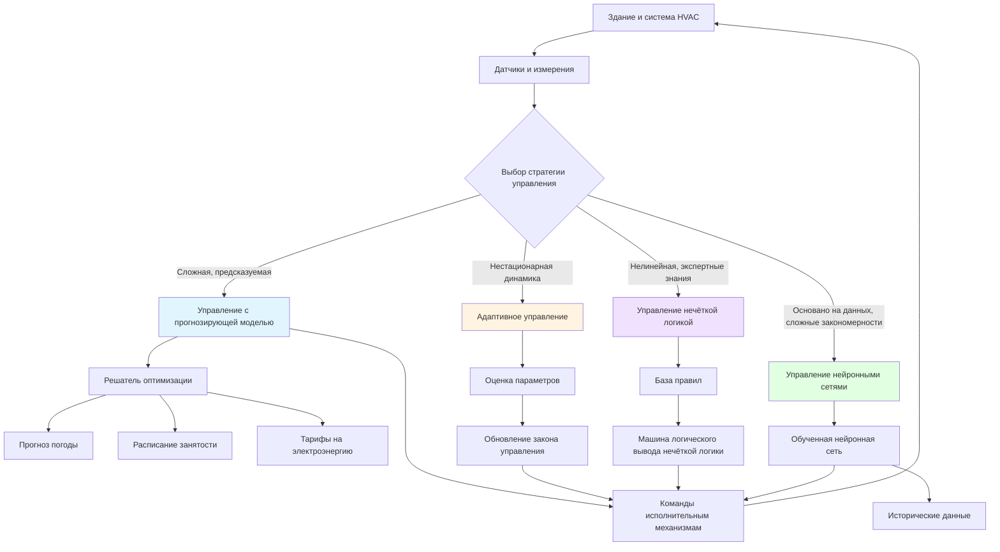

Передовая теория управления выходит за рамки классического управления с обратной связью, чтобы работать со сложными многомерными системами HVAC с нестационарной динамикой, ограничениями и задачами оптимизации. Эти методы используют математические модели, вычислительный интеллект и оптимизацию в реальном времени для достижения превосходной энергоэффективности, теплового комфорта и операционной производительности.

## Управление с прогнозирующей моделью (MPC)

Управление с прогнозирующей моделью представляет собой наиболее значительное достижение в технологии управления HVAC. MPC использует динамическую модель здания и системы HVAC для прогнозирования будущего поведения на конечном горизонте и вычисляет оптимальные управляющие воздействия путём решения задачи условной оптимизации на каждом временном шаге.

### Принцип действия MPC

Контроллер решает следующую задачу оптимизации:

**Минимизировать:** J = Σ[k=0 to N] {Q(T_zone[k] - T_setpoint)² + R(u[k])²}

**При условиях:**
- Динамика системы: x[k+1] = Ax[k] + Bu[k]
- Ограничения: u_min ≤ u[k] ≤ u_max
- Границы комфорта: T_min ≤ T_zone[k] ≤ T_max

Где:
- N = горизонт прогнозирования (типично 4–24 часа для HVAC)
- Q = весовой коэффициент штрафа на ошибку слежения
- R = весовой коэффициент штрафа на управляющее воздействие
- u[k] = управляющее воздействие (положение клапана, положение заслонки и т.д.)
- x[k] = вектор состояния (температуры, влажность, тепловые массы)

### Преимущества MPC в системах HVAC

**Экономия энергии:**
- Предвидит тепловые нагрузки на основе прогнозов погоды и расписания занятости
- Предварительное охлаждение или предварительный нагрев в периоды низких тарифов (управление спросом)
- Снижает пиковый спрос на 15–30% по сравнению с обычным управлением

**Обработка ограничений:**
- Явно соблюдает пределы мощности оборудования
- Поддерживает границы комфорта во время переходных процессов
- Координирует несколько подсистем (охладители, вентиляционные агрегаты, терминальные устройства)

**Многомерная оптимизация:**
- Обрабатывает взаимодействия между температурой, влажностью и качеством воздуха в помещении
- Балансирует конкурирующие цели (комфорт, энергия, качество воздуха в помещении)
- Оптимизирует производительность на системном уровне, а не на уровне отдельных компонентов

## Адаптивные системы управления

Адаптивное управление регулирует параметры контроллера в реальном времени для компенсации изменений системы, включая:
- Сезонные изменения тепловых свойств здания
- Деградация поверхностей теплопередачи (образование отложений)
- Изменения в режимах занятости
- Старение оборудования и дрейф производительности

### Адаптивное управление с эталонной моделью (MRAC)

MRAC определяет эталонную модель, представляющую желаемое поведение замкнутой системы. Механизм адаптации регулирует коэффициенты усиления контроллера, чтобы минимизировать ошибку между фактическим выходом системы и выходом эталонной модели.

**Закон адаптации:**
θ[k+1] = θ[k] + γ·e[k]·φ[k]

Где:
- θ = вектор параметров контроллера
- γ = коэффициент адаптации (типично 0,01–0,1)
- e = ошибка слежения
- φ = вектор регрессора (прошлые входы/выходы)

### Самонастраивающиеся регуляторы

Самонастраивающиеся регуляторы объединяют онлайн-идентификацию системы с проектированием управления. Контроллер:
1. Оценивает параметры модели на основе данных входа/выхода, используя рекурсивный метод наименьших квадратов
2. Вычисляет оптимальные коэффициенты управления на основе текущей оценки модели
3. Применяет управляющее воздействие и повторяет процесс

Этот подход компенсирует сезонные изменения динамики здания без ручной переналадки.

## Управление нечёткой логикой

Управление нечёткой логикой преобразует экспертные знания в математические правила, позволяя управлять без точных математических моделей. Особенно эффективно для систем HVAC с нелинейным поведением и качественными рекомендациями по эксплуатации.

### Структура контроллера нечёткой логики

**Фаззификация:** Преобразование чётких входов (ошибка температуры, скорость изменения) в значения нечёткого принадлежности.

**База правил:** ЕСЛИ ошибка_температуры ЕСТЬ большой_положительный И скорость ЕСТЬ положительная ТО клапан_охлаждения ЕСТЬ полностью_открыт

**Логический вывод:** Оценка всех правил и объединение выходов с использованием композиции минимума-максимума.

**Дефаззификация:** Преобразование нечёткого выхода в чёткий управляющий сигнал методом центроида.

### Применение в системах HVAC

- **Управление комфортом:** Правила типа «ЕСЛИ зона немного_теплая И люди активны ТО увеличить охлаждение умеренно»
- **Оптимизация пуска:** Агрессивное управление при больших ошибках, мягкое управление у заданного значения
- **Координация многозонных систем:** Приоритизация зон на основе занятости и отклонения от комфорта

Контроллеры нечёткой логики обычно снижают потребление энергии на 5–15% по сравнению с PID, улучшая показатели комфорта.

## Управление нейронными сетями

Искусственные нейронные сети обучаются политике управления на основе исторических данных, фиксируя сложные нелинейные связи между входами и оптимальными выходами.

### Прямые нейронные сети

Входной слой получает состояние системы (температуры, расходы, наружные условия), скрытые слои извлекают признаки, выходной слой производит управляющие сигналы. Обучение использует обратное распространение с данными из периодов оптимальной работы.

**Архитектура:**
- Входные узлы: 10–20 (температуры зон, температура наружного воздуха, солнечное излучение, занятость)
- Скрытые слои: 1–2 слоя с 5–15 узлами в каждом
- Выходные узлы: 2–5 (положение клапана охлаждения, уставка температуры подаваемого воздуха, скорость вентилятора)

### Рекуррентные нейронные сети (RNN)

RNN включают память о прошлых состояниях, позволяя прогнозировать тепловую динамику здания. Сети с длинной краткосрочной памятью (LSTM) превосходны в захвате долгосрочных зависимостей, таких как эффекты тепловой массы в течение 4–12 часов.

### Гибридные подходы

**Нейронная сеть + MPC:** Нейронная сеть обеспечивает быструю приблизительную модель для оптимизации MPC, снижая вычислительную нагрузку в 10–50 раз по сравнению с физическими моделями.

**Нейронная сеть + PID:** Нейронная сеть настраивает коэффициенты PID на основе условий работы, объединяя простоту PID с адаптивностью.

## Архитектура передового управления

## Сравнение стратегий управления

| Стратегия | Сложность | Экономия энергии | Затраты на внедрение | Вычислительная нагрузка | Робастность | Лучшее применение |
|----------|-----------|-----------------|-------------------|----------------------|------------|------------------|
| **MPC** | Очень высокая | 20–30% | Высокие (требуется модель) | Высокая (оптимизация) | Средняя | Крупные коммерческие здания, предсказуемые нагрузки |
| **Адаптивное управление** | Высокая | 10–20% | Средние | Средняя | Высокая | Системы с меняющейся динамикой, старое оборудование |
| **Нечёткая логика** | Средняя | 5–15% | Средние (экспертные правила) | Низкая | Высокая | Нелинейные системы, качественные задачи управления |
| **Нейронная сеть** | Высокая | 15–25% | Высокие (сбор данных) | Средняя | Низкая (требуется переобучение) | Сложные закономерности, достаточно исторических данных |
| **Классический PID** | Низкая | Базовая | Низкие | Очень низкая | Средняя | Простое однокольцевое управление, модернизация |

## Рекомендации по внедрению

**Управление с прогнозирующей моделью:**
- Требует проверенную тепловую модель здания (RC-сеть или физическую модель)
- Интеграция прогноза погоды необходима для высокой производительности
- Вычислительные ресурсы: многопроцессорный процессор или облачные вычисления для зданий площадью >4600 м²
- Возврат инвестиций: 2–4 года для крупных коммерческих зданий

**Адаптивное управление:**
- Инициализация консервативными параметрами для обеспечения стабильности во время адаптации
- Требуется возбуждение входного сигнала (достаточная вариация входов для оценки параметров)
- Мониторинг скорости адаптации для обнаружения отказов датчиков или несоответствия структуры модели

**Нечёткая логика:**
- Разработка базы правил требует компетентности в области HVAC и итеративной настройки
- Форма функций принадлежности значительно влияет на производительность (треугольная достаточна для большинства приложений)
- Объединение с PID для гибридных контроллеров нечёткой логики-PID, балансирующих простоту и интеллект

**Нейронная сеть:**
- Данные обучения должны охватывать полный диапазон работы (все сезоны, уровни занятости)
- Риск переобучения при недостаточности данных (минимум 6–12 месяцев рекомендуется)
- Валидация против физических ограничений предотвращает небезопасные управляющие воздействия
- Периодическое переобучение (ежеквартально) поддерживает производительность при изменении характеристик здания

## Метрики производительности

Оценка производительности передового управления с использованием:

**Метрики энергии:**
- Снижение кВч/м²/год по сравнению с базовым уровнем
- Снижение пикового спроса (кВ)
- Улучшение коэффициента производительности (COP)

**Метрики комфорта:**
- Процент времени в пределах зоны комфорта ASHRAE
- Распределение прогнозируемого среднего голоса (PMV)
- Перерегулирование и время установления при изменении заданного значения

**Экономические метрики:**
- Экономия затрат на энергию ($/год)
- Снижение платежей за спрос ($/месяц)
- Период возврата затрат на внедрение (лет)

## Ключевые источники

Передовая теория управления опирается на литературу по инженерии систем управления, оптимизации и искусственному интеллекту:

- **ASHRAE Guideline 36:** Последовательность операций высокой производительности для систем HVAC
- **Maciejowski, J.M.:** "Predictive Control with Constraints" — основы MPC
- **Åström, K.J. & Wittenmark, B.:** "Adaptive Control" — комплексная теория адаптивного управления
- **Driankov, D., Hellendoorn, H., & Reinfrank, M.:** "An Introduction to Fuzzy Control" — приложения нечёткой логики
- **Afram, A. & Janabi-Sharifi, F.:** "Theory and Applications of HVAC Control Systems" — реализация, специфичная для HVAC

Передовые методы управления преобразуют системы HVAC из реактивного оборудования в интеллектуальные, предвидящие системы, которые одновременно оптимизируют энергию, комфорт и затраты. Выбор зависит от сложности здания, доступной компетентности и целей производительности.
