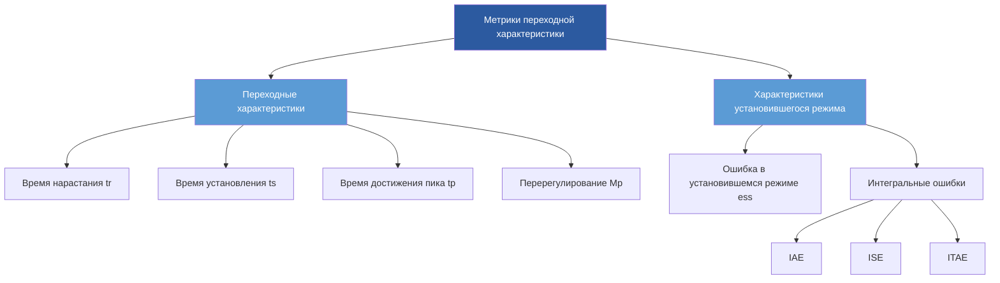

Метрики производительности системы управления обеспечивают количественные показатели для оценки эффективности реакции контроллера HVAC на изменения уставок и возмущения. Эти метрики направляют настройку контроллера, пусконаладку системы и постоянную оптимизацию производительности для обеспечения энергоэффективности, комфорта occupants и защиты оборудования.

## Характеристики переходного процесса

Переходная характеристика (step response) системы управления раскрывает критические атрибуты производительности. Когда контроллер получает ступенчатое изменение уставки, несколько измеримых характеристик определяют его поведение.

### Время нарастания и время установления

**Время нарастания** ($t_r$) представляет собой продолжительность, за которую управляемая переменная переходит от 10% до 90% от своего конечного значения. Более короткое время нарастания указывает на более быструю реакцию, но может привести к перерегулированию.

**Время установления** ($t_s$) определяет момент, когда управляемая переменная остается в пределах заданного допускного диапазона вокруг конечного значения. Существуют два распространенных критерия:

$$t_{s,2\%} = \text{время пребывания в пределах } \pm 2\% \text{ от конечного значения}$$

$$t_{s,5\%} = \text{время пребывания в пределах } \pm 5\% \text{ от конечного значения}$$

Руководство ASHRAE 36 рекомендует время установления менее 15 минут для контроля температуры в зонах и менее 5 минут для контроля температуры подаваемого воздуха для баланса между отзывчивостью и стабильностью.

### Перерегулирование и пиковая реакция

**Максимальное перерегулирование** количественно определяет, насколько управляемая переменная превышает свое конечное значение:

$$M_p = \frac{c(t_p) - c_{ss}}{c_{ss}} \times 100\%$$

где $c(t_p)$ — пиковое значение, а $c_{ss}$ — значение в установившемся режиме.

Избыточное перерегулирование приводит к потере энергии и может вызвать циклирование оборудования. Для применений HVAC перерегулирование должно оставаться ниже 10% для контроля температуры и 5% для контроля давления, чтобы предотвратить скачки дискомфорта и нагрузку на оборудование.

## Критерии интегральной производительности

Метрики интегральной ошибки оценивают совокупную производительность управления во времени, предоставляя одно числовое значение, характеризующее эффективность контроллера.

### Интеграл от абсолютной ошибки (IAE)

$$\text{IAE} = \int_0^{\infty} |e(t)| \, dt$$

где $e(t) = r(t) - c(t)$ — ошибка между эталонным значением и управляемой переменной.

IAE одинаково взвешивает все ошибки независимо от времени их возникновения. Оно штрафует как большие переходные ошибки, так и устойчивые ошибки в установившемся режиме.

### Интеграл от квадрата ошибки (ISE)

$$\text{ISE} = \int_0^{\infty} e^2(t) \, dt$$

ISE сильно штрафует большие ошибки из-за операции возведения в квадрат, что делает его чувствительным к перерегулированию и колебаниям. Эта метрика приоритизирует агрессивное управляющее воздействие для минимизации пиковых отклонений.

### Интеграл от взвешенной по времени абсолютной ошибки (ITAE)

$$\text{ITAE} = \int_0^{\infty} t \cdot |e(t)| \, dt$$

ITAE применяет возрастающий вес к ошибкам, возникающим позже во времени, подчеркивая быстрое установление и минимальную ошибку в установившемся режиме. Этот критерий хорошо согласуется с целями HVAC, где длительные отклонения от уставки приводят к кумулятивной потере энергии и дискомфорту.

## Сравнение критериев производительности

| Метрика | Формула | Основной фокус | Применение в HVAC |
|--------|---------|---------------|------------------|
| IAE | $\int_0^{\infty} \|e(t)\| dt$ | Общая величина ошибки | Общая оценка контроллера |
| ISE | $\int_0^{\infty} e^2(t) dt$ | Подавление больших ошибок | Системы, требующие строгого контроля |
| ITAE | $\int_0^{\infty} t \cdot \|e(t)\| dt$ | Быстрое установление, минимальное перерегулирование | Оптимизация энергопотребления, комфорт |
| Перерегулирование | $(c_{max} - c_{ss})/c_{ss}$ | Пиковое отклонение | Защита оборудования |
| Время установления | Время до $\pm 2\%$ или $\pm 5\%$ | Скорость реакции | Управление на основе присутствия |

## Метрики осцилляторного отклика

Контроллеры с недостаточным демпфированием демонстрируют осцилляторное поведение, характеризующееся:

**Коэффициент затухания**: Отношение амплитуд последовательных пиков в переходном процессе с недостаточным демпфированием:

$$\text{DR} = \frac{A_2}{A_1}$$

где $A_1$ и $A_2$ — амплитуды последовательных перерегулирований. Коэффициенты затухания ниже 0,25 указывают на хорошо демпфированные системы.

**Период колебаний** ($T_o$): Время между последовательными пиками. Увеличенный период колебаний указывает на медлительное управление, приводящее к потере энергии из-за повторяющихся циклов нагрева и охлаждения.

## Требования к производительности ASHRAE

Руководство ASHRAE 36-2021 устанавливает целевые показатели производительности управления:

| Петля управления | Время установления | Перерегулирование | Ошибка в установившемся режиме |
|------|----------|----------|---------------|
| Температура в зоне | < 15 мин | < 10% | $\pm 0,3°C$ |
| Температура подаваемого воздуха | < 5 мин | < 5% | $\pm 0,6°C$ |
| Статическое давление | < 3 мин | < 5% | $\pm 25$ Па |
| Уровень CO₂ | < 20 мин | < 15% | $\pm 50$ ppm |

## Оценка производительности контроллера

Непрерывный мониторинг метрик производительности позволяет:

1. **Проверка настройки**: Подтверждение соответствия параметров контроллера проектным спецификациям
2. **Обнаружение деградации**: Выявление ухудшения управления из-за дрейфа датчиков, износа исполнительных механизмов или изменений технологического процесса
3. **Количественная оценка энергопотребления**: Корреляция производительности управления с потреблением энергии
4. **Сравнительный анализ**: Бенчмаркинг нескольких контроллеров или систем

Метрики производительности обеспечивают объективные, количественные показатели, заменяющие субъективные оценки, что позволяет проводить оптимизацию систем управления HVAC на основе данных для улучшения комфорта, энергоэффективности и долговечности оборудования.
