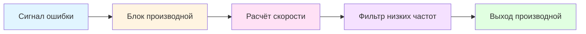

## Основы производной составляющей

Производная составляющая—также называемая действием по скорости или упреждающим действием—реагирует на скорость изменения сигнала ошибки. Этот режим предсказывает будущую ошибку путём экстраполяции текущих тенденций ошибки, обеспечивая корректирующее воздействие до возникновения больших отклонений. В приложениях HVAC производная составляющая уменьшает перерегулирование и повышает стабильность для процессов с значительными запаздываниями, таких как управление температурой на выходе воздухообработчика или системы с большой тепловой инерцией.

Производная составляющая создаёт управляющий выход, пропорциональный скорости изменения контролируемой переменной:

$$u_D(t) = K_d \frac{de(t)}{dt}$$

где $K_d$ — коэффициент производной (также выражаемый как $K_p \cdot T_d$ в зависимой форме), $e(t)$ — сигнал ошибки, и $u_D(t)$ — вклад производной в управляющий выход.

## Постоянная времени производной

Параметр времени производной $T_d$ представляет временной интервал, на который производная составляющая "смотрит вперёд". Он количественно определяет, какую будущую ошибку предсказывает регулятор на основе текущей скорости изменения:

$$u_D(t) = K_p \cdot T_d \cdot \frac{de(t)}{dt}$$

Увеличение $T_d$ повышает вклад производной, обеспечивая более сильное демпфирование, но также большую чувствительность к шуму. Производная составляющая достигает максимального выхода, когда ошибка изменяется с постоянной скоростью, равной $1/T_d$ в единицу времени.

### Идеальная и практическая производная

Идеальная передаточная функция производной в области Лапласа:

$$G_D(s) = K_d \cdot s = K_p \cdot T_d \cdot s$$

Эта идеальная форма бесконечно усиливает высокочастотный шум. Практические реализации используют фильтрованную производную с запаздыванием первого порядка:

$$G_D(s) = \frac{K_p \cdot T_d \cdot s}{1 + \frac{T_d}{N} \cdot s}$$

где $N$ — коэффициент фильтра производной (обычно 5-20). Это ограничивает усиление на высоких частотах, сохраняя производную составляющую на релевантных частотах процесса.

## Характеристики отклика производной

### Действие производной при изменении задания

При резком изменении задания производная ошибки скачкообразно возрастает, вызывая "дифференциальный скачок"—внезапный, большой управляющий выход. Это проблематично в системах HVAC с ограниченной авторитетностью исполнительных механизмов или ограничениями положения клапанов/заслонок.

**Производная по измерению (DoM):**

Вместо расчёта производной ошибки современные регуляторы рассчитывают производную контролируемой переменной:

$$u_D(t) = -K_p \cdot T_d \cdot \frac{d PV(t)}{dt}$$

Отрицательный знак учитывает связь между PV и ошибкой ($e = SP - PV$). Это исключает дифференциальный скачок при изменении задания, сохраняя демпфирование при возмущениях.

## Рекомендации по настройке производной

Параметры производной зависят от динамики процесса, уровней шума и целей управления. Следующая таблица предоставляет начальные значения для приложений HVAC:

| **Приложение** | **Типичное соотношение Td/Ti** | **Диапазон Td (секунды)** | **Примечания** |
|----------------|--------------------------------|---------------------------|----------------|
| Температура на выходе воздухообработчика | 0,1 - 0,25 | 10 - 60 | Среднее запаздывание, гладкая PV |
| Управление температурой в помещении | 0 | 0 | Высокий шум, большое мёртвое время—избегать D |
| Управление давлением пара | 0,2 - 0,4 | 5 - 30 | Быстрый процесс, низкий шум |
| Температура подачи охлаждённой воды | 0,1 - 0,2 | 15 - 90 | Большая тепловая инерция |
| Регулирование температуры горячей воды | 0 | 0 | Медленный процесс, шумная обратная связь |
| Статическое давление в воздуховоде | 0,05 - 0,15 | 2 - 10 | Быстрый привод, среднее шум |

### Правила настройки

Классические методы настройки предоставляют оценки $T_d$ на основе характеристик процесса:

| **Метод** | **Время производной Td** | **Условия** |
|-----------|--------------------------|------------|
| Ziegler-Nichols (скачок) | $T_d = 0,5 \cdot L$ | Мёртвое время $L$, постоянная времени $\tau$ известны |
| Cohen-Coon | $T_d = L \cdot \frac{0,37 - 0,37(L/\tau)}{1 + 0,185(L/\tau)}$ | Лучше для $L/\tau < 1$ |
| Lambda tuning | $T_d = \tau$ (если возможно) | Установить равной доминирующей постоянной времени |
| AMIGO | $T_d = 0,5 \cdot L$ | Подобно Z-N, специфично для процесса |

Для систем HVAC с шумом датчика уменьшите $T_d$ на 25-50% от расчётных значений и увеличьте коэффициент фильтра $N$ до 10-20.

## Практические ограничения

**Усиление шума:**

Производная составляющая усиливает шум измерения, что может вызвать износ исполнительных механизмов, потери энергии и нестабильность управления. Высокочастотный шум датчика (от квантования, электрических помех или турбулентного потока) усиливается в производной составляющей. Решения включают:

- Фильтрацию низких частот PV перед расчётом производной
- Производную по измерению (DoM) для избежания скачков, вызванных заданием
- Уменьшение коэффициента производной или постоянной времени
- Выбор датчиков с более низкими характеристиками шума

**Ограничения исполнительных механизмов:**

Выход производной может требовать быстрые движения исполнительного механизма, превышающие физические возможности. Заслонки и клапаны имеют ограничения скорости изменения (градусы в секунду или % открытия в секунду), ограничивающие отклик. Когда требования производной превышают эти ограничения, контур управления становится эффективно PI, нивелируя преимущества производной составляющей.

**Процессы с мёртвым временем:**

Процессы со значительным мёртвым временем (временной задержкой транспортировки) получают минимальную пользу от производной составляющей. Производная не может предсказать возмущения, которые ещё не повлияли на измерение. Для систем, где $L/\tau > 1$, производная составляющая даёт небольшое улучшение и может ухудшить производительность.

## Реализация в контроллерах HVAC

Современные контроллеры HVAC реализуют фильтрованную производную по измерению:

$$u_D[k] = \frac{T_d}{T_d + N \cdot T_s} \cdot u_D[k-1] - \frac{K_p \cdot T_d \cdot N}{T_d + N \cdot T_s} \cdot (PV[k] - PV[k-1])$$

где $T_s$ — интервал дискретизации, $k$ обозначает текущий отсчёт, и $k-1$ обозначает предыдущий отсчёт. Эта дискретная форма подходит для цифровых контроллеров с периодами дискретизации 1-10 секунд, типичными для систем управления зданиями.

### Условия отключения производной

Контроллеры часто отключают производную составляющую при определённых условиях:

- Операция в ручном режиме
- Режим отслеживания задания
- После настройки или после больших изменений задания (отключение с задержкой по времени)
- Обнаружение высокого шума PV (адаптивные алгоритмы)
- Насыщение или ограничение исполнительного механизма

## Ссылки инженерного содержания

Теория производной составляющей и методы настройки установлены в литературе по теории управления:

- **Åström & Hägglund**, *PID Controllers: Theory, Design, and Tuning* (ISA, 1995)—основополагающий текст по практической реализации PID
- **ASHRAE Handbook—HVAC Applications**, Глава 46: Приложения управления в системах HVAC
- **ISA-5.1-2009**: Стандарт обозначений и идентификации приборов
- **Seborg, Edgar, & Mellichamp**, *Process Dynamics and Control* (Wiley, 2016)—комплексное рассмотрение фильтрации производной и настройки

Практическая настройка производной в системах HVAC часто следует рекомендациям производителей от Johnson Controls, Honeywell, Siemens и документации Tridium, которые учитывают типичную динамику систем зданий и характеристики датчиков.
