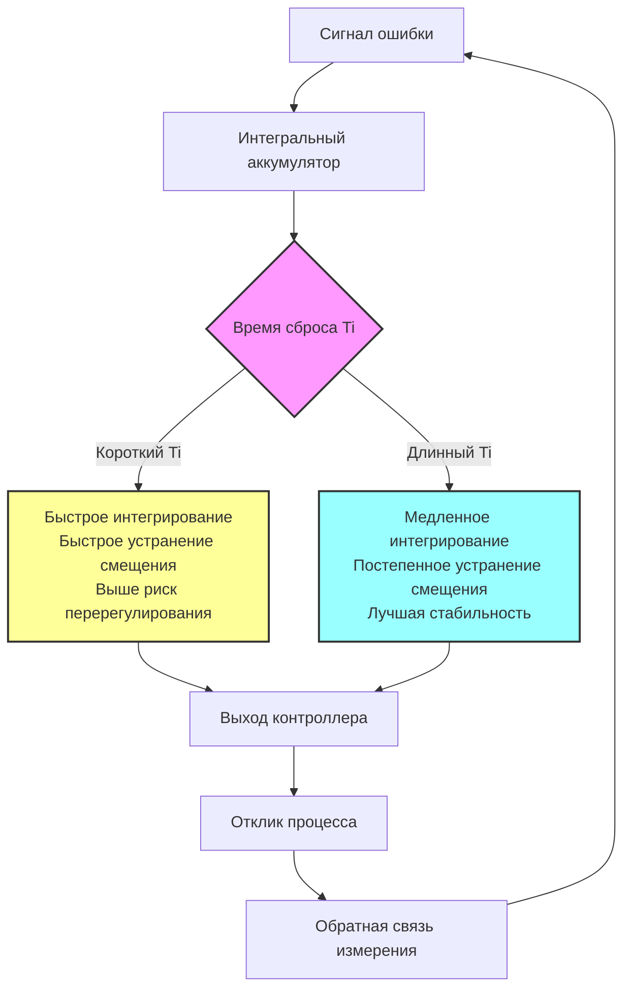

## Основы интегрального управления

Интегральное управление, также называемое действием сброса, устраняет смещение в установившемся состоянии путем непрерывного накопления ошибки во времени. В приложениях HVAC интегральное действие гарантирует, что контролируемые переменные, такие как температура в помещении или статическое давление в воздуховоде, в конечном итоге точно достигают своих уставок, а не просто приближаются к ним.

Интегральный член математически представляет площадь под кривой ошибки. Когда ошибка сохраняется — даже если она небольшая — интегральный член растет, увеличивая выход контроллера до тех пор, пока ошибка не будет устранена. Это делает интегральное управление необходимым для процессов с возмущениями нагрузки, что характерно для практически всех систем HVAC.

### Математическое представление

Интегральный вклад в выход контроллера составляет:

$$u_I(t) = K_i \int_0^t e(\tau) \, d\tau$$

Где:
- $u_I(t)$ = интегральный вклад в выход (%)
- $K_i$ = интегральный коэффициент (повторений/мин или %/(%·мин))
- $e(t)$ = сигнал ошибки (уставка - измерение)
- $\tau$ = переменная интегрирования

Альтернативно, выраженное с временем сброса $T_i$:

$$u_I(t) = \frac{K_p}{T_i} \int_0^t e(\tau) \, d\tau$$

Где:
- $T_i$ = время интегрирования или время сброса (минуты)
- $K_p$ = пропорциональный коэффициент (безразмерный)

Связь между интегральным коэффициентом и временем сброса:

$$K_i = \frac{K_p}{T_i}$$

### Дискретная реализация

В цифровых контроллерах HVAC интегральный член вычисляется в дискретные временные интервалы:

$$u_I[n] = u_I[n-1] + K_i \cdot e[n] \cdot \Delta t$$

Где $\Delta t$ — интервал времени выборки.

## Действие сброса в системах HVAC

Действие сброса непрерывно регулирует базовый выход контроллера. Термин "сброс" происходит от ранних пневматических контроллеров, где механизм интегрирования со временем выполнял сброс положения пропорциональной полосы.

### Ключевые характеристики

**Устранение смещения**: Первичная функция интегрального действия — удаление ошибки в установившемся состоянии. Без интегрального управления контроллер только с пропорциональной частью поддерживает постоянное смещение между уставкой и измерением.

**Медленная реакция**: Интегральное действие реагирует постепенно. Эта медленная реакция обеспечивает стабильность, но может вызвать перерегулирование при слишком агрессивной настройке.

**Компенсация нагрузки**: По мере изменения нагрузок (присутствие людей, солнечное излучение, внешние условия) интегральное действие автоматически регулирует выход для поддержания уставки без вмешательства оператора.

## Выбор времени сброса

Время сброса ($T_i$) определяет, насколько быстро интегральное действие реагирует на устойчивую ошибку. Меньшие времена сброса производят более быстрое интегральное действие, но рискуют нестабильностью.

### Рекомендации по настройке по приложениям

| Приложение HVAC | Типичное время сброса (Ti) | Интегральный коэффициент (Ki) | Обоснование |
|------------------|------------------------|-------------------|-----------|
| Управление клапаном охлажденной воды | 5-15 минут | 0,067-0,20 повторений/мин | Быстрый тепловой отклик требует умеренного сброса |
| Управление клапаном горячей воды | 8-20 минут | 0,05-0,125 повторений/мин | Медленнее охлаждения, большая тепловая инерция |
| Температура воздуха на выходе | 3-10 минут | 0,10-0,33 повторений/мин | Быстрый отклик воздушной стороны позволяет более быстрый сброс |
| Контроль температуры в помещении | 15-30 минут | 0,033-0,067 повторений/мин | Очень медленный процесс, требует медленного сброса |
| Статическое давление в воздуховоде | 2-8 минут | 0,125-0,50 повторений/мин | Быстрый пневматический отклик позволяет агрессивную настройку |
| Контроль давления в здании | 10-25 минут | 0,04-0,10 повторений/мин | Медленный процесс с большими задержками |
| Управление заслонкой экономайзера | 4-12 минут | 0,083-0,25 повторений/мин | Умеренный отклик для контроля смешанного воздуха |

## Размотка интеграла

Размотка интеграла происходит, когда интегральный член накапливается до чрезмерных значений при условиях устойчивой ошибки. Это происходит, когда выход контроллера насыщается на своих пределах (0% или 100%), но ошибка сохраняется, что приводит к продолжающемуся росту интегрального члена.

### Последствия размотки

**Чрезмерное перерегулирование**: Когда условия изменяются и переменная процесса приближается к уставке, накопленный интегральный член заставляет выход оставаться на максимуме, вызывая значительное перерегулирование.

**Задержка реакции**: Контроллер должен "размотать" чрезмерное интегральное накопление перед тем, как он сможет адекватно реагировать, создавая задержки отклика.

**Нестабильность**: Серьезная размотка может вызвать устойчивые колебания, когда контроллер повторно перерегулирует в обоих направлениях.

### Общие сценарии размотки в HVAC

1. **Условия запуска**: Во время нагрева или охлаждения большие ошибки температуры сохраняются при выходе, насыщенном на 100%
2. **Ограничения оборудования**: Заклинивший клапан, отказ заслонки или отключение оборудования при продолжающемся спросе
3. **Изменения уставки**: Большие скачки уставки вызывают устойчивую ошибку при переходе
4. **Сезонные переходы**: Режимы экономайзера или свободного охлаждения могут ограничивать полномочия клапана отопления/охлаждения

## Стратегии защиты от размотки

Эффективная защита от размотки критична для стабильного управления HVAC. Современные цифровые контроллеры реализуют несколько стратегий.

### Методы реализации защиты от размотки

| Метод | Описание | Преимущества | Недостатки | Лучшие приложения |
|--------|-------------|------------|---------------|-------------------|
| **Ограничение выхода** | Остановить интегральное накопление при достижении выходом пределов | Простая, эффективная для базового управления | Может не предотвратить все сценарии размотки | Простое управление клапаном/заслонкой |
| **Обратный расчет** | Вычислить идеальное интегральное значение из насыщенного выхода | Изощренная, гладкое восстановление | Требует настройки коэффициента обратного расчета | Критичное управление температурой |
| **Условное интегрирование** | Интегрировать только при уменьшении ошибки | Предотвращает накопление при насыщении | Может замедлить устранение смещения | Приложения с частым насыщением |
| **Пределы насыщения интеграла** | Ограничить интегральный член конкретным диапазоном | Предсказуемое поведение, легко реализовать | Требует тщательного выбора пределов | Большинство коммерческих контроллеров HVAC |
| **Динамическое ограничение сброса** | Регулировать скорость интегрирования на основе положения выхода | Адаптивно к условиям работы | Сложная реализация | Высокопроизводительное управление VAV или последовательностью |

### Защита от размотки с обратным расчетом

Наиболее эффективный метод защиты от размотки для приложений HVAC:

$$u_I[n] = u_I[n-1] + K_i \cdot e[n] \cdot \Delta t + \frac{1}{T_{bc}} (u_{sat} - u_{calc})$$

Где:
- $u_{sat}$ = фактический насыщенный выход (0% или 100%)
- $u_{calc}$ = вычисленный выход до насыщения
- $T_{bc}$ = постоянная времени обратного расчета

Разница $(u_{sat} - u_{calc})$ направляет интегральный член к значению, которое производит допустимый выход.

## Практические соображения реализации

### Интегральное действие при смене режимов

Когда системы HVAC переходят между режимами работы (отопление на охлаждение, занято на свободно), интегральный член должен управляться тщательно:

- **Безударный переход**: Инициализировать интеграл для поддержания текущего выхода при переходе режима
- **Сброс интеграла**: Очистить накопленное интегральное значение при переходе между несовместимыми режимами управления
- **Настройка по режимам**: Применить различные интегральные параметры для отопления и охлаждения

### Интеграция с логикой последовательности

В сложных последовательностях HVAC (VAV с дополнительным отоплением, многозонные установки) интегральное управление взаимодействует с переходами этапов:

- Приостановить интегрирование при изменениях этапов, чтобы позволить стабилизацию системы
- Использовать отдельные интегральные члены для различных этапов управления
- Координировать интегральное действие в каскадных циклах управления

### Мониторинг и диагностика

Отслеживать поведение интегрального члена для диагностики системы:

- Чрезмерное интегральное накопление указывает на недостаточное оборудование или проблемы с полномочиями управления
- Быстрые интегральные колебания предлагают проблемы настройки или шум измерения
- Устойчивое интегральное смещение может указывать на ошибки калибровки датчика или дисбаланс нагрузки

## Лучшие практики выбора скорости сброса

1. **Начните консервативно**: Начните с медленного сброса (длинный $T_i$) и постепенно увеличивайте скорость, контролируя стабильность
2. **Соответствуйте динамике процесса**: Время сброса должно быть в 2-4 раза больше доминирующей постоянной времени процесса
3. **Учтите переменность нагрузки**: Процессы с высокой переменностью нагрузки выигрывают от более медленного сброса для поддержания стабильности
4. **Учтите время задержки**: Системы со значительными задержками транспорта требуют более медленного интегрального действия
5. **Тестируйте под нагрузкой**: Проверьте интегральную производительность в условиях пиковой калорийности/охлаждения, а не только при легких нагрузках

Правильная настройка интегрального управления устраняет смещение при сохранении стабильной и чуткой работы системы HVAC при всех условиях эксплуатации.
