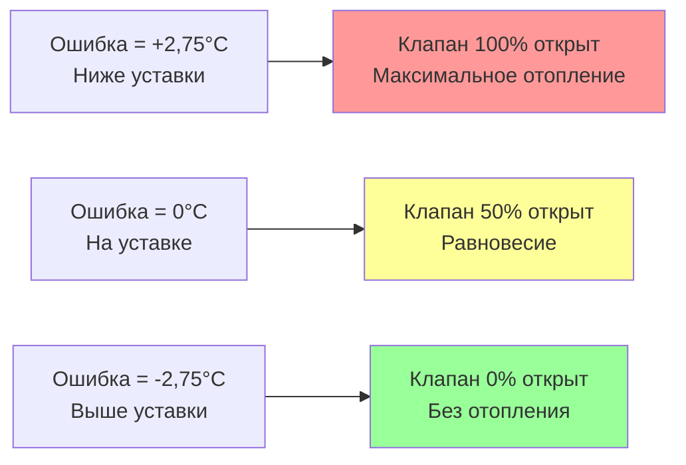

Пропорциональное регулирование представляет фундаментальное действие регулирования, при котором выход регулятора изменяется в прямой пропорции к ошибке регулирования. Эта линейная зависимость между ошибкой и выходом обеспечивает немедленный отклик на отклонения от уставки при сохранении стабильности благодаря ограниченному усилению. Понимание характеристик пропорционального регулирования позволяет эффективно применять его и выявляет его внутреннее ограничение, требующее дополнительных режимов регулирования.

## Концепция пропорционального коэффициента усиления

Закон пропорционального регулирования определяет выход как произведение коэффициента усиления и ошибки:

$$CO(t) = K_p \cdot e(t) + CO_0$$

Где $CO(t)$ — выход регулятора в момент времени $t$, $K_p$ — коэффициент пропорционального усиления, $e(t)$ — ошибка регулирования ($SP - PV$), а $CO_0$ — смещение выхода при нулевой ошибке.

Пропорциональный коэффициент усиления определяет чувствительность отклика регулятора на ошибки. Более высокое усиление производит большие изменения выхода для данных ошибок, приводя к агрессивному действию регулирования. Регулятор с $K_p = 2$ производит 2% изменения выхода на 1% ошибки. Более низкое усиление дает более мягкий отклик, при $K_p = 0,5$ производит только 0,5% изменения выхода на 1% ошибки.

Значение усиления напрямую влияет на поведение системы. Недостаточное усиление позволяет сохраняться большим установившимся ошибкам. Чрезмерное усиление вызывает колебания или нестабильность, когда регулятор чрезмерно реагирует на малые возмущения. Оптимальное усиление уравновешивает скорость отклика с запасами стабильности.

Для применения регулирования температуры в помещении рассмотрим регулятор с $K_p = 4$%/°C, управляющий клапаном отопления. Если температура в помещении составляет 20°C с уставкой 22°C:

$$e = 22 - 20 = 2°C$$

$$CO = 4 \frac{\%}{°C} \times 2°C + 50\% = 58\%$$

Клапан открывается на 58%, увеличивая тепловой выход для обогрева помещения. По мере повышения температуры к уставке ошибка уменьшается и клапан постепенно закрывается.

## Диапазон дросселирования и пропорциональная полоса

Диапазон дросселирования (также называемый пропорциональной полосой) представляет диапазон ошибок, производящий полномасштабное изменение выхода. Эта альтернативная спецификация обеспечивает интуитивное понимание чувствительности регулирования:

$$TR = \frac{100\%}{K_p}$$

Регулятор с $K_p = 5$%/% имеет диапазон дросселирования 20%. Регулятор с $K_p = 2$%/% имеет диапазон дросселирования 50%.

Для регулирования температуры диапазон дросселирования выражает температурный диапазон, вызывающий полный ход клапана. Клапан теплового регулирования с диапазоном дросселирования 5,5°C полностью закрывается при 2,75°C выше уставки и полностью открывается при 2,75°C ниже уставки. Промежуточные температуры производят пропорциональные положения клапана.

Узкий диапазон дросселирования (высокое усиление) обеспечивает плотное регулирование, но рискует нестабильностью. Широкий диапазон дросселирования (низкое усиление) обеспечивает стабильность, но допускает большие ошибки. Применение HVAC обычно применяет диапазон дросселирования 2,8–11°C для регулирования температуры и 0,035–0,14 кПа для регулирования давления.

## Смещение и ошибка установившегося состояния

Пропорциональное регулирование неотъемлемо производит ошибку установившегося состояния, называемую смещением или провалом. Это фундаментальное ограничение возникает потому, что пропорциональное воздействие требует ненулевую ошибку для поддержания ненулевого выхода.

Рассмотрим систему отопления в равновесии с уставкой 21°C. Помещение теряет 14,7 кВт тепла в окружающую среду. Нагревательный змеевик должен отдать ровно 14,7 кВт, чтобы поддерживать температуру. Если клапан должен быть открыт на 60%, чтобы отдать это тепло, пропорциональное регулирование требует достаточной ошибки для получения 60% выхода.

С $K_p = 5$%/°C и $CO_0 = 50\%$ (предполагая 50% выхода при нулевой ошибке):

$$60\% = K_p \cdot e + 50\%$$

$$60\% = 5\%/°C \cdot e + 50\%$$

$$e = 2°C$$

Помещение стабилизируется при 19°C, на 2°C ниже уставки 21°C. Это смещение 2°C представляет ошибку установившегося состояния, необходимую для поддержания открытия клапана на 60%.

Смещение увеличивается с нагрузкой. Если потери тепла увеличиваются до 22 кВт, требуя открытие клапана на 80%:

$$80\% = 5\%/°C \cdot e + 50\%$$

$$e = 6°C$$

Помещение теперь работает при 15°C, на 6°C ниже уставки. Смещение варьируется пропорционально отклонению нагрузки от условия проектирования, производящего нулевую ошибку.

Проблема смещения объясняет необходимость интегрального воздействия для точного регулирования уставки. Чистое пропорциональное регулирование подходит для приложений, допускающих ошибки установившегося состояния, таких как обогрев помещений, где люди принимают температуры в пределах ±1,1–1,7°C от уставки.

## Прямое и обратное воздействие

Регуляторы работают в режимах прямого или обратного воздействия в зависимости от требуемой зависимости между измеряемой величиной и выходом.

**Прямое воздействие** увеличивает выход при увеличении измеряемой величины. Когда регулируемая переменная повышается выше уставки (отрицательная ошибка для $SP - PV$), выход увеличивается. Применения охлаждения применяют прямое регулирование: повышение температуры увеличивает открытие клапана охлаждения или скорость компрессора.

**Обратное воздействие** уменьшает выход при увеличении измеряемой величины. Когда регулируемая переменная повышается выше уставки, выход уменьшается. Применения отопления применяют обратное регулирование: повышение температуры уменьшает открытие клапана отопления.

Математическое представление поддерживает оба режима через знак усиления:

$$CO(t) = \pm K_p \cdot (SP - PV) + CO_0$$

Положительное усиление производит обратное воздействие (отопление), отрицательное усиление производит прямое воздействие (охлаждение).

| Применение | Режим воздействия | Знак ошибки | Отклик выхода |
|-------------|-------------------|------------|------------------|
| Клапан отопления | Обратное | Температура ниже SP (+) | Увеличить открытие клапана |
| Клапан отопления | Обратное | Температура выше SP (-) | Уменьшить открытие клапана |
| Клапан охлаждения | Прямое | Температура выше SP (-) | Увеличить открытие клапана |
| Клапан охлаждения | Прямое | Температура ниже SP (+) | Уменьшить открытие клапана |
| Вентилятор приточного воздуха | Прямое | Давление ниже SP (+) | Увеличить скорость вентилятора |
| Вентилятор вытяжного воздуха | Прямое | Давление выше SP (-) | Уменьшить скорость вентилятора |

Неправильный выбор режима воздействия производит положительную обратную связь, приводя систему в направлении от уставки. Обратный регулятор на клапане охлаждения открывает клапан при повышении температуры, увеличивая охлаждение и дополнительно понижая температуру в неконтролируемом режиме.

## Регулирование нагрузки и выбор пропорционального усиления

Регулирование нагрузки описывает, насколько хорошо регулятор поддерживает уставку несмотря на изменения нагрузки. Пропорциональное регулирование показывает зависящее от нагрузки смещение, с качеством регулирования, определяемым величиной усиления.

Более высокое пропорциональное усиление улучшает регулирование нагрузки, снижая смещение для данных изменений нагрузки. Удвоение усиления вдвое снижает смещение. Однако пределы стабильности ограничивают максимальное используемое усиление. Оптимальное усиление максимизирует регулирование нагрузки при сохранении адекватных запасов стабильности.

Выбор усиления учитывает:

**Характеристики процесса:**
- Большой процессный коэффициент (высокая чувствительность к положению клапана) требует низкого коэффициента усиления регулятора
- Высокая постоянная времени процесса (медленная тепловая инерция) допускает более высокий коэффициент усиления регулятора
- Значительное время задержки ограничивает максимальное стабильное усиление

**Требования к производительности:**
- Плотный допуск уставки требует высокого усиления и интегрального воздействия
- Применения, допускающие смещение, могут использовать умеренное усиление без интегрального воздействия
- Быстрые изменения нагрузки выигрывают от более высокого усиления для быстрого отклика

**Запасы стабильности:**
- Колебательные процессы требуют консервативного усиления
- Хорошо демпфированные процессы принимают агрессивное усиление
- Критичные для безопасности приложения требуют консервативной настройки

**Типичные пропорциональные усиления HVAC:**

| Применение | Диапазон дросселирования | Пропорциональный коэффициент усиления |
|-------------|--------------------------|----------------------------------------|
| Температура в помещении (отопление) | 3,3–6,7°C | 15–30%/°C |
| Температура в помещении (охлаждение) | 2,2–4,4°C | 23–45%/°C |
| Температура подачи воздуха | 1,7–3,3°C | 30–59%/°C |
| Статическое давление в воздуховоде | 12,5–37,5 Па | 2,7–8 %/Па |
| Температура охлажденной воды | 1,1–2,2°C | 45–91%/°C |
| Температура горячей воды | 2,2–4,4°C | 23–45%/°C |

## Характеристики производительности

Пропорциональное регулирование обеспечивает несколько преимуществ для приложений HVAC:

**Простота:** Один параметр (усиление) требует настройки, минимизируя сложность настройки и время наладки.

**Стабильность:** Пропорциональное воздействие не вводит сдвиг фазы, сохраняя стабильность даже с значительным временем задержки процесса.

**Плавная работа:** Непрерывная модуляция предотвращает циклирование и износ, связанные с управлением типа включение-выключение.

**Немедленный отклик:** Выход изменяется мгновенно с ошибкой, обеспечивая быструю начальную коррекцию.

Ограничения ограничивают применения чистого пропорционального регулирования:

**Смещение установившегося состояния:** Зависящий от нагрузки провал предотвращает точное поддержание уставки.

**Чувствительность к нагрузке:** Выход варьируется с нагрузкой, требуя достаточной ошибки для поддержания каждой точки работы.

**Отсутствие компенсации возмущений:** Прошлые ошибки не влияют на текущий выход, позволяя возмущениям создать новое равновесное смещение.

**Компромисс настройки:** Один параметр не может независимо оптимизировать скорость отклика и стабильность.

Эти ограничения привели к алгоритмам пропорционально-интегральным (PI) и пропорционально-интегрально-дифференциальным (PID), которые добавляют интегральное воздействие для устранения смещения и дифференциальное воздействие для улучшения переходного отклика. Однако понимание пропорционального регулирования остается существенным, так как оно обеспечивает первичное действие регулирования в составных алгоритмах.

## Практические применения HVAC

Чистое пропорциональное регулирование подходит для приложений, где смещение установившегося состояния приемлемо и ценится простота:

**Обогрев в некритичных помещениях:** Склады, хранилища и промышленные пространства допускают колебания температуры ±1,1–1,7°C. Пропорциональное регулирование поддерживает приемлемый комфорт с минимальной настройкой.

**Регулирование давления с внутренней интеграцией:** Регулирование давления подачи воздуха обработчика на системах с ограниченным объемом показывает интегрирующее поведение через накопление воздуха. Сам процесс обеспечивает интегральное воздействие, позволяя пропорциональному регулированию достичь нулевого смещения.

**Регулирование соотношения:** Поддержание фиксированного соотношения между потоками использует пропорциональное регулирование с одним потоком, отслеживающим другой. Смещение в абсолютных значениях не влияет на поддержание соотношения.

**Последовательный запуск с ведущим-ведомым:** Ступенчатое управление несколькими агрегатами на основе нагрузки использует пропорциональное регулирование для модуляции ведущего агрегата, с дополнительными агрегатами, запускающимися на основе пороговых значений нагрузки.

Большинство современных приложений HVAC применяют PI или PID регулирование для устранения смещения. Однако пропорциональный член обеспечивает первичное действие регулирования, с интегральным и дифференциальным членами, дополняющими достижение конкретных целей производительности. Правильный выбор пропорционального усиления остается первым и наиболее критичным шагом в настройке PID.
