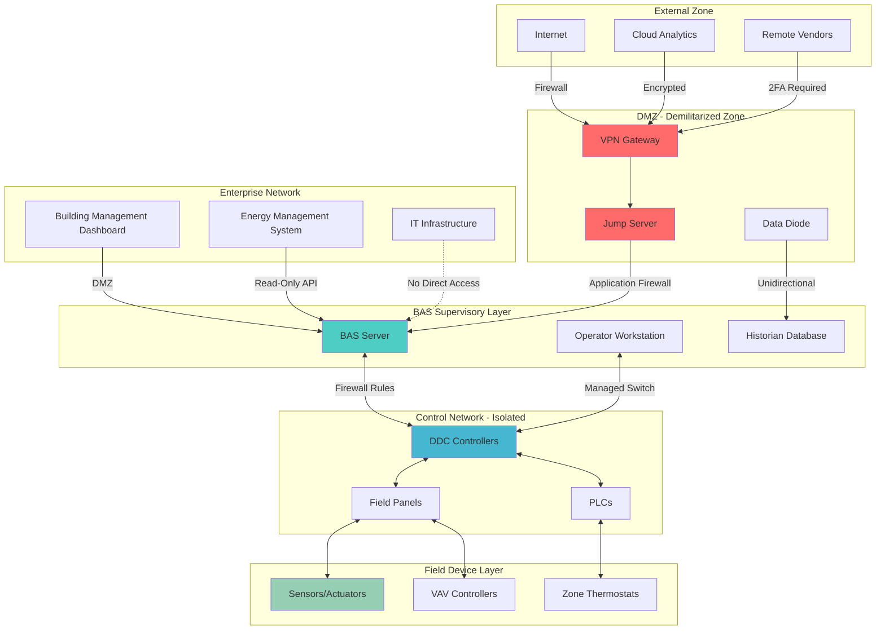

Системы автоматизации зданий (BAS) и сети управления HVAC представляют критическую инфраструктуру, уязвимую для киберугроз. Современные архитектуры BAS интегрируют области IT и OT (операционные технологии), создавая поверхности атак, требующие многоуровневых стратегий защиты. Данный материал освещает средства кибербезопасности, необходимые для защиты систем климатизации от несанкционированного доступа, утечек данных и нарушения операционной деятельности.

## Архитектура сегментации сети

Сегментация сети изолирует компоненты BAS от корпоративных сетей и Интернета, ограничивая горизонтальное распространение во время инцидентов безопасности. Основной принцип заключается в создании отдельных зон безопасности с контролируемыми путями коммуникации.

**Зоны сегментации:**

- **Уровень 0 (полевые устройства):** датчики, исполнительные механизмы, контроллеры VAV, зональные термостаты
- **Уровень 1 (слой управления):** контроллеры DDC, программируемые логические контроллеры, панели управления
- **Уровень 2 (надзорный):** серверы BAS, рабочие станции операторов, HMI (интерфейс человеко-машинного взаимодействия)
- **Уровень 3 (корпоративный):** системы управления зданием, платформы управления энергией
- **Уровень 4 (внешний):** облачные сервисы, удаленный доступ, подключения поставщиков

**Реализация сегментации:**

VLAN (виртуальные локальные сети) обеспечивают логическое разделение на общей физической инфраструктуре. Каждая зона BAS работает на выделенных VLAN со списками контроля доступа (ACL), определяющими разрешенный трафик. Брандмауэры между зонами применяют строгие правила входящего/исходящего трафика на основе принципа наименьших привилегий.

Физическая сегментация с использованием отдельных сетевых коммутаторов обеспечивает превосходную изоляцию для критических управляющих контуров. Неуправляемые коммутаторы на уровне полевых устройств предотвращают несанкционированное изменение конфигурации, в то время как управляемые коммутаторы на надзорных уровнях позволяют осуществлять мониторинг трафика и безопасность портов.

## Платформа контроля доступа

Контроль доступа ограничивает взаимодействие с системой только авторизованным персоналом с законной операционной необходимостью. Платформа объединяет аутентификацию (проверку личности), авторизацию (предоставление разрешений) и учет (регистрацию действий).

| Тип управления | Реализация | Уровень безопасности | Случай применения |
|-------------|----------------|----------------|----------|
| Однофакторная | Только пароль | Низкий | Доступ только для чтения некритичных систем |
| Двухфакторная (2FA) | Пароль + OTP/токен | Средний | Рабочие станции операторов |
| Многофакторная (MFA) | Пароль + биометрия + местоположение | Высокий | Административный доступ |
| На основе сертификатов | Инфраструктура PKI | Очень высокий | Связь между сервисами |
| Zero Trust | Непрерывная верификация | Максимальный | Облачные системы |

**Управление доступом на основе ролей (RBAC):**

RBAC назначает разрешения на основе должностных функций, а не отдельных пользователей. Типичные роли BAS включают:

- **Просмотр:** мониторинг только для чтения, без изменения уставок
- **Оператор:** корректировка уставок в определенных диапазонах, подтверждение тревог
- **Техник:** изменение графиков, переопределение управления, локальное диагностирование
- **Инженер:** конфигурирование контроллеров, изменение последовательностей, сетевые изменения
- **Администратор:** управление пользователями, параметры безопасности, системные изменения

**Требования к аутентификации:**

Пароли должны соответствовать стандартам сложности: минимум 12 символов, смешанный регистр, цифры, специальные символы. Смена пароля каждые 90 дней для обычных пользователей, 60 дней для привилегированных учетных записей. Блокировка учетной записи после пяти неудачных попыток предотвращает атаки подбора.

Аутентификация на основе сертификатов с использованием сертификатов X.509 обеспечивает более строгую безопасность для BACnet/SC (безопасное подключение) и других зашифрованных протоколов. Инфраструктура открытых ключей (PKI) управляет выдачей, обновлением и отзывом сертификатов.

## Протоколы шифрования

Шифрование защищает конфиденциальность данных при передаче и хранении. Реализации BAS требуют шифрования для удаленного доступа, взаимодействия между зонами и облачной интеграции.

**Безопасность транспортного уровня (TLS):**

TLS 1.2 или выше шифруют каналы связи между компонентами BAS. Устаревшие протоколы (SSL, TLS 1.0, TLS 1.1) содержат известные уязвимости и должны быть отключены. Валидация сертификатов предотвращает атаки перехвата.

**Шифрование для конкретных протоколов:**

- **BACnet/SC:** встроенное шифрование с использованием TLS с websockets
- **Modbus:** Modbus/TCP с туннелированием VPN или шифрованием на уровне приложения
- **LonWorks:** VPN IPsec для каналов IP-852
- **OPC UA:** встроенные режимы безопасности (подпись, подпись и шифрование)

**Реализация VPN:**

Виртуальные частные сети создают зашифрованные туннели для удаленного доступа. VPN IPsec работают на сетевом уровне, шифруя весь трафик между узлами. VPN SSL/TLS обеспечивают доступ на уровне приложения через веб-браузеры или клиенты.

Разделенное туннелирование должно быть отключено для удаленного доступа поставщиков, чтобы предотвратить маршрутизацию трафика BAS через незащищенные сети. Все сеансы VPN требуют многофакторной аутентификации и автоматического отключения после 30 минут неактивности.

## Мониторинг безопасности и обнаружение угроз

Непрерывный мониторинг выявляет аномальное поведение, указывающее на инциденты безопасности. Мониторинг безопасности BAS охватывает анализ сетевого трафика, агрегацию логов и аналитику поведения.

**Компоненты мониторинга:**

| Компонент | Функция | Возможность обнаружения |
|-----------|----------|---------------------|
| Сетевой IDS/IPS | Глубокий анализ пакетов | Нарушения протокола, известные сигнатуры атак |
| Платформа SIEM | Корреляция логов | Многоэтапные атаки, эскалация привилегий |
| Анализ сетевого трафика | Отклонение от базовой линии | Инъекция команд, горизонтальное распространение |
| Мониторинг целостности файлов | Проверка контрольной суммы | Несанкционированные изменения конфигурации |
| Обнаружение на конечной точке | Мониторинг процессов | Выполнение вредоноса, кража учетных данных |

**Критические источники логов:**

- Попытки аутентификации (успешные/неудачные)
- Изменения конфигурации с привязкой к пользователю
- Установление/завершение сетевых соединений
- Генерация и подтверждение тревог
- Обновления программного обеспечения/микропрограмм
- Запросы к базе данных и изменения

**Реагирование на инциденты:**

Инциденты безопасности требуют документированных процедур реагирования. Первоначальное реагирование включает локализацию (изоляцию затронутых сегментов), ликвидацию (удаление угроз) и восстановление (возврат в нормальное состояние). Криминалистический анализ определяет коренную причину и векторы атак.

## Лучшие практики кибербезопасности

| Область практики | Требование | Частота реализации |
|--------------|-------------|-------------------------|
| Управление патчами | Применение обновлений безопасности | В течение 30 дней с момента выпуска |
| Сканирование уязвимостей | Сканирование сети и приложений | Ежеквартально |
| Тестирование на проникновение | Авторизованные имитационные атаки | Ежегодно |
| Аудиты безопасности | Проверка конфигурации | Два раза в год |
| Проверка резервной копии | Тестирование процедур восстановления | Ежемесячно |
| Проверка доступа пользователей | Удаление неактивных учетных записей | Ежеквартально |
| Обучение безопасности | Программы повышения осведомленности сотрудников | Ежегодно |

**Соответствие ASHRAE/NIST:**

Руководство ASHRAE 36 освещает кибербезопасность BAS в последовательностях высокоэффективных систем. NIST SP 800-82 предоставляет руководство по безопасности систем промышленного управления, применимое к сетям BAS. NIST Cybersecurity Framework (CSF) предлагает структуру управления рисками: выявление (Identify), защита (Protect), обнаружение (Detect), реагирование (Respond), восстановление (Recover).

**Укрепление конфигурации по умолчанию:**

Измените все учетные данные по умолчанию сразу после установки. Отключите неиспользуемые сервисы и протоколы (Telnet, FTP, SNMPv1/v2). Закройте ненужные сетевые порты. Включите аудит логирования на максимальном уровне детализации. Отключите порты USB на критических устройствах, чтобы предотвратить несанкционированную передачу данных.

**Безопасность цепи поставок:**

Проверьте подлинность микропрограмм с использованием цифровых подписей. Ведите реестр компонентов программного обеспечения (SBOM) для отслеживания уязвимостей. Установите защищенные процедуры доступа поставщиков с временно ограниченными учетными данными и мониторингом сеансов.

Кибербезопасность для BAS требует постоянной бдительности. Угрозы постоянно развиваются, требуя регулярной переоценки средств управления, возможностей мониторинга и процедур реагирования для сохранения операционной целостности и безопасности населения.
