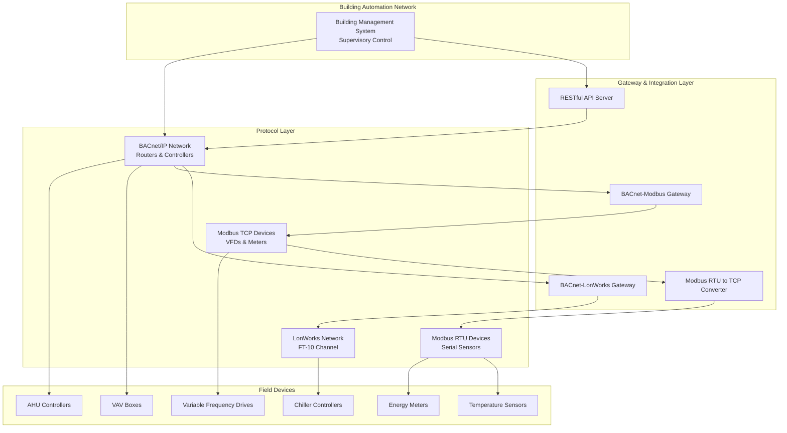

## Обзор интеграции протоколов

Системы автоматизации зданий требуют безупречного взаимодействия между различным оборудованием от разных производителей. Интеграция и совместимость обеспечивают централизованный мониторинг, управление и оптимизацию систем HVAC через стандартизованные протоколы связи. Основные протоколы — BACnet, LonWorks и Modbus — каждый выполняет отличительную роль в современных архитектурах управления зданиями.

Успешная интеграция зависит от понимания характеристик протоколов, выбора надлежащих топологий сетей и реализации шлюзов или драйверов, когда встроенная совместимость отсутствует. Стандарт ASHRAE 135 определяет BACnet как отраслевой стандарт для сетей автоматизации и управления зданиями, устанавливая основу для независимой от производителя интеграции.

## Основные протоколы связи HVAC

### BACnet (Building Automation and Control Networks)

BACnet обеспечивает объектно-ориентированное представление данных со стандартизованными услугами для чтения, записи и подписки на данные автоматизации зданий. Определенный стандартом ASHRAE 135, BACnet поддерживает несколько физических уровней, включая IP, MS/TP (Master-Slave/Token-Passing) и устаревший ARCNET.

**Ключевые характеристики:**
- Архитектура, основанная на объектах, со стандартизованными типами объектов (аналоговый вход, бинарный выход, расписание и т.д.)
- Услуги включают ReadProperty, WriteProperty, подписки COV (Change of Value)
- Встроенная поддержка трендинга, тревог и планирования
- Маршрутизация на уровне сети обеспечивает взаимодействие между сетями

**Варианты физического уровня:**
- BACnet/IP: основан на Ethernet, использует существующую IT-инфраструктуру, поддерживает крупные сети
- BACnet MS/TP: последовательная RS-485, экономичен для связи полевых устройств, типичные скорости передачи 9600–76 800 бит/с
- BACnet/SC: Secure Connect через веб-сокеты, развивающийся стандарт для зашифрованного взаимодействия

### LonWorks (ISO/IEC 14908)

LonWorks использует одноранговую архитектуру с сетевыми переменными для обмена данными. Первоначально разработан корпорацией Echelon, стандартизирован как ISO/IEC 14908.

**Ключевые характеристики:**
- Сетевые переменные (NV) обеспечивают прямое связывание между устройствами
- Технология на основе микросхемы Neuron с распределенным интеллектом
- Поддерживает витую пару (FT-10), силовые линии, IP и оптоволокно
- Совместимость через стандартные типы сетевых переменных (SNVT)

**Области применения:**
- Системы автоматизации зданий прошлых поколений
- Сети управления освещением
- Специализированное оборудование HVAC с сертификацией LonMark

### Modbus

Modbus — простой протокол «мастер-ведомый», широко используемый для промышленной автоматизации и связи оборудования HVAC. Разработан компанией Modicon в 1979 году и остается распространенным благодаря простоте и свободной реализации.

**Варианты:**
- Modbus RTU: двоичный последовательный протокол через RS-232/RS-485, детерминированная синхронизация
- Modbus TCP/IP: протокол приложения Modbus через TCP, порт 502
- Modbus ASCII: кодированный в ASCII последовательный вариант, менее распространен

**Характеристики:**
- Адресация, основанная на регистрах (регистры хранения, входные регистры, катушки, дискретные входы)
- Коды функций для операций чтения/записи (FC03: Read Holding Registers, FC16: Write Multiple Registers)
- Отсутствие встроенной объектной модели или стандартизованного представления данных
- Требует карт регистров, специфичных для производителя, для интерпретации

## Сравнение протоколов

| Функция | BACnet | LonWorks | Modbus RTU | Modbus TCP |
|---------|--------|----------|------------|------------|
| Архитектура | Объектно-ориентированная | Одноранговая (NV) | Мастер-ведомый | Клиент-сервер |
| Стандартизация | ASHRAE 135 | ISO/IEC 14908 | De facto | De facto |
| Модель данных | Объекты и свойства | Сетевые переменные | Регистры | Регистры |
| Обнаружение | Who-Is/I-Am | Service Pin | Ручная конфигурация | Ручная конфигурация |
| Пропускная способность | Средняя-высокая | Средняя | Низкая | Средняя |
| Типичная скорость | 10–100 Мбит/с (IP) | 78 кбит/с (FT-10) | 9600–115200 бит/с | 100 Мбит/с |
| Встроенная совместимость | Высокая | Средняя | Низкая | Низкая |
| Сложность | Высокая | Средняя | Низкая | Низкая |

## Подходы к интеграции

### Шлюзы протоколов

Шлюзы протоколов преобразуют связь между несовместимыми протоколами, обеспечивая интеграцию оборудования нескольких производителей. Шлюзы работают на уровне приложения, отображая объекты, регистры или сетевые переменные между доменами протоколов.

**Функции шлюза:**
- Преобразование данных и конвертация форматов
- Отображение услуг, специфичных для протокола (например, BACnet ReadProperty для Modbus FC03)
- Буферизация и кэширование данных для оптимизации опроса
- Передача тревог и событий

**Рекомендации по реализации:**
- Конфигурация отображения точек определяет соответствие между исходными и целевыми данными
- Интервалы опроса влияют на задержку обновления и нагрузку на сеть
- Отчеты на основе COV или исключений уменьшают ненужный трафик
- Ограничение возможностей шлюза (точки, устройства, пропускная способность) должно соответствовать масштабу системы

**Распространенные типы шлюзов:**
- BACnet/IP для Modbus TCP: раскрывает регистры Modbus как объекты BACnet
- Маршрутизатор BACnet MS/TP для BACnet/IP: расширяет полевые сети MS/TP на IP-магистраль
- LonWorks для BACnet: отображает SNVT LonMark на стандартизованные объекты BACnet

### Встроенные драйверы протоколов

Системы управления зданиями реализуют встроенные драйверы протоколов для прямого взаимодействия без промежуточных шлюзов. Программное обеспечение драйвера выполняет операции протокольного стека на сервере BMS или контроллере.

**Характеристики драйвера:**
- Меньшая задержка в сравнении с интеграцией на основе шлюза
- Прямой доступ к функциям, специфичным для протокола (трендинг BACnet, коды исключений Modbus)
- Требует поддержки платформой BMS для каждого протокола
- Конфигурация включает адресацию устройства, параметры сети и отображение точек

**Распространенные реализации драйверов:**
- Драйвер BACnet: поддерживает обнаружение устройств, просмотр объектов, подписки COV
- Драйвер Modbus: реализует роль мастера с настраиваемыми расписаниями опроса
- Драйвер OPC: подключается к серверам OPC для стандартизованного доступа к промышленным данным

### Интеграция на основе API

Современные системы управления зданиями предоставляют REST API для интеграции веб-сервисов, облачного подключения и разработки приложений третьих сторон.

**Преимущества интеграции API:**
- Независимый от платформы доступ с использованием протоколов HTTP/HTTPS
- Сериализация данных JSON или XML для удобочитаемых форматов
- Поддержка вебхуков для управления событиями
- Механизмы аутентификации OAuth2 или ключ API

**Типичные конечные точки API:**
- GET /devices: получение инвентаря устройств
- GET /points/{id}/value: чтение текущего значения точки
- POST /points/{id}/command: запись команды на управляемую точку
- GET /alarms: запрос активных тревог и событий

**Шаблоны интеграции:**
- Облачная агрегация: локальная BMS отправляет данные на облачные платформы аналитики
- Мобильные приложения: доступ HTTPS для удаленного мониторинга и управления
- Системы управления энергией: периодическое получение данных для управления спросом

## Стандарты совместимости и передовые методы

**Соответствие ASHRAE 135 (BACnet):**
- Укажите устройства, включенные в BACnet Testing Laboratories (BTL), для доказанной совместимости
- Определите требуемые BACnet Interoperability Building Blocks (BIBB) в спецификациях
- Используйте стандартизованные типы объектов и свойства для максимальной гибкости производителя

**Требования к документации:**
- Поддерживайте заявления о соответствии реализации протокола (PICS для BACnet)
- Документируйте карты регистров для устройств Modbus с типами данных и масштабированием
- Предоставляйте сведения о привязке сетевых переменных для установок LonWorks

**Проектирование сети:**
- Сегментируйте сети по протоколам для минимизации трафика трансляции
- Реализуйте VLAN для изоляции трафика BACnet/IP от сетей IT
- Размеры сегментов MS/TP для избежания задержек маркерной передачи (обычно максимум 32 устройства)
- Используйте отдельные каналы RS-485 для сетей Modbus RTU для предотвращения конфликтов адресов

**Соображения безопасности:**
- Включайте BACnet/SC для зашифрованного взаимодействия где поддерживается
- Реализуйте правила брандмауэра, ограничивающие трафик протокола до авторизованных подсетей
- Используйте туннели VPN для удаленного доступа к BMS вместо раскрытия протоколов в интернет
- Применяйте аутентификацию на подключениях Modbus TCP где это поддерживается прошивкой устройства

Интеграция и совместимость преобразуют изолированное оборудование HVAC в согласованные системы автоматизации зданий, способные к оптимизированной производительности, энергоэффективности и централизованному обнаружению неисправностей.

## Компоненты

- Bacnet Integration
- Bacnet Ip
- Bacnet Mstp
- Bacnet Objects
- Bacnet Services
- Lonworks Integration
- Modbus Rtu Integration
- Modbus Tcp Integration
- Opc Integration
- Haystack Tagging
- Brick Schema
- Api Integration
- Restful Api
- Web Services
