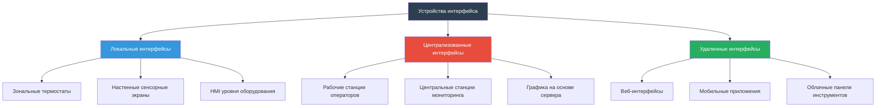

Устройства интерфейса служат критически важным звеном между операторами зданий и системами управления HVAC, обеспечивая мониторинг, контроль и оптимизацию оборудования климатического контроля. Эти интерфейсы «человек-машина» (HMI) варьируются от простых термостатов до сложных рабочих станций операторов, управляющих портфелями целых зданий.

## Иерархия устройств интерфейса

## Термостаты и локальные элементы управления

Термостаты представляют собой наиболее распространенные устройства интерфейса HVAC, обеспечивая контроль температуры на уровне зоны и взаимодействие с жильцами. Современные термостаты эволюционировали от простых биметаллических коммутирующих устройств до сложных контроллеров на основе микропроцессоров.

**Категории термостатов:**

- **Непрограммируемые термостаты:** базовая регулировка уставки с ручным выбором режима
- **Программируемые термостаты:** планирование на основе времени с несколькими периодами в сутки (пробуждение, день, вечер, сон)
- **Умные термостаты:** подключенные к сети устройства с алгоритмами обучения, обнаружением присутствия и удаленным доступом
- **Коммуникационные термостаты:** интеграция с системами автоматизации зданий через BACnet, Modbus или проприетарные протоколы

Настенные сенсорные экраны расширяют функциональность термостата путем отображения множества параметров системы, предоставления доступа к дополнительным настройкам и графического представления работы системы. Эти устройства обычно оснащены емкостными сенсорными экранами диагональю 8,9–25 см с настраиваемыми пользовательскими интерфейсами.

## Рабочие станции операторов

Рабочие станции операторов служат централизованными командными центрами для систем автоматизации зданий, обеспечивая комплексные возможности мониторинга и управления несколькими зданиями или кампусами.

### Требования к оборудованию

| Компонент | Минимальная спецификация | Рекомендуемая спецификация |
|-----------|----------------------|---------------------------|
| Процессор | Intel Core i5 | Intel Core i7 или AMD Ryzen 7 |
| ОЗУ | 8 ГБ | 16 ГБ или больше |
| Хранилище | 256 ГБ SSD | 512 ГБ NVMe SSD |
| Разрешение дисплея | 1920 x 1080 (Full HD) | 2560 x 1440 (QHD) или два монитора |
| Сетевой интерфейс | Ethernet 1 Гбит/с | Ethernet 1 Гбит/с с резервным подключением |
| Операционная система | Windows 10 Pro | Windows 10/11 Pro или Enterprise |
| Графика | Интегрированная графика | Выделенный GPU для крупномасштабной графики |

### Функциональность программного обеспечения

Программное обеспечение рабочей станции оператора должно обеспечивать визуализацию в реальном времени, управление аварийными сигналами, анализ тенденций и функции управления. ASHRAE Guideline 13-2015 устанавливает требования к пользовательскому интерфейсу для систем автоматизации зданий, подчеркивая интуитивную навигацию, согласованные графические представления и надлежащее приоритизирование аварийных сигналов.

**Основные возможности рабочей станции:**

- **Графическое представление системы:** планы этажей, механические схемы и схемы систем с наложением живых данных
- **Управление аварийными сигналами:** приоритизированный дисплей аварийных сигналов с фильтрацией, подтверждением и историческими журналами аварийных сигналов
- **Тренд и регистрация данных:** дисплеи трендов в реальном времени и исторические с настраиваемыми диапазонами времени и наложением нескольких точек
- **Планирование:** планы на основе календаря с обработкой исключений для праздников и специальных событий
- **Формирование отчетов:** автоматические отчеты об энергии, сводки производительности системы и документация по техническому обслуживанию
- **Управление базой данных:** конфигурация точки, резервная копия системы и контроль версий

## Веб-интерфейсы

Веб-интерфейсы исключают необходимость в специализированном программном обеспечении рабочей станции, обеспечивая функциональность автоматизации зданий через стандартные веб-браузеры. Эта архитектура имеет несколько преимуществ:

- **Независимость платформы:** доступ с любого устройства с современным браузером (Windows, macOS, Linux, планшеты)
- **Упрощенное развертывание:** не требуется установка или обслуживание клиентского программного обеспечения
- **Централизованные обновления:** обновления программного обеспечения на стороне сервера автоматически доступны всем пользователям
- **Масштабируемость:** поддержка неограниченного количества одновременных пользователей на основе емкости сервера

Веб-интерфейсы используют HTML5, CSS3 и фреймворки JavaScript для доставки адаптивных дизайнов, которые адаптируются к различным размерам экрана. Обновления данных в реальном времени обычно используют подключения WebSocket или события, отправленные сервером, для эффективного взаимодействия.

Соображения безопасности для веб-интерфейсов включают шифрование HTTPS, многофакторную аутентификацию, контроль доступа на основе ролей и политики тайм-аута сеанса. ASHRAE Standard 135.1-2013 (BACnet secure connect) предоставляет рекомендации по защите коммуникаций автоматизации зданий.

## Мобильные приложения

Мобильные приложения расширяют доступ к автоматизации зданий на смартфоны и планшеты, обеспечивая удаленный мониторинг и управление из любого места. Мобильные интерфейсы отдают приоритет основным функциям из-за ограниченного экранного пространства.

**Функции мобильного приложения:**

- **Представления панели инструментов:** ключевые показатели производительности и статус системы с первого взгляда
- **Уведомления об аварийных сигналах:** push-уведомления о критических аварийных сигналах, требующих немедленного внимания
- **Регулировка температуры:** удаленное изменение уставки и выбор режима
- **Управление присутствием:** изменение режима здания для раннего прихода или продленного рабочего времени
- **Мониторинг энергии:** отслеживание потребления энергии в реальном времени и затрат
- **Быстрые элементы управления:** часто используемые функции доступны в пределах двух нажатий на экран

Нативные приложения (iOS/Android) обеспечивают лучшую производительность и автономную функциональность по сравнению с мобильными веб-приложениями. Гибридные фреймворки, такие как React Native или Flutter, позволяют разработку кроссплатформы с общими кодовыми базами.

## Требования к проектированию HMI

ASHRAE Guideline 13 определяет требования к интерфейсам «человек-машина» для обеспечения последовательной и интуитивной работы различных систем автоматизации зданий.

### Требования к дисплею

| Параметр | Спецификация |
|-----------|--------------|
| Частота обновления | 1–5 секунд для динамических значений |
| Цветовое кодирование | Согласованное во всей графике (красный = аварийный сигнал, желтый = предупреждение, зеленый = нормальное) |
| Размер шрифта | Минимум 10 пунктов для компьютера, 14 пунктов для мобильного устройства |
| Коэффициент контрастности | Минимум 4,5:1 для обычного текста, 3:1 для крупного текста |
| Независимость разрешения | Графика масштабируется без потери качества |
| Время ответа | <2 секунды для подтверждения выполнения команды пользователя |

### Стандарты навигации

- Максимум три уровня навигационной глубины для доступа к любой функции
- Навигация навигационная цепочка, показывающая текущее местоположение в иерархии системы
- Контекстная справка, доступная с любого экрана
- Согласованное использование значков и размещение во всех интерфейсах
- Быстрый доступ к сводке аварийных сигналов с любого экрана

## Представление данных и анализ

Эффективные устройства интерфейса преобразуют необработанные данные датчиков в практическую информацию с помощью методов визуализации:

- **Графика в реальном времени:** анимированные представления оборудования, показывающие статус операции
- **Диаграммы тренда:** линейные графики, отображающие изменения параметров во времени с настраиваемыми осями
- **Графики сравнения:** несколько зданий или периодов времени, наложенные для анализа производительности
- **Тепловые карты:** цветовые коды планов этажей, указывающие распределение температуры или интенсивность энергии
- **Диаграммы рассеяния:** анализ корреляции между связанными параметрами (температура наружного воздуха в зависимости от потребления энергии)

Хранение исторических данных позволяет проводить судебно-техническую экспертизу производительности системы, отказов оборудования и закономерностей потребления энергии. Требования к хранилищу масштабируются с количеством точек и частотой регистрации; типичные установки требуют 1–5 ТБ хранилища для многолетних баз данных истории.

## Панели инструментов энергии

Специализированные панели инструментов энергии обеспечивают владельцам и операторам зданий видимость потребления энергии, затрат и показателей эффективности. Эти интерфейсы обычно интегрируют данные счетчика коммунальных услуг, часы работы оборудования и расчетные значения интенсивности использования энергии (EUI).

Компоненты панели инструментов включают:

- **Спрос в реальном времени:** текущий электрический спрос (кВт) в сравнении с пиковыми лимитами и пороговыми значениями тарифов коммунальных услуг
- **Итоги потребления:** дневное, месячное и годовое потребление энергии по типам топлива
- **Отслеживание затрат:** затраты на энергию с применением графика тарифов и расчетом платежей по спросу
- **Сравнительный анализ:** сравнение с предыдущими периодами, аналогичными зданиями или целевыми показателями производительности ASHRAE Standard 100
- **Углеродный след:** выбросы парниковых газов, рассчитанные на основе потребления энергии

Устройства интерфейса представляют окно оператора в сложные системы HVAC, напрямую влияя на эффективность операции, энергетическую производительность и комфорт жильцов благодаря их проектированию, функциональности и удобству использования.
