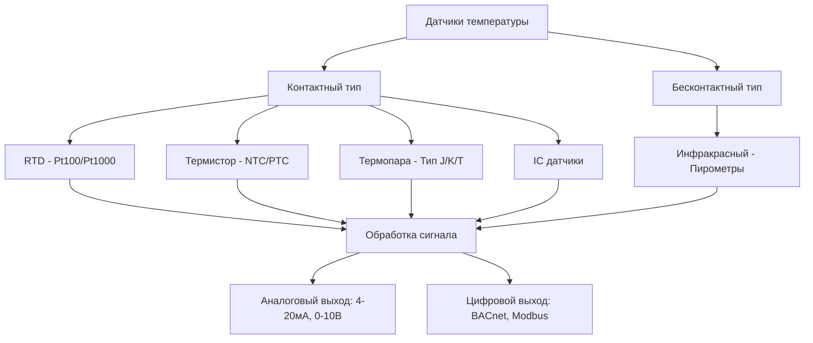
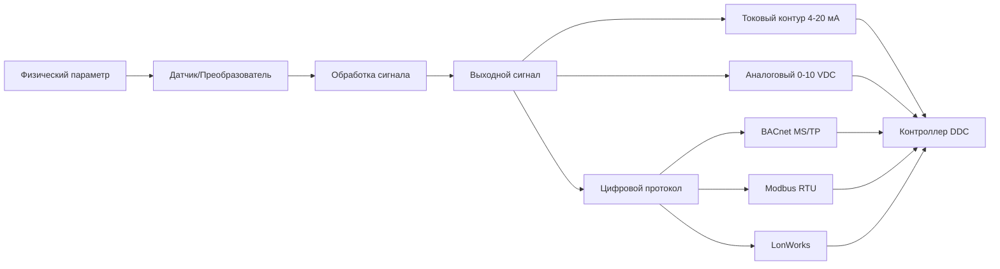

## Обзор

Датчики и преобразователи формируют сенсорный уровень систем автоматизации зданий, преобразуя физические величины в электрические сигналы для мониторинга и управления. Точность датчика, время отклика и надежность напрямую влияют на производительность системы, энергоэффективность и комфорт пользователей.

## Фундаментальные характеристики датчиков

### Точность и анализ погрешностей

Точность датчика определяется полной погрешностью, объединяющей систематические и случайные компоненты:

$$E_{total} = \sqrt{E_{systematic}^2 + E_{random}^2}$$

где:
- $E_{systematic}$ = погрешность калибровки, погрешность линейности, гистерезис
- $E_{random}$ = шум, изменение повторяемости

ASHRAE Guideline 36 определяет требования к точности датчиков:
- Температура помещения: ±0,3°C
- Температура наружного воздуха: ±0,6°C
- Статическое давление в воздуховоде: ±5% от показания или ±12 Па, в зависимости от того, что больше
- Поток воздуха: ±10% от показания
- Относительная влажность: ±5% RH

### Динамический отклик

Отклик датчика первого порядка на пошаговый входной сигнал:

$$T(t) = T_{final}(1 - e^{-t/\tau})$$

где $\tau$ — постоянная времени (время для достижения 63,2% от конечного значения). Время отклика (95% от конечного значения) равно $3\tau$.

## Датчики температуры

### Сравнение датчиков температуры

| Тип датчика | Диапазон | Точность | Стабильность | Время отклика | Стоимость |
|-------------|----------|----------|--------------|---------------|-----------|
| Pt100 RTD | -200°C до 850°C | ±0,1°C | Отличная | 1-10 с | Высокая |
| Pt1000 RTD | -200°C до 850°C | ±0,15°C | Отличная | 1-10 с | Высокая |
| NTC Термистор | -40°C до 150°C | ±0,2°C | Хорошая | 1-5 с | Низкая |
| Термопара Тип K | -200°C до 1350°C | ±0,5°C до ±2°C | Удовлетворительная | 0,1-1 с | Низкая |
| IC датчик (LM35) | -55°C до 150°C | ±0,5°C | Хорошая | 0,5-2 с | Низкая |

### Соотношение сопротивления и температуры RTD

Уравнение Каллендара-Ван Дюзена описывает поведение RTD:

$$R(T) = R_0[1 + AT + BT^2 + C(T-100)T^3]$$

Для датчиков Pt100 $R_0 = 100\,\Omega$ при 0°C, $\alpha = 0,00385\,\Omega/\Omega/°C$.

Упрощенное линейное приближение для диапазона HVAC (-40°C до 100°C):

$$R(T) = R_0(1 + \alpha T)$$

## Датчики давления и преобразователи

Принципы измерения давления:
- **Пьезорезистивный**: Кремниевая диафрагма с тензодатчиками
- **Емкостной**: Отклонение изменяет емкость
- **Пьезоэлектрический**: Кристалл генерирует заряд под напряжением (только для динамических измерений)

### Диапазоны давления в HVAC

| Применение | Типичный диапазон | Требуемая точность |
|-----------|------------------|-------------------|
| Статическое давление в воздуховоде | 0-48 Па | ±5% или ±12 Па |
| Давление в здании | -24 до +24 Па | ±2,4 Па |
| Перепад давления фильтра | 0-24 Па | ±10% |
| Холодильная машина высокое давление | 0-3450 кПа | ±1% FS |
| Холодильная машина низкое давление | 0-1380 кПа | ±1% FS |
| Гидравлическая система | 0-1034 кПа | ±1% FS |

Соотношение выхода датчика давления:

$$V_{out} = V_{span} \left(\frac{P - P_{min}}{P_{max} - P_{min}}\right) + V_{offset}$$

Для выхода 4-20 мА: $I_{out} = 4 + 16\left(\frac{P - P_{min}}{P_{max} - P_{min}}\right)$ мА

## Датчики влажности

Относительная влажность — это отношение фактического давления пара к давлению насыщенного пара:

$$RH = \frac{p_v}{p_{vs}(T)} \times 100\%$$

### Технологии датчиков влажности

| Тип | Принцип | Диапазон | Точность | Время отклика |
|-----|---------|---------|----------|---------------|
| Емкостной | Полимерный диэлектрический фильм | 0-100% RH | ±2-3% RH | 30-60 с |
| Резистивный | Проводящий полимер | 10-95% RH | ±3-5% RH | 30-120 с |
| Охлаждаемое зеркало | Измерение точки росы | 5-95% RH | ±0,5% RH | 60-180 с |

ASHRAE Standard 62.1 требует мониторинга влажности для спроса на контролируемую вентиляцию. Дрейф датчика требует ежегодной перекалибровки.

## Датчики расхода воздуха

Технологии измерения расхода для HVAC:

### Датчики на основе скорости

**Измерение расхода по дифференциальному давлению**:

$$Q = K \times A \times \sqrt{2\Delta P / \rho}$$

где:
- $Q$ = объемный расход (м³/ч)
- $K$ = коэффициент расхода (зависит от устройства измерения)
- $A$ = площадь поперечного сечения воздуховода
- $\Delta P$ = дифференциальное давление
- $\rho$ = плотность воздуха

**Датчики массового расхода с тепловым датчиком**:

Передача тепла от нагреваемого элемента пропорциональна массовому расходу:

$$q = \dot{m} c_p \Delta T$$

Преимущества: Прямое измерение массового расхода, широкий диапазон перестройки (100:1)

### Сравнение датчиков расхода

| Тип датчика | Точность | Перепад давления | Диапазон перестройки | Стоимость |
|------------|----------|------------------|-------------------|-----------|
| Массив трубок Пито | ±5-10% | Низкий | 5:1 | Низкая |
| Анемометр горячей проволоки | ±3-5% | Отсутствует | 100:1 | Средняя |
| Ультразвуковой | ±2-3% | Отсутствует | 20:1 | Высокая |
| Вихревой расходомер | ±1-2% | Средний | 10:1 | Средняя |

## Датчики качества воздуха

Мониторинг качества воздуха в помещении включает:

**Датчики CO₂ (Технология NDIR)**:
- Диапазон: 0-2000 ppm (типичный)
- Точность: ±50 ppm или ±3% от показания
- Установка ASHRAE 62.1: 1000 ppm для DCV

**Датчики VOC (Полупроводник металлооксидный)**:
- Обнаружение летучих органических соединений
- Выход: относительный индекс или эквивалент CO₂
- Применение: спрос на контролируемую вентиляцию, управление воздухоочистителем

**Датчики взвешенных частиц**:
- Измерение PM2.5 и PM10
- Технологии: рассеяние света, оптический подсчет частиц
- ASHRAE Standard 241 ссылается на управление инфекционными аэрозолями

## Критерии выбора датчика

1. **Диапазон измерения**: Выбрать диапазон для размещения рабочей точки в середине 70% диапазона
2. **Требования к точности**: По ASHRAE Guideline 36 или специфичные для системы
3. **Окружающая среда**: Температура, влажность, вибрация, воздействие загрязнения
4. **Выходной сигнал**: Соответствие требованиям входа контроллера
5. **Время отклика**: Должно быть быстрее динамики управляемого процесса
6. **Обслуживание**: Характеристики дрейфа, интервал калибровки, доступность
7. **Монтаж**: Сложность крепления, электромонтажа, пусконаладки

## Передача сигналов

**Аналоговые сигналы**:
- 4-20 мА: Промышленный стандарт, самоснабжаемый, помехоустойчивый, компенсация сопротивления провода
- 0-10 VDC: Простой интерфейс, восприимчивость к шумам, короткая дистанция (рекомендуется <15 м)

**Цифровые протоколы**:
- BACnet: Открытый стандарт, взаимодействие
- Modbus: Простой, широко поддерживаемый
- Собственный: Специфичный для производителя, потенциальные проблемы интеграции

## Калибровка и обслуживание

ASHRAE Guideline 36 рекомендует:
- Датчики температуры: Проверка ежегодно
- Датчики давления: Калибровка каждые 2 года
- Датчики влажности: Калибровка ежегодно
- Датчики расхода: Проверка каждые 2 года
- Датчики CO₂: Калибровка каждые 2-5 лет

Методы калибровки:
- **Место установки**: Сравнение с портативным эталонным датчиком
- **Лаборатория**: Снятие датчика, калибровка в контролируемой среде
- **Двухточечная**: Регулировка нулевой точки и диапазона
- **Многоточечная**: Полнодиапазонная характеризация

## Заключение

Выбор датчика оказывает глубокое влияние на производительность системы. Указывайте датчики, которые соответствуют требованиям точности ASHRAE, соответствуют условиям окружающей среды и безупречно интегрируются с архитектурой системы управления. Регулярная калибровка поддерживает точность и обеспечивает проектные намерения в течение всего жизненного цикла системы.
