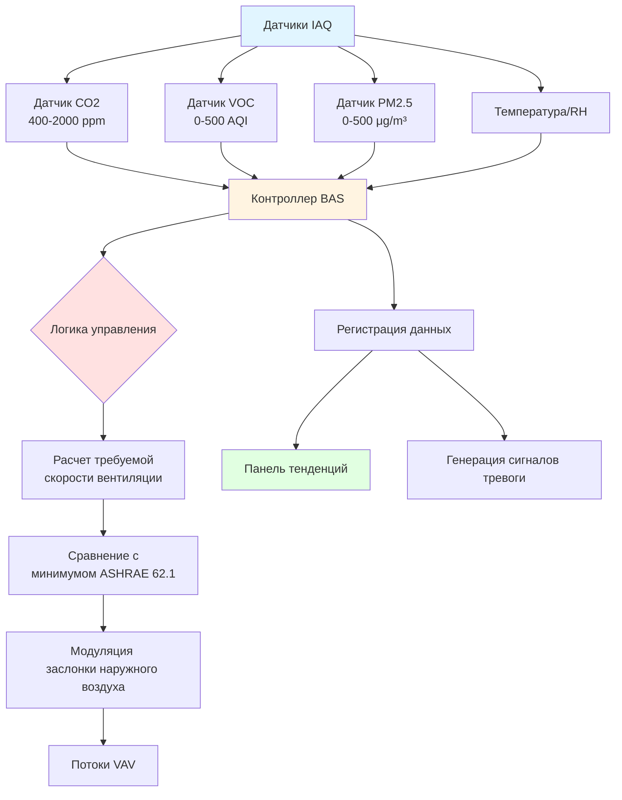

# Датчики качества воздуха: принципы обнаружения и интеграция в HVAC

Датчики качества внутреннего воздуха (IAQ) позволяют системам управляемой по требованию вентиляции (DCV) оптимизировать подачу наружного воздуха на основе фактической занятости и уровней загрязнения вместо фиксированных графиков. Стандарт ASHRAE 62.1 допускает снижение скорости вентиляции, если датчики CO2 демонстрируют снижение занятости при условии соблюдения надлежащих протоколов точности и обслуживания датчиков.

## Датчики CO2 с NDIR: принцип обнаружения

Датчики неизбирательной инфракрасной спектроскопии (NDIR) обнаруживают диоксид углерода через избирательное поглощение инфракрасного излучения в полосе длины волны 4,26 μm. Датчик использует широкополосный ИК источник, оптическую полость и детектор с оптическим фильтром, соответствующим спектру поглощения CO2.

**Закон Бера-Ламберта** определяет соотношение между концентрацией газа и поглощением света:

$$I = I_0 e^{-\alpha C L}$$

Где:
- $I$ = интенсивность пропущенного света (Вт)
- $I_0$ = интенсивность падающего света (Вт)
- $\alpha$ = коэффициент поглощения (ppm⁻¹·см⁻¹)
- $C$ = концентрация CO2 (ppm)
- $L$ = оптическая длина пути (см)

Датчик измеряет отношение пропущенной интенсивности к падающей, вычисляя концентрацию из:

$$C = -\frac{1}{\alpha L} \ln\left(\frac{I}{I_0}\right)$$

Двухволновые конструкции NDIR включают эталонный канал на невпитываемой длине волны (обычно 3,9 μm) для компенсации дрейфа интенсивности источника, загрязнения окна и температурных эффектов. Это дифференциальное измерение значительно повышает долгосрочную стабильность.

**Типичные спецификации датчика CO2 NDIR:**

| Параметр | Спецификация | Примечания |
|-----------|---------------|-------|
| Диапазон измерения | 0–2000 ppm | Стандартный для приложений DCV |
| Точность | ±50 ppm + 3% от показаний | При опорных условиях 25°C |
| Время отклика (T90) | 60–120 секунд | Время достижения 90% изменения |
| Стабильность калибровки | <50 ppm смещения/5 лет | Компенсация алгоритмом ABC |
| Рабочая температура | 0–50°C | Снижение точности вне 15–35°C |
| Потребление энергии | 0,5–3 Вт | Непрерывная работа |

## Датчики VOC на основе оксида металла

Датчики полупроводникового оксида металла (MOX) обнаруживают летучие органические соединения через поверхностные реакции на нагретых пленках оксида металла, обычно диоксида олова (SnO2) или триоксида вольфрама (WO3). Датчик работает при температуре 200–400°C для активации каталитического окисления органических молекул.

**Механизм обнаружения:**

Чистом воздухе молекулы кислорода адсорбируются на поверхности оксида металла, захватывая свободные электроны и создавая слой истощения:

$$\text{O}_2(\text{газ}) + e^- \rightarrow \text{O}_2^-(\text{адс})$$

Когда восстанавливающие газы (VOC, CO) контактируют с нагретой поверхностью, они реагируют с адсорбированным кислородом, высвобождая электроны обратно в зону проводимости:

$$\text{VOC} + \text{O}^- \rightarrow \text{CO}_2 + \text{H}_2\text{O} + e^-$$

Сопротивление датчика уменьшается с концентрацией VOC согласно степенному закону:

$$R_s = R_0 \left(\frac{C}{C_0}\right)^{-\beta}$$

Где:
- $R_s$ = сопротивление датчика в целевом газе (кОм)
- $R_0$ = сопротивление датчика в чистом воздухе (кОм)
- $C$ = концентрация VOC (ppm)
- $C_0$ = эталонная концентрация (ppm)
- $\beta$ = показатель чувствительности (0,3–0,7, зависит от газа)

Датчики MOX обеспечивают широкоспектральное обнаружение VOC, но лишены специфичности соединения. Выходные данные обычно представляются как эквивалентные ppb или как безмерный индекс качества воздуха (шкала 0–500).

## Оптические счетчики частиц для мониторинга PM

Оптические счетчики частиц обнаруживают взвешенные в воздухе частицы путем измерения рассеяния света от отдельных частиц, проходящих через лазерный луч. Интенсивность рассеянного света коррелирует с размером частицы, позволяя оценить массовую концентрацию.

**Теория рассеяния Ми** описывает рассеяние света от сферических частиц, сравнимых по размеру с длиной волны или больше:

$$I_{\text{рассеяние}} \propto d^6$$

Для частиц в диапазоне 0,3–10 μm интенсивность рассеяния приблизительно масштабируется с шестой степенью диаметра частицы, обеспечивая высокую чувствительность к изменениям размера.

Массовая концентрация рассчитывается из количества частиц по интервалам размеров:

$$\text{PM}_{2.5} = \sum_{i=1}^{n} N_i \cdot \rho \cdot \frac{\pi d_i^3}{6}$$

Где:
- $N_i$ = количество частиц в интервале размеров $i$ (частицы/л)
- $\rho$ = предполагаемая плотность частиц (обычно 1,65 г/см³)
- $d_i$ = средний диаметр для интервала $i$ (μm)

**Сравнение датчиков взвешенных частиц:**

| Технология | Диапазон размеров | Точность | Время отклика | Стоимость | Применение |
|------------|------------|----------|---------------|------|-------------|
| Оптический (рассеяние света) | 0,3–10 μm | ±10% для PM2,5 | 1–10 секунд | $$ | Мониторинг качества внутреннего воздуха |
| Нефелометр | 0,1–10 μm | ±5% для PM2,5 | 1–60 секунд | $$$$ | Исследования, соответствие нормативным требованиям |
| Бета-атенюация | 2,5–10 μm | ±2% | 1 час | $$$$$ | Стандартный метод EPA |
| MEMS резонатор | 1–10 μm | ±15% | 10–30 секунд | $ | Недорогие приложения IoT |

## Интеграция датчиков IAQ в BAS

Современные системы автоматизации зданий интегрируют несколько датчиков IAQ для динамического управления скоростью вентиляции, сокращая потребление энергии при сохранении приемлемого качества внутреннего воздуха.

## Требования ASHRAE 62.1 для DCV

Стандарт ASHRAE 62.1, раздел 6.2.7, допускает использование DCV с датчиками CO2 в помещениях с переменной занятостью, с учетом следующих требований:

**Критерии расположения датчиков:**
- Расположены в зоне дыхания (0,9–1,8 м от пола)
- Позиционированы для представления средних условий в помещении
- Минимум один датчик на зону управления
- Избегать прямого солнечного света, подачи воздуха или источников загрязнения

**Точность и калибровка:**
- Начальная точность: ±75 ppm или 5% от показаний
- Интервал калибровки на объекте: рекомендация производителя
- Автоматическое восстановление базовой линии (ABC) допустимо для помещений, регулярно пустующих

**Алгоритм управления:**
- Поддерживать уставку CO2 на уровне наружного воздуха + 600 ppm или ниже (обычно 1000–1200 ppm абсолютно)
- Обеспечить минимальную вентиляцию, требуемую кодексом, на уставке
- Пропорциональное управление предотвращает циклирование вентиляции

**Расчет скорости вентиляции:**

$$V_{oz} = R_p \cdot P_z + R_a \cdot A_z$$

Где:
- $V_{oz}$ = скорость подачи наружного воздуха в зону (CFM, м³/ч)
- $R_p$ = скорость подачи наружного воздуха на человека (CFM/чел, м³/(ч·чел))
- $P_z$ = население зоны (человек)
- $R_a$ = скорость подачи наружного воздуха на площадь (CFM/м², м³/(ч·м²))
- $A_z$ = площадь пола зоны (м²)

Системы DCV модулируют $P_z$ на основе занятости, полученной из CO2, при сохранении минимального компонента $R_a \cdot A_z$ в любое время.

**Сравнение датчиков для приложений DCV:**

| Тип датчика | Точность | Стабильность | Отклик | Стоимость | Лучшее применение |
|-------------|----------|-----------|----------|------|------------------|
| NDIR CO2 | ±50 ppm | Отличная | Умеренный (60 с) | $$$ | Основное управление DCV согласно ASHRAE 62.1 |
| MOX VOC | ±15% эквивалент | Хорошая с базовой линией | Быстрый (5 с) | $$ | Дополнительное указание IAQ, не одобрено кодексом |
| Оптический PM2,5 | ±10 μg/м³ | Умеренная | Быстрый (10 с) | $$$ | Управление фильтрацией, сигналы качества воздуха |
| Комбинированный IAQ | Варьируется | Хорошая | Быстрый | $$$$ | Комплексный мониторинг, не управление по одному параметру |

## Практические соображения при реализации

**Ввод в эксплуатацию датчика:**
1. Проверить нулевую калибровку датчика в свежем наружном воздухе перед установкой
2. Задокументировать места установки с фотографиями и планами этажей
3. Установить базовые показания во время пустующих и полностью занятых периодов
4. Настроить журналы тенденций BAS для концентрации, скорости вентиляции и данных энергии

**Требования к обслуживанию:**
- Датчики CO2: проверка нуля и диапазона ежегодно, очистка оптических поверхностей
- Датчики VOC: сброс базовой линии ежеквартально в периоды пустования
- Датчики PM: очистка оптической камеры ежемесячно, замена входных фильтров согласно рекомендациям производителя

**Потенциал экономии энергии:**
Системы DCV обычно снижают энергию вентиляции на 20–40% в помещениях с переменной занятостью по сравнению с вентиляцией при расчетной занятости, с периодами окупаемости 2–5 лет в зависимости от климата, затрат на энергию и графиков работы.

---

*Этот контент содержит инженерно-техническое руководство для специалистов HVAC. Выбор датчиков, их расположение и стратегии управления должны соответствовать применимым кодексам и стандартам, включая ASHRAE 62.1, IMC и местные поправки.*
