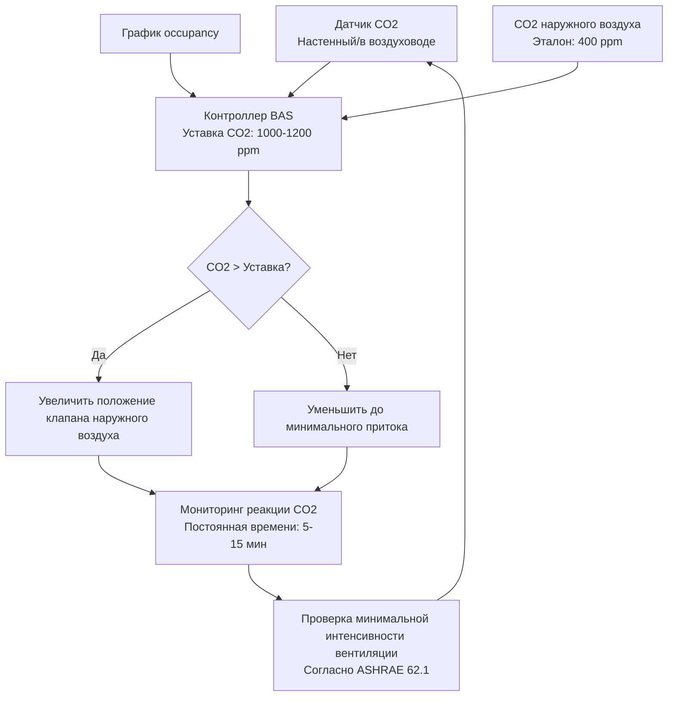

Датчики углекислого газа служат основным механизмом обратной связи для систем вентиляции с управлением по спросу (DCV), позволяя динамически регулировать интенсивность вентиляции в зависимости от уровня occupancy. Стандарт ASHRAE 62.1 допускает использование DCV на основе CO2 в качестве альтернативной процедуры расчета интенсивности вентиляции при условии правильной реализации с использованием калиброванных датчиков, соответствующих специфическим требованиям точности.

## Принципы работы NDIR-датчиков

Бесдисперсионные инфракрасные (NDIR) датчики измеряют концентрацию CO2, используя характерное поглощение молекулой инфракрасного излучения на длине волны 4,26 мкм. Принцип работы датчика основан на законе Бугера — Ламберта — Бера, который связывает поглощение света с концентрацией газа:

$$I = I_0 \cdot e^{-\alpha \cdot L \cdot C}$$

Где:
- $I$ = интенсивность прошедшего света (Вт)
- $I_0$ = интенсивность падающего света (Вт)
- $\alpha$ = коэффициент поглощения (м²/моль)
- $L$ = длина оптического пути (м)
- $C$ = концентрация газа (ppm)

Измеренная концентрация CO2 рассчитывается по коэффициенту пропускания:

$$C = \frac{1}{\alpha \cdot L} \ln\left(\frac{I_0}{I}\right)$$

Двухволновые NDIR-датчики используют эталонную длину волны (обычно 3,9 мкм), нечувствительную к CO2, для компенсации загрязнения оптического пути, старения источника света и дрейфа детектора. Компенсированное измерение использует отношение:

$$C_{compensated} = K \cdot \ln\left(\frac{I_{ref}/I_{CO2,sample}}{I_{ref,0}/I_{CO2,0}}\right)$$

Этот подход обеспечивает превосходную долгосрочную стабильность по сравнению с одноволновыми конструкциями.

## Интеграция датчиков CO2 в системы DCV

## Классы точности датчиков и области применения

| Класс точности | Типичная погрешность | Диапазон | Область применения | Интервал калибровки |
|:---:|:---:|:---:|:---:|:---:|
| Класс A | ±30 ppm ±3% | 0-2000 ppm | Критические среды, лаборатории | 12 месяцев |
| Класс B | ±50 ppm ±5% | 0-2000 ppm | Коммерческая DCV, классные комнаты | 24 месяца |
| Класс C | ±75 ppm ±7% | 0-2000 ppm | Общий мониторинг, жилые помещения | 36 месяцев |

**Требования ASHRAE 62.1 для DCV:**
- Точность датчика: ±75 ppm или 5% от показаний (в зависимости от того, что больше)
- Диапазон измерений: минимум 0-2000 ppm
- Калибровка: интервалы, указанные производителем, или не реже одного раза в 5 лет
- Измерение CO2 наружного воздуха или фиксированное эталонное значение (обычно 400 ppm)

## Методы калибровки

**1. Калибровка на свежем воздухе (одноточечная ABC)**

Автоматическая базовая калибровка предполагает, что датчик периодически подвергается воздействию свежего наружного воздуха (~400 ppm). Алгоритм автоматически корректирует базовый уровень в течение 7-14 дней. Этот метод работает для помещений с регулярными периодами отсутствия людей, но неэффективен в постоянно занятых или загрязненных средах.

**2. Двухточечная калибровка по диапазону**

Требует воздействия известных эталонных газов:
- Нулевая точка: чистый азот (0 ppm CO2)
- Точка диапазона: сертифицированный калибровочный газ (обычно 1000 ppm)

Коэффициент калибровки:

$$K_{span} = \frac{C_{ref}}{C_{measured}}$$

**3. Полевая проверка**

Сравнение показаний датчика с калиброванным переносным эталонным прибором:
- Дать 15-минутный период стабилизации
- Записать температуру и давление окружающей среды
- Допустимое отклонение: в пределах заявленной спецификации точности

## Требования к месту установки

Правильное размещение датчика напрямую влияет на производительность системы DCV и энергоэффективность.

**Пространственные датчики (мониторинг возвратного воздуха):**
- Высота: 0,9-1,8 м над уровнем пола (зона дыхания)
- Расстояние: >0,9 м от дверей, >1,5 м от приточных диффузоров
- Избегать: прямого солнечного света, источников тепла, зон застоя воздуха
- Плотность: 1 датчик на 929 м² или на зону одного вентилятора

**Канальные датчики:**
- Расположение: в возвратном воздуховоде до смешения с наружным воздухом
- Монтаж: зонд датчика выступает в центральную часть воздушного потока
- Скорость воздуха: минимум 2-4 м/с для адекватного отклика
- Защита: защита от конденсата и твердых частиц

**Справочные данные по наружному воздуху:**
- Расположение: Забор свежего воздуха, до экономайзера
- Высота: >2,4 м над уровнем земли для избежания выхлопных газов транспортных средств
- Защита: Влагозащищенный корпус с фильтром для частиц

## Характеристики времени отклика

Время отклика датчика влияет на стабильность контура управления DCV и комфорт occupants.

| Параметр | Типичное значение | Влияние |
|------|---|--------|
| Время отклика T90 датчика | 60-120 секунд | Время достижения 90% от скачкообразного изменения |
| Постоянная времени помещения | 5-15 минут | Скорость изменения концентрации CO2 |
| Обновление контура управления | 1-5 минут | Частота опроса/расчета BAS |
| Скорость привода заслонки | 30-90 сек/90° | Ограничение физического отклика |

Общее время отклика системы на изменения занятости обычно составляет от 8 до 20 минут. Алгоритмы управления должны учитывать эту задержку, чтобы предотвратить колебания, обеспечивая при этом достаточную вентиляцию при резком увеличении занятости.

**Оптимальные параметры управления:**
- Пропорциональная зона: 200-300 ppm выше уставки
- Интегральное время: 10-20 минут
- Уставка: 1000-1200 ppm (на 600-800 ppm выше наружного базового уровня)
- Мертвая зона: 50-100 ppm для предотвращения «охоты»

## Обслуживание и устранение неисправностей

**Рутинное обслуживание:**
- Визуальный осмотр: Ежеквартально на предмет накопления пыли и физических повреждений
- Проверка работоспособности: Раз в полгода с использованием переносного эталона
- Очистка: Ежегодная очистка оптической камеры в соответствии с инструкцией производителя
- Калибровка: По спецификации производителя или каждые 2-5 лет

**Распространенные проблемы:**
- Сдвиг ниже базового уровня: Сбой алгоритма ABC, требуется ручная калибровка
- Нестабильные показания: Загрязненная оптика, неудачное место установки
- Отсутствие реакции на занятость: Недостаточный воздушный поток (датчики в воздуховоде), отказ датчика
- Постоянно высокие показания: Сдвиг калибровки, недостаточный приток наружного воздуха

Правильный выбор, установка и обслуживание датчиков CO2 напрямую определяют эффективность системы DCV. Датчики точности класса B с технологией NDIR на двух длинах волн и функцией ABC обеспечивают оптимальный баланс производительности, надежности и стоимости жизненного цикла для коммерческих систем HVAC.
