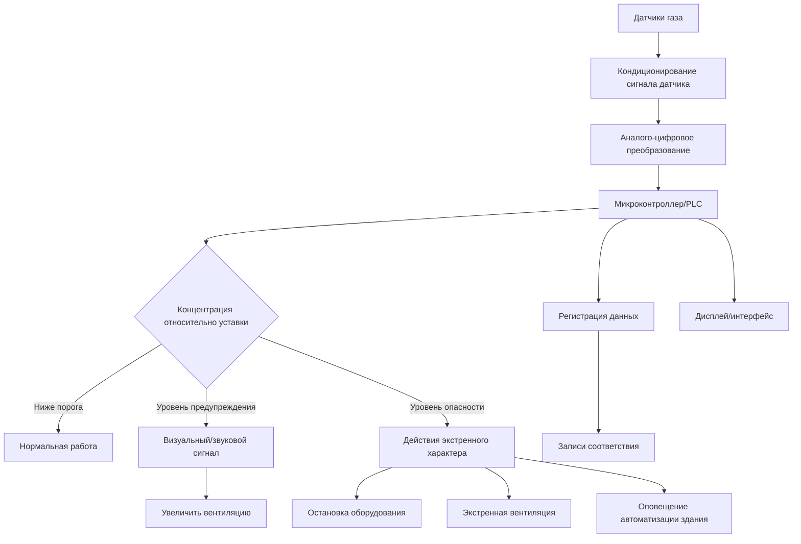

## Технологии датчиков обнаружения газа

Датчики обнаружения газа обеспечивают критически важный мониторинг безопасности систем HVAC, защищая жильцов от утечек хладагента, воздействия окиси углерода и опасности горючих газов. Современные установки HVAC требуют обнаружения газа в соответствии с ASHRAE 15, NFPA 70 и местными строительными нормами.

### Электрохимические датчики

Электрохимические датчики работают за счет окислительно-восстановительных реакций на поверхностях электродов, погруженных в электролитный раствор. Когда молекулы целевого газа диффундируют через мембрану в датчик, они подвергаются электрохимическим реакциям, которые создают ток, пропорциональный концентрации газа.

**Принцип работы:**

Датчик содержит три электрода: рабочий, вспомогательный и референтный. Целевой газ окисляется на рабочем электроде, высвобождая электроны, которые проходят через внешнюю цепь. Вспомогательный электрод замыкает цепь, восстанавливая кислород или другие вещества. Полученный ток имеет линейное соотношение с концентрацией газа в пределах указанного диапазона датчика.

**Типичные применения:**

- Обнаружение окиси углерода (диапазон 0–1000 ppm)
- Мониторинг диоксида азота (диапазон 0–20 ppm)
- Обнаружение утечек хладагента (датчики, специфичные для ГФУ, ГХФУ)
- Обнаружение аммиака в промышленной холодильной технике

**Характеристики производительности:**

| Параметр | Типичное значение | Примечания |
|-----------|-------------------|-----------|
| Время отклика | 30–60 секунд | T90 до целевой концентрации |
| Точность | ±5% от показания | При условиях калибровки |
| Срок службы | 2–3 года | Датчики CO, варьируется в зависимости от газа |
| Диапазон температуры | 0°C–50°C | Производительность снижается вне диапазона |
| Перекрестная чувствительность | Переменная | Требуется компенсация алгоритмами |

Электрохимические датчики требуют периодической калибровки и имеют ограниченный срок службы из-за истощения электролита. Температура и влажность значительно влияют на точность, что необходимо учитывать при компенсации окружающей среды в схеме датчика.

### Каталитические датчики

Каталитические датчики обнаруживают горючие газы через экзотермическое окисление на нагретой поверхности катализатора. Датчик содержит два согласованных шарика в конфигурации моста Уитстона: один покрыт активным катализатором, другой пассивирован как референтный.

**Принцип работы:**

Оба шарика нагреваются приблизительно до 500°C через встроенные платиновые спирали. Когда горючий газ контактирует с активным шариком, каталитическое окисление выделяет тепло, повышая температуру и сопротивление шарика. Изменение сопротивления создает дисбаланс моста, пропорциональный концентрации газа.

**Типичные применения:**

- Обнаружение утечек природного газа в механических помещениях
- Мониторинг пропана в помещениях с оборудованием
- Обнаружение метана в воздухозаборных отверстиях горения
- Общее обнаружение горючих газов

**Преимущества и ограничения:**

Каталитические датчики обеспечивают надежное обнаружение широкого спектра горючих газов с отличной долгосрочной стабильностью. Однако они потребляют значительную мощность, выделяют тепло и могут быть отравлены кремниевыми соединениями, соединениями серы и галогенированными углеводородами. Установка в атмосфере с дефицитом кислорода делает их неработоспособными, поскольку горение требует кислорода.

### Инфракрасные датчики газа

Недисперсионные инфракрасные (NDIR) датчики обнаруживают газы за счет поглощения определенных инфракрасных длин волн. Эти датчики превосходны при обнаружении утечек хладагента, обладая иммунитетом к отравлению и сроком службы, превышающим 10 лет.

NDIR датчики излучают инфракрасное излучение через камеру образца газа на детектор. Молекулы целевого газа поглощают определенные длины волн, снижая интенсивность сигнала пропорционально концентрации. Двухволновые конструкции с использованием референтных и поглощающих каналов компенсируют деградацию лампы и загрязнение оптики.

## Стандарты обнаружения горючих газов

### Пороги НПВ/ВПВ для распространенных газов

| Газ | НПВ (% об.) | ВПВ (% об.) | Типичная уставка сигнала тревоги |
|-----|-------------|-------------|-----------------------------------|
| Природный газ (Метан) | 5,0 | 15,0 | 25% НПВ (1,25% об.) |
| Пропан | 2,1 | 9,5 | 20% НПВ (0,42% об.) |
| Водород | 4,0 | 75,0 | 25% НПВ (1,0% об.) |
| Пары бензина | 1,4 | 7,6 | 20% НПВ (0,28% об.) |

Нижний предел взрываемости (НПВ) представляет минимальную концентрацию газа, поддерживающую горение. Уставки сигнала тревоги обычно срабатывают при 20–25% НПВ, обеспечивая надлежащее предупреждение до развития опасных условий.

## Требования к обнаружению утечек хладагента

ASHRAE 15-2019 требует систем обнаружения хладагента для машинных отделений и занятых пространств, содержащих высоковероятные системы, превышающие установленные лимиты количества хладагента.

### Уставки сигнала тревоги ASHRAE 15

| Тип хладагента | Уровень тревоги | Требуемое действие |
|---|---|---|
| A1 (Низкая токсичность) | RCL × 1,0 | Сигнал тревоги, увеличить вентиляцию |
| A2/A2L (Горючий) | 25% НВП | Сигнал тревоги, остановить оборудование |
| A3 (Высокая воспламеняемость) | 25% НВП | Сигнал тревоги, экстренная остановка |
| B1/B2 (Более высокая токсичность) | ПДК-ССЧ | Сигнал тревоги, эвакуация пространства |

RCL (Предел концентрации хладагента) варьируется в зависимости от хладагента и классификации занятости. Системы обнаружения должны активировать механическую вентиляцию и вызывать визуальные/звуковые сигналы тревоги при превышении концентраций установленных уровней.

### Рекомендации по размещению датчиков

Располагайте датчики хладагента на основе плотности пара относительно воздуха:

- Хладагенты тяжелее воздуха (R-134a, R-410A): Установка на 30–45 см выше пола
- Хладагенты легче воздуха (Аммиак R-717): Установка около потолка
- Несколько датчиков требуются для помещений площадью более 93 м² или содержащих препятствия

## Архитектура системы обнаружения газа

## Обнаружение окиси углерода

Датчики окиси углерода защищают жильцов от продуктов неполного сгорания в оборудовании, работающем на топливе. NFPA 720 и местные нормы обычно требуют обнаружения CO в механических помещениях, где размещаются приборы сгорания.

**Уровни сигнала тревоги согласно UL 2034:**

| Концентрация | Время воздействия | Требуемое действие |
|---|---|---|
| 70 ppm | 60–240 минут | Звуковой сигнал |
| 150 ppm | 10–50 минут | Звуковой сигнал |
| 400 ppm | 4–15 минут | Звуковой сигнал |

Располагайте датчики CO на расстоянии 1,5–6 м от оборудования сгорания на уровне дыхания (1,2–1,8 м над полом). Установите вдали от путей прямого выхлопа, но в пределах схемы циркуляции окружающего воздуха.

## Техническое обслуживание и калибровка

Системы обнаружения газа требуют систематического обслуживания для обеспечения надежной работы:

1. **Ежемесячное функциональное тестирование** – проверка активации сигнала тревоги и реакции системы
2. **Ежеквартальное бампное тестирование** – подача целевого газа для проверки отклика датчика
3. **Годовая калибровка** – регулировка выхода датчика с использованием сертифицированного калибровочного газа
4. **Периодическая замена** – замена электрохимических датчиков по расписанию производителя (обычно 2–3 года)

Ведите записи калибровки, задокументировав идентификацию датчика, дату калибровки, применяемую концентрацию газа и идентификацию технолога для обеспечения соответствия нормам и защиты от ответственности.

## Критерии выбора

Выбирайте технологию обнаружения газа на основе требований применения:

- Электрохимические: Токсичные газы, низкие концентрации, умеренная стоимость
- Каталитические: Горючие газы, суровые условия, доказанная надежность
- NDIR: Хладагенты, длительный срок службы, минимальное обслуживание
- Оксид металла полупроводника: общего назначения, наименьшая стоимость, умеренная селективность

Рассмотрите селективность датчика, перекрестную чувствительность к мешающим газам, условия окружающей среды, возможности обслуживания и полную стоимость владения, включая замену датчиков за весь срок службы системы.
