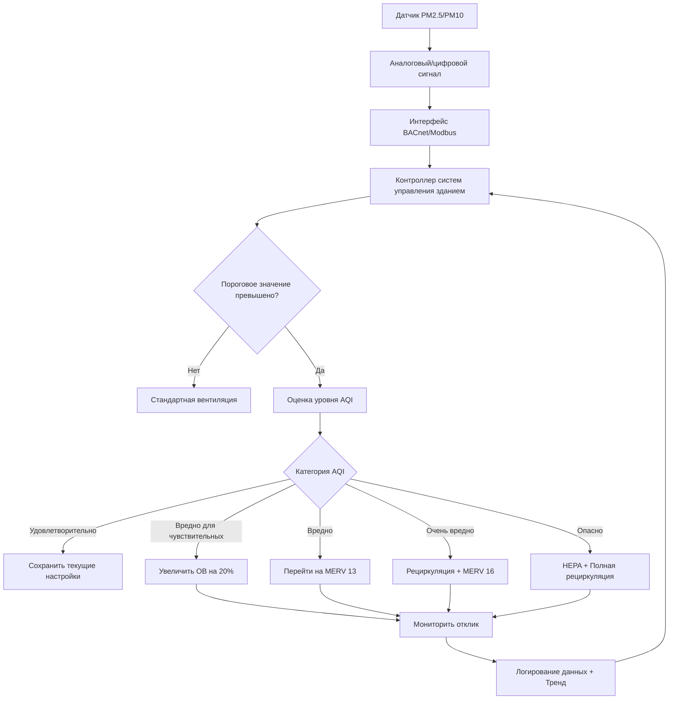

Датчики твердых частиц измеряют воздушные частицы по фракциям размера, позволяя системам HVAC реагировать на ухудшение качества воздуха в помещении. Эти датчики используют принципы оптического обнаружения для подсчета и определения размера частиц в реальном времени, предоставляя критические данные для управления вентиляцией, обслуживания фильтров и защиты здоровья пассажиров.

## Принципы оптического зондирования

Датчики твердых частиц работают на основе физики рассеяния света. Когда сфокусированный луч света встречает воздушную частицу, интенсивность рассеянного света коррелирует с размером частицы согласно теории рассеяния Ми. Соотношение между интенсивностью рассеянного света I и диаметром частицы d выглядит следующим образом:

**I ∝ d^n**

Где n варьируется от 2 до 6 в зависимости от размера частицы относительно длины волны. Для частиц <1 мкм доминирует рассеяние Рэлея (n≈6). Для частиц >1 мкм применяется геометрическое рассеяние (n≈2).

### Метод лазерного рассеяния

Лазерные датчики используют полупроводниковый лазер (обычно длина волны 650-680 нм) для создания сфокусированного объема обнаружения. Частицы проходят через этот объем под действием естественных воздушных потоков или принудительной аспирации. Фотодетектор, расположенный под углом 90° или под углом переднего рассеяния (30-60°), захватывает импульсы рассеянного света.

**Ключевые преимущества:**
- Обнаружение и определение размера отдельных частиц
- Измерение концентрации в реальном времени
- Разрешение по размерам от 0,3 до 10 мкм
- Время отклика <10 секунд

**Эксплуатационные особенности:**
- Требует чистоты оптического пути
- Чувствителен к влиянию влажности на размер частицы
- Потребление энергии: 0,5-1,5 Вт при непрерывной работе
- Типичный срок службы: 20 000-30 000 часов

### Нефелометрия

Нефелометры измеряют общее рассеяние света от совокупности частиц, а не от отдельных частиц. Эти приборы освещают больший объем воздуха и интегрируют рассеянный свет от всех частиц одновременно. Выходной сигнал представляет концентрацию массы, а не подсчет частиц.

**Характеристики нефелометра:**
- Измеряют коэффициент рассеяния (Мм⁻¹)
- Меньше чувствительны к отдельным крупным частицам
- Лучшая стабильность в условиях высокой концентрации
- Требуют калибровки по концентрации массы

## Подсчет и определение размера частиц

Оптические счетчики частиц (OPC) классифицируют частицы в канали размера на основе анализа высоты импульса. Амплитуда каждого импульса рассеянного света соответствует диаметру частицы посредством предустановленной калибровки. Стандартные каналы размера соответствуют значимым для здоровья фракциям:

| Канал размера | Диапазон диаметра | Значимость для здоровья |
|--------------|-------------------|-------------------------|
| PM0.3 | 0,3-0,5 мкм | Ультратонкие частицы, глубокое проникновение в легкие |
| PM0.5 | 0,5-1,0 мкм | Продукты сгорания |
| PM1.0 | 1,0-2,5 мкм | Дыхаемая фракция |
| PM2.5 | ≤2,5 мкм | Тонкие частицы, регулируемые EPA |
| PM10 | ≤10 мкм | Вдыхаемые крупные частицы, регулируемые EPA |

Датчики сообщают концентрацию массы (мкг/м³), преобразуя подсчеты частиц в массу, используя предполагаемую плотность частицы (обычно 1,65 г/см³ для городских аэрозолей) и интегрируя по каналам размера.

## Стандарты и пороги EPA AQI

Индекс качества воздуха Агентства по охране окружающей среды классифицирует воздействие твердых частиц на здоровье. Элементы управления HVAC интегрируют эти пороги для инициирования увеличения вентиляции, изменения режима фильтрации или уведомления пассажиров.

### Пороги AQI для PM2.5

| Категория AQI | Диапазон (мкг/м³) | Цветовой код | Ответ HVAC |
|---------------|-------------------|--------------|-----------|
| Хорошо | 0-12,0 | Зеленый | Стандартная работа |
| Удовлетворительно | 12,1-35,4 | Желтый | Поддерживать фильтрацию |
| Вредно для чувствительных групп | 35,5-55,4 | Оранжевый | Увеличить вентиляцию на 20% |
| Вредно | 55,5-150,4 | Красный | Увеличить до фильтрации MERV 13+ |
| Очень вредно | 150,5-250,4 | Фиолетовый | Режим рециркуляции, высокая фильтрация |
| Опасно | >250,5 | Коричневый | Полная рециркуляция, фильтрация HEPA |

### Пороги AQI для PM10

| Категория AQI | Диапазон (мкг/м³) | Воздействие на здоровье |
|---------------|-------------------|------------------------|
| Хорошо | 0-54 | Минимальный риск |
| Удовлетворительно | 55-154 | Приемлемое качество |
| Вредно для чувствительных групп | 155-254 | Возможны респираторные симптомы |
| Вредно | 255-354 | Эффекты для общего населения |
| Очень вредно | 355-424 | Серьезное обострение |
| Опасно | >425 | Чрезвычайные условия |

## Метод гравиметрического анализа

Гравиметрический анализ является эталонным стандартом для измерения твердых частиц. Воздух проходит через предварительно взвешенную мембрану фильтра в течение определенного периода времени (обычно 24 часа). После отбора пробы фильтр кондиционируется и повторно взвешивается в контролируемой среде.

**Расчет концентрации массы:**

**C = (m₂ - m₁) / (Q × t)**

Где:
- C = концентрация массы (мкг/м³)
- m₂ = конечная масса фильтра (мкг)
- m₁ = начальная масса фильтра (мкг)
- Q = объемный расход (м³/мин)
- t = продолжительность отбора (мин)

**Преимущества:**
- Прямое измерение массы, без предположений
- Обозначение Федерального эталонного метода (FRM) EPA
- Наивысшая точность для целей калибровки

**Ограничения:**
- Нет данных в реальном времени
- Трудоемкий протокол
- Требует экологического контроля (20±2°C, 35±5% влажность)
- Не подходит для обратной связи управления HVAC

## Интеграция датчиков PM в системы HVAC

## Критерии выбора датчика

**Для типичных коммерческих приложений HVAC:**
- Диапазон измерения: 0-500 мкг/м³ (PM2.5), 0-1000 мкг/м³ (PM10)
- Точность: ±10% при 100 мкг/м³
- Связь: BACnet IP или Modbus RTU
- Интервал калибровки: Годовая проверка по эталону

**Для критических сред (больницы, лаборатории):**
- Расширенный диапазон с разрешением канала 0,3 мкм
- Требование точности ±5%
- Возможность непрерывного логирования данных
- Выходы сигналов тревоги для немедленного уведомления

Размещение датчика должно обеспечивать репрезентативность отбора пробы: установка в канале воздуха, возвращаемого в систему, на расстоянии 3-5 диаметров воздуховода после поворотов, избегание участков вблизи решеток или заслонок, где возможна стратификация, и соблюдение технических характеристик производителя по диапазонам рабочей температуры и влажности.
