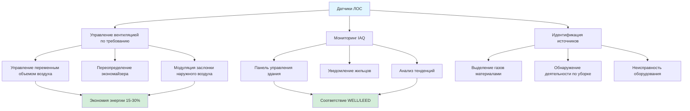

Датчики летучих органических соединений (ЛОС) обнаруживают воздушные химические вещества, выделяемые строительными материалами, мебелью, чистящими средствами и людьми. Эти датчики обеспечивают стратегии управления вентиляцией по требованию, которые снижают энергопотребление при сохранении приемлемых уровней качества воздуха в помещении в соответствии с ASHRAE 62.1 и международными стандартами IAQ.

## Технологии датчиков

### Датчики на основе оксида металла (MOX)

Датчики MOX используют нагретую полупроводниковую пленку (обычно диоксид олова, SnO₂), которая изменяет электрическое сопротивление при воздействии восстанавливающих газов. Работая при температуре 200-400°C, поверхность датчика облегчает реакции окисления с молекулами ЛОС, высвобождая электроны, которые снижают сопротивление пленки пропорционально концентрации ЛОС.

**Принцип работы:**
- Нагревательный элемент поддерживает постоянную температуру (обычно 300°C)
- Молекулы ЛОС адсорбируются на поверхность оксида металла
- Каталитическое окисление высвобождает электроны в зону проводимости
- Сопротивление логарифмически уменьшается с концентрацией газа
- Схема кондиционирования сигнала преобразует сопротивление в выходное напряжение

**Характеристики:**
- Широкий спектр ответа на несколько видов ЛОС
- Низкая стоимость (10-50 USD за единицу)
- Срок эксплуатации 2-5 лет
- Дрейф чувствительности требует периодической калибровки
- Потребление энергии 150-500 мВт из-за нагревательного элемента

### Датчики фотоионизационного детектора (PID)

Датчики PID ионизируют молекулы ЛОС с помощью ультрафиолетового света, затем измеряют полученный ионный ток. Лампа УФ (обычно 10,6 эВ) излучает фотоны с достаточной энергией для удаления электронов из молекул ЛОС, создавая обнаруживаемые ионные пары, собираемые электродами под приложенным напряжением.

**Принцип работы:**
- Лампа УФ излучает высокоэнергетические фотоны (10,6 или 11,7 эВ)
- Фотоны ионизируют молекулы ЛОС с более низким потенциалом ионизации
- Электрическое поле разделяет ионы и электроны
- Измерение тока пропорционально концентрации ЛОС
- Ответ, специфичный для вида, основан на энергии ионизации

**Характеристики:**
- Селективное обнаружение на основе энергии ионизации
- Линейный ответ в широком диапазоне концентраций (ppb-ppm)
- Быстрое время отклика (1-3 секунды)
- Более высокая стоимость (200-800 USD за единицу)
- Требует замены лампы каждые 1-2 года
- Минимальный дрейф чувствительности по сравнению с MOX

### Электрохимические датчики ЛОС

Электрохимические датчики окисляют или восстанавливают молекулы ЛОС на поверхностях электродов, генерируя измеримый ток. Эти датчики нацелены на конкретные группы ЛОС (формальдегид, спирты) с помощью селективных электродов и составов электролитов.

**Технология, специфичная для применения:**
- Обнаружение формальдегида в новом строительстве
- Мониторинг паров спирта в лабораториях
- Ограничено конкретными соединениями ЛОС
- Более высокая селективность, чем MOX или PID

## Стандарты измерения TVOC

Полные летучие органические соединения (TVOC) представляют совокупную концентрацию всех обнаруженных ЛОС, обычно выражаемую как эквивалент толуола. Стандарты определяют приемлемые уровни воздействия и протоколы измерения.

| Стандарт | Порог TVOC | Применение | Основание |
|----------|----------------|-------------|-------|
| ASHRAE 62.1 | <500 мкг/м³ | Коммерческие здания | Комфорт/приемлемость |
| WELL Building | <500 мкг/м³ | Помещения, ориентированные на здоровье | Долгосрочное воздействие |
| German AgBB | <1000 мкг/м³ | Выбросы материалов | Тестирование в течение 28 дней |
| California Section 01350 | <500 мкг/м³ | Школы, офисы | Хроническое воздействие |
| LEED v4 | Только мониторинг | Зеленые здания | Документирование |

**Категории IAQ (Стандарт ЕС EN 16798-3):**

| Категория | Диапазон TVOC (мкг/м³) | Описание |
|----------|-------------------|-------------|
| I | <200 | Высокое качество IAQ, чувствительные группы населения |
| II | 200-500 | Среднее качество IAQ, общие здания |
| III | 500-1000 | Умеренное качество IAQ, минимально приемлемое |
| IV | >1000 | Низкое качество IAQ, требует исправления |

## Сравнение датчиков

| Параметр | MOX | PID | Электрохимический |
|-----------|-----|-----|-----------------|
| Диапазон обнаружения | 0-50 ppm | 0,1-2000 ppm | 0-100 ppm |
| Время отклика | 30-60 секунд | 1-3 секунды | 30-90 секунд |
| Селективность | Низкая (широкая) | Средняя | Высокая (специфичная) |
| Срок эксплуатации | 2-5 лет | 3-5 лет | 1-3 года |
| Интервал калибровки | 6-12 месяцев | 12-24 месяца | 6-12 месяцев |
| Потребление энергии | 150-500 мВт | 2-5 Вт | 10-50 мВт |
| Диапазон температур | -10 to 50°C | 0 to 45°C | 0 to 50°C |
| Влияние влажности | Высокое | Низкое | Среднее |

## Калибровка и техническое обслуживание

**Методы полевой калибровки:**

1. **Нулевая калибровка** - воздействие воздуха без ЛОС (отфильтрованный наружный воздух) устанавливает базовое значение
2. **Калибровка диапазона** - известная концентрация газа (обычно 10 ppm изобутилена) устанавливает полномасштабный ответ
3. **Многоточечная калибровка** - три или более концентрации устанавливают кривую линейности

**Компенсация дрейфа:**
- Датчики MOX дрейфуют на 10-20% ежегодно из-за отравления поверхности
- Автоматическая коррекция базовой линии с использованием минимальных значений в периоды отсутствия людей
- Сравнение эталонного датчика в контролируемой среде
- Алгоритмы компенсации температуры и влажности

**График обслуживания:**
- MOX: визуальный осмотр ежеквартально, калибровка каждые 6 месяцев
- PID: замена лампы каждые 12-18 месяцев, калибровка ежегодно
- Все типы: замена фильтра при наличии, проверка электрических соединений

## Приложения HVAC

**Стратегии внедрения:**

1. **Мониторинг на уровне зоны** - один датчик на 250-500 м² открытой площади
2. **Зондирование возвратного воздуха** - один датчик представляет несколько зон
3. **Мониторинг критически важных помещений** - выделенные датчики в зонах высокого риска (комнаты копирования, лаборатории)
4. **Установление базовой линии** - сбор данных в течение 2-4 недель определяет нормальный диапазон работы
5. **Ответ вентиляции** - увеличение наружного воздуха на 25-50% при превышении TVOC 500 мкг/м³
6. **Пороги сигнализации** - оповещение при 800 мкг/м³, механическое переопределение при 1200 мкг/м³

**Интеграция логики управления:**
- Аналоговый выход (0-10 ВDC или 4-20 мA) к контроллеру BAS
- Коммуникация Modbus RTU или BACnet для цифровой интеграции
- Уставка обычно 450-500 мкг/м³ для поддержания IAQ категории II
- Пропорциональное управление между 300-700 мкг/м³ предотвращает колебания

**Влияние на энергию:**
- DCV на основе ЛОС снижает нагрев/охлаждение наружного воздуха на 15-30%
- Наиболее эффективен в помещениях с переменными выбросами (конференц-залы, многофункциональные помещения)
- Минимальная экономия в постоянно занятых помещениях с постоянным выделением ЛОС
- Окупаемость обычно 2-4 года в коммерческих приложениях

Выбор датчика ЛОС зависит от требований приложения: датчики MOX подходят для общего мониторинга IAQ с ограничениями по стоимости, датчики PID обеспечивают превосходную точность для документирования соответствия, а электрохимические датчики нацелены на конкретные соединения в специализированных средах.
