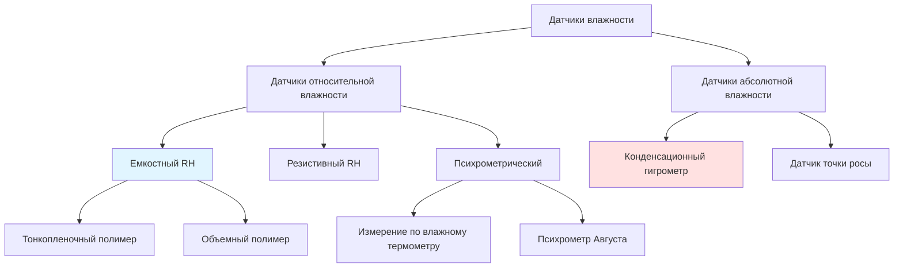

Измерение влажности в системах HVAC опирается на преобразователи, которые преобразуют концентрацию водяного пара в электрические сигналы для управления и мониторинга. Понимание принципов работы датчиков, ограничений точности и ограничений применения имеет фундаментальное значение для надлежащей производительности системы.

## Классификация датчиков влажности

## Емкостные датчики относительной влажности

Емкостные датчики доминируют в приложениях HVAC благодаря отличной линейности, стабильности и возможностям температурной компенсации. Чувствительный элемент состоит из гигроскопического диэлектрического материала, зажатого между двумя электродами.

**Принцип работы:**

Диэлектрическая проницаемость полимерной пленки изменяется в зависимости от содержания поглощенной влаги. Емкость изменяется согласно:

C = (ε₀ × εᵣ × A) / d

Где:
- C = емкость (Ф)
- ε₀ = электрическая постоянная (8,854 × 10⁻¹² Ф/м)
- εᵣ = относительная диэлектрическая проницаемость гигроскопического диэлектрика
- A = площадь электрода (м²)
- d = толщина диэлектрика (м)

Относительная диэлектрическая проницаемость εᵣ является функцией содержания влаги, которая коррелирует с окружающей относительной влажностью. Современные датчики включают интегральные схемы, которые преобразуют изменения емкости в выходные сигналы 4-20 мА, 0-10 VDC или цифровые выходы.

**Характеристики отклика:**

ΔC/C₀ = k × (RH₂ - RH₁)

Где k — коэффициент чувствительности датчика, типично 0,3–0,5 пФ/%RH для тонкопленочных конструкций.

## Резистивные датчики влажности

Резистивные датчики измеряют изменения проводимости в гигроскопических солевых или проводящих полимерных пленках. Поглощение водяного пара изменяет подвижность ионов и концентрацию носителей заряда.

**Принцип работы:**

Сопротивление экспоненциально уменьшается с увеличением относительной влажности:

R = R₀ × e^(-α × RH)

Где:
- R = сопротивление датчика (Ω)
- R₀ = эталонное сопротивление при 0% RH
- α = коэффициент чувствительности, зависящий от материала
- RH = относительная влажность (%)

Резистивные датчики обнаруживают большой гистерезис и более медленный отклик, чем емкостные типы. Они находят применение в недорогих жилых термостатах и влажностатах.

## Конденсационный гигрометр

Конденсационный гигрометр представляет наиболее точный метод измерения влажности, служащий основным стандартом для калибровки датчиков. Работа включает охлаждение поверхности зеркала до образования конденсата при температуре точки росы.

**Принцип измерения:**

Оптическое обнаружение определяет точную температуру, при которой образуется конденсат. Это непосредственно измеряет температуру точки росы Tₐ, из которой получаются другие параметры влажности:

RH = 100 × (Pᵥₛ(Tₐ) / Pᵥₛ(Tᵈᵦ))

Где:
- Pᵥₛ(Tₐ) = давление насыщенного пара при точке росы
- Pᵥₛ(Tᵈᵦ) = давление насыщенного пара при температуре сухого термометра

**Точность:** ±0,1°C до ±0,2°C точки росы, эквивалентно ±0,5% RH при 20°C. Только для лабораторных и калибровочных применений.

## Психрометрическое измерение

Измерение температуры по влажному термометру обеспечивает определение влажности через принципы теплопередачи и массопередачи.

**Энергетический баланс у влажного термометра:**

hc(Tᵈᵦ - Twb) = hfg × kc(Wₛ(Twb) - W)

Где:
- hc = коэффициент конвективной теплопередачи (Вт/м²·K)
- Tᵈᵦ = температура сухого термометра (°C)
- Twb = температура по влажному термометру (°C)
- hfg = скрытая теплота испарения (2257 кДж/кг при 100°C)
- kc = коэффициент массопередачи (кг/м²·с)
- Wₛ(Twb) = влагосодержание при насыщении при температуре влажного термометра
- W = фактическое влагосодержание

Психрометрические диаграммы обеспечивают графические решения. Точность зависит от надлежащего насыщения фитиля, скорости воздуха (минимум 3 м/с для психрометров Августа) и коррекции атмосферного давления.

## Характеристики производительности датчиков

### Сравнение точности и времени отклика

| Тип датчика | Точность (% RH) | Время отклика τ₆₃ | Диапазон температур | Стоимость |
|-------------|-----------------|-------------------|-------------------|------|
| Емкостный тонкопленочный | ±1,5% до ±2% | 8–30 сек | -40°C до 85°C | Средняя |
| Емкостный объемный полимер | ±2% до ±3% | 30–60 сек | -20°C до 80°C | Низкая–средняя |
| Резистивный | ±3% до ±5% | 20–60 сек | 0°C до 60°C | Низкая |
| Конденсационный гигрометр | ±0,5% RH эквив. | 1–5 мин | -75°C до 100°C DP | Очень высокая |
| По влажному термометру | ±2% до ±4% | 2–5 мин | -10°C до 50°C | Низкая |

### Требования ASHRAE к точности датчиков

В соответствии с руководством ASHRAE 36-2021 и стандартом 55-2020:

| Применение | Требуемая точность | Интервал калибровки |
|-------------|-------------------|----------------------|
| Критические помещения (дата-центры, лаборатории) | ±3% RH | 12 месяцев |
| Стандартное управление комфортом | ±5% RH | 24 месяца |
| Управление экономайзером | ±5% RH | 24 месяца |
| Управление давлением в здании | ±5% RH | 24 месяца |
| Системы рекуперации энергии | ±5% RH | 24 месяца |

Стандарт ASHRAE 41.6 определяет методы испытаний и проверку производительности для приборов измерения влажности.

## Дрейф датчиков и калибровка

Все датчики влажности испытывают дрейф из-за загрязнения, старения полимера и воздействия экстремальных температур или химических паров.

**Механизмы дрейфа:**
- Сшивание полимера от УФ-излучения или высоких температур
- Осаждение загрязняющих веществ на чувствительных поверхностях
- Деградация гигроскопического материала от химического воздействия
- Коррозия электродов в условиях высокой влажности

**Методы калибровки:**
1. Стандарты на основе солевых растворов (LiCl, MgCl₂, NaCl) обеспечивающие известную RH при контролируемых температурах
2. Двухточечная калибровка при 33% и 75% RH контрольных точек
3. Сравнение с конденсационным гигрометром
4. Камера влажности с эталонными датчиками передачи

Емкостные датчики обнаруживают типичный дрейф 0,5–1% RH в год в чистой среде, 2–3% RH в год в загрязненных условиях.

## Рекомендации по применению

**Размещение датчиков:**
- Минимум 2 м над полом в занятых помещениях
- Избегать прямого потока воздуха от диффузоров или решеток возврата
- Экранировать от источников лучистого тепла
- Обеспечить адекватную циркуляцию воздуха вокруг чувствительного элемента

**Факторы окружающей среды, влияющие на точность:**
- Требуется температурная компенсация для датчиков RH
- Атмосферное давление влияет на психрометрические расчеты
- Скорость воздуха должна превышать 0,5 м/с для конвективной теплопередачи
- Химические пары могут постоянно повредить полимерные датчики

**Кондиционирование сигнала:**
- Петли 4–20 мА обеспечивают превосходную помехоустойчивость над 0–10 VDC
- Цифровые выходы (Modbus, BACnet) устраняют ошибки аналогового преобразования
- Электроника передатчика должна включать температурную компенсацию
- Алгоритмы расчета точки росы улучшают производительность управления

Надлежащий выбор датчиков, размещение установки и протоколы обслуживания обеспечивают точное управление влажностью для комфорта жильцов, требований процесса и защиты оборудования в системах HVAC.
