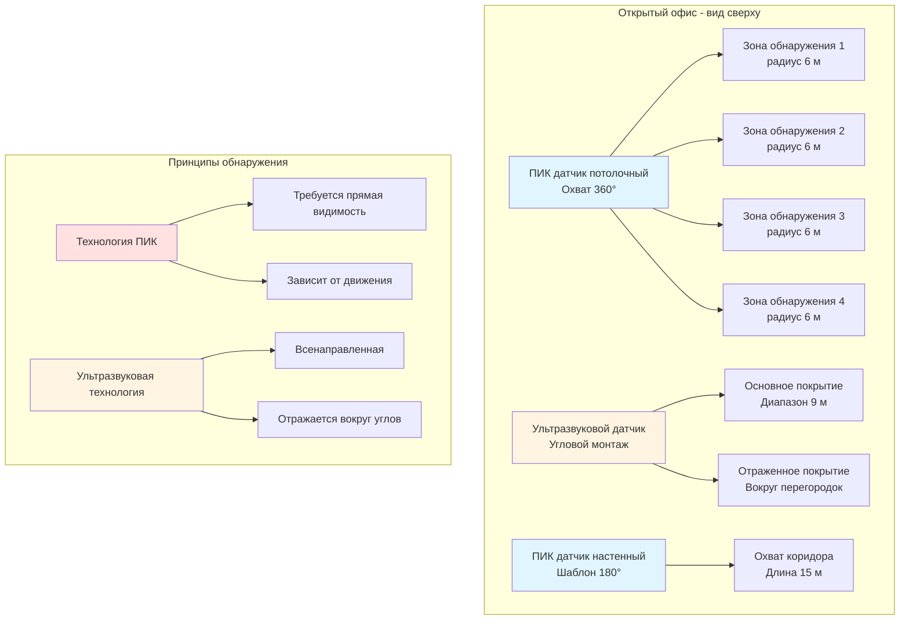

## Обзор

Датчики обнаружения присутствия обеспечивают работу управляемых спросом систем HVAC и освещения путем автоматической регулировки работы в зависимости от использования помещения. Эти устройства обеспечивают существенную экономию энергии, предотвращая подачу кондиционированного воздуха и освещение в незанятые зоны. ASHRAE 90.1 требует наличия автоматических выключателей в многочисленных типах помещений, что делает датчики присутствия обязательной кодом мерой энергосбережения.

Фундаментальный принцип работы заключается в обнаружении человеческого присутствия через физические явления: тепловое излучение (ПИК), отраженные звуковые волны (ультразвук), отражение микроволн или визуальный анализ (на основе камер). Надлежащий выбор датчика требует согласования технологии обнаружения с геометрией помещения, уровнями активности жильцов и требованиями последовательности управления.

## Технологии датчиков

### Пассивные инфракрасные (ПИК) датчики

ПИК датчики обнаруживают тепловое излучение в диапазоне длин волн 8-14 мкм, излучаемое человеческим телом (приблизительно 9,4 мкм пиковая длина волны при температуре кожи 37 °C). Пироэлектрический элемент генерирует напряжение при изменении потока инфракрасной энергии по сегментированным зонам обнаружения, создаваемым линзами Френеля или зеркальными элементами.

**Принцип работы:**
Датчик делит свое поле зрения на несколько зон. Когда источник тепла перемещается из одной зоны в другую, изменение дифференциальной температуры на пироэлектрическом детекторе превышает порог (типично 0,5-2 °C), что вызывает сигнал присутствия. Неподвижные жильцы не генерируют сигнал — технология ПИК зависит от движения.

**Основные характеристики:**
- Диапазон обнаружения: 6-15 м в типичном случае, варьируется в зависимости от конструкции линзы
- Поле зрения: 90° до 360° в зависимости от применения
- Время отклика: 0,5-2 секунды
- Требует прямой видимости для обнаружения движения
- Восприимчив к ложным срабатываниям от солнечного света, обогревателей и движущихся воздушных потоков
- Низкое энергопотребление (типично 1-5 мВт)

### Ультразвуковые датчики

Ультразвуковые датчики излучают высокочастотные звуковые волны (25-40 кГц, выше порога слышимости человека) и анализируют сдвиг Доплера в отраженных эхо-сигналах. Когда жилец движется, отраженная частота смещается согласно:

Δf = (2v/c) × f₀

Где v — скорость жильца, c — скорость звука (343 м/с при 20 °C), и f₀ — передаваемая частота.

**Принцип работы:**
Пьезоэлектрический преобразователь чередуется между передачей ультразвуковых импульсов и приемом отражений. Схема управления выполняет анализ частоты для обнаружения сдвигов Доплера, указывающих на движение. В отличие от ПИК, ультразвуковые датчики могут обнаруживать небольшие движения, такие как ввод текста или дыхание за столом.

**Основные характеристики:**
- Диапазон обнаружения: 9-15 м
- Характер покрытия: всенаправленный, отражается вокруг углов
- Обнаруживает небольшие движения (движение рук/пальцев)
- Не требует прямой видимости — покрытие следует за воздушными потоками
- Восприимчив к шуму воздухообмена HVAC, движущимся объектам (шторы, растения)
- Более высокое энергопотребление, чем ПИК (50-200 мВт)

### Датчики двойной технологии

Датчики двойной технологии комбинируют обнаружение ПИК и ультразвука в одном устройстве с конфигурациями логики И/ИЛИ. Логика И требует подтверждения обеими технологиями перед включением (снижает ложные срабатывания), в то время как любая из технологий может поддерживать состояние «занято». Эта конфигурация минимизирует ложные активации при обеспечении надежного обнаружения.

**Преимущества:**
- Резко снижены ложные срабатывания (логика И для активации)
- Улучшенная надежность обнаружения (логика ИЛИ для поддержания состояния «занято»)
- Подходит для сложных помещений с препятствиями или движением воздуха
- Соответствует строгим требованиям к предотвращению ложных активаций

**Компромиссы:**
- Более высокая стоимость (1,5-2× одинарных технологий)
- Повышенная сложность и потенциальные точки отказа
- Более высокое энергопотребление

## Режимы присутствия и отсутствия

| Режим | Активация | Деактивация | Экономия энергии | Принятие пользователями | Применение |
|------|-----------|------------|------------------|------------------------|-----------|
| **Присутствие** | Автоматическое при обнаружении | Автоматическое после истечения времени | 30-50% типично | Высокое (удобство) | Туалеты, коридоры, кладовые |
| **Отсутствие** | Требуется ручное включение | Автоматическое после истечения времени | 50-70% типично | Переменное (требует действия) | Приватные офисы, классные комнаты, конференц-залы |

Датчики отсутствия обеспечивают превосходную экономию энергии, так как никогда не активируют системы без необходимости — требование ручного включения гарантирует только преднамеренное использование. ASHRAE 90.1 допускает либо режим в зависимости от функции помещения, но режим отсутствия все чаще становится предпочтительной спецификацией для приватных офисов и аналогичных помещений.

## Передовые технологии

### Системы подсчета людей

Продвинутые системы присутствия используют тепловизионные матрицы, стереоскопические камеры или датчики времени пролета для подсчета жильцов, входящих и выходящих из помещений. Эти системы обеспечивают:

- Точный подсчет жильцов (типичная точность ±1-2 человека)
- Отслеживание направления (дифференциация входа/выхода)
- Картирование плотности для больших помещений
- Интеграция с системами управления вентиляцией по спросу (DCV)

Подсчет людей обеспечивает точную подачу наружного воздуха в зависимости от фактической занятости, а не расчетной численности, оптимизируя энергию вентиляции при сохранении соответствия ASHRAE 62.1 по качеству воздуха в помещении.

### Оценка присутствия на основе CO₂

Измерение роста концентрации CO₂ выше уровня на открытом воздухе обеспечивает косвенный показатель присутствия. Каждый жилец генерирует примерно 0,3-0,5 л/мин CO₂ при сидячем уровне активности. Концентрация CO₂ в помещении подчиняется:

C(t) = C_outdoor + (N × G)/(Q × ρ)

Где N — количество жильцов, G — скорость генерации CO₂, Q — скорость вентиляции, и ρ — плотность воздуха.

Этот метод работает для управления вентиляцией, но реагирует слишком медленно для приложений освещения (типичное время задержки 15-30 минут).

## Шаблоны охвата датчиков

## Руководство выбора применения

| Тип помещения | Рекомендуемая технология | Монтаж | Настройка времени задержки | Требование кода |
|------------|----------------------|----------|-----------------|------------------|
| Приватные офисы (<30 м²) | ПИК или двойная технология | Потолок или стена | 15-20 мин | ASHRAE 90.1-2019 |
| Открытые офисы | Двойная технология или ультразвук | Потолочная сетка | 20-30 мин | ASHRAE 90.1-2019 |
| Конференц-залы | Двойная технология отсутствия | Потолок | 15-20 мин | ASHRAE 90.1-2019 |
| Туалеты | ПИК присутствия | Потолок | 10-15 мин | ASHRAE 90.1-2019 |
| Коридоры | ПИК присутствия | Стена или потолок | 10-15 мин | ASHRAE 90.1-2019 |
| Склады | Двойная технология | Высокий монтаж | 20-30 мин | ASHRAE 90.1-2019 |
| Классные комнаты | Режим отсутствия | Настенный выключатель | 15-20 мин | ASHRAE 90.1-2019 |

## Требования ASHRAE 90.1

ASHRAE 90.1-2019 Раздел 9.4.1.2 требует автоматического выключения освещения в большинстве типов помещений в течение 20-30 минут после того, как жильцы покидают помещение. Раздел 6.4.3.3 касается управления HVAC для зон, требуя:

- Управление отключением для неиспользуемых периодов
- Автоматическое снижение/повышение температуры на основе присутствия или расписания
- Управление на уровне зоны для помещений >25 м² (за исключением определенных исключений)

Датчики присутствия удовлетворяют этим требованиям при надлежащей интеграции с последовательностями управления HVAC, обычно реализуя задержку 30-60 минут перед переходом в режим отключения при отсутствии (дольше, чем освещение, чтобы предотвратить чрезмерное переключение).

## Рассмотрение установки

**Критические факторы:**
- Высота монтажа влияет на характер покрытия (типичная высота потолка 2,4-4,5 м)
- Избегайте направления ПИК датчиков на источники тепла или окна
- Размещайте ультразвуковые датчики вдали от диффузоров HVAC
- Проверьте покрытие при отсутствии мертвых зон, где работают жильцы
- Установите периоды времени задержки, соответствующие функции помещения (баланс экономии энергии против ложных выключений)
- Введите датчики в эксплуатацию для проверки надлежащей работы и регулировки чувствительности

**Типичные ошибки:**
- Недостаточное покрытие, приводящее к ложным условиям отсутствия
- Периоды времени задержки слишком короткие, вызывающие частые выключения
- ПИК датчики заблокированы мебелью, перегородками или растениями
- Ультразвуковые датчики срабатывают от движения воздуха или механического оборудования

Надлежащий выбор датчика, размещение и ввод в эксплуатацию обеспечивают снижение энергопотребления HVAC и светильников на 30-60% для периодически занимаемых помещений при сохранении комфорта жильцов и соответствия кодам.
