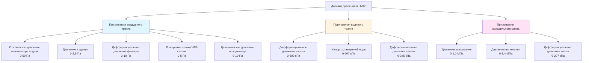

Датчики давления являются основными приборами в системах HVAC, измеряя статическое давление, дифференциальное давление и динамическое давление для точного управления воздушным потоком, контроля фильтров и оптимизации системы. Современные преобразователи давления HVAC используют передовые технологии датчиков, включая пьезорезистивные и емкостные принципы для достижения точности в пределах ±0,5% от полной шкалы в диапазонах работы от 0,025 кПа (см. вод. ст.) до 207 кПа.

## Технологии датчиков

### Пьезорезистивные датчики

Пьезорезистивные датчики давления используют фундаментальное свойство полупроводниковых материалов изменять электрическое сопротивление под действием механического напряжения. Когда давление прилагается к кремниевой диафрагме, содержащей диффузионные или ионно-имплантированные резисторы, деформация вызывает изменения сопротивления, которые образуют мостовую схему Уитстона.

Изменение сопротивления следует соотношению ΔR/R = GF × ε, где GF — коэффициент датчика (обычно 50-200 для кремния), а ε — деформация. Это создает дифференциальное выходное напряжение, пропорциональное приложенному давлению.

**Преимущества:**
- Высокая чувствительность и отношение сигнала к шуму
- Отличная линейность в широких диапазонах давления
- Быстрое время отклика (1-10 мс)
- Компактный размер чувствительного элемента
- Подходит для приложений с низким и высоким давлением

**Типичные приложения HVAC:**
- Измерение статического давления в здании (0-25 Па)
- Контроль статического давления в воздуховодах (0-50 Па)
- Измерение давления хладагента (0-3,4 МПа)
- Системы сжатого воздуха (0-1,4 МПа)

### Емкостные датчики

Емкостные датчики давления измеряют давление посредством изменений емкости между подвижной диафрагмой и фиксированным электродом. Приложенное давление отклоняет диафрагму, изменяя расстояние промежутка и, следовательно, емкость в соответствии с C = εA/d, где ε — диэлектрическая проницаемость, A — площадь электрода, а d — промежуток.

Емкостные датчики превосходят по показателям при измерении низкого дифференциального давления, критического для приложений HVAC. Изменение емкости преобразуется в выходной сигнал частоты или напряжения через электронику обработки сигнала.

**Преимущества:**
- Превосходные характеристики при низких давлениях (0,5-50 Па)
- Исключительная стабильность и характеристики долгосрочного дрейфа
- Низкий температурный коэффициент
- Минимальное потребление энергии
- Отличное разрешение для дифференциального давления

**Типичные приложения HVAC:**
- Контроль дифференциального давления фильтра (0-10 Па)
- Управление давлением в здании (0-2,5 Па)
- Дифференциальное давление чистой комнаты (0-0,5 Па)
- Измерение воздушного потока VAV-секции (0-5 Па)

## Типы измерения давления

### Статическое давление

Статическое давление представляет потенциальную энергию в воздушном потоке, измеряемую перпендикулярно направлению потока. Системы HVAC используют датчики статического давления для контроля:

- Давления на выходе вентилятора подачи
- Давления всасывания вентилятора возврата
- Давления в здании относительно атмосферы
- Распределения давления в системе воздуховодов

Стандарт ASHRAE 111 требует размещения датчиков статического давления на расстоянии не менее 7,5 диаметра воздуховода ниже по потоку и 3 диаметров выше по потоку от источников возмущения потока.

### Дифференциальное давление

Датчики дифференциального давления измеряют перепад давления между двумя точками, критически важный для:

- Индикации загрузки фильтра (ASHRAE рекомендует замену при 2-кратном начальном падении давления)
- Измерения воздушного потока через расходомерные станции
- Давления в здании (обычно +0,01-0,025 кПа для коммерческих зданий)
- Датчика потока терминальных секций VAV

Стандарт ASHRAE 62.1 требует поддерживать положительное давление в здании для предотвращения инфильтрации, при этом датчики дифференциального давления обеспечивают сигнал обратной связи.

### Динамическое давление

Динамическое давление, равное ρV²/2, представляет кинетическую энергию движущегося воздуха. Трубки Пито в сочетании с датчиками дифференциального давления измеряют динамическое давление для определения скорости воздушного потока: V = 6,18√(VP) для стандартного воздуха, где V в м/с, а VP в Па.

## Спецификации датчиков

### Диапазон давления и точность

| Приложение | Типичный диапазон | Требуемая точность | Тип датчика |
|-------------|-------------------|-------------------|-------------|
| Давление в здании | 0-2,5 Па | ±0,25 Па | Емкостной |
| Контроль фильтра | 0-10 Па | ±0,5 Па | Емкостной |
| Статическое давление воздуховода | 0-50 Па | ±0,5% ПШ | Пьезорезистивный |
| Поток VAV-секции | 0-5 Па | ±1% ПШ | Емкостной |
| Всасывание/выход вентилятора | 0-75 Па | ±0,5% ПШ | Пьезорезистивный |
| Давление хладагента | 0-3,4 МПа | ±1% ПШ | Пьезорезистивный |
| Давление пара | 0-207 кПа | ±0,5% ПШ | Пьезорезистивный |

### Стандарты выходного сигнала

| Тип выхода | Диапазон | Приложение | Преимущества |
|-------------|----------|-----------|------------|
| 4-20 мА | Токовая петля | Передача на дальние расстояния | Устойчивость к шумам, двухпроводное соединение |
| 0-10 Вdc | Напряжение | Короткие расстояния, вход DDC | Простая проводка, низкая стоимость |
| 0-5 Вdc | Напряжение | Устаревшие системы | Прямой интерфейс |
| Цифровой (Modbus, BACnet) | Различается | Сетевые системы | Несколько параметров, диагностика |

## Приложения в системах HVAC

## Критерии выбора

**Диапазон давления:** Выбирайте датчики с максимальным диапазоном работы в 1,5-2 раза превышающим ожидаемое максимальное давление, чтобы обеспечить точность в рабочей области и защиту от событий перепада давления.

**Требования к точности:** Определите требуемую точность на основе требований управления. Давление в здании требует ±0,25 Па, тогда как управление статическим давлением воздуховода допускает ±0,5% полной шкалы.

**Условия окружающей среды:** Учитывайте температурный диапазон, влажность и совместимость с носителем. Пьезорезистивные кремниевые элементы требуют температурной компенсации для диапазонов, превышающих 0-50°C. Емкостные датчики обеспечивают превосходную температурную стабильность.

**Время отклика:** Динамические приложения, такие как управление VAV, требуют времени отклика менее 1 секунды. Статические приложения, такие как контроль фильтра, допускают более медленный отклик.

**Требования установки:** Обеспечьте надлежащее размещение согласно стандарту ASHRAE 111, избегая турбулентных областей потока. Используйте усредняющие датчики для больших воздуховодов с площадью сечения, превышающей 0,37 м².

## Калибровка и техническое обслуживание

Датчики давления требуют ежегодной проверки калибровки с использованием эталонных стандартов, прослеживаемых до NIST. Дрейф нулевой точки обычно остается в пределах ±0,25 Па в год для качественных емкостных датчиков. Дрейф диапазона зависит от технологии датчика и воздействия перепада давления.

Проверяйте трубопроводы датчиков давления ежеквартально на предмет засоров, конденсации или повреждений. Наклоняйте трубопроводы в сторону от точек датчиков для предотвращения накопления жидкости. Чистите или заменяйте линии датчиков ежегодно в пыльных средах.
