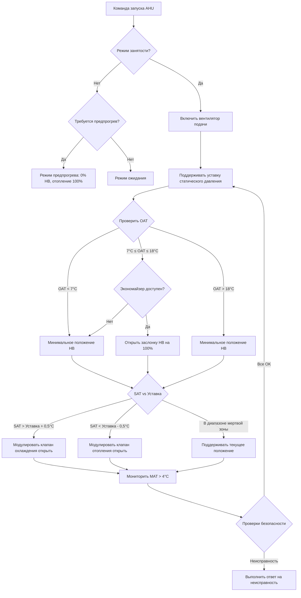

## Обзор

Последовательности управления операций определяют логические пошаговые инструкции, которые управляют работой оборудования HVAC в различных условиях. Эти последовательности обеспечивают скоординированное управление несколькими компонентами для достижения теплового комфорта, поддержания качества воздуха в помещении и оптимизации энергопотребления. Хорошо спроектированные последовательности интегрируют входные сигналы датчиков, логику управления и выходные сигналы исполнительных механизмов для динамического реагирования на нагрузки здания и условия окружающей среды.

## Структура ASHRAE Guideline 36

ASHRAE Guideline 36 предоставляет стандартизированные высокопроизводительные последовательности управления для систем HVAC. Руководство устанавливает последовательности на основе принципов физического управления, минимизируя одновременное отопление и охлаждение, оптимизируя работу экономайзера приточного воздуха и реализуя управление вентиляцией по спросу. Последовательности Guideline 36 уделяют приоритет логике подстройки и отклика для ступенчатого включения оборудования, графикам сброса на основе обратной связи зон и диагностике обнаружения неисправностей, встроенной в алгоритмы управления.

Ключевые особенности последовательностей Guideline 36:

- **Подстройка и отклик**: Пошагово изменяет производительность оборудования на основе измеренных показателей, а не фиксированных графиков
- **Управление на уровне зон**: Управление температурой и потоком воздуха отдельных зон с координацией на уровне системы
- **Сброс наружного воздуха**: Сброс температуры приточного воздуха и давления на основе условий окружающей среды и спроса зон
- **Интеграция экономайзера**: Приоритет свободного охлаждения, когда условия наружного воздуха это позволяют
- **Ступенчатое включение на основе спроса**: Работа оборудования на основе фактических требований по нагрузке

## Последовательность управления приточно-вытяжной установкой (AHU)

### Режимы работы и логика переходов

Последовательности AHU координируют работу вентилятора подачи, заслонок наружного воздуха, нагревательных и охлаждающих батарей, вентиляторов обратного и вытяжного воздуха для подачи кондиционированного воздуха требуемой температуры и расхода.

| Режим работы | Температура наружного воздуха | Действие управления | Клапан охлаждения | Клапан отопления |
|---|---|---|---|---|
| Механическое охлаждение | > 18°C | Охлаждение DX/CHW | Модулирующий | Закрыт |
| Охлаждение экономайзером | 7°C - 18°C | 100% заслонка НВ | Модулирующий по необходимости | Закрыт |
| Минимум НВ + отопление | < 7°C | Минимальное положение НВ | Закрыт | Модулирующий |
| Предварительный прогрев утром | Любая (Неприцеп) | 0% НВ, рециркуляция | Закрыт | 100% открыт |
| Ночной режим | Неприцеп | Вентилятор выключен, заслонки закрыты | Закрыт | Закрыт |

### График сброса температуры приточного воздуха

Температура приточного воздуха (SAT) изменяется на основе температуры наружного воздуха (OAT) для снижения энергопотребления при частичных нагрузках:

**Сброс сезона отопления:**
- OAT ≤ -7°C: уставка SAT = 35°C
- OAT = 13°C: уставка SAT = 18°C
- Линейная интерполяция между -7°C и 13°C

**Сброс сезона охлаждения:**
- OAT ≥ 27°C: уставка SAT = 13°C
- OAT = 18°C: уставка SAT = 17°C
- Линейная интерполяция между 18°C и 27°C

### Последовательность логики управления

AHU работает через каскадные контуры управления:

1. **Управление вентилятором подачи**: Модулировать VFD для поддержания уставки статического давления в воздуховоде (обычно 37-62 Па на расстояние 2/3 в воздуховод)
2. **Заслонки наружного воздуха**: Модулировать для поддержания минимального расхода наружного воздуха CFM (согласно ASHRAE 62.1) или увеличить до 100% при наличии условий экономайзера
3. **Клапан охлаждения**: Модулировать для поддержания уставки SAT при необходимости охлаждения (SAT > уставка)
4. **Клапан отопления**: Модулировать для поддержания уставки SAT при необходимости отопления (SAT < уставка) и неактивности экономайзера
5. **Управление температурой смешанного воздуха**: Мониторить для предотвращения замерзания (блокировка охлаждения при MAT < 4°C)

### Диаграмма последовательности управления AHU

## Последовательность управления терминальным блоком VAV

Блоки VAV управляют температурой зоны путем модуляции расхода воздуха и перегрева (при наличии). Последовательность отдает приоритет охлаждению путем увеличения расхода воздуха перед активацией перегрева.

**Последовательность охлаждения (температура зоны > уставка):**
1. Увеличить расход воздуха от минимума (обычно 30% от расчетного CFM или требование вентиляции) к максимальному расчетному CFM
2. Заслонка модулирует линейно, так как контур PI реагирует на ошибку температуры зоны
3. Клапан перегрева остается закрытым во время всей операции охлаждения

**Последовательность отопления (температура зоны < уставка):**
1. Уменьшить расход воздуха до минимальной уставки
2. Если температура зоны продолжает падать ниже уставки - 1°C, модулировать клапан перегрева открыть
3. Клапан перегрева модулирует от 0-100% на основе контура управления PI

**Работа в режиме мертвой зоны:**
- Поддерживать мертвую зону 1°C между отоплением и охлаждением для предотвращения одновременной работы
- Во время работы в режиме мертвой зоны поддерживать минимальный расход для вентиляции

## Последовательность ступенчатого включения чиллера

Несколько чиллеров работают в конфигурации ведущего-ведомого с логикой подстройки и отклика:

**Условия ступенчатого включения:**
- Ведущий чиллер при ≥ 85% производительности в течение 10 минут → Запустить ведомый чиллер
- Температура подачи холодной воды > уставка + 1°C в течение 15 минут → Добавить чиллер
- Минимальное время работы между ступенями: 15 минут

**Условия ступенчатого выключения:**
- Все работающие чиллеры при ≤ 30% производительности в течение 20 минут → Отключить один блок
- Температура подачи холодной воды < уставка - 1°C в течение 15 минут → Удалить чиллер
- Минимальное время работы: 30 минут перед разрешением отключения

**Сброс холодной воды:**
- Температура подачи холодной воды изменяется на основе нагрузки здания или температуры наружного воздуха
- OAT ≥ 27°C: CHWST = 7°C
- OAT ≤ 16°C: CHWST = 11°C
- Сброс снижает подъем компрессора и повышает эффективность при частичных нагрузках

## Последовательность ступенчатого включения котла

Последовательность котла поддерживает температуру подачи горячей воды путем модульного ступенчатого включения:

**Ротация ведущий-ведомый:**
- Ротировать ведущий котел еженедельно или после 200 часов работы для выравнивания времени работы
- Отслеживать запуски и время работы для планового прогнозного обслуживания

**Управление степенью сгорания:**
1. Ведущий котел модулирует от минимального сгорания (обычно 25% производительности) к максимуму
2. Когда ведущий котел достигает 90% степени сгорания в течение 5 минут, ступенчатое включение второго котла
3. Распределять нагрузку поровну между работающими котлами
4. Ступенчатое выключение, когда общая нагрузка падает ниже 40% производительности одного котла в течение 10 минут

**Сброс температуры горячей воды:**
- Сброс на основе температуры наружного воздуха снижает температуру обратной воды и повышает эффективность конденсационного котла
- OAT ≤ -18°C: HWST = 82°C
- OAT ≥ 16°C: HWST = 49°C
- Линейный сброс между точками температуры

## Условия переходов и блокировки

| Оборудование | Условие запуска | Условие остановки | Блокировка безопасности |
|---|---|---|---|
| Вентилятор подачи | График занятости ИЛИ ручное управление | Неприцеп И нет управления | Срабатывание детектора дыма, морозозащита |
| Чиллер | DP цепи CHW > 34 кПа И CHWST > 10°C | Отсутствие потока ИЛИ CHWST < 3°C | Низкая температура испарителя, датчик потока |
| Котел | DP цепи HW > 21 кПа И HWST < уставка | Отсутствие потока ИЛИ верхний предел | Верхний предел температуры, отсечка при низком уровне воды |
| Градирня | Чиллер работает | Чиллер выключен в течение 15 мин | Низкая температура в поддоне < 4°C |
| Насос CHW | Команда запуска чиллера | Чиллер выключен И поток доказан выключен | Перегрузка двигателя, неисправность VFD |

Эти последовательности составляют основу скоординированной работы системы HVAC, обеспечивая эффективную работу оборудования при сохранении комфорта пассажиров и безопасности системы. Надлежащая реализация требует детального тестирования точка-к-точке, проверки при пуске и постоянного мониторинга для проверки того, что работа последовательности соответствует замыслу проекта.
