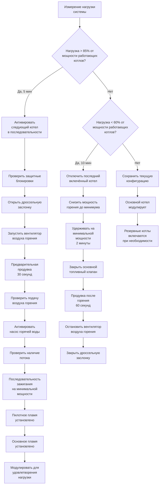

Последовательности котельной установки координируют работу нескольких котлов для эффективного удовлетворения тепловых нагрузок при обеспечении безопасности, долговечности оборудования и оптимизации энергопотребления. Эти последовательности управляют ступенчатым включением котлов, модуляцией мощности горения, ротацией основного и резервного котлов, сбросом температуры подающей воды и комплексными защитными блокировками в соответствии с ASHRAE Guideline 36 и NFPA 85.

## Ступенчатое включение котлов и логика активации

Ступенчатое включение котлов определяет количество работающих котлов на основе потребности в теплоснабжении, температуры наружного воздуха и нагрузки системы. Система автоматизации здания рассчитывает необходимое количество котлов на основе измеренного спроса системы и доступной мощности.

**Критерии ступенчатого включения:**

- Нагрузка системы превышает 85% мощности работающих котлов в течение 5 минут → активировать следующий котел
- Нагрузка системы падает ниже 60% мощности работающих котлов в течение 10 минут → отключить один котел
- Температура наружного воздуха ниже расчётного порога отопления → принудительно включить минимальное количество котлов
- Мощность горения отдельного котла постоянно выше 90% → ступенчато включить дополнительный котел
- Мощность горения отдельного котла постоянно ниже 30% → оценить возможность отключения

**Последовательность активации каждого котла:**

1. Проверить все защитные блокировки активированы (датчик пламени, датчик низкого уровня воды, датчик высокой температуры, доказана подача воздуха горения)
2. Открыть дроссельную заслонку дымохода (если установлена) и проверить замыкание концевого выключателя заслонки
3. Запустить вентилятор подачи воздуха горения и установить предварительную продувку минимум на 30 секунд в соответствии с NFPA 85
4. Проверить доказательство подачи воздуха горения через датчик перепада давления
5. Активировать насос горячей воды, обслуживающий котел, и проверить поток через датчик перепада давления
6. Инициировать последовательность зажигания на минимальной мощности
7. Проверить установление пилотного пламени в течение 10 секунд
8. Открыть основной топливный клапан и проверить основное пламя в течение 5 секунд
9. Перейти к модулирующему управлению после доказательства пламени в течение 30 секунд
10. Увеличить мощность горения для удовлетворения потребности нагрузки

## Ротация основного и резервного котлов

Управление основным и резервным котлами чередует приоритет котлов для выравнивания времени работы и износа по нескольким котлам. Основной котел сначала модулирует для удовлетворения нагрузки, а резервные котлы включаются при увеличении спроса.

**Логика ротации:**

- Чередовать обозначение основного котла еженедельно или после 100 часов работы
- Переопределить ротацию, если отдельный котел требует обслуживания или показывает состояние неисправности
- Назначить основной котел на основе наименьшего совокупного времени работы или количества пусков
- В переходные сезоны работать с одним котлом в режиме ротации, чтобы минимизировать циклирование

**Приоритет работы:**

1. **Основной котел:** модулирует от минимальной до максимальной мощности горения для удовлетворения нагрузки
2. **Первый резервный котел:** включается, когда основной превышает 85% мощности, затем модулирует
3. **Второй резервный котел:** включается, когда совокупная мощность основного и первого резервного превышает 85%
4. **Резервный котел:** остаётся в отключённом состоянии, но готов к автоматическому запуску при неисправности основного котла

## Управление мощностью горения и модуляция

Управление мощностью горения регулирует выход горелки в соответствии с потребностью в тепле при обеспечении эффективного сгорания. Современные котлы используют модулирующие горелки с диапазонами модуляции от 4:1 до 10:1.

**Стратегия модуляции:**

- ПИД-контур управления рассчитывает мощность горения на основе ошибки температуры подающей воды
- Минимальная мощность горения: 10-25% от полной мощности (в соответствии со спецификацией производителя)
- Максимальная мощность горения: 100% номинальной мощности
- Скорость изменения мощности: максимум 10% в минуту во избежание термических ударов
- Таймер против короткого цикла: минимум 5 минут работы перед разрешением отключения

**Алгоритм управления:**

Мощность горения (%) = KP × Ошибка + KI × ∫Ошибка dt + KD × (dОшибка/dt)

Где:
- Ошибка = Уставка температуры подающей воды - Измеренная температура подающей воды
- KP (Коэффициент пропорциональности) = 2,0–5,0
- KI (Коэффициент интегрирования) = 0,1–0,5
- KD (Коэффициент дифференцирования) = 0,05–0,2

## Сброс температуры подающей воды

Сброс температуры подающей воды снижает температуру подающей воды котла на основе температуры наружного воздуха или нагрузки здания, повышая эффективность конденсационного котла и снижая потери в распределительной системе.

**График сброса:**

| Температура наружного воздуха | Уставка температуры подающей воды | Стратегия мощности горения |
|------------------------|----------------------|---------------------|
| ≥ 18°C | 49°C | Минимум, оценить отключение |
| 10°C | 60°C | Модулировать в соответствии с нагрузкой |
| 2°C | 71°C | Модулировать в соответствии с нагрузкой |
| -7°C | 77°C | Ступенчато включить котлы при необходимости |
| ≤ -18°C | 82°C | Максимальная мощность |

**Уравнение сброса:**

SWSP = SWmax - [(SWmax - SWmin) × (OAT - OATmin) / (OATmax - OATmin)]

Где:
- SWSP = Уставка температуры подающей воды (°C)
- SWmax = Максимальная температура подающей воды, 82°C в расчётных условиях
- SWmin = Минимальная температура подающей воды, 49°C в тёплых условиях
- OAT = Температура наружного воздуха (°C)
- OATmax = 18°C (порог отключения в тёплую погоду)
- OATmin = -18°C (расчётное условие отопления)

## Защитные блокировки и ограничения

Защитные блокировки котла предотвращают работу при небезопасных условиях в соответствии со стандартами безопасности горения NFPA 85 и управления котлами ASME CSD-1.

**Обязательные защитные блокировки:**

| Блокировка | Функция | Действие при неисправности |
|-----------|----------|-----------------|
| Датчик низкого уровня воды | Контролирует уровень воды в котле | Немедленное отключение топлива, блокировка |
| Датчик высокой температуры | Контролирует температуру подающей воды > 93°C | Отключение топлива, сигнал тревоги |
| Датчик пламени | Проверяет наличие пламени | Отключение топлива в течение 4 секунд |
| Датчик подачи воздуха горения | Проверяет работу вентилятора через ΔP | Предотвратить последовательность зажигания |
| Датчик температуры дымохода | Контролирует температуру дымовых газов > 260°C | Отключение топлива, сигнал тревоги |
| Датчик низкого давления газа | Контролирует давление подачи топлива | Предотвратить зажигание, сигнал тревоги |
| Датчик высокого давления газа | Контролирует давление подачи топлива | Отключение топлива, блокировка |
| Датчик потока горячей воды | Проверяет поток насоса через ΔP | Предотвратить последовательность зажигания |
| Датчик положения дроссельной заслонки | Проверяет открытое положение заслонки | Предотвратить последовательность зажигания |

**Ответ при неисправности:**

- Требуется ручной сброс после блокировки защиты
- Автоматический перезапуск разрешён после устранения условий мягкой тревоги
- Условие неисправности зафиксировано с временной меткой для диагностического анализа
- Критические неисправности отключают повреждённый котел и включают резервный блок

## Защита от конденсации и низкотемпературная защита

Управление защитой от конденсации предотвращает конденсацию дымовых газов в неконденсационных котлах путём поддержания минимальной температуры возвратной воды.

**Стратегия защиты:**

- Поддерживать температуру возвратной воды выше 54°C для неконденсационных котлов
- Использовать трёхходовой смесительный клапан для обхода холодной возвратной воды во время прогрева
- Клапан обхода модулирует для поддержания минимальной температуры на входе котла 60°C
- После прогрева системы перейти к полному потоку через котел
- Защитить чугунные котлы от термического удара, ограничив скорость повышения температуры 28°C в час

## Режимы работы и оптимизация

**Отключение при тёплой погоде:**
- Отключить все котлы, когда температура наружного воздуха превышает 18°C в течение 4 часов
- Поддерживать работу насосов котлов в режиме проверки (еженедельный прогон в течение 5 минут)

**Оптимизация конденсационного котла:**
- Устанавливать целевую температуру возвратной воды ниже 54°C для максимизации конденсационной работы
- Приоритизировать конденсационные котлы как основные блоки при низконагруженных условиях
- Контролировать температуру дымовых газов для проверки конденсационной работы (< 60°C указывает на конденсацию)

**Выравнивание времени работы:**
- Отслеживать совокупное время работы в часах и количество пусков для каждого котла
- Чередовать обозначение основного котла для выравнивания износа и интервалов обслуживания
- Генерировать предупреждения об обслуживании на основе пороговых значений времени работы (2000 часов или 1 год)

## Мониторинг производительности

Постоянно контролировать эти параметры для проверки надлежащей работы котельной установки:

- Температуры подающей и возвратной воды
- Мощность горения отдельных котлов
- Температура воздуха горения и уровни CO₂
- Температура дымовых газов
- Дифференциальное давление системы
- Часы работы отдельных котлов и количество циклов
- Расход топлива на котел
- Общая эффективность установки (выходная энергия кДж / входная энергия кДж)
