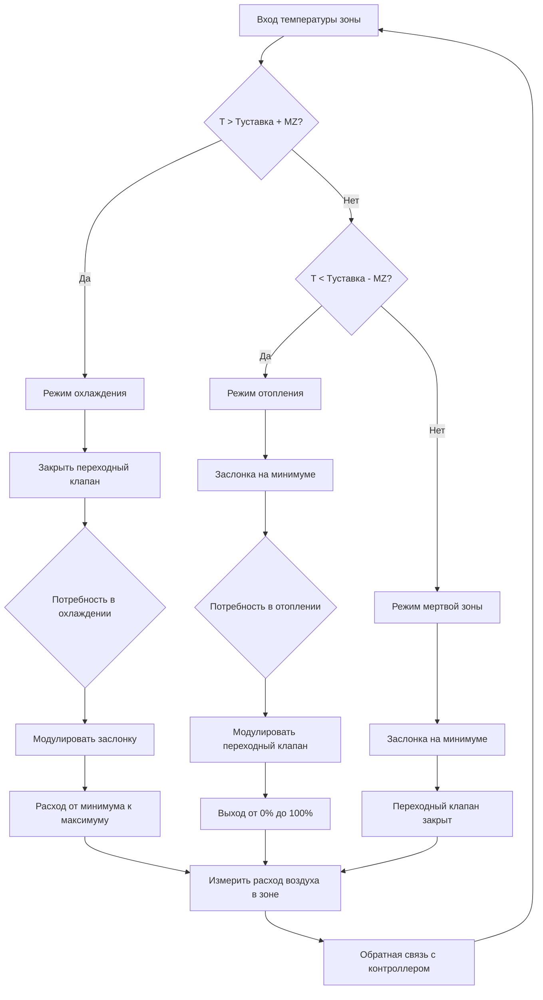

## Последовательности управления VAV-боксом

Переменные объемные (VAV) терминальные устройства обеспечивают управление температурой на уровне зоны путем модуляции расхода воздуха, подаваемого в отдельные помещения. Последовательности управления определяют, как заслонки, переходные катушки и вентиляторы боксов с питанием от вентилятора реагируют на условия в зоне для поддержания комфорта при оптимизации энергоэффективности.

## Последовательность VAV-бокса с охлаждением только

VAV-боксы с охлаждением только содержат один привод заслонки и не имеют возможности отопления. Последовательность управления работает следующим образом:

**Нормальный режим охлаждения:**
1. Температура зоны выше уставки запускает открытие заслонки
2. Заслонка модулирует от минимального к максимальному положению пропорционально ошибке температуры
3. При минимальной нагрузке охлаждения заслонка поддерживает уставку минимального расхода воздуха
4. При увеличении потребления охлаждения заслонка открывается линейно до максимального расхода воздуха
5. Максимальный расход воздуха обычно рассчитывается на 1,2–1,3 раза от пиковой нагрузки для обеспечения способности к управлению

**Требования к минимальному расходу воздуха:**
Заслонка никогда не закрывается ниже уставки минимального расхода воздуха, которая удовлетворяет требованиям вентиляции в соответствии со стандартом ASHRAE Standard 62.1. Минимальный расход воздуха обычно составляет от 30–50% расчетного максимального расхода для внешних зон и 20–30% для внутренних зон.

**Эксплуатация мертвой зоны:**
Когда температура зоны находится в пределах мертвой зоны охлаждения (обычно 0,5–1,0 °C ниже уставки), заслонка поддерживает минимальное положение. Это предотвращает ненужные циклы расхода воздуха и снижает потребление энергии вентилятором.

## VAV-бокс с последовательностью переходного управления

VAV-боксы с переходным управлением добавляют возможность отопления через электрические резистивные катушки, катушки с горячей водой или паровые катушки. Последовательность координирует работу заслонки и переходного управления:

**Последовательность охлаждения (температура зоны выше уставки):**
1. Переходный клапан полностью закрыт (выход 0%)
2. Заслонка модулирует от минимального к максимальному положению
3. Расход воздуха увеличивается пропорционально потребности в охлаждении
4. Максимальное охлаждение обеспечивается при положении заслонки 100%

**Мертвая зона (температура зоны в пределах уставки ±0,3 °C):**
1. Заслонка поддерживает положение минимального расхода воздуха
2. Переходный клапан остается закрытым
3. Активное отопление или охлаждение отсутствуют

**Последовательность отопления (температура зоны ниже уставки):**
1. Заслонка остается в положении минимального расхода воздуха
2. Переходный клапан модулирует от 0 до 100% в зависимости от потребности в отоплении
3. Температура подаваемого воздуха увеличивается при увеличении выхода переходного управления
4. Максимальное отопление обеспечивается при положении переходного клапана 100% с минимальным расходом воздуха

Эта структура последовательности минимизирует одновременное отопление и охлаждение, снижая потери энергии при сохранении надлежащей вентиляции.

## VAV-последовательности ASHRAE Guideline 36

ASHRAE Guideline 36 предоставляет стандартизированные высокопроизводительные последовательности для VAV-систем. Ключевые особенности включают:

**Логика двойного максимума:**
Guideline 36 реализует отдельные пределы максимального расхода воздуха для режимов охлаждения и вентиляции. Во время пикового охлаждения бокс может подавать расход до максимума охлаждения. Во время работы экономайзера или в мягкую погоду максимум снижается для предотвращения переохлаждения.

**Логика оптимизации и регулирования:**
Вместо фиксированных минимальных расходов воздуха, Guideline 36 использует динамическое регулирование минимума на основе фактических уровней CO2 в зоне или рассчитанных требований к расходу наружного воздуха, повышая энергоэффективность.

**Пределы положения заслонки:**
Последовательность включает положения для управления без зависимости от давления с отслеживанием расхода воздуха. Положение заслонки регулируется для поддержания целевого расхода воздуха независимо от колебаний статического давления в воздуховоде.

## Таблица уставок минимального расхода воздуха

| Тип зоны | Минимум % от расчета | Типичный диапазон CFM (м³/ч) | Основание вентиляции |
|-----------|-------------------|------------------|-------------------|
| Офис внутри здания | 20–30% | 50–150 CFM (85–255 м³/ч) | Плотность населения |
| Офис на периметре | 30–40% | 75–200 CFM (127–340 м³/ч) | Нагрузки ограждающей конструкции + вентиляция |
| Переговорная | 40–50% | 150–400 CFM (255–680 м³/ч) | Высокая плотность населения |
| Учебный класс | 40–50% | 200–500 CFM (340–850 м³/ч) | Высокая плотность населения |
| Лаборатория | 50–70% | 300–800 CFM (510–1360 м³/ч) | Безопасность + требования процесса |
| Центр обработки данных | 60–80% | 500–2000 CFM (850–3400 м³/ч) | Нагрузки охлаждения оборудования |

## Характеристики управления заслонкой

**Эксплуатация без зависимости от давления:**
Современные VAV-боксы включают измерение расхода воздуха через датчики скорости или дифференциальное давление на входе. Контроллер регулирует положение заслонки для поддержания целевого расхода воздуха несмотря на колебания статического давления восходящего потока, обеспечивая стабильное управление в зоне.

**Авторитет заслонки:**
Надлежащее управление требует минимального коэффициента регулирования 50:1. Бокс с максимальным расчетным расходом 1700 м³/ч (1000 CFM) должен точно управляться вплоть до 34 м³/ч (20 CFM) минимума. Линейные заслонки с характеризованными приводами обеспечивают лучшее управление при низком расходе, чем противоположно-лопастные заслонки.

**Время отклика:**
Приводы заслонок обычно требуют 60–120 секунд для полного хода. Контуры управления должны учитывать это время отклика для предотвращения колебаний. Настройка контура PID должна использовать пропорциональные полосы 1–2 °C с минимальным интегральным действием.

## Каскадное управление и управление переходом

**Электрический переход:**
Электрические катушки работают в ступенях (обычно 2–3 ступени для управления SCR или ступенчатого управления). Каждая ступень активируется последовательно при увеличении потребности в отоплении. Пределы частоты циклирования предотвращают чрезмерный износ контактора.

**Переход с горячей водой:**
Двухходовые модулирующие клапаны обеспечивают пропорциональное управление. Авторитет клапана (соотношение перепада давления клапана к перепаду давления катушки) должен превышать 0,5 для стабильного управления. Требования к минимальной скорости потока воды предотвращают расслоение катушки.

**Калибровка клапана управления:**
Переходные клапаны, рассчитанные с характеристиками равного процента, обеспечивают линейный выход тепла во всем диапазоне эксплуатации. Надлежащий выбор коэффициента Cv клапана гарантирует, что клапан работает между 20–80% открытия при расчетных условиях, максимизируя авторитет управления.

## Диаграмма последовательности управления VAV

## Режимы занятости и незанятости

**Режим занятости:**
- Полная эксплуатация последовательности, как описано выше
- Минимальный расход воздуха поддерживается для вентиляции
- Температура в зоне поддерживается на уставках занятости
- Переход доступен для разогрева утром

**Режим незанятости:**
- Уставка расширена на температуры дежурного режима (уставка отопления 15–18 °C, установка охлаждения 26–29 °C)
- Заслонка закрыта с нулевым расходом, если только температура не превышает пределы дежурного режима
- Переход отключен, если только температура не падает ниже уставки защиты от замерзания
- Значительная экономия энергии за счет сокращения расхода воздуха и исключения переходного управления

**Режим разогрева:**
- Предварительная последовательность занятости приводит пространство к уставке занятости
- Заслонка в положении минимального расхода
- Переход на максимальное выражение
- Алгоритмы оптимального запуска рассчитывают время разогрева на основе температуры наружного воздуха и тепловой массы здания

## Соображения реализации

Надлежащая реализация последовательности управления VAV-боксом требует внимания к расположению датчиков, выбору привода и настройке контура управления. Датчики температуры в зоне должны располагаться вдали от диффузоров подачи и источников тепла. Датчики расхода воздуха требуют прямых участков воздуховода для точности. Параметры управления должны быть отрегулированы и скорректированы на основе фактической производительности системы для достижения стабильной и энергоэффективной эксплуатации.
