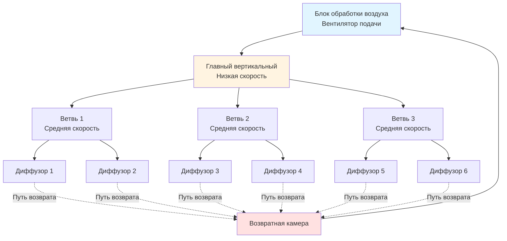
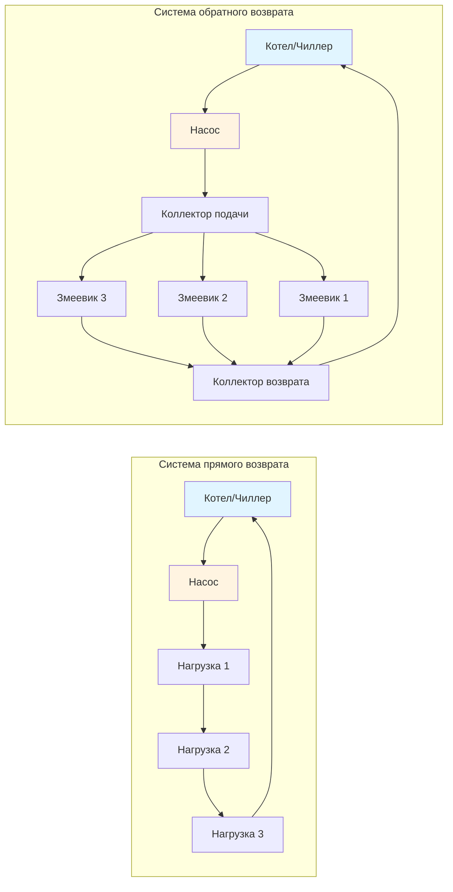

# Воздухопроводы и трубопроводные системы

Системы распределения образуют циркуляционную сеть ОВКВ установок, доставляя кондиционированный воздух и гидравлические жидкости от центрального оборудования к занятым пространствам. Правильное проектирование требует овладения механикой жидкостей, термодинамикой, свойствами материалов и строительными стандартами для достижения эффективной, тихой и надежной операции.

## Основы распределения воздуха

Системы распределения воздуха передают кондиционированный воздух через листовой металл, стекловолокно, ткань или пластиковые воздухопроводы. Приоритеты проектирования включают минимизацию перепада давления, контроль передачи шума, предотвращение утечек воздуха и поддержание надлежащих профилей скорости.

### Методы размеров воздухопроводов

**Метод равного трения**: Поддерживает постоянный перепад давления на единицу длины по всей системе. Для заданного коэффициента трения $f$ (Па/м или дюйм. в.с./100 фт):

$$
\Delta P = f \cdot L
$$

где $L$ - длина воздухопровода. Диаметр воздухопровода следует из соотношения Дарси-Вейсбаха:

$$
\Delta P = f_D \cdot \frac{L}{D_h} \cdot \frac{\rho V^2}{2}
$$

где:
- $f_D$ = коэффициент трения Дарси (безразмерный)
- $D_h$ = гидравлический диаметр (м или фт)
- $\rho$ = плотность воздуха (кг/м³ или фунт/фт³)
- $V$ = скорость (м/с или фт/мин)

**Метод восстановления статического давления**: Размеры воздухопроводов таким образом, чтобы снижение давления скорости ниже по течению преобразовалось в статическое давление, компенсируя потери на трение. На каждом фитинге:

$$
\Delta P_s = \Delta P_v - \Delta P_f
$$

где $\Delta P_s$ - изменение статического давления, $\Delta P_v$ - снижение давления скорости, и $\Delta P_f$ - потеря на трение.

### Компоненты перепада давления

Общий перепад давления системы объединяет несколько сопротивлений:

$$
\Delta P_{total} = \Delta P_{straight} + \sum \Delta P_{fittings} + \Delta P_{equipment}
$$

Потери на фитинги используют коэффициенты потерь:

$$
\Delta P_{fitting} = C \cdot \frac{\rho V^2}{2}
$$

SMACNA предоставляет комплексные значения $C$ для колен, переходов, демпферов и диффузоров на основе геометрии и скорости.

### Архитектура системы воздухопроводов

## Основы гидравлического распределения

Гидравлические системы транспортируют тепловую энергию через жидкие носители, обычно воду или растворы гликоля. Рассмотрения проектирования включают размеры насоса, выбор материала трубы, размещение расширения и удаление воздуха.

### Размеры трубопровода и перепад давления

Уравнение Дарси-Вейсбаха управляет перепадом давления в трубе:

$$
\Delta P = f \cdot \frac{L}{D} \cdot \frac{\rho V^2}{2}
$$

Для турбулентного потока (Re > 4000), уравнение Коулбрука-Уайта связывает коэффициент трения с шероховатостью:

$$
\frac{1}{\sqrt{f}} = -2 \log_{10} \left( \frac{\epsilon/D}{3.7} + \frac{2.51}{Re \sqrt{f}} \right)
$$

где $\epsilon$ - абсолютная шероховатость и $Re$ - число Рейнольдса.

Практическое проектирование использует пределы скорости для контроля эрозии и шума:
- Охлажденная вода: 1.2-2.4 м/с (4-8 фт/с)
- Горячая вода: 1.2-3.0 м/с (4-10 фт/с)
- Пар: скорость зависит от давления и метода возврата конденсата

### Конфигурации гидравлических систем

Системы обратного возврата обеспечивают врожденный гидравлический баланс путем уравнивания длин труб для каждой нагрузки.

## Выбор материалов и стандарты

**Материалы воздуховодов** (Стандарты SMACNA по конструкции HVAC-воздуховодов):
- Оцинкованная сталь: наиболее распространенный материал, спецификация ASTM A653
- Нержавеющая сталь: для коррозионных сред, спецификация ASTM A480
- Алюминий: для прибрежных зон и химического воздействия, спецификация ASTM B209
- Дuctboard из стекловолокна: внутренняя изоляция, стандарты NAIMA

**Материалы трубопроводов** (ASME B31.9, спецификации ASTM):
- Стальные трубы: класс 40 для большинства применений, черные или оцинкованные
- Медь: тип L для инженерных систем зданий, спецификация ASTM B88
- CPVC: для холодной воды до 93°C, спецификация ASTM F441
- PEX: для гидронного отопления, спецификации ASTM F876/F877

## Стандарты проектирования и ссылки

**Основы ASHRAE**: Глава 21 (Проектирование воздухопроводов), Глава 22 (Размеры трубопроводов)

**Публикации SMACNA**:
- Стандарты конструкции воздухопроводов HVAC - металлические и гибкие
- Проектирование воздухопроводов
- Руководство сейсмического крепления

**Требования класса давления**: SMACNA определяет конструкцию воздухопроводов на основе статического давления и размеров, в диапазоне от ±500 Па (±2 дюйма в.с.) до ±2500 Па (±10 дюймов в.с.).

## Рассмотрения интеграции системы

Эффективное проектирование распределения интегрируется с архитектурными, конструктивными и другими системами MEP:

1. **Координация**: Поддерживайте зазоры для установки и доступа в обслуживание
2. **Акустика**: Размер для пределов скорости, предотвращающих образование шума
3. **Тепловая производительность**: Изоляция для предотвращения конденсации и потерь энергии
4. **Сейсмическое крепление**: Требования SMACNA/ASCE 7 для распорок и поддерживающих конструкций
5. **Безопасность жизни**: Противопожарные/дымовые заслонки согласно NFPA 90A/90B на оценочных узлах

Проектирование системы распределения напрямую влияет на размеры оборудования, потребление энергии, комфорт занятых и долгосрочные эксплуатационные расходы. Надлежащее применение фундаментальных принципов и отраслевых стандартов обеспечивает соответствие систем требованиям производительности на протяжении всего срока их эксплуатации.

---

*Ссылка: Справочник ASHRAE - Основы (2021), Стандарты конструкции воздухопроводов HVAC SMACNA (2005), ASME B31.9 Трубопроводы услуг зданий*
