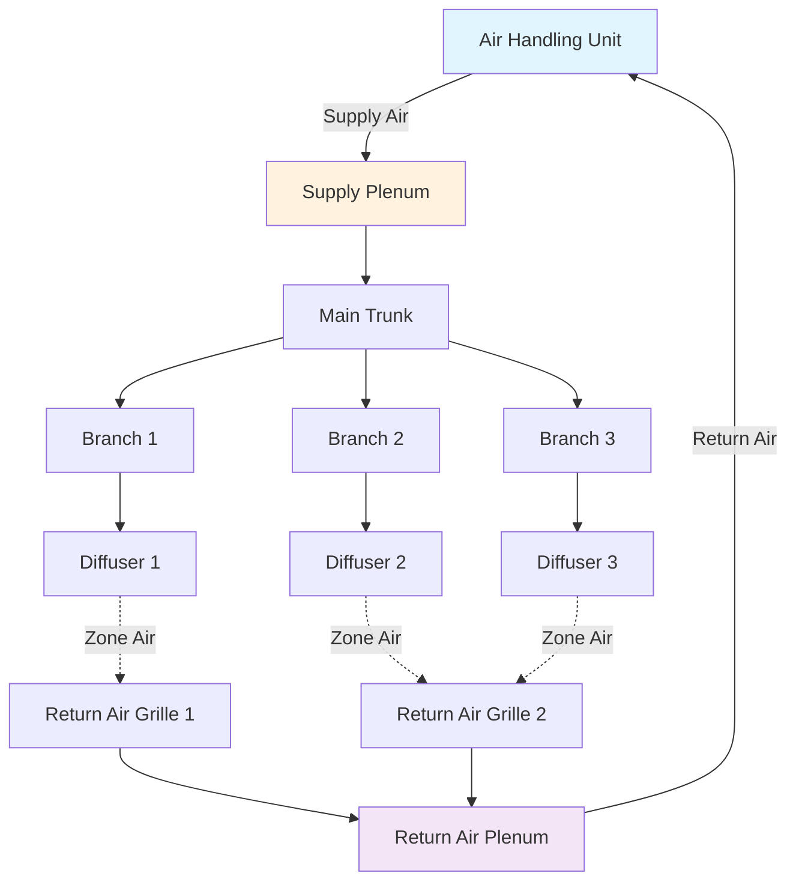

## Обзор

Воздуховоды служат циркуляционной системой установок HVAC, доставляя кондиционированный воздух в занятые помещения и возвращая воздух в оборудование для повторной кондиционирования. Правильное проектирование воздуховодов обеспечивает адекватный поток воздуха, минимизированное энергопотребление, приемлемые уровни шума и долговечность системы. В этом разделе рассматриваются фундаментальные принципы, которые управляют системами подачи, возврата и вытяжки воздуховодов.

## Компоненты системы воздуховодов

## Основы определения размера воздуховодов

### Метод скорости

Метод скорости определяет размер воздуховодов на основе целевой скорости воздуха для контроля шума и перепада давления:

$$Q = A \times V$$

$$A = \frac{Q}{V}$$

Где:
- $Q$ = расход воздуха (CFM)
- $A$ = площадь поперечного сечения воздуховода (м²)
- $V$ = скорость воздуха (м/с)

Для прямоугольных воздуховодов эквивалентный диаметр для расчетов потерь давления:

$$D_e = 1.30 \times \frac{(a \times b)^{0.625}}{(a + b)^{0.25}}$$

Где $a$ и $b$ — размеры воздуховода в сантиметрах.

### Метод равного трения

Этот метод поддерживает постоянную потерю давления на единицу длины во всей системе. Уравнение Дарси-Вейсбаха, адаптированное для воздуховодов:

$$\Delta P_f = \frac{f \times L \times \rho \times V^2}{2 \times D_h}$$

Упрощено для стандартного воздуха на уровне моря:

$$\Delta P = \frac{0.109 \times Q^{1.9}}{D^{5.02}}$$

Где:
- $\Delta P$ = потеря давления (Па на 100 м)
- $f$ = коэффициент трения (безразмерный)
- $L$ = длина воздуховода (м)
- $D$ = диаметр воздуховода (см)
- $D_h$ = гидравлический диаметр (см)
- $\rho$ = плотность воздуха (кг/м³)

### Рекомендуемые скорости воздуха в воздуховодах

| Тип системы | Основные воздуховоды | Ветвевые воздуховоды | Примечания |
|-------------|------------|--------------|-------|
| **Подача — жилые помещения** | 3,6-4,6 м/с | 2,5-3,6 м/с | Низкая скорость для контроля шума |
| **Подача — коммерческие** | 6,1-9,1 м/с | 4,1-6,1 м/с | Баланс между размером и шумом |
| **Возврат — низкая скорость** | 4,1-5,1 м/с | 3,0-4,1 м/с | Снижает переиспускаемый шум |
| **Возврат — высокая скорость** | 7,6-10,2 м/с | 6,1-7,6 м/с | Промышленные применения |
| **Системы вытяжки** | 5,1-7,6 м/с | 4,1-6,1 м/с | Зависит от типа загрязнителя |

## Выбор материала воздуховода

Выбор материала зависит от требований применения, соответствия кодексам и экономических факторов.

| Материал | Применение | Преимущества | Ограничения | Класс SMACNA |
|----------|-------------|------------|-------------|--------------|
| **Оцинкованная сталь** | Общие HVAC, коммерческие | Прочная, огнестойкая, жесткая | Коррозия во влажных условиях | 0,25-2,5 кПа |
| **Алюминий** | Прибрежные, агрессивные среды | Устойчив к коррозии, легкий | Выше стоимость, меньше прочность | 0,25-1,5 кПа |
| **Нержавеющая сталь** | Вытяжка, высокая температура, агрессивная | Отличная коррозионная стойкость | Высокая стоимость материала | 0,25-2,5 кПа |
| **Доска из стекловолокна** | Низкое давление, жилые/коммерческие | Звукопоглощение, изолирован | Ограничено 0,5 кПа, чувствительна к влаге | Макс. 0,5 кПа |
| **Гибкий воздуховод** | Финальные соединения, узкие пространства | Простой монтаж, предизолирован | Высокие потери давления при сжатии | Макс. 0,25 кПа |
| **PVC/FRP** | Вытяжка дымов, химическая среда | Устойчив к химикатам | Не для общего HVAC | Зависит |

## Системы подачи воздуховодов

Воздуховоды подачи доставляют кондиционированный воздух из воздухообрабатывающего устройства в занятые помещения. Соображения при проектировании:

**Классификация давления:** ASHRAE 90.1 и IMC требуют герметизацию воздуховодов на основе класса статического давления:
- Низкое давление: ≤ 0,5 кПа
- Среднее давление: 0,5-1,5 кПа
- Высокое давление: 1,5-2,5 кПа

**Требования к теплоизоляции:** Воздуховоды подачи в некондиционированных помещениях требуют изоляции для предотвращения тепловых потерь. Минимум RSI 1,06 для воздуховодов в некондиционированных помещениях по IECC.

**Устройства распределения воздуха:** Концевые устройства (диффузоры, решетки регистров, решетки) должны быть выбраны для:
- Требуемого расстояния выброса
- Приемлемых критериев шума (NC 25-40 в зависимости от помещения)
- Надлежащего смешивания и избежания застойных зон

## Системы возврата воздуховодов

Системы возврата собирают воздух из кондиционированных помещений и направляют его обратно в воздухообрабатывающее устройство. Критические факторы проектирования:

**Определение размера:** Воздуховоды возврата обычно рассчитаны на более низкие скорости, чем подача, чтобы минимизировать переиспускаемый шум вблизи занятых помещений. Недостаточно рассчитанные системы возврата создают чрезмерное статическое давление, снижая производительность и эффективность системы.

**Центральные и распределенные возвраты:** Распределенные системы возврата обеспечивают лучший баланс давления и контроль температуры, но увеличивают стоимость установки. Центральные возвраты экономичны, но могут создавать дисбаланс давления между помещениями.

**Переходные воздуховоды и решетки:** Требуются, когда двери разделяют пути подачи и возврата воздуха, чтобы предотвратить нарастание давления. Минимум 0,16 CFM (м³/ч) на квадратный метр площади помещения через переходные отверстия.

## Системы вытяжки воздуховодов

Системы вытяжки удаляют загрязненный, нагретый или влажный воздух из зданий. Применения включают:

**Общая вытяжка:** Удаление вентиляционного воздуха здания для поддержания соотношений положительного/отрицательного давления.

**Вытяжка из кухни:** Удаление пара, богатого смазкой, в соответствии с NFPA 96. Требует:
- Сварная черная или нержавеющая сталь калибра 1,2 мм
- Минимальная скорость воздуховода 2,5 м/с
- Конструкция смазочного воздуховода по списку

**Вытяжка из ванных/туалетов:** Выделенная вытяжка предотвращает миграцию запахов. Типичная скорость: 0,024 м³/с на унитаз, 0,0095 м³/с на писсуар.

**Вытяжка из колпака дымовой трубы:** Лабораторная и промышленная вытяжка для опасных загрязнителей. Требует материалы, устойчивые к коррозии, и управление с постоянным объемом или VAV.

## Соображения относительно потерь давления

Общие потери давления в системе включают:

$$\Delta P_{total} = \Delta P_{friction} + \Delta P_{fittings} + \Delta P_{equipment}$$

**Коэффициенты потерь на фитингах:** Каждый отвод, тройник, переход и демпер вводят дополнительные потери давления, выраженные как кратные давлению скорости:

$$\Delta P_{fitting} = C \times VP$$

$$VP = \frac{V^2}{4005}$$

Где $C$ — коэффициент потерь фитинга из ASHRAE Fundamentals или SMACNA HVAC Systems Duct Design.

Типичные коэффициенты потерь фитингов:
- 90° скошенный отвод (без лопаток): C = 1,2
- 90° радиусный отвод (R/D = 1,5): C = 0,27
- Прямой тройник (ветвь): C = 0,9-1,5
- Резкое сужение: C = 0,5
- Резкое расширение: C = 1,0

## Стандарты и ссылки

**Стандарты SMACNA:**
- HVAC Systems Duct Design: Таблицы потерь на трение, коэффициенты потерь фитингов, стандарты конструкции
- Duct Construction Standards: Калибры материалов, требования к герметизации, армирование

**Стандарты ASHRAE:**
- ASHRAE Handbook - Fundamentals: Психрометрика, механика жидкостей, уравнения проектирования воздуховодов
- ASHRAE 90.1: Требования к энергоэффективности, включая герметизацию и изоляцию воздуховодов
- ASHRAE 62.1: Требования вентиляции, влияющие на проектирование системы воздуховодов

**Требования кодексов:**
- International Mechanical Code (IMC): Конструкция воздуховодов, материалы, опоры, зазоры
- NFPA 90A/90B: Установка систем кондиционирования воздуха и вентиляции
- Местные поправки и требования юрисдикции

## Заключение

Эффективное проектирование воздуховодов балансирует множество конкурирующих целей: адекватную доставку потока воздуха, энергоэффективность, акустические характеристики, конструируемость и стоимость жизненного цикла. Соблюдение производственных стандартов SMACNA и методологии проектирования ASHRAE обеспечивает, что системы соответствуют ожиданиям производительности при соответствии применимым кодексам.
