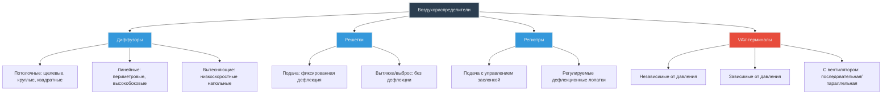

# Воздухораспределители: диффузоры, решетки и регистры

Воздухораспределители являются финальными компонентами системы распределения воздуха, обеспечивая подачу кондиционированного воздуха из воздуховодов в занятые помещения. Правильный выбор терминала напрямую влияет на комфорт в помещении, энергоэффективность и акустические характеристики. Данное руководство охватывает типы терминалов, методологию выбора и физику поведения воздушных струй.

## Классификация терминальных устройств

Воздухораспределители подразделяются на четыре основные категории в зависимости от функции и управления расходом воздуха:

## Физика дальности выброса и падения

Дальность выброса воздушной струи представляет горизонтальное расстояние, на которое воздух распространяется от терминала до точки, где скорость уменьшается до указанной конечной скорости (обычно 25 м/мин для охлаждения, 50 м/мин для обогрева). Падение количественно определяет вертикальное отклонение, вызванное эффектами плавучести и гравитации.

### Расчет дальности выброса

Дальность выброса следует эмпирическим соотношениям, полученным из уравнения свободной струи Альбертсона для турбулентных потоков:

**T₅₀ = K × √(Q / V₀)**

Где:
- T₅₀ = дальность выброса до скорости 25 м/мин (м)
- K = коэффициент дальности выброса (безразмерный, зависит от производителя)
- Q = расход воздуха (м³/ч)
- V₀ = начальная скорость на выходе (м/мин)

Для прямоугольных диффузоров соотношение упрощается до:

**T₅₀ = K × (Q / L)**

Где L = активная длина (м) диффузора.

### Расчет падения

Падение является результатом разности плотности между подаваемым и комнатным воздухом. Для изотермальных струй падение незначительно. Для неизотермальных условий:

**D = 0.00015 × ΔT × T₅₀**

Где:
- D = расстояние падения (м)
- ΔT = разность температур, подача минус помещение (°C)
- T₅₀ = дальность выброса (м)

**Критическое замечание:** Струи охлаждения падают из-за отрицательной плавучести (ρ_подача > ρ_помещение). Струи обогрева поднимаются. Максимально допустимое падение составляет 0,6–0,9 м для потолочных диффузоров, чтобы предотвратить сквозняки в зоне пребывания.

## Критерии выбора диффузора

Выбор требует балансировки подачи воздуха, акустических характеристик и архитектурных ограничений. Обратитесь к стандарту ASHRAE 70 (методы испытания и оценки производительности воздухораспределителей и воздухозаборников) для стандартизации данных производительности.

| Параметр | Потолочные диффузоры | Линейный щелевой | Вытесняющий | Высокобоковой |
|----------|---------------------|------------------|------------|-------------|
| **Типовая дальность выброса (м)** | 2,4–6,1 | 3,0–9,1 | 0,9–1,8 | 4,6–12,2 |
| **Скорость подачи (м/мин)** | 120–240 | 150–300 | 15–30 | 180–365 |
| **Уровень NC @ 3 м** | 25–35 | 30–40 | <20 | 35–45 |
| **Отношение дальности/падения** | 4:1 типовое | 6:1 типовое | н/п | 10:1 типовое |
| **Применение** | Офисы общего назначения | Периметровые зоны | Лаборатории, чистые помещения | Спортзалы, вестибюли |
| **Рисунок распределения** | 2–4 способа | Линейный | 360° радиальный | 1-направленный горизонтальный |

### Акустические характеристики

Генерирование звука в терминалах возникает в результате турбулентности на лопатках и перепада давления на устройстве. Стандарты ADC (Air Diffusion Council) предоставляют рейтинги NC (критерии шума):

**NC ≈ 10 × log₁₀(Δp) + C**

Где Δp = перепад давления (Па) и C = постоянная, зависящая от геометрии терминала.

**Целевой показатель проектирования:** NC 25–35 для офисов, NC 30–40 для розничных помещений, NC 20–25 для конференц-залов.

## VAV-терминалы

VAV-терминалы модулируют расход воздуха при сохранении уставок температуры помещения. Существуют два фундаментальных типа:

### Независимые от давления (PI) и зависимые от давления (PD)

| Характеристика | Независимые от давления | Зависимые от давления |
|---|---|---|
| **Управление расходом** | Интегральный датчик расхода + контроллер | Только положение заслонки |
| **Чувствительность к давлению в воздуховоде** | Компенсирует изменение давления | Расход зависит от давления |
| **Стоимость** | На 30–50% выше | Базовая стоимость |
| **Применение** | Системы >10 терминалов | Малые системы, ограничения по бюджету |
| **Точность** | ±10% от уставки | ±20–30% от уставки |

### VAV-терминалы с вентилятором

Терминалы с вентилятором смешивают первичный (охлажденный) воздух с воздухом из плены, обеспечивая постоянную подачу объема при условиях низкой нагрузки:

**Серийный вентилятор:** вентилятор работает непрерывно, смешивая первичный и индуцированный воздух перед подачей.

**Параллельный вентилятор:** вентилятор работает только при снижении первичного расхода ниже минимума, работая параллельно с первичным воздухом.

**Емкость отопления (серийная):**

**Q_heat = 0.34 × (м³/ч_total) × (T_подача - T_первичная)**

Где м³/ч_total включает как первичный, так и индуцированный расход воздуха.

## Методология выбора

1. **Определить нагрузку на зону:** рассчитать явную холодильную нагрузку (кДж/ч).
2. **Рассчитать требуемый расход:** м³/ч = Q_явная / (0.34 × ΔT).
3. **Установить требование по дальности выброса:** T₅₀ = 0,75 × (длина или ширина помещения, в зависимости от критичности).
4. **Выбрать тип терминала:** на основе архитектурных ограничений и применения.
5. **Проверить производительность:** убедитесь в данных производителя для дальности выброса при рассчитанном расходе.
6. **Подтвердить перепад давления:** убедитесь, что Δp < доступное статическое давление системы, обычно 12–37 Па.
7. **Проверить акустику:** убедитесь, что рейтинг NC соответствует требованиям пространства.

## Стандарты и справочные материалы

- **ASHRAE Standard 70:** методы испытания и оценки производительности воздухораспределителей и воздухозаборников
- **ASHRAE Fundamentals Handbook:** глава 20, пространственное распределение воздуха
- **ADC (Air Diffusion Council):** стандарты испытаний производительности диффузоров
- **SMACNA:** проектирование воздуховодов HVAC, раздел 6, терминальные устройства

## Рекомендации по установке

**Потолочные диффузоры:** установите на расстоянии минимум 15 см от стен, чтобы предотвратить окрашивание. Поддерживайте прямой воздуховод длиной 4× диаметра горловины выше по потоку.

**Линейные диффузоры:** выровняйте щели перпендикулярно стене окна для периметрового отопления. Герметизируйте коробки плены, чтобы предотвратить утечку обхода.

**Терминалы вытеснения:** разместите в зоне пребывания (пол или низкая стена). Требует стратифицированного температурного профиля; не подходит для помещений с высотой потолка <2,7 м.

**VAV-терминалы:** монтируйте с зазором для обслуживания для доступа к заслонке и контроллеру. Установите минимум прямой воздуховод в 3× диаметр выше по потоку для точного измерения расхода.

Правильный выбор и установка терминала обеспечивают эффективное распределение воздуха, минимизируют потребление энергии и сохраняют комфорт в помещении на всей площади кондиционируемого пространства.
