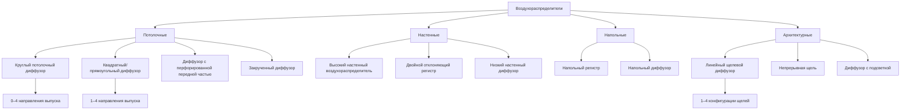

Воздухораспределители подают кондиционированный воздух в занятые помещения, контролируя картину потока воздуха, скорость, температурный перепад и акустические характеристики. Правильный выбор требует анализа дальности подачи, характеристик падения, картины распространения и движения воздуха в помещении для достижения тепловогокомфорта и целей качества воздуха.

## Основные параметры производительности

Производительность воздухораспределителя зависит от трёх основных характеристик, определяющих картину потока воздуха:

**Дальность подачи** — это горизонтальное или вертикальное расстояние от лицевой части воздухораспределителя до точки, где скорость воздушной струи уменьшается до 0,25 м/с (50 fpm) — скорости срыва. Это определяет расстояние покрытия.

**Падение** — вертикальное расстояние, на которое воздушная струя падает ниже горизонтальной плоскости перед достижением скорости срыва. Критично для охлаждающих приложений, где холодный воздух падает более быстро.

**Распространение** — угол расширения картины потока воздуха, обычно измеряется в точке, где скорость снижается до 0,25 м/с. Определяет ширину покрытия.

### Расчёт дальности подачи

Расчёты дальности подачи используют данные производительности от производителя на основе стандарта ASHRAE Standard 70 или процедур тестирования ADC (Air Diffusion Council):

```
T = K × (Q / Ak)^0.5
```

Где:
- T = Дальность подачи до скорости срыва 0,25 м/с (м)
- K = Коэффициент производительности производителя
- Q = Расход воздуха (м³/ч)
- Ak = Коэффициент эффективной площади (безразмерный)

Для предварительного выбора размера отношение дальности подачи к высоте потолка обычно составляет от 1,5:1 до 2,5:1 для потолочных воздухораспределителей, с меньшими отношениями для низкоскоростных приложений и большими отношениями для высокоскоростных систем.

### Предсказание падения

Падение зависит от температурного перепада и дальности подачи:

```
D = C × ΔT × (T / 10)^1.5
```

Где:
- D = Расстояние падения (м)
- C = Коэффициент падения (0,1–0,3 в зависимости от типа воздухораспределителя)
- ΔT = Температурный перепад между подачей и помещением (°C)
- T = Дальность подачи (м)

Рекомендуемые максимальные температурные перепады:

| Тип воздухораспределителя | Охлаждение ΔT | Отопление ΔT |
|--------------------------|--------------|-------------|
| Потолочный диффузор | 8–11°C | 14–17°C |
| Высокий настенный | 6–8°C | 17–22°C |
| Низкий настенный | 3–4°C | 8–11°C |
| Напольный | 4–7°C | Не применимо |

## Типы диффузоров и области применения



### Потолочные диффузоры

Круглые и квадратные потолочные диффузоры обеспечивают радиальные горизонтальные картины потока воздуха, идеальные для стандартной высоты потолков (2,4–3,7 м). Характеристики производительности:

- **Картина выпуска**: 1-, 2-, 3- или 4-сторонние регулируемые картины
- **Диапазон дальности подачи**: 1,8–9,1 м в зависимости от размера и расхода воздуха
- **Рейтинги NC**: NC 25–35 при номинальном расходе воздуха
- **Применение**: Офисы, розничные магазины, жилые помещения

Диффузоры с перфорированной передней частью обеспечивают превосходную производительность в высокопроизводительных приложениях с пониженным перепадом давления и улучшенным смешиванием воздуха. Картина перфорации создаёт множество малых струй, которые быстро захватывают воздух помещения, снижая температурную стратификацию.

Закрученные диффузоры генерируют вращающуюся картину потока с высокими коэффициентами индукции (10:1 до 15:1), обеспечивая отличное смешивание с минимальным температурным перепадом в занятой зоне. Оптимальны для систем переменного объёма воздуха (VAV), где коэффициенты отключения достигают 4:1.

### Настенные воздухораспределители и регистры

Настенное крепление в верхней части (2,1–2,7 м над полом) обеспечивает дальние подачи, подходящие для периметровых зон и больших открытых пространств:

- **Дальность подачи**: 4,6–15,2 м с регулируемым отклонением
- **Вертикальное распространение**: 15–30 градусов
- **Горизонтальное распространение**: 30–60 градусов
- **Применение**: Периметровое отопление/охлаждение, гимназии, склады

Двойные отклоняющие регистры обеспечивают независимое управление горизонтальными и вертикальными лопатками, позволяя точно регулировать картину потока воздуха. Выбирайте с противоположными лопатками дросселирования для улучшенного управления потоком и пониженного шума.

### Напольные диффузоры

Напольные воздухораспределители обеспечивают восходящее распределение воздуха для систем воздораспределения под полом (UFAD) и вытеснительной вентиляции:

- **Скорость выпуска**: 0,25–0,5 м/с на уровне пола
- **Высота дальности подачи**: 1,2–1,8 м до занятой зоны
- **Температурный перепад**: максимум 4–7°C охлаждения
- **Применение**: UFAD, полы с повышенным доступом, вытеснительная вентиляция

### Линейные щелевые диффузоры

Архитектурные щелевые диффузоры интегрируются в дизайн здания, обеспечивая контролируемое распределение воздуха:

- **Ширина щели**: 1,3–5,1 см
- **Картина**: 1-, 2-, 3- или 4-щелевые конфигурации
- **Расход воздуха на погонный метр**: 1,4–2,6 м³/ч/м на погонный метр длины
- **Дальность подачи**: 2,4–7,6 м в зависимости от конфигурации щели
- **Применение**: Периметровые зоны, вестибюли, архитектурные пространства

## Критерии выбора

| Параметр | Рекомендуемый диапазон | Примечания |
|----------|----------------------|-----------|
| Кратность воздухообмена в помещении | 4–8 воздухообменов/ч охлаждение, 2–4 воздухообмена/ч отопление | Выше для внутренних нагрузок |
| Скорость срыва | 0,25 м/с стандартно, 0,13–0,18 м/с критично | Ниже для лабораторий, чистых помещений |
| Отношение дальности подачи к высоте потолка | 1,5:1 до 2,5:1 | Обеспечивает надлежащее смешивание |
| Скорость в шейке | 2,5–4,1 м/с стандартно, 2,0–3,1 м/с с низким уровнем шума | Управляет перепадом давления и шумом |
| Рейтинг NC | NC 25–30 офисы, NC 35–40 розничные | По ASHRAE Standard 55 |
| ADPI (индекс производительности распределения воздуха) | >80 для занятых зон | Измеряет тепловой комфорт |

### Рейтинги производительности ADC

Air Diffusion Council устанавливает стандартизированные процедуры тестирования для сертификации производительности воздухораспределителя. Рейтинги серии ADC-1000 предоставляют:

- Сертифицированные данные дальности подачи при различных расходах воздуха
- Уровни звуковой мощности в октавных полосах
- Характеристики перепада давления
- Производительность при температурном перепаде

Указывайте сертифицированные ADC продукты для проектов, требующих проверенных данных производительности и согласованных результатов установки.

## Особенности установки

Эффективность воздухораспределителя зависит от надлежащих практик установки:

1. **Расположите диффузоры** на основе расчётов дальности подачи, чтобы обеспечить перекрытие картины потока 10–20% для равномерного покрытия
2. **Проверьте глубину потолочного плёнума**, обеспечивающую адекватное расстояние (минимум 15–30 см) от соединения с воздуховодом до спинки воздухораспределителя для надлежащего распределения воздуха
3. **Установите балансировочные дросселирующие клапаны** в воздуховодах выше по потоку от воздухораспределителей, а не при соединениях в шейке, где они создают чрезмерный шум
4. **Сохраняйте зазоры** от стен, перегородок и препятствий в соответствии с требованиями производителя (обычно 30–61 см)
5. **Координируйте с освещением и потолочной сеткой**, чтобы избежать конфликтов и сохранить архитектурную симметрию

Правильный выбор и установка воздухораспределителя напрямую влияют на комфорт жильцов, энергоэффективность и акустические характеристики на протяжении всего жизненного цикла здания.
