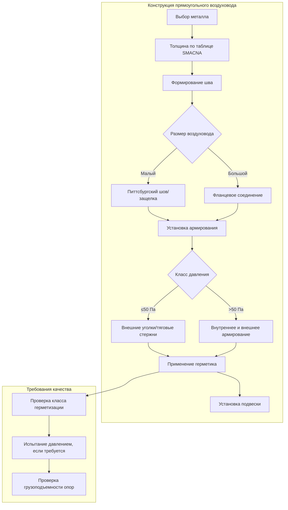

## Обзор

Стандарты конструкции воздуховодов HVAC устанавливают минимальные требования к изготовлению воздуховодов из листового металла для обеспечения структурной целостности, герметичности и безопасной работы при расчетном давлении. Национальная ассоциация подрядчиков по листовому металлу и кондиционированию воздуха (SMACNA) публикует отраслевые стандартные спецификации, которые определяют выбор толщины металла, расстояния армирования, методы герметизации и требования к опорам на основе класса давления и размеров воздуховода.

## Классы давления SMACNA

Системы воздуховодов классифицируются по максимальному рабочему давлению, измеряемому в Па (Па). Класс давления определяет требования к конструкции, включая толщину металла, тип армирования и методы герметизации.

### Определение классов давления

| Класс давления | Диапазон статического давления | Типичные применения |
|----------------|--------------------------------|---------------------|
| **10 Па** | До 10 Па | Жилые системы, низкоскоростные коммерческие |
| **25 Па** | 10–25 Па | Стандартные коммерческие HVAC, малые системы VAV |
| **50 Па** | 25–50 Па | Среднее давление VAV, большие коммерческие системы |
| **75 Па** | 50–75 Па | Высокопрессионные системы, вытяжка лабораторий |
| **100 Па** | 75–100 Па | Промышленная вентиляция, специальные применения |
| **150 Па** | 100–150 Па | Высокоскоростные системы, производственная вытяжка |
| **250 Па** | 150–250 Па | Очень высокопрессионные промышленные применения |

## Требования к толщине металла

Толщина листового металла варьируется в зависимости от размера воздуховода и класса давления. Выбор толщины прямоугольного воздуховода следует таблицам SMACNA на основе наибольшего размера стороны и класса статического давления.

### Таблица толщины прямоугольного воздуховода (оцинкованная сталь)

Для класса давления 50 Па:

| Размер стороны воздуховода | Минимальная толщина | Толщина (мм) |
|------------------------------|-------------------|-------------|
| До 30 см | 26 калибр | 0,47 |
| 31–76 см | 24 калибр | 0,61 |
| 77–137 см | 22 калибр | 0,76 |
| 138–213 см | 20 калибр | 0,91 |
| 216–244 см | 18 калибр | 1,21 |

Более высокие классы давления требуют более толстого металла, а более низкие классы давления позволяют использовать более тонкие материалы. Полные спецификации по всем классам давления см. в таблицах SMACNA.

### Требования к толщине круглого воздуховода

Конструкция круглого и овального воздуховода использует спиральный шов или продольное соединение:

| Диаметр | 10 Па | 50 Па | 100 Па |
|---------|--------|---------|---------|
| До 30 см | 26 калибр | 24 калибр | 22 калибр |
| 33–61 см | 24 калибр | 22 калибр | 20 калибр |
| 64–91 см | 22 калибр | 20 калибр | 18 калибр |
| 94–152 см | 20 калибр | 18 калибр | 16 калибр |

## Требования к армированию

Поперечное армирование предотвращает разрушение воздуховода под отрицательным давлением и боковой прогиб под положительным давлением. Тип армирования и расстояние зависят от размеров воздуховода и класса давления.

### Типы армирования

- **Тяговые стержни**: Резьбовые стержни с угловыми или канальными рамами
- **Уголки и каналы**: Конструктивные элементы, прикрепленные к внешней части воздуховода
- **Бусины и поперечные перегибы**: Сформированные на поверхности воздуховода для более мелких воздуховодов
- **Внутренние углы**: Для больших воздуховодов, требующих внутреннего крепления

### Максимальное расстояние армирования

Для прямоугольного воздуховода класса 50 Па:

| Размер воздуховода | Расстояние армирования |
|-------------------|----------------------|
| 48–76 см | 152 см |
| 79–107 см | 122 см |
| 109–152 см | 102 см |
| 155–213 см | 76 см |
| 216–244 см | 61 см |

Расстояние уменьшается с более высокими классами давления и увеличивается с более низкими классами.

## Требования к герметизации

Классификация утечек воздуха соответствует стандартам класса герметизации SMACNA или требованиям к классам герметизации ASHRAE Standard 90.1.

### Классы герметизации SMACNA

| Класс герметизации | Максимальная утечка (CFM (м³/ч) на 929 см² при 25 Па) | Применения |
|-------------------|--------------------------------------------------|--------------|
| **Без герметизации** | 48 CFM (81 м³/ч) | Системы возврата воздуха ниже 75 Па |
| **Класс герметизации A** | 24 CFM (41 м³/ч) | Низкопрессионные приточные воздуховоды |
| **Класс герметизации B** | 12 CFM (20 м³/ч) | Среднепрессионные приточные, наружные воздуховоды |
| **Класс герметизации C** | 6 CFM (10 м³/ч) | Высокопрессионные системы, рекуперация тепла |

### Методы герметизации

- **Без герметизации**: Продольные швы и соединения механически скреплены без герметика
- **Класс герметизации A**: Поперечные соединения герметизированы лентой или мастикой
- **Класс герметизации B**: Все соединения и швы герметизированы
- **Класс герметизации C**: Все соединения, швы и проходы герметизированы; включает прокладки на фланцевых соединениях

Мастика, самоклеящаяся лента и прокладочные соединения являются приемлемыми материалами герметизации. Клейкая лента с тканевой основой не допускается для постоянной герметизации.

## Требования к расстоянию опор

Подвески и опоры воздуховодов должны предотвращать провисание, позволяя при этом тепловое расширение. Максимальное расстояние опор зависит от конструкции воздуховода и его местоположения.

### Максимальное расстояние между подвесками

| Тип воздуховода | Максимальное расстояние |
|----------------|----------------------|
| **Прямоугольный воздуховод** | 3 м (горизонтально) |
| **Круглый воздуховод до 61 см** | 3 м |
| **Круглый воздуховод свыше 61 см** | 2,4 м |
| **Вертикальные стояки** | На каждом этаже, максимум 4,9 м |
| **На отводах/переходах** | В пределах 1,2 м от фитинга |

Системы опор должны быть спроектированы на общий вес воздуховода, изоляции и воздушной нагрузки. Трапециевидные подвески, скобы Clevise и ленточные подвески являются общими конфигурациями.

## Детали конструкции воздуховода

## Типы соединений и подключений

- **Питтсбургский шов**: Стандартный продольный шов для прямоугольного воздуховода
- **Защелкивающийся шов**: Альтернатива для меньшего прямоугольного воздуховода
- **Фланцевые соединения**: Требуются для воздуховодов со сторонами более 61 см на поперечных соединениях
- **Скользящее и приводное соединение**: Допускается для круглого воздуховода до 50 Па
- **Сварные швы**: Требуются для высокотемпературных или специальных применений

## Специальные требования к конструкции

### Высокопрессионные воздуховоды (>100 Па)

- Требует непрерывных сварных или болтовых фланцевых соединений
- Обычно требуется внутреннее армирование
- Класс герметизации C обязателен
- Рекомендуется инженерная проверка для обеспечения структурной надежности

### Системы отрицательного давления

Вытяжные и возвратные воздуховоды под отрицательным давлением требуют дополнительного армирования для предотвращения разрушения. Расстояние промежуточного армирования уменьшается на 33% для приложений с отрицательным давлением.

### Наружные воздуховоды

- Минимум 22 калибр оцинкованной стали или нержавеющей стали
- Все швы и соединения герметизированы минимум до класса герметизации B
- Скошены для дренажа с дренажными отверстиями в низких точках
- Защищены от застойной воды и коррозии

## Соответствие и контроль

Надлежащая конструкция воздуховода обеспечивает:

- Структурную целостность при расчетном рабочем давлении
- Минимальные утечки воздуха для энергоэффективности
- Безопасную работу на протяжении всего срока службы системы
- Соответствие кодексу в соответствии с IMC и местными поправками

Подрядчики должны проверить детали конструкции в соответствии со стандартами SMACNA во время изготовления и установки. Испытания третьей стороной могут потребоваться для критических применений или зданий с высокими характеристиками для проверки соответствия классу герметизации.
