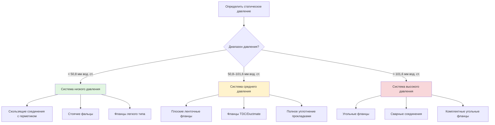

# Типы соединений воздуховодов и методы соединения

Соединения воздуховодов представляют собой критические точки в системах распределения воздуха, где правильное выполнение напрямую влияет на производительность системы, энергоэффективность и уровень утечки воздуха. Выбор подходящего типа соединения зависит от класса рабочего давления, материала воздуховода, требований к доступу и условий структурной нагрузки.

## Классификация соединений по методу изготовления

### Скользящие соединения (Slip Joints)

Скользящие соединения являются наиболее распространенным методом поперечного соединения прямоугольных и круглых воздуховодов в системах с низким давлением. Мужская часть одного участка воздуховода вставляется в женскую часть соседнего участка, создавая соединение с перекрытием.

**Требования к изготовлению:**
- Минимальное перекрытие 38 мм для воздуховодов диаметром до 610 мм
- Перекрытие 51 мм для воздуховодов диаметром от 635 до 1219 мм
- Перекрытие 64 мм для воздуховодов диаметром свыше 1219 мм

**Ограничения по давлению:**
Скользящие соединения обычно ограничены статическим давлением ниже 50 мм вод. ст. (водяной манометр), если они специально не усилены. Соединение relies на нанесении герметика и механических крепежных элементах (винты по металлу или заклепки), расположенных в соответствии со стандартами SMACNA.

### Соединения со стоячим фальцем (Standing Seam Joints)

Конструкция со стоячим фальцем создает продольные соединения при изготовлении прямоугольных воздуховодов. Два края воздуховода сгибаются вместе и сжимаются для формирования механической защелки без необходимости использования дополнительных крепежных элементов.

**Ключевые характеристики:**
- Обеспечивает структурную жесткость вдоль длины воздуховода
- Исключает необходимость нанесения герметика в самом шве при правильном формировании
- Типичные типы швов включают шов Питтсбург, замок snap-lock и замок snap-lock с пробивкой кнопок
- Расстояние между швами зависит от толщины листа воздуховода и его соотношения сторон

### Фланцевые соединения (Flanged Connections)

Фланцевые соединения обеспечивают наиболее надежный метод соединения для систем воздуховодов среднего и высокого давления. Фланцы крепятся к концам воздуховодов и соединяются болтами с прокладкой для создания герметичного уплотнения.

**Типы фланцев:**

| Тип фланца | Диапазон давления | Типичное применение |
|------|------|------|
| Уголки (Angle iron flanges) | До 254 мм вод. ст. | Крупные прямоугольные воздуховоды, системы высокого давления |
| Фланцы Ductmate/TDC | До 152 мм вод. ст. | Коммерческие системы, требующие сборки на месте |
| Плоские ленточные фланцы (Flat strap flanges) | До 102 мм вод. ст. | Прямоугольные воздуховоды среднего давления |
| Компаньон-уголки (Companion angle flanges) | До 254 мм вод. ст. | Тяжелые промышленные применения |

**Материалы прокладок:**
- Пена из неопрена с закрытыми порами для большинства применений (толщиной 13–19 мм)
- Резина EPDM для применений с более высокой температурой
- Сплошной неопрен для систем высокого давления, требующих устойчивости к сжатию

### Сварные соединения (Welded Connections)

Сварные соединения обеспечивают постоянные, герметичные соединения для круглых спиральных воздуховодов и специализированных применений высокого давления. Сварка исключает требования к механическим крепежным элементам и обеспечивает наименьший уровень утечки среди всех типов соединений.

**Применение:**
- Круглые спиральные воздуховоды в открытых архитектурных установках
- Системы вытяжной вентиляции из нержавеющей стали
- Промышленная вентиляция высокого давления (выше 254 мм вод. ст.)
- Среда с контролем загрязнения, требующая абсолютной герметичности

## Требования к герметизации соединений

SMACNA определяет три класса герметизации на основе статического давления и применения:

| Класс герметизации | Диапазон статического давления | Требования к герметизации |
|------|------|------|
| Класс A | До 50 мм вод. ст. | Лента с давлением или мастикой только на поперечных соединениях |
| Класс B | 50–76 мм вод. ст. | Мастика, прокладки или ленты на всех соединениях и швах |
| Класс C | 76–254 мм вод. ст. | Прокладки на всех соединениях; мастика или лента на продольных швах |

**Свойства герметиков:**
Все герметики должны сохранять адгезию и гибкость в рабочем температурном диапазоне, быть устойчивыми к ультрафиолетовому разрушению при воздействии и оставаться пароimpermeable после отверждения.

## Классификация утечек воздуховодов

SMACNA устанавливает классы утечки, определяющие максимально допустимую потерю воздуха на единицу площади поверхности:

- **Класс утечки 3:** 3 CFM (м³/ч) на 100 кв. футов (9,29 м²) при 1 дюйме вод. ст. (негерметизированные воздуховоды)
- **Класс утечки 6:** 6 CFM (м³/ч) на 100 кв. футов (9,29 м²) при 1 дюйме вод. ст.
- **Класс утечки 12:** 12 CFM (м³/ч) на 100 кв. футов (9,29 м²) при 1 дюйме вод. ст.
- **Класс утечки 24:** 24 CFM (м³/ч) на 100 кв. футов (9,29 м²) при 1 дюйме вод. ст.

Коды по энергоэффективности все чаще требуют проведения испытаний на герметичность, особенно для воздуховодов, расположенных вне кондиционируемого пространства. Испытания обычно проводятся с использованием оборудования «duct blaster» для создания избыточного давления в секциях и измерения фактических показателей утечки.

## Выбор типа соединения в зависимости от класса давления

## Особенности монтажа на объекте

**Расстояние между соединениями и крепление:**
Поперечные соединения не должны совпадать с местами установки подвесок. Соединения следует располагать между опорами с минимальным зазором 15 см для обеспечения доступа при правильной сборке.

**Требования к крепежу:**
Для листовых винтов или заклепок в скользящих соединениях требуется определенное расстояние между ними:
- Максимальное расстояние 7,6 см для воздуховодов при давлении выше 254 мм вод. ст.
- Расстояние 15,2 см при давлении от 50,8 до 254 мм вод. ст.
- Расстояние 30,5 см при давлении ниже 50,8 мм вод. ст.

**Монтаж прокладок:**
Убедитесь, что материал прокладки непрерывен по всему периметру фланца без зазоров или пустот в зоне сжатия. Затяжка болтов должна выполняться в шахматном порядке для равномерного распределения усилия сжатия.

## Ссылки на стандарты

Данный материал соответствует стандартам SMACNA HVAC Duct Construction Standards - Metal and Flexible, 4-е издание. Местные органы строительного надзора могут устанавливать дополнительные требования сверх минимальных норм SMACNA, особенно в части протоколов испытаний на герметичность и спецификаций классов герметичности в юрисдикциях, ориентированных на энергоэффективность.
