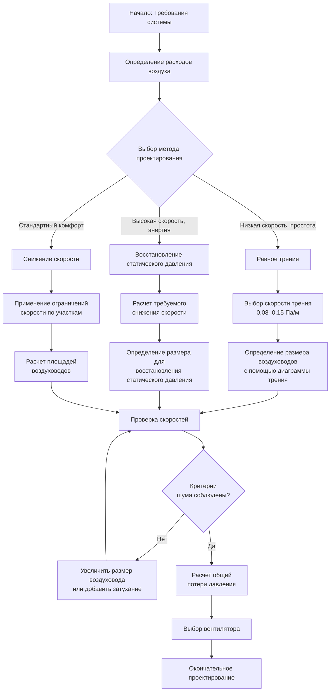

## Обзор методов проектирования воздуховодов

Проектирование систем воздуховодов требует систематического выбора размеров воздуховодов для доставки указанных расходов воздуха при соблюдении приемлемых потерь давления, уровней шума и затрат на строительство. Три основных метода, преобладающие в современной практике HVAC: равное трение, восстановление статического давления и снижение скорости. Каждый метод применяет специфические физические принципы для уравновешивания требований к производительности с практическими ограничениями.

Выбор метода проектирования зависит от характеристик системы, требований к производительности и экономических соображений. ASHRAE Fundamentals Глава 21 (Проектирование воздуховодов) предоставляет авторитетную основу для этих методологий.

## Метод равного трения

Метод равного трения поддерживает постоянную потерю давления на единицу длины по всей системе воздуховодов. Этот подход упрощает балансировку и обеспечивает согласованную производительность по всем ветвям.

### Принцип проектирования

Скорость трения остается постоянной:

$$\frac{\Delta P}{L} = \text{const}$$

Где:
- $\Delta P$ = потеря давления (Па)
- $L$ = длина воздуховода (м)

Связь между расходом воздуха, размером воздуховода и скоростью трения вытекает из уравнения Дарси-Вейсбаха:

$$\Delta P = f \cdot \frac{L}{D} \cdot \frac{\rho V^2}{2}$$

Для круглых воздуховодов скорость связана с расходом:

$$V = \frac{4Q}{\pi D^2}$$

Объединение этих уравнений дает соотношение определения размера равного трения:

$$D = \left(\frac{8fLQ^2}{\pi^2 \Delta P \rho}\right)^{1/5}$$

### Процедура применения

1. **Выбор скорости трения** (обычно 0,08–0,15 Па/м)
2. **Определение размера основного ствола** с использованием общего расхода воздуха и выбранной скорости трения
3. **Определение размера ветвей** с сохранением одинаковой скорости трения на единицу длины
4. **Расчет скорости** для каждого участка для проверки критериев шума
5. **Определение потерь на фитингах** и общего давления системы

### Преимущества и ограничения

**Преимущества:**
- Простая процедура расчета
- Саморегулирующиеся характеристики
- Предсказуемая производительность
- Подходит для низкоскоростных систем

**Ограничения:**
- Может создать чрезмерные скорости в больших воздуховодах
- Не оптимизирует восстановление статического давления
- Может привести к перемерению оборудования в распределенных системах

## Метод восстановления статического давления

Восстановление статического давления преобразует напор скоростного давления в статическое давление на каждом расходящемся соединении за счет контролируемого расширения. Этот метод поддерживает приблизительно постоянное статическое давление на всех точках отвода.

### Управляющие уравнения

На каждой точке ветвления снижение скорости создает восстановление статического давления:

$$\Delta P_s = P_{v1} - P_{v2} - \Delta P_f$$

Где:
- $\Delta P_s$ = восстановление статического давления (Па)
- $P_{v1}$ = напор скоростного давления выше по потоку (Па)
- $P_{v2}$ = напор скоростного давления ниже по потоку (Па)
- $\Delta P_f$ = потеря трения в участке (Па)

Напор скоростного давления составляет:

$$P_v = \frac{\rho V^2}{2}$$

Для полного восстановления статического давления:

$$\Delta P_s = \Delta P_f$$

Это дает критерий проектирования:

$$\frac{\rho}{2}(V_1^2 - V_2^2) = f \cdot \frac{L}{D} \cdot \frac{\rho V_{avg}^2}{2}$$

### Процедура проектирования

1. **Расчет требуемого снижения скорости** на каждом соединении
2. **Определение размера нижестоящего участка** для достижения целевой скорости
3. **Проверка восстановления статического давления** равна потере трения плюс потери на фитингах
4. **Проектирование геометрии переходов** для эффективного восстановления давления
5. **Итерация** до тех пор, пока статическое давление остается постоянным

### Характеристики производительности

Восстановление статического давления оптимизирует энергию вентилятора путем восстановления напора скоростного давления. Этот метод подходит для высокоскоростных систем и длительных распределительных линий, где затраты энергии превосходят начальные затраты на строительство.

**Требования проектирования:**
- Постепенные переходы (включенный угол 7–10°)
- Надлежащие соотношения сторон (<4:1)
- Достаточные прямые длины воздуховодов ниже по потоку
- Тщательное проектирование фитингов

## Метод снижения скорости

Метод снижения скорости уменьшает скорость воздуха в дискретных шагах по системе, обычно поддерживая скорости в пределах предопределенных диапазонов для каждого типа участка.

### Стандартные диапазоны скорости

| Участок воздуховода | Диапазон скорости (м/s) |
|---------------------|------------------------|
| Основной ствол | 6,1–9,1 |
| Ветви | 4,1–6,1 |
| Финальные разводки | 2,5–4,1 |

### Подход к определению размера

Для каждого участка:

$$A = \frac{Q}{V_{target}}$$

Где:
- $A$ = площадь поперечного сечения воздуховода (м²)
- $Q$ = расход воздуха (м³/ч)
- $V_{target}$ = целевая скорость (м/s)

Выберите стандартные размеры воздуховодов, ближайшие к рассчитанной площади, при сохранении скорости в приемлемом диапазоне.

## Сравнение методов проектирования

| Метод | Лучшее применение | Мощность вентилятора | Балансировка | Сложность |
|-------|------------------|----------------------|--------------|-----------|
| Равное трение | Низкоскоростные системы, короткие линии | Умеренная | Простая | Низкая |
| Восстановление статического давления | Высокоскоростное, длительное распределение | Самая низкая | Средняя | Высокая |
| Снижение скорости | Общего назначения, системы комфорта | Умеренная-высокая | Средняя | Низкая |

## Рабочий процесс проектирования воздуховодов

## Практические соображения при проектировании

**Выбор скорости трения:**
- Жилые помещения: 0,06–0,10 Па/м
- Коммерческие: 0,10–0,15 Па/м
- Промышленные: 0,15–0,25 Па/м

**Ограничения скорости для контроля шума:**
- Жилые дома: 2,5–3,6 м/s
- Отдельные офисы: 3,6–5,1 м/s
- Общие офисы: 5,1–6,6 м/s

**Ограничения соотношения сторон:**
Поддерживайте соотношение сторон прямоугольного воздуховода ниже 4:1, чтобы предотвратить разделение потока и чрезмерные потери давления. Преобразование эквивалентного диаметра круга с помощью:

$$D_e = 1,30 \frac{(ab)^{0,625}}{(a+b)^{0,25}}$$

Где $a$ и $b$ — размеры прямоугольного воздуховода.

## Ссылки

ASHRAE Handbook—Fundamentals, Глава 21: Проектирование воздуховодов предоставляет комплексное описание методов проектирования, коэффициентов трения, коэффициентов потерь на фитингах и диаграмм определения размеров, необходимых для всех расчетов проектирования воздуховодов.
