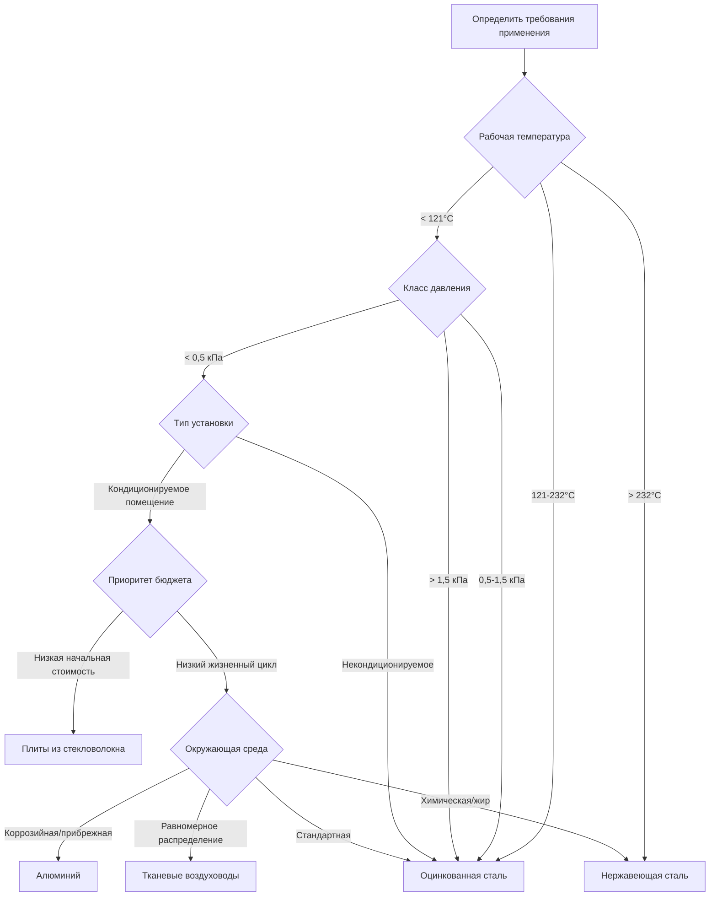

## Обзор

Выбор материала воздуховода напрямую влияет на производительность системы, долговечность и затраты на установку. Выбор зависит от требований применения, включая скорость воздуха, температуру, влажность, химическое воздействие и ограничения при монтаже. Стандарты SMACNA обеспечивают техническую базу для правильного выбора материала и методов строительства.

## Свойства материалов и применение

### Оцинкованная сталь

Оцинкованная сталь остается отраслевым стандартом для коммерческих приложений HVAC благодаря оптимальному балансу прочности, долговечности и стоимости.

**Ключевые свойства:**
- Диапазон толщины листа: 30 gauge (0,40 мм) до 16 gauge (1,61 мм)
- Максимальная рабочая температура: 232°C непрерывно
- Теплопроводность: 45,0 кДж/(ч·м·°C)
- Коррозионная стойкость: цинковое покрытие обеспечивает защиту на 7–15 лет в нормальных условиях

**Применение:**
- Коммерческие системы подачи и возврата воздуха в зданиях
- Приложения среднего и высокого давления (до 2,5 кПа)
- Системы общей вентиляции и вытяжки
- Чистые воздушные среды без значительного химического загрязнения

**Требования SMACNA:** Выбор толщины листа стали следует спецификациям класса давления SMACNA. Для прямоугольных воздуховодов минимальная толщина увеличивается с размером воздуховода и классом давления.

### Алюминий

Алюминий обеспечивает превосходную коррозионную стойкость в специализированных средах, где оцинкованная сталь разрушается преждевременно.

**Ключевые свойства:**
- Плотность: 2,7 г/см³ (на 33% легче стали)
- Теплопроводность: 205 кДж/(ч·м·°C) (в 4,5 раза выше, чем у стали)
- Коррозионная стойкость: отличная в прибрежных и высокой влажности окружающей среде
- Максимальная рабочая температура: 204°C

**Применение:**
- Установки в прибрежных районах с воздействием соленого воздуха
- Объекты химической переработки с кислотными парами
- Чистые помещения, требующие неферромагнитных материалов
- Системы, требующие уменьшения конструкционной нагрузки

**Особенности:** Более высокая теплопроводность увеличивает теплопередачу, требуя дополнительной изоляции в кондиционируемых помещениях. Стоимость материала обычно в 2,5–3 раза выше, чем оцинкованная сталь.

### Нержавеющая сталь

Нержавеющая сталь обеспечивает максимальную долговечность в самых требовательных условиях.

**Ключевые свойства:**
- Распространенные сплавы: 304 и 316 нержавеющая сталь
- Максимальная рабочая температура: 816°C (периодическая)
- Коррозионная стойкость: превосходная в химической и высокой влажности окружающей среде
- Гладкая отделка поверхности: Ra 0,8 мкм или лучше

**Применение:**
- Лабораторные вытяжные системы для коррозийных паров
- Вытяжные системы кухни с жиронасыщенным воздухом
- Чистые помещения фармацевтического производства
- Приложения выхлопа с высокой температурой

**Фактор стоимости:** Затраты на материал и изготовление достигают 4–6 раз больше, чем оцинкованная сталь, оправданы только при отказе других материалов по требованиям производительности или долговечности.

### Плиты из стекловолокна

Жесткие плиты из стекловолокна объединяют воздушный барьер и тепловую изоляцию в один продукт.

**Ключевые свойства:**
- Плотность: 48–96 кг/м³
- Тепловое сопротивление: RSI 0,74–1,41 на 25 мм толщины
- Максимальная скорость воздуха: 12,7 м/с (рекомендация SMACNA)
- Максимальная рабочая температура: 121°C
- Распространение пламени/развитие дыма: 25/50 (соответствует UL 181 Class 1)

**Применение:**
- Системы низкого и среднего давления (до 0,5 кПа)
- Воздуховоды подачи и возврата в кондиционируемых помещениях
- Ситуации, требующие интегральной тепловой и акустической изоляции
- Жилые и легкие коммерческие установки

**Ограничения:** Не подходит для высокоскоростных систем, наружного воздействия или высокой влажности. Требует осторожного обращения для предотвращения повреждения покрытия воздушного барьера.

### Тканевые воздуховоды

Инженерные системы тканевых воздуховодов обеспечивают равномерное распределение воздуха через пористый текстиль или инженерные отверстия.

**Ключевые свойства:**
- Материалы: полиэстер, нейлон или стекловолокно
- Воздухопроницаемость: инженерная от 0–400 CFM/м² (0–2,0 м³/(ч·м²))
- Максимальное статическое давление: 1,0 кПа (типичное)
- Вес: 0,5–1,5 кг/м² (на 95% легче листового металла)

**Применение:**
- Промышленные помещения, требующие равномерного распределения воздуха
- Объекты пищевой переработки (моющиеся, антимикробные варианты)
- Временные или сезонные установки
- Высокие складские помещения и производственные объекты

**Преимущества:** Исключает горячие/холодные пятна благодаря дисперсии на 360°, простые системы подвески и машинная стирка при техническом обслуживании.

## Критерии выбора материала

## Сравнительный анализ

| Материал | Относительная стоимость | Вес (кг/м²) | Макс. температура (°C) | Макс. давление | Коррозионная стойкость | Типичный срок службы (лет) |
|----------|------------------------|-------------|------------------------|-----------------|----------------------|--------------------------|
| Оцинкованная сталь | 1,0× | 7,3–14,6 | 232 | 2,5 кПа | Умеренная | 20–30 |
| Алюминий | 2,5–3,0× | 2,4–4,9 | 204 | 2,5 кПа | Отличная | 30–50 |
| Нержавеющая сталь | 4,0–6,0× | 8,8–17,1 | 816 | 2,5 кПа | Превосходная | 40–60 |
| Плиты из стекловолокна | 0,8–1,2× | 1,5–2,4 | 121 | 0,5 кПа | Плохая (влага) | 15–25 |
| Ткань | 1,5–2,5× | 0,5–1,5 | 93 | 1,0 кПа | Хорошая (моющаяся) | 10–20 |

## Стандарты строительства

**Спецификации SMACNA:**
- HVAC Duct Construction Standards - Metal and Flexible
- Fibrous Glass Duct Construction Standards
- Round Industrial Duct Construction Standards

**Ключевые требования:**
- Расстояние между поперечными соединениями: максимум 1,2 м для оцинкованной стали, 3 м для стекловолокна
- Продольные швы: Pittsburgh, snap-lock или сварка в соответствии с классом давления
- Усиление: требуется, когда размеры воздуховода превышают таблицы SMACNA для данной толщины и давления
- Класс утечки: Seal Class A, B или C в зависимости от требований системы

## Рассмотрения при установке

**Обращение с материалами:**
- Оцинкованная сталь: защитить цинковое покрытие от истирания при обращении
- Алюминий: избегать контакта с неодноименными металлами (гальваническая коррозия)
- Стекловолокно: сохранить целостность воздушного барьера, герметизировать все соединения согласно спецификациям производителя
- Ткань: обеспечить правильное натяжение и расстояние подпорок согласно инженерным спецификациям

**Методы соединения:**
- Металлические воздуховоды: приводные зажимы, S-ползунки, фланцевые соединения согласно SMACNA
- Стекловолокно: скобовые и клейкие соединения, переходные муфты стекловолокно-металл
- Ткань: кабели подвески, опорные кольца и системы подключения производителя

**Проверка на месте установки:**
Проверить установленные системы на утечку согласно требованиям Seal Class SMACNA. Максимально допустимая утечка варьируется от 0,81 CFM/м² (Seal Class A) до 0,20 CFM/м² (Seal Class C) при испытательном давлении.
