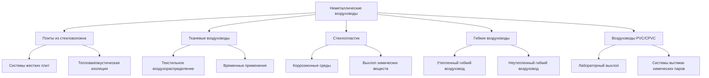

## Обзор

Неметаллические воздуховоды предоставляют альтернативу традиционным стальным оцинкованным воздуховодам, предлагая преимущества в конкретных приложениях, включая тепловые характеристики, снижение массы, акустический контроль и гибкость монтажа. Эти системы включают плиты воздуховодов из стекловолокна, тканевые системы воздухораспределения, воздуховоды из стеклопластика (FRP), гибкие воздуховоды и специализированные полимерные материалы.

Критерии выбора зависят от требований применения, включая диапазон температур, класс давления, условия окружающей среды, акустические характеристики и ограничения монтажа.

## Типы неметаллических воздуховодов

## Сравнение свойств материалов

### Характеристики производительности

| Материал | Макс. темп. (°C) | Класс давления | Тепловое R-значение (м²·К/Вт) | Масса (кг/м²) | Огнестойкость |
|----------|---------------|----------------|-----------------|-----------------|-------------|
| Плита из стекловолокна 38 мм | 121 | 50 Па | 1.06 | 1.85 | Класс 1 |
| Ткань (полиэстер) | 71 | 100 Па | Н/П (неутепленная) | 0.73 | NFPA 701 |
| FRP (полиэстер) | 93 | 240 Па | Зависит от вида | 5.85 | Класс 1 |
| Гибкий (утепленный) | 121 | 25 Па | 0.74–1.41 | 2.93 | UL 181 Класс 1 |
| PVC Schedule 40 | 60 | 360 Па | Отсутствует | 10.25 | Ограничена |

### Матрица применения

| Материал | Приточный воздух | Возвратный воздух | Выхлоп | Высокая влажность | Коррозионная |
|----------|-----------|-----------|---------|---------------|-----------|
| Плита из стекловолокна | Отличный | Отличный | Ограничено | Удовлетворительно | Плохо |
| Тканевые воздуховоды | Отличный | Удовлетворительно | Нет | Хорошо | Удовлетворительно |
| FRP | Хорошо | Хорошо | Отличный | Отличный | Отличный |
| Гибкие воздуховоды | Хорошо | Удовлетворительно | Ограничено | Хорошо | Удовлетворительно |
| PVC/CPVC | Плохо | Плохо | Отличный | Отличный | Отличный |

## Системы плит воздуховодов из стекловолокна

Плиты воздуховодов из стекловолокна состоят из жестких смол-связанных волокон стекла с подкрепленной облицовкой фольга-сетка-крафт (FSK) или алюминиевой фольги для защиты от паров. Материал функционирует как структура воздуховода и тепловая изоляция.

**Ключевые свойства:**
- Плотность: 48–96 кг/м³ в зависимости от класса давления
- Теплопроводность: 0.040–0.045 Вт/(м·К)
- Акустическое поглощение: NRC 0,70–0,90
- Минимальная прочность на сжатие: 34–103 кПа

**Требования к изготовлению (стандарты конструкции воздуховодов SMACNA HVAC):**
- Глубина V-образного паза: минимум 6 мм оставшейся толщины материала
- Методы закрытия: скобы и самоклеящаяся лента для низкого давления; механические крепежи для 50 Па
- Максимальное соотношение сторон: 4:1 для прямоугольных воздуховодов
- Расстояние между опорами: максимум 3 м для горизонтальных участков

**Преимущества:**
- Встроенная тепловая изоляция (исключает внешнее обертывание)
- Превосходное акустическое затухание (снижает передачу шума вентилятора)
- Легкий вес (снижает нагрузку на конструкцию)
- Отсутствие конденсации на внешних поверхностях при охлаждении

**Ограничения:**
- Невозможно использовать на открытом воздухе или в помещениях с высокой влажностью без защиты
- Не подходит для выхлопных систем с потенциальным химическим воздействием
- Требует осторожного обращения при монтаже
- Максимальная скорость: 12,7 м/с для приточного воздуха

**Соответствие стандартам:**
- UL 181: Заводские воздуховоды и соединители
- ASTM C1338: Стандартный метод испытаний на основе оценки давления плит воздуховодов
- NFPA 90A: Стандарт для установки систем кондиционирования воздуха и вентиляции

## Тканевые системы воздуховодов

Тканевые воздуховоды, также называемые текстильными системами воздухораспределения, распределяют кондиционированный воздух через инженерные пористые или перфорированные тканевые материалы. Ткань служит в качестве воздуховода и воздухораспределителя.

**Варианты материалов:**
- Полиэстер (наиболее распространен): моющийся, прочный, широкий диапазон температур
- Нейлон: повышенная прочность, химическая стойкость
- Полипропилен: влагостойкость, низкая стоимость

**Методы распределения воздуха:**
- Пористая ткань: воздух проходит через переплетение материала (низкая скорость)
- Лазерные отверстия: направленные потоки воздуха
- Комбинированные системы: смешивание пористого воздухораспределения и отверстий

**Рассмотрение конструкции:**
- Статическое давление на ткани: 20–50 Па обычно
- Скорость приточного воздуха в ткани: 2–13 м/с
- Дальность броска: 0,9–6 м в зависимости от конструкции отверстия
- Размер кабеля поддержки: по спецификации производителя

**Преимущества:**
- Равномерное распределение воздуха по всей длине воздуховода
- Исключает традиционные диффузоры и решетки
- Моющийся и очищаемый (критично для пищевой промышленности)
- Легкий вес и эстетичный внешний вид
- Быстрый монтаж

**Типичные применения:**
- Помещения пищевой обработки и подготовки
- Спортивные арены и гимназии
- Временное охлаждение для мероприятий
- Чистые комнаты (специальные антистатические материалы)
- Склады и распределительные центры

**Стандарты:**
- NFPA 701: Стандартные методы испытаний на распространение пламени
- ASHRAE 70: Метод испытания эффективности диффузии
- Одобрение Factory Mutual для конкретных приложений

## Воздуховоды из стеклопластика (FRP)

Воздуховоды FRP состоят из армирования стекловолокном, встроенного в термореактивную смолу (полиэстер, винилэстер или эпоксидная смола). Эти системы превосходят работу в коррозионных средах, где металлические воздуховоды быстро выходят из строя.

**Выбор смолы:**
- Полиэстер: общая химическая стойкость, наименьшая стоимость
- Винилэстер: превосходная коррозионная стойкость, более высокая температура
- Эпоксидная смола: максимальная химическая стойкость, наиболее дорогая

**Методы конструкции:**
- Ручная укладка: нестандартные формы, возможна полевая изготовление
- Намотка волокном: цилиндрические воздуховоды, высокая прочность
- Пултрузия: профили с постоянным поперечным сечением

**Механические свойства:**
- Предел прочности на растяжение: 69–172 МПа
- Предел прочности на изгиб: 103–276 МПа
- Максимальная непрерывная температура: 82–121°C в зависимости от смолы

**Применения:**
- Системы выхлопа химических процессов
- Выхлоп из лабораторных вытяжных шкафов
- Операции нанесения покрытий и обработки металлов
- Объекты очистки сточных вод
- Морские среды

**Требования к установке:**
- Расстояние между опорами: рассчитываются на основе нагрузки пролета (типично 2,4–3 м)
- Методы соединения: фланцевые соединения с прокладками, клеевые соединения
- Компенсация расширения: 12,7–25,4 мм на 30,5 м на 55°C изменения температуры
- Заземление: неэлектропроводящая; требует переходных перемычек для рассеивания статического электричества

**Стандарты:**
- Руководство по конструкции воздуховодов FRP SMACNA
- ASTM D2996: Стандартная спецификация для намотанных стекловолокном труб
- Factory Mutual 4910: Стандарт одобрения воздуховодов

## Рекомендации по установке

**Плиты воздуховодов из стекловолокна:**
1. Хранить в плоском положении в сухом месте, с земли
2. Резать острыми ножами; герметизировать все соединения лентой, рассчитанной на UL 181
3. Установить подвесы на расстоянии максимум 3 м
4. Защитить открытые концы во время строительства

**Тканевые воздуховоды:**
1. Установить кабели поддержки с надлежащим натяжением (по производителю)
2. Обеспечить минимальный зазор к горючим материалам (900 мм типично)
3. Обеспечить доступ для периодического снятия и очистки
4. Проверить соответствие баланса воздуха конструкции воздухораспределения

**Системы FRP:**
1. Следовать спецификациям момента затяжки производителя для болтов фланца
2. Использовать совместимые материалы прокладок (EPDM, Viton, PTFE)
3. Обеспечить надлежащую конструктивную поддержку (FRP имеет более низкую жесткость, чем металл)
4. Заземлить систему при обработке легковоспламеняющихся паров

## Критерии выбора

Выбирайте неметаллические воздуховоды при условии:
- **Плиты из стекловолокна**: системы HVAC низкого давления, требующие тепловых и акустических характеристик
- **Тканевые воздуховоды**: требуется равномерное распределение воздуха на больших площадях или критична очищаемость
- **FRP**: коррозионное химическое воздействие делает металлические воздуховоды непригодными
- **Гибкие воздуховоды**: короткие соединительные участки от жестких воздуховодов к терминалам
- **PVC/CPVC**: химический выхлоп при умеренных температурах с воздействием кислоты/щелочи

Рассмотрите металлические воздуховоды при необходимости более высоких давлений, температур, превышающих пределы материала, воздействия на открытом воздухе или требованиях структурной жесткости.
