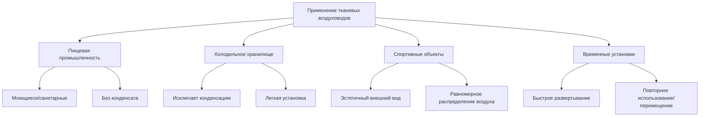
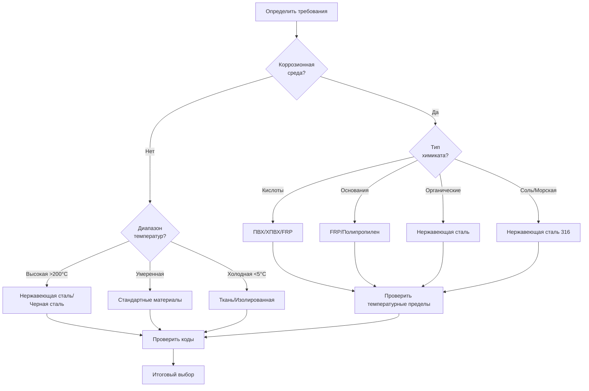

## Обзор

Специальные материалы воздуховодов используются в приложениях, где стандартные оцинкованные стальные или алюминиевые воздуховоды неэффективны из-за коррозионной активной среды, экстремальных температур, требований гигиены или уникальных условий установки. Выбор материала требует анализа химической совместимости, температурных пределов, структурной прочности и долгосрочной надежности в рабочих условиях.

## Воздуховоды из нержавеющей стали

### Свойства материала

Воздуховоды из нержавеющей стали обеспечивают превосходную коррозионную стойкость и температурные возможности для сложных сред.

**Коэффициент теплового расширения:**
$$\alpha_{ss} = 17.3 \times 10^{-6} \text{ м/м°C}$$

**Допустимое напряжение для нержавеющей стали 304:**
$$\sigma_{allow} = \frac{\sigma_{yield}}{SF} = \frac{215 \text{ МПа}}{1.5} = 143 \text{ МПа}$$

### Области применения

- Системы вытяжки коммерческих кухонь (воздух, загрязненный жиром)
- Лабораторная вытяжка дымов (химическое воздействие)
- Фармацевтические чистые помещения (требования гигиены и очистки)
- Вытяжка высокотемпературных процессов (до 816°C для типа 309)
- Прибрежные установки (коррозия от соляного аэрозоля)

**Ключевые соображения:**
- Тип 304 для общей коррозионной стойкости
- Тип 316 для сред с хлоридами
- Тип 430 для экономичных неструктурных приложений
- Сварные швы требуются для жировых воздуховодов согласно NFPA 96
- Отделка поверхности влияет на очищаемость (стандарт 2B, электрополирование для фармацевтики)

## Стеклопластиковые воздуховоды

### Стеклопластик (FRP)

Воздуховоды из стеклопластика сочетают коррозионную стойкость с структурной прочностью благодаря армированию волокнами в матрицах из термореактивных смол.

**Модуль упругости при изгибе:**
$$E_f = \frac{FL^3}{48I\delta}$$

Где:
- F = приложенная нагрузка (Н)
- L = длина пролета (м)
- I = момент инерции (м⁴)
- δ = прогиб (м)

**Коэффициент химической стойкости:**
$$CRF = \frac{\sigma_{exposed}}{\sigma_{control}}$$

Коэффициент CRF больше 0.8 указывает на приемлемую химическую стойкость.

### Области применения

- Системы вытяжки кислотных дымов
- Установки очистки сточных вод
- Подключения промышленных скрубберов
- Прибрежные или морские среды
- Подземные прокладки воздуховодов (невосприимчивость к коррозии)

## Воздуховоды из ПВХ и ХПВХ

### Сравнение материалов

| Свойство | ПВХ | ХПВХ | Единица |
|----------|-----|------|--------|
| Макс. непрерывная температура | 60°C | 93°C | - |
| Прочность на разрыв | 52 МПа | 55 МПа | ASTM D638 |
| Распространение пламени | 15-20 | 10-15 | ASTM E84 |
| Химическая стойкость | Отличная | Отличная | - |
| УФ-стойкость | Слабая | Слабая | - |
| Коэффициент стоимости | 1.0× | 1.3× | Относительно |

### Понижение рейтинга по температуре

Рейтинги давления ПВХ и ХПВХ воздуховодов снижаются с температурой:

$$P_{rated}(T) = P_{rated,20°C} \times \left(1 - \frac{T - 20}{T_{max} - 20} \times 0.5\right)$$

### Области применения

**Воздуховоды из ПВХ:**
- Лабораторная вытяжка дымов (кислоты, растворители)
- Вытяжка цехов гальваники
- Помещения зарядки аккумуляторов
- Вытяжка полупроводниковых производств

**Воздуховоды из ХПВХ:**
- Вытяжка химических дымов с повышенной температурой
- Приложения горячих кислотных дымов
- Обращение с хлорным газом

## Полипропиленовые воздуховоды

Полипропилен обеспечивает отличную химическую стойкость с более высокой температурной способностью, чем ПВХ.

**Свойства:**
- Максимальная температура: 100°C непрерывно
- Плотность: 0.90-0.91 г/см³
- Прочность на разрыв: 32-40 МПа
- Выдающаяся стойкость к кислотам, основаниям и органическим растворителям

**Методы соединения:**
- Стыковая сварка расплавлением (метод нагреваемой пластины)
- Экструзионная сварка для полевых соединений
- Фланцевые соединения с прокладками

## Системы тканевых воздуховодов

Тканевые воздуховоды обеспечивают уникальные преимущества для конкретных приложений благодаря конструкции из проницаемых или полупроницаемых текстильных материалов.

### Распределение воздушного потока

**Расчет площади выхода:**
$$A_{discharge} = \frac{Q}{V_{discharge}}$$

**Падение давления через ткань:**
$$\Delta P = \frac{8\mu LQ}{\pi r^4} + \frac{\rho V^2}{2C_d^2}$$

Где Cd представляет коэффициент расхода материала ткани.

### Области применения и преимущества

**Характеристики производительности:**
- Скорость воздуха: 5-15 м/с внутри
- Рабочее давление: 50-400 Па статическое
- Материалы: полиэстер, нейлон, стеклопластик
- Очистка: машинная стирка или вакуумирование на месте
- Классы пожарной безопасности: класс 1 или A согласно ASTM E84

## Система выбора материалов

### Матрица критериев выбора

### Факторы решения

**Воздействие окружающей среды:**
- Концентрация и температура химикатов
- Непрерывное или прерывистое воздействие
- Доступность техническому обслуживанию

**Конструктивные требования:**
- Класс статического давления согласно SMACNA
- Длины пролетов и расстояния подвески
- Сейсмические и ветровые нагрузки

**Соответствие кодексам:**
- Требования IMC Глава 6
- NFPA 96 для жировых воздуховодов
- Местные поправки и одобрения

**Экономический анализ:**
- Стоимость материала на погонный метр
- Требования к трудозатратам при установке
- Ожидаемый срок службы
- Затраты на обслуживание

## Установка и соединения

### Соединения специальных материалов

| Материал | Метод соединения | Герметик | Стандарт |
|----------|------------------|----------|----------|
| Нержавеющая сталь | Сварка | Не требуется | SMACNA HVAC |
| FRP | Склейка | Смола | Производитель |
| ПВХ/ХПВХ | Растворная цемент | Интегрирован | ASTM D2564 |
| Полипропилен | Сварка расплавлением | Не требуется | DVS 2207 |
| Ткань | Молния/Липучка | Не требуется | Производитель |

### Расстояния подвески

Максимальный интервал подвески варьируется в зависимости от жесткости материала:

$$L_{max} = \sqrt[4]{\frac{384EI}{5w_{max}\delta_{allow}}}$$

Где:
- E = модуль упругости (Па)
- I = момент инерции (м⁴)
- w = распределенная нагрузка (Н/м)
- δallow = допустимый прогиб (обычно L/200)

## Стандарты и ссылки

**Стандарты SMACNA:**
- HVAC Duct Construction Standards
- Rectangular Industrial Duct Construction
- Round Industrial Duct Construction

**Рекомендации ASHRAE:**
- ASHRAE Handbook - HVAC Systems and Equipment
- Глава 19: Проектирование воздуховодов

**Стандарты материалов:**
- ASTM A480: нержавеющая сталь
- ASTM D1784: ПВХ компаунды
- ASTM F441: ХПВХ трубы и фитинги
- ASTM E84: Характеристики горения поверхности

---

**Выбор специальных материалов воздуховодов требует тщательного анализа рабочих условий, химического воздействия, экстремальных температур и конструктивных требований для обеспечения длительной надежности системы и соответствия кодексам.**
