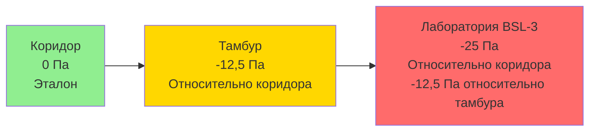

Системы с отрицательным давлением поддерживают контролируемую среду при давлении ниже давления в окружающих помещениях, предотвращая выход контаминантов, патогенов или опасных материалов. Эта стратегия распределения воздуха находит критическое применение в палатах изоляции медицинских учреждений, лабораториях биобезопасности, производстве фармацевтических препаратов и промышленных объектах сдерживания.

## Физические принципы отрицательного давления

Отрицательное давление возникает при вытяжке из помещения большего количества воздуха, чем подается. Перепад давления создает направленный поток воздуха из областей с более высоким давлением в контролируемое помещение, образуя барьер сдерживания.

**Фундаментальное соотношение:**

ΔP = P_соседний - P_помещение > 0

Где:
- ΔP = перепад давления (Па или мм вод. ст.)
- P_соседний = давление в прилегающем коридоре или помещении
- P_помещение = давление в помещении с отрицательным давлением

**Баланс воздушного потока:**

Q_вытяжка = Q_подача + Q_инфильтрация + ΔQ

Где ΔQ представляет дифференциальный воздушный поток, создающий градиент давления, обычно 10-15% от подачи воздуха для медицинских приложений.

## Требования по перепаду давления в зависимости от применения

| Применение | Минимум ΔP | Типичное ΔP | Нормативный документ |
|-----------|-----------|------------|-------------------|
| Изоляция аэрозольной инфекции (AII) | 2,5 Па (0,01 мм вод. ст.) | 2,5–8 Па (0,01–0,03 мм вод. ст.) | CDC Guidelines, FGI |
| Защитная среда (PE), тамбур | 2,5 Па | 2,5–8 Па | ASHRAE 170 |
| Лаборатория BSL-2 | 5–10 Па | 12,5 Па (0,05 мм вод. ст.) | NIH, CDC/BMBL |
| Лаборатория BSL-3 | 12,5 Па (0,05 мм вод. ст.) | 25–37,5 Па (0,1–0,15 мм вод. ст.) | CDC/NIH BMBL |
| Лаборатория BSL-4 | 37,5 Па (0,15 мм вод. ст.) | 50+ Па (0,2+ мм вод. ст.) | CDC/NIH BMBL |
| Фармацевтическая чистая комната (отрицательная) | 5–15 Па | 10–15 Па | USP 797/800 |
| Хранилище опасных материалов | 12,5–25 Па | 25 Па | NFPA, местные коды |

## Параметры проектирования палат изоляции медицинских учреждений

Медицинские учреждения требуют точного управления давлением для защиты пациентов, персонала и посетителей от аэрозольных инфекционных заболеваний.

**Требования ASHRAE 170 для палат AII:**

- Минимальный перепад давления: 2,5 Па (0,01 мм вод. ст.) отрицательное относительно коридора
- Минимальная кратность воздухообмена: 12 ACH (существующие), 12 ACH (новое строительство)
- Минимальные внешние воздухообмены: 2 ACH
- Весь воздух вытягивается непосредственно на улицу (без рециркуляции)
- Место выброса вытяжного воздуха: минимум 7,6 м от воздухозаборников
- Требуется мониторинг и сигнализация давления
- Тамбур рекомендован, но не обязателен

**Расчет требуемого смещения вытяжки:**

Для стандартной палаты изоляции размером 3,7 м × 3,7 м × 2,7 м (объем 37 м³):

При 12 ACH: Q_итого = (37 м³ × 12) / 60 мин = 7,4 м³/мин (CFM: 437)

Смещение вытяжки для перепада 2,5 Па:
Q_вытяжка = Q_подача + ΔQ

Где ΔQ ≈ 1,4–4,2 м³/мин (CFM: 50–150) в зависимости от щели под дверью, герметичности помещения и размера переходных решеток.

Типичное проектирование: подача = 7,1 м³/мин (CFM: 250), вытяжка = 8,5 м³/мин (CFM: 300) (смещение = 1,4 м³/мин или CFM: 50)

## Приложения биобезопасности лабораторий

Лаборатории биобезопасности используют каскады отрицательного давления для предотвращения выхода патогенов, с повышением отрицательного давления от нижних к более высоким уровням сдерживания.

**Пример каскада давления (люк BSL-3):**

**Направление потока воздуха:** коридор → тамбур → лаборатория

Этот каскад гарантирует, что при открытии двери между помещениями воздушный поток всегда движется в сторону более высокого сдерживания, предотвращая миграцию патогенов.

## Соображения проектирования системы вытяжки

Системы с отрицательным давлением требуют выделенных систем вытяжки со специфическими характеристиками производительности.

**Критические компоненты системы вытяжки:**

1. **Вытяжные вентиляторы:** резервные вентиляторы постоянного объема, рассчитанные на максимальное статическое давление при минимальном снижении производительности
2. **Фильтрация HEPA:** требуется для BSL-3/4 и некоторых медицинских приложений перед выбросом на улицу
3. **Воздуховоды:** герметично закрытые конструкции с отрицательным давлением, доступные для дезинфекции
4. **Выброс стека:** точка выброса на возвышении с адекватным разбавлением и рассеиванием
5. **Мониторинг давления:** непрерывный мониторинг дифференциального давления с визуальными и звуковыми сигналами тревоги

**Уравнение расчета вытяжного вентилятора:**

BHP = (Q × ΔP_итого) / (6356 × η_вентилятор)

Где:
- BHP = мощность на валу в лошадиных силах
- Q = расход вытяжного воздуха (м³/мин, выраженный в CFM)
- ΔP_итого = общее статическое давление (мм вод. ст.)
- η_вентилятор = полный КПД вентилятора (доля)

Для лаборатории BSL-3 с вытяжкой 56,6 м³/мин (CFM: 2000) через фильтры HEPA с общим статическим давлением 140 мм вод. ст. (мм вод. ст.: 5,5) и КПД вентилятора 65%:

BHP = (2000 × 140) / (6356 × 0,65) = 67,2 Вт (примерно 2,66 кВт или 3,6 л.с.)

Выберите электродвигатель мощностью 3 л.с. с коэффициентом служебной пригодности для надежности.

## Управление давлением и мониторинг

Поддержание стабильных перепадов давления требует активных систем управления и непрерывного мониторинга.

**Стратегии управления:**

- **Прямое управление давлением:** модулирующие заслонки вытяжки на основе обратной связи датчика дифференциального давления
- **Отслеживание воздушного потока:** подача воздуха отслеживает вытяжку с фиксированным смещением (например, вытяжка = подача + 2,1 м³/мин/CFM: 75)
- **Каскадное управление:** вложенные контуры управления, поддерживающие несколько перепадов давления в люках

**Требования к мониторингу:**

| Параметр | Частота мониторинга | Уставка сигнала тревоги | Ответное действие |
|-----------|---------------------|----------------|----------|
| Перепад давления | Непрерывно | < 2,5 Па (AII) | Визуальная/звуковая сигнализация |
| Воздушный поток (подача/вытяжка) | Непрерывно | ±10% уставки | Сигнализация и тренд |
| Воздухообмены в помещении | Рассчитано/отображено | < 12 ACH | Сигнализация |
| Перепад давления фильтра HEPA | Непрерывно | > 2× начальное ΔP | Уведомление об обслуживании |

## Целостность сдерживания и тестирование

Системы с отрицательным давлением требуют проверки при наладке и периодического повторного тестирования.

**Тесты при наладке:**

1. **Проверка перепада давления:** измерение ΔP при условиях проектирования с закрытыми дверями
2. **Тест качания дверью:** дверь должна качаться в сторону негативного пространства при приоткрывании
3. **Визуализация дыма:** видимый поток дыма под дверью или через переходную решетку в сторону отрицательного пространства
4. **Тест спада давления:** мониторинг времени восстановления давления после открытия двери (обычно < 30 секунд до 90% уставки)
5. **Измерение воздушного потока:** проверка соответствия количеств подачи и вытяжки проектным значениям

**Частота эксплуатационного тестирования:**
- Палаты AII медицинских учреждений: ежедневный визуальный мониторинг, квартальная сертификация
- Лаборатории BSL-3: ежедневная проверка давления, ежегодная сертификация
- Фармацевтические объекты: непрерывный мониторинг в соответствии с требованиями надлежащей производственной практики

## Режимы отказа системы и резервирование

Критические приложения требуют отказоустойчивого проектирования для поддержания сдерживания при отказах оборудования или потере питания.

**Стратегии резервирования:**

- Двойные вытяжные вентиляторы с автоматическим переходом
- Аварийное питание вытяжных систем (не подачи) для поддержания отрицательного давления при отключениях
- Клапаны управления, независимые от давления, устойчивые к дрейфу
- Сигнализация в систему автоматизации зданий и локальные звуковые оповещатели

**Анализ режимов отказа:**

При отказе вытяжного вентилятора: давление в помещении повышается к нейтральному/положительному—КРИТИЧЕСКИЙ ОТКАЗ
При отказе вентилятора подачи: давление в помещении становится более отрицательным—безопасный режим отказа, но может превысить конструктивные пределы

Этот анализ диктует, что системы вытяжки получают приоритет более высокой надежности, чем системы подачи в приложениях с отрицательным давлением.

---

Системы вентиляции с отрицательным давлением обеспечивают необходимое сдерживание для медицинских, научных и промышленных приложений, где предотвращение выхода контаминантов является первостепенным. Надлежащее проектирование требует понимания физики перепада давления, выбора надлежащего оборудования, внедрения надежных систем управления и обслуживания систем посредством регулярного тестирования и мониторинга.
