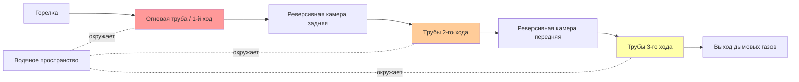
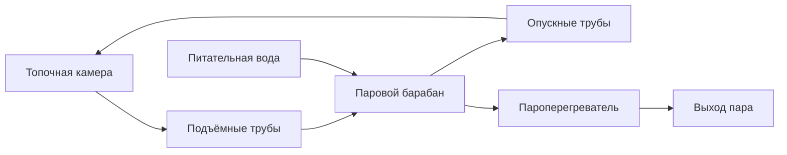
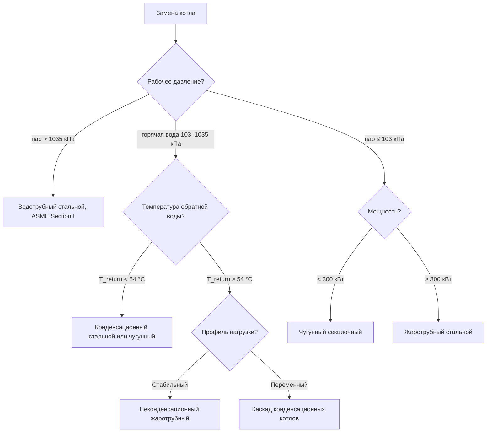

## Системы классификации котлов

Котлы классифицируются по конструктивной методологии, конфигурации теплообменника, материалам давленого корпуса и термодинамическому режиму работы. Понимание этих классификаций позволяет выбрать котёл, соответствующий требованиям по давлению, мощности, эффективности и ограничениям места установки.

### Жаротрубные и водотрубные конструкции

Фундаментальное различие между жаротрубными (fire-tube) и водотрубными (water-tube) котлами определяется взаимным расположением продуктов сгорания и воды внутри сосуда высокого давления.

#### Жаротрубные котлы (fire-tube)

В жаротрубной конструкции горячие газы сгорания проходят внутри труб, погружённых в воду. Стенка трубы разделяет горячий газовый поток и воду.

Тепловой поток через стенку трубы:


$$q = \frac{T_g - T_w}{\dfrac{1}{h_g} + \dfrac{t_{wall}}{k_{wall}} + \dfrac{1}{h_w}}$$


где $q$ — тепловой поток (Вт/м²); $T_g$ — температура дымовых газов (К); $T_w$ — температура воды (К); $h_g$ — коэффициент конвекции со стороны газов (Вт/(м²·К)); $h_w$ — коэффициент конвекции со стороны воды (Вт/(м²·К)); $t_{wall}$ — толщина стенки (м); $k_{wall}$ — коэффициент теплопроводности стали (43,5 Вт/(м·К)).

Со стороны газов: $h_g = 85$–170 Вт/(м²·К) — лимитирующее термическое сопротивление. Со стороны воды: $h_w = 1\,700$–6\,800 Вт/(м²·К) при естественной конвекции.

**Технические характеристики:**
- Диапазон мощностей: 75 кВт–6 МВт (конструкция Scotch Marine);
- Максимальное давление: как правило, 1 035 кПа по ASME Section IV;
- Большой объём воды обеспечивает тепловую инерцию и сглаживает пики нагрузки;
- Медленный отклик на изменения нагрузки (3–5 мин);
- Умеренные капитальные затраты, низкие расходы на обслуживание.





#### Водотрубные котлы (water-tube)

В водотрубной конструкции вода циркулирует внутри труб, а дымовые газы омывают трубы снаружи. Трубы образуют границу давления.

Движущий напор естественной циркуляции:


$$\Delta P_{circ} = g \cdot H \cdot (\rho_{down} - \rho_{up})$$


где $g = 9{,}81$ м/с²; $H$ — вертикальное расстояние между барабанами (м); $\rho_{down}$ — плотность холодной воды в опускных трубах (кг/м³); $\rho_{up}$ — плотность двухфазной смеси в подъёмных трубах (кг/м³).

**Технические характеристики:**
- Диапазон мощностей: 300 кВт–1 000+ МВт;
- Давления до 22 МПа для энергетических котлов;
- Малый объём воды — быстрый отклик (< 1 мин);
- Требует ASME Section I при давлении > 103 кПа пара или > 121 °C воды.





### Материальная конструкция: чугун против стали

#### Чугунные секционные котлы

Чугунные котлы собираются из отдельных секций, стянутых толкающими ниппелями и стяжными стержнями. Чугун имеет низкий коэффициент теплового расширения ($\alpha = 11{,}8 \times 10^{-6}$ К⁻¹) и высокую устойчивость к кислородной коррозии.

Термическое напряжение в секции:


$$\sigma_{thermal} = E \cdot \alpha \cdot \Delta T$$


Для чугуна: $E = 100$ ГПа. При нагреве с 20 °C до 80 °C: $\sigma = 100 \times 10^3 \times 11{,}8 \times 10^{-6} \times 60 = 70{,}8$ МПа — значительно ниже предела прочности на растяжение 200 МПа.

**Преимущества:** долговечность 30–50 лет; возможность замены отдельных секций в полевых условиях; стойкость к тепловому удару; отличная коррозионная стойкость при pH 8,5–10,5.

**Ограничения:** максимальное давление пара 103 кПа (ASME Section IV); высокая тепловая масса замедляет прогрев; нельзя использовать в конденсационном режиме без специальных секций.

#### Стальные котлы

Стальные котлы представляют собой сварные сосуды из углеродистой или низколегированной стали. Современные марки: SA-178 Grade A (трубы), SA-285 Grade C и SA-516 Grade 70 (обечайки). Сварные швы выполняются по ASME Section IX.

**Преимущества:** рабочие давления до 22 МПа; компактность; возможность создания любой геометрии; соответствие ASME Section I для мощных установок.

**Ограничения:** уязвимы к кислородной коррозии при pH < 8,5; требуют деаэрации питательной воды и постоянного pH-контроля; не расширяются в полевых условиях.

### Конденсационная и неконденсационная технологии

Граница между конденсационными и неконденсационными котлами проходит по температуре выхода дымовых газов относительно точки росы водяного пара.

#### Термодинамика конденсационного режима

Рекуперируемая скрытая теплота:


$$\Delta \eta = \frac{\dot{m}_{H_2O,cond} \cdot h_{fg}}{Q_{input}} \times 100\%$$


Для природного газа на 1 м³ сожжённого топлива образуется ≈ 0,21 кг водяного пара. При $h_{fg} = 2\,450$ кДж/кг и НТС газа = 35 400 кДж/м³:

$$\Delta \eta = \frac{0{,}21 \times 2\,450}{35\,400} \times 100\% = 1{,}45\% \text{ на кг пара}$$

Суммарный прирост при полной конденсации составляет 8–11 % относительно НТС.

Образование конденсата из дымовых газов природного газа:


$$CO_2 + H_2O \;\leftrightarrow\; H_2CO_3$$


pH конденсата: 3,5–5,0. Требуется нейтрализация перед сбросом в канализацию. Теплообменники — нержавеющая сталь 316L или алюминиево-кремниевый сплав.

#### Неконденсационные котлы

Температура уходящих газов поддерживается выше 150 °C, температура обратной воды — выше 54 °C для предотвращения локальной конденсации. КПД сгорания 78–85 % по ВТС. Применяются в системах с высокотемпературными радиаторами, паровом отоплении и при использовании мазута с высоким содержанием серы.

## Сравнительный анализ по критериям выбора


| Критерий | Жаротрубный | Водотрубный | Чугунный | Стальной | Конденсационный |
|---|---|---|---|---|---|
| Диапазон мощностей | 75 кВт–6 МВт | 300 кВт–1 000+ МВт | 15–3 000 кВт | 75 кВт–1 000+ МВт | 15–6 000 кВт |
| Макс. давление | 1 035 кПа | 22 000+ кПа | 1 103 кПа | 22 000 кПа | 1 035 кПа |
| Тепловой КПД | 80–85 % | 82–88 % | 80–85 % | 80–88 % | 90–98 % |
| Время отклика | Медленное | Быстрое | Медленное | Среднее | Среднее |
| Срок службы | 20–30 лет | 25–40 лет | 30–50 лет | 20–35 лет | 15–25 лет |
| Капитальные затраты | Средние | Высокие | Низкие–Средние | Средние | Высокие |
| Эксплуатационные затраты | Средние | Средние | Средние–Высокие | Средние | Низкие |


## Выбор котла по типу применения

### Коммерческие здания (офисы, торговля)

**Рекомендация:** конденсационный жаротрубный или чугунный секционный.

**Обоснование:** нагрузки умеренные и переменные; низкотемпературное распределение совместимо с конденсационным режимом; операционные затраты критичны для долгосрочного владения.

### Промышленные технологические процессы (высокое давление пара)

**Рекомендация:** водотрубный стальной котёл.

**Обоснование:** высокое давление технологического пара; быстрый отклик на изменение нагрузки; соответствие ASME Section I обязательно.

### Системы централизованного теплоснабжения

**Рекомендация:** водотрубные стальные котлы, несколько единиц в каскаде.

**Обоснование:** большая тепловая мощность, повышенные температуры теплоносителя, требования к резервированию.

### Учреждения (школы, больницы)

**Рекомендация:** конденсационные котлы в каскадной конфигурации.

**Обоснование:** переменная нагрузка в течение суток; требования к надёжности и резервированию; наличие функции низкотемпературной подачи совместимо с конденсацией.

### Блок-схема выбора котла при замене





## Требования стандартов и кодов

- **ASME Section I:** силовые котлы — давление пара > 103 кПа или высокотемпературная вода > 1 103 кПа и/или > 121 °C;
- **ASME Section IV:** отопительные котлы — давление ниже пороговых значений Section I;
- **EN 303** (серия): испытания и требования для котлов на газообразном и жидком топливе;
- **ASHRAE 90.1-2022:** минимальные КПД теплогенерирующего оборудования;
- **ГОСТ Р 55682** (серия): технические условия, классификация и испытания водогрейных котлов;
- **СП 60.13330.2022:** проектирование систем отопления зданий.

---

*Правильный выбор котла требует систематической оценки требований к производительности, рабочему давлению, целевым показателям КПД, ограничениям пространства и стоимости жизненного цикла. Конденсационная технология обеспечивает значительные преимущества при совместимых температурах обратной воды; водотрубные конструкции незаменимы при высоких давлениях и большой мощности; чугунные и жаротрубные котлы оптимальны для типичных коммерческих применений.*
