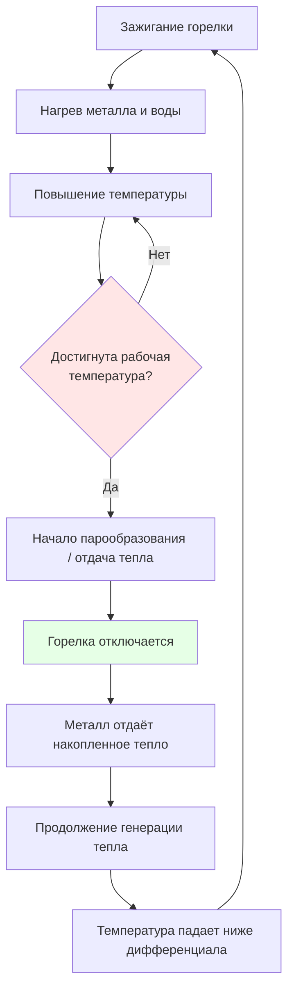

## Обзор

Чугунные секционные котлы (cast-iron sectional boilers) занимают доминирующее положение в жилищном и лёгком коммерческом отоплении благодаря уникальному модульному методу сборки, исключительной коррозионной стойкости и сроку службы, регулярно превышающему 30–40 лет. В отличие от сварных стальных агрегатов, чугунные котлы состоят из отдельных секций, соединённых резьбовыми ниппелями, — это обеспечивает гибкость при полевой сборке, замене повреждённых секций и поэтапном наращивании мощности.

Физические свойства серого чугуна определяют область применения: низкий коэффициент теплового расширения ($\alpha = 11{,}8 \times 10^{-6}$ К⁻¹), устойчивость к кислородной коррозии за счёт графитной микроструктуры и высокая тепловая масса. Ограничение — допустимое давление по ASME Section IV: не более 103 кПа (изб.) для пара и 1 103 кПа (изб.) для горячей воды.

## Механика сборки секций

### Конструкция толкающих ниппелей (push nipples)

Каждая пара соседних секций соединяется толкающими ниппелями — короткими двусторонними резьбовыми стержнями с уплотнительными кольцами на торцах. Сила герметизации соединения:


$$F_{seal} = P_{max} \cdot A_{gasket} + F_{preload}$$


где $P_{max}$ — максимальное рабочее давление (Па); $A_{gasket}$ — площадь контактной поверхности прокладки (м²); $F_{preload}$ — предварительная затяжка стяжными стержнями (Н). Стяжные стержни, проходящие по всей длине котла, поддерживают постоянное сжатие при тепловых циклах.





### Термические напряжения в секции

Каждая секция работает как самостоятельный термический элемент, допускающий независимое тепловое расширение. Напряжение, возникающее в металле при нагреве:


$$\sigma_{thermal} = E \cdot \alpha \cdot \Delta T$$


Для серого чугуна: $E = 100$ ГПа; $\alpha = 11{,}8 \times 10^{-6}$ К⁻¹. При рабочем нагреве с $T_0 = 20$ °C до $T_{op} = 80$ °C:

$$\sigma_{thermal} = 100 \times 10^3 \times 11{,}8 \times 10^{-6} \times 60 = 70{,}8 \text{ МПа}$$

Это значительно ниже предела прочности чугуна на растяжение 190–200 МПа. Секционная конструкция позволяет каждой секции свободно расширяться, не передавая накопленного напряжения на соседние элементы.

### Теплопередача через стенку секции

Теплопроводность через чугунную стенку (при $k_{CI} = 52$ Вт/(м·К)):


$$q = \frac{k_{CI} \cdot A \cdot \Delta T}{t_{wall}}$$


При типичной толщине стенки $t_{wall} = 9$ мм и перепаде температур 80 К: $q/A = 52 \times 80 / 0{,}009 = 462\,000$ Вт/м² — высокий тепловой поток обеспечивается низким кондуктивным сопротивлением материала.

## Конфигурации: мокрое и сухое основание


| Характеристика | Мокрое основание (wet base) | Сухое основание (dry base) |
|---|---|---|
| Камера сгорания | Окружена водой | Расположена выше уровня воды, изолирована |
| Тепловой КПД (AFUE) | 80–84 % | 83–87 % |
| Тепловая масса | Выше (больший объём воды) | Ниже |
| Время прогрева | Дольше | Быстрее |
| Риск конденсации на основании | Ниже | Выше — требует защиты |
| Типичное применение | Жилые системы горячей воды | Коммерческие системы, пар |
| Число секций | 4–8 | 6–12 |


### Конфигурация с мокрым основанием

Котлы с мокрым основанием (wet-base) погружают камеру сгорания в воду, обеспечивая 360° теплопередачу. Накопленная тепловая энергия в объёме воды:


$$Q_{stored} = m_{water} \cdot c_p \cdot \Delta T$$


**Числовой пример.** Котёл с объёмом воды 150 л (масса $m = 150$ кг), диапазон рабочих температур $\Delta T = 60$ К:

$$Q_{stored} = 150 \times 4{,}19 \times 60 = 37\,710 \text{ кДж} \approx 37{,}7 \text{ МДж}$$

Это эквивалентно 10,5 кВт·ч тепловой энергии, которая может поддерживать подачу тепла после отключения горелки в течение 20–40 минут при умеренной нагрузке. Высокая тепловая инерция снижает частоту циклов и повышает AFUE.

### Конфигурация с сухим основанием

В конструкции с сухим основанием (dry-base) камера сгорания расположена над уровнем воды и защищена огнеупорной изоляцией. Потери тепла через изолированное основание:


$$q_{loss} = \frac{\Delta T}{\dfrac{t_{ins}}{k_{ins}} + \dfrac{1}{h_{conv}}}$$


При 50 мм керамоволоконной изоляции ($k_{ins} = 0{,}12$ Вт/(м·К)) и $\Delta T = 300$ К относительно воздуха котельной потери снижаются на 20–30 % по сравнению с конструкцией мокрого основания.

## Коррозионная стойкость чугуна

Превосходная коррозионная стойкость серого чугуна обусловлена двумя факторами: высоким содержанием кремния (1,5–3,0 %) и образованием на поверхности пассивного слоя магнетита ($\text{Fe}_3\text{O}_4$):


$$3\,\text{Fe} + 4\,\text{H}_2\text{O} \;\rightarrow\; \text{Fe}_3\text{O}_4 + 4\,\text{H}_2$$


Слой магнетита стабилен при pH > 8,5 и обеспечивает скорость коррозии менее 0,025 мм/год — пренебрежимо малую за 40-летний срок службы.

### Требования к контролю pH воды


| Диапазон pH | Скорость коррозии, мм/год | Механизм |
|---|---|---|
| < 7,0 | > 0,5 | Кислотное растворение магнетита |
| 7,0–8,5 | 0,1–0,5 | Умеренная кислотная коррозия |
| 8,5–10,5 | < 0,025 | Оптимальный пассивный слой — рекомендуемый диапазон |
| > 11,0 | 0,05–0,2 | Щелочное охрупчивание |


Поддержание pH в диапазоне 8,5–10,5 достигается дозированием гидроксида натрия или пленкообразующих аминов. Общее солесодержание (TDS) следует поддерживать ниже 500 мг/л, жёсткость — ниже 150 мг/л CaCO₃.

## Тепловая масса: влияние на динамику системы

Удельная теплоёмкость чугуна: $c_{p,CI} = 460$ Дж/(кг·К). Чугунный котёл массой 200 кг накапливает:


$$Q_{metal} = m_{CI} \cdot c_{p,CI} \cdot \Delta T = 200 \times 460 \times 60 = 5{,}52 \text{ МДж}$$


Суммарная тепловая масса (металл + вода) для типичного котла достигает 40–50 МДж.





**Следствия высокой тепловой массы:**

Положительные: снижение цикличности (более длительные периоды горения повышают AFUE); стабильная температура подачи (отклонение ±2 °C); снижение термических ударов на арматуру и насосы.

Отрицательные: период прогрева 15–25 минут до выхода на рабочий режим; повышенные потери в режиме ожидания (0,5–1,5 % номинальной мощности в час); медленный отклик на команды термостата.

## Давление и соответствие ASME Section IV

ASME Section IV регламентирует котлы, работающие в диапазонах низкого давления:
- Пар: не более 103 кПа (изб.);
- Горячая вода: не более 1 103 кПа (изб.) при температуре не выше 121 °C.

Ограничение МДРД (максимально допустимого рабочего давления) обусловлено прочностью ниппельных соединений. Расчёт:


$$P_{MAWP} = \frac{n_{rods} \cdot \sigma_{allow} \cdot A_{rod}}{A_{section}}$$


Для четырёх стяжных стержней M12 (площадь сечения $A_{rod} = 84{,}3$ мм²) при допустимом напряжении 250 МПа:

$$P_{MAWP} = \frac{4 \times 250 \times 84{,}3}{14\,000} = 6{,}0 \text{ МПа}$$

С коэффициентом безопасности 4 получаем МДРД ≈ 150 кПа — более чем достаточно для эксплуатации при 103 кПа.

## Выбор мощности для жилых и лёгких коммерческих применений

Расчёт мощности чугунного котла по ASHRAE Handbook Fundamentals, Chapter 18, и EN 12831:


$$Q_{boiler} = Q_{heat\_loss} \times 1{,}15 + Q_{DHW}$$


Коэффициент 1,15 учитывает потери в трубопроводах и нагрузку «подхвата». ASHRAE предупреждает: в хорошо изолированных системах реальные потери ниже 15 %, и применение универсального коэффициента ведёт к завышению мощности и ухудшению AFUE из-за цикличности.


| Применение | Входная мощность, кВт | Число секций | Масса, кг |
|---|---|---|---|
| Малый жилой дом | 17–28 | 3–5 | 180–280 |
| Средний жилой дом | 28–49 | 5–8 | 280–420 |
| Большой жилой дом | 49–83 | 8–10 | 420–600 |
| Лёгкий коммерческий объект | 83–222 | 10–15 | 600–1 200 |


## Факторы долговечности

Правильно обслуживаемые чугунные котлы регулярно достигают 30–50 лет службы — результат нескольких конструктивных решений:

1. **Отсутствие сварных швов:** нет концентраторов напряжений, предрасположенных к коррозионной усталости.
2. **Заменяемость секций:** единственная повреждённая секция меняется без замены всего котла.
3. **Пассивный защитный слой:** магнетит обеспечивает самовосстановление коррозионного барьера при поддержании надлежащего pH.
4. **Механическая простота:** значительно меньше движущихся частей и электронных компонентов, чем в конденсационных установках.


| Компонент | Срок службы, лет |
|---|---|
| Чугунные секции | 40–60 |
| Толкающие ниппели и прокладки | 25–35 |
| Горелочный блок (burner assembly) | 15–25 |
| Контроллеры и автоматика | 10–20 |
| Циркуляционный насос | 12–18 |


## Нормативная база

- **ASME Boiler and Pressure Vessel Code, Section IV** — отопительные котлы (Heating Boilers);
- **ГОСТ Р 55682** — водогрейные котлы с номинальным тепловым напряжением до 400 кВт;
- **ASHRAE Handbook — HVAC Systems and Equipment, Chapter 32** — Boilers;
- **EN 303-1** — котлы для центрального отопления: испытания и маркировка;
- **СП 60.13330.2022** — проектирование систем отопления и вентиляции зданий.
