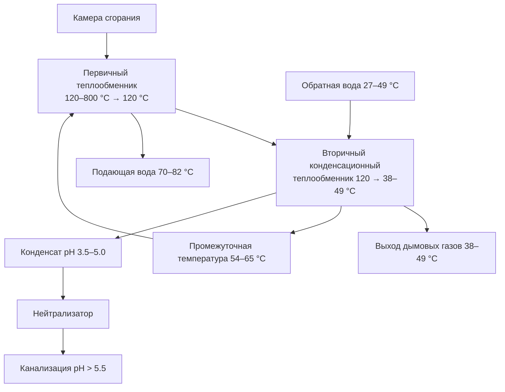

## Основной принцип работы

Конденсационные котлы достигают тепловой эффективности 90–98 % (по ВТС — высшей теплотворной способности) за счёт рекуперации скрытой теплоты водяного пара, содержащегося в продуктах сгорания. Обычный (неконденсационный) котёл выбрасывает дымовые газы при температуре выше точки росы — около 57 °C для природного газа — и эта теплота безвозвратно теряется. Конденсационный котёл намеренно охлаждает уходящие газы ниже точки росы, конденсируя водяной пар и извлекая теплоту фазового перехода.

Термодинамическое обоснование: при конденсации 1 кг водяного пара при атмосферном давлении выделяется скрытая теплота $h_{fg} \approx 2\,450$ кДж/кг. Для природного газа около 11 % ВТС топлива заключено в скрытой теплоте водяного пара продуктов сгорания. Обычные котлы эту энергию теряют; конденсационные — улавливают.

## Уравнение полного теплового баланса

Суммарная рекуперированная теплота в конденсационном котле:


$$Q_{total} = Q_{sensible} + Q_{latent} = \dot{m}_{fg} \cdot c_{p,fg} \cdot (T_{fg,in} - T_{fg,out}) + \dot{m}_{H_2O,cond} \cdot h_{fg}$$


где:
- $Q_{sensible}$ — явная теплота, отбираемая от охлаждения дымовых газов (кДж/ч);
- $Q_{latent}$ — скрытая теплота конденсирующегося водяного пара (кДж/ч);
- $\dot{m}_{fg}$ — массовый расход дымовых газов (кг/ч);
- $c_{p,fg} \approx 1{,}06$ кДж/(кг·К) — удельная теплоёмкость дымовых газов;
- $T_{fg,in}$, $T_{fg,out}$ — температуры газов на входе и выходе из вторичного теплообменника (°C);
- $\dot{m}_{H_2O,cond}$ — расход сконденсировавшегося пара (кг/ч);
- $h_{fg} \approx 2\,450$ кДж/кг при 57 °C.

### Числовой пример

Газовый котёл мощностью 200 кВт, сжигает $\dot{V}_{gas} = 20$ м³/ч природного газа (НТС = 35 400 кДж/м³). Продукты сгорания: $\dot{m}_{fg} = 28{,}4$ кг/ч, содержание водяного пара — 0,21 кг/м³ газа.

Масса пара в уходящих газах: $\dot{m}_{H_2O} = 20 \times 0{,}21 = 4{,}2$ кг/ч. При полной конденсации:

$$Q_{latent} = 4{,}2 \times 2\,450 = 10\,290 \text{ кДж/ч} = 2{,}86 \text{ кВт}$$

Дополнительная явная теплота при охлаждении газов от 120 °C до 45 °C:

$$Q_{sensible} = 28{,}4 \times 1{,}06 \times (120 - 45) / 3\,600 = 0{,}63 \text{ кВт}$$

Итоговый прирост рекуперации: $\approx 3{,}5$ кВт при базовой мощности 200 кВт — около 1,75 %. В масштабе года при отопительном сезоне 2 400 ч экономия составит $3{,}5 \times 2\,400 = 8\,400$ кВт·ч тепловой энергии.

## Физика конденсации и точка росы

Температура точки росы продуктов сгорания зависит от парциального давления водяного пара и определяется через уравнение Антуана:


$$T_{dp} = \frac{B}{\ln(A / P_{H_2O}) - C}$$


где $P_{H_2O}$ — парциальное давление водяного пара в дымовых газах; $A$, $B$, $C$ — константы уравнения Антуана для воды. На практике применяют табличные значения:


| Топливо | Точка росы, °C | Содержание H₂O в газах, % об. |
|---|---|---|
| Природный газ (CH₄) | 57–60 | 18–20 |
| Пропан (C₃H₈) | 52–54 | 14–16 |
| Дизельное масло № 2 | 43–49 | 10–12 |
| Мазут (> 0,5 % S) | 120–150 | 10–12 (точка росы по H₂SO₄) |


Конденсация начинается только тогда, когда температура поверхности теплообменника опускается ниже точки росы. Для природного газа это происходит при температуре обратной воды ниже 57 °C, а интенсивная конденсация — при обратке ниже 45–50 °C.

## Конструкция теплообменника

### Требования к материалам

Конденсат из дымовых газов содержит растворённый CO₂ (угольная кислота), а при сжигании газа с примесями серы — и сернистую кислоту. pH конденсата: 3,5–5,0. Обычная углеродистая сталь в этой среде корродирует со скоростью 1–3 мм/год, что делает её непригодной.


| Материал | Макс. температура, °C | Стойкость к конденсату | Теплопроводность, Вт/(м·К) | Относительная стоимость |
|---|---|---|---|---|
| Нержавеющая сталь 316L | 760 | Отличная | 16 | 2,5–3,0× |
| Нержавеющая сталь 439 | 760 | Очень хорошая | 25 | 2,0–2,5× |
| Алюминиево-кремниевый сплав Al-Si10 | 649 | Хорошая | 163 | 1,5–2,0× |
| Углеродистая сталь | 480 | Плохая | 43,5 | 1,0× |


Нержавеющая сталь 316L (2–3 % молибдена) обеспечивает наилучшую стойкость к питтинговой и щелевой коррозии. Алюминиево-кремниевые сплавы обладают вдвое лучшей теплопроводностью и более высоким тепловым КПД при более низкой стоимости, но требуют поддержания pH конденсата ≥ 4,5 для предотвращения амфотерной коррозии.

### Двухступенчатая схема теплообменника





Вторичный теплообменник работает в зоне конденсации: сначала извлекает явную теплоту, охлаждая газы до точки росы, затем рекуперирует скрытую теплоту конденсирующегося пара. Противоточная схема «холодная обратка → вторичный → первичный теплообменник → горячая подача» обеспечивает максимальную передачу тепла.

## Зависимость КПД от температуры обратной воды

Конденсационный режим реализуется только при достаточно низкой температуре обратной воды, позволяющей охладить дымовые газы ниже точки росы. Функция относительной конденсационной работы:


$$f(T_{ret}) = \begin{cases}
1{,}0 & T_{ret} \leq 43\text{ °C} \\[4pt]
\dfrac{57 - T_{ret}}{14} & 43\text{ °C} < T_{ret} < 57\text{ °C} \\[4pt]
0 & T_{ret} \geq 57\text{ °C}
\end{cases}$$



| Температура обратной воды, °C | Режим конденсации | AFUE, % | Тепловой КПД, % |
|---|---|---|---|
| 27 | Полный | 96–98 | 95–97 |
| 38 | Полный | 94–96 | 93–95 |
| 49 | Частичный | 90–92 | 89–91 |
| 60 | Минимальный | 86–88 | 85–87 |
| 71 | Нет | 82–84 | 81–83 |


ASHRAE 90.1-2022 (раздел 6.5.4) требует применения конденсационных котлов в системах с температурой обратной воды ниже 49 °C. СП 60.13330.2022 рекомендует проектирование систем с разностью температур подача/обратка не менее 15–20 °C при максимально возможном снижении температуры обратной воды.

## Проектирование системы для конденсационного режима

### Совместимые распределительные системы

Конденсационные котлы достигают оптимального КПД совместно с:
- системами лучистого напольного отопления (radiant floor heating): подача 32–49 °C, обратка 21–38 °C;
- низкотемпературными панельными радиаторами: подача 49–60 °C, обратка 32–43 °C;
- высокоэффективными фанкойлами с увеличенными поверхностями нагрева;
- системами с управлением температурной коррекцией по наружному воздуху.

### Управление температурой подачи (outdoor reset)

Сброс температуры подачи по наружному воздуху максимизирует время конденсационной работы:


$$T_{supply} = T_{supply,max} - (T_{supply,max} - T_{supply,min}) \cdot \frac{T_{out} - T_{out,design}}{T_{balance} - T_{out,design}}$$


Типичный график: при $T_{out} = -20$ °C подача 80 °C; при $T_{out} = +15$ °C подача 40 °C. Снижение температуры подачи повышает как КПД самого котла, так и эффективность теплоотдачи радиаторов и тёплых полов.

## Управление конденсатом

### Объём образующегося конденсата


$$\dot{V}_{cond} = \frac{Q_{input} \cdot 0{,}11 \cdot f_{condensing}}{h_{fg} \cdot \rho_{cond}}$$


Котёл мощностью 300 кВт при полном конденсационном режиме ($f_{condensing} = 1{,}0$) производит приблизительно 50–60 л/ч конденсата.

### Нейтрализация конденсата

pH конденсата 3,5–5,0 обусловлен реакцией:


$$\text{CO}_2 + \text{H}_2\text{O} \;\leftrightarrow\; \text{H}_2\text{CO}_3$$


Большинство нормативов сантехники требуют нейтрализации до pH > 5,5–6,0 перед сбросом в канализацию. Три метода:


| Метод | Реагент | Ресурс | Замена |
|---|---|---|---|
| Известняковый фильтр | CaCO₃ | 0,9–1,4 кг на 100 кДж/ч | 6–12 мес. |
| Магнезиальный фильтр | MgO | 0,7–0,9 кг на 100 кДж/ч | 12–18 мес. |
| Дозирование щёлочи | раствор NaOH | переменный | непрерывное |


Реакция нейтрализации на известняке:


$$\text{CaCO}_3 + 2\,\text{H}^+ \;\rightarrow\; \text{Ca}^{2+} + \text{H}_2\text{O} + \text{CO}_2$$


## Дымоудаление и воздух горения

Низкая температура уходящих газов (38–49 °C) позволяет использовать пластиковые дымоходы: ПВХ, ХПВХ или полипропилен — вместо нержавеющих, что снижает стоимость монтажа на 30–50 %. Герметичная подача воздуха горения (sealed combustion) исключает риск депрессуризации помещения и соответствует требованиям ASHRAE 62.2-2022 и раздела 7 IMC (International Mechanical Code).

## Нормативные требования к КПД

ASHRAE 90.1-2022:
- Газовые водогрейные котлы < 88 кВт: тепловой КПД ≥ 90 % (фактически обязывает применять конденсационную технологию);
- Газовые котлы ≥ 88 кВт: КПД сгорания ≥ 92 % или тепловой КПД ≥ 90 %.

DOE 10 CFR Part 430 (действует с 2028 г.): AFUE ≥ 95 % для жилых газовых котлов < 88 кВт.

ГОСТ Р 55682 устанавливает классы энергетической эффективности: класс 5 (наивысший) — КПД ≥ 95 % по НТС.

EN 303-1 задаёт процедуры испытаний котлов на газообразном и жидком топливе, включая отдельные протоколы для конденсационных агрегатов.

СП 60.13330.2022: рекомендует конденсационные котлы в системах с расчётной температурой подачи ≤ 70 °C.

## Область применения и ограничения

**Оптимальные применения:**
- гидравлические системы с напольным лучистым отоплением;
- низкотемпературные системы с управлением по наружному воздуху;
- объекты с высоким годовым числом часов работы (> 2 000 ч/год);
- новое строительство с интегрированным проектированием здания и инженерных систем.

**Ограничения:**
- КПД резко снижается при температуре обратной воды выше 57 °C;
- требуется дренажная система и нейтрализация конденсата;
- первоначальная стоимость на 40–80 % выше неконденсационных котлов;
- в районах с жёсткой водой возможно накипеобразование в вторичном теплообменнике при плохой водоподготовке.

---

*Источники: ASHRAE 90.1-2022; ASHRAE Handbook — HVAC Systems and Equipment 2020, Ch. 32; DOE 10 CFR Part 430; EN 303-1:2017; СП 60.13330.2022; ГОСТ Р 55682.*
