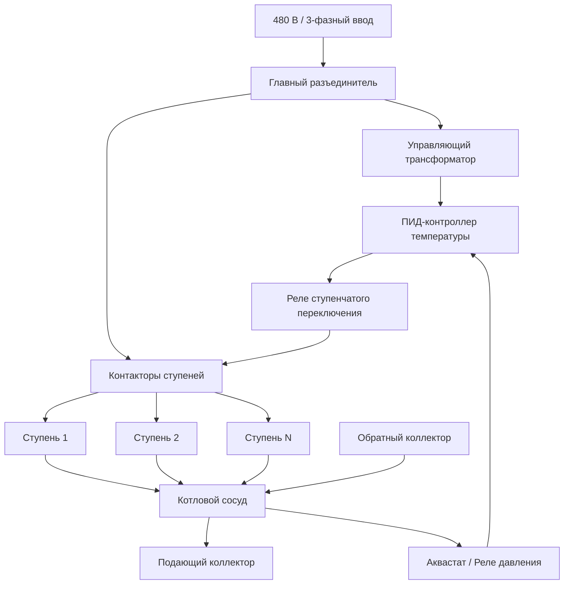
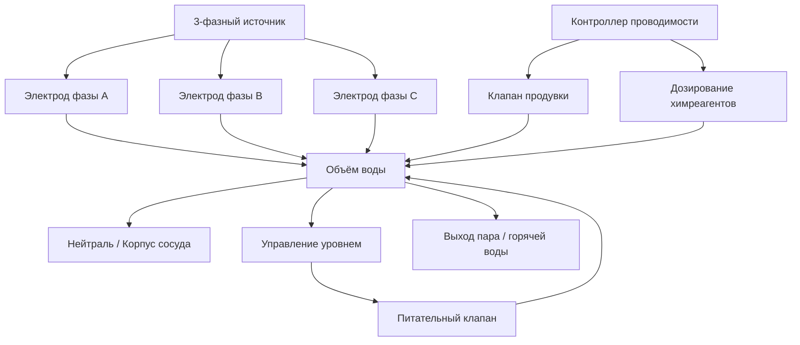

Электрические котлы преобразуют электрическую энергию непосредственно в тепловую — для систем гидравлического отопления или выработки технологического пара. В отличие от котлов сгорания, им не требуются топливные баки, воздух горения и дымоходная система. Это упрощает монтаж и даёт 100 % КПД в точке использования. Физические механизмы нагрева — джоулев нагрев сопротивления (resistive heating) или ионная проводимость воды (electrode boiler) — обеспечивают точное управление температурой без продуктов сгорания.

## Фундаментальные механизмы нагрева

### Резистивный нагрев (Joule heating)

Электрическая энергия преобразуется в тепло при движении электронов через проводник. Первый закон Джоуля:


$$P = I^2 R = \frac{V^2}{R} = V \cdot I$$


где $P$ — мощность (Вт); $I$ — ток (А); $R$ — электрическое сопротивление элемента (Ом); $V$ — напряжение (В). Весь электрический ввод переходит в тепловую энергию: закон сохранения энергии не допускает иного при чисто омической нагрузке.

Теплопередача от нагревательного элемента к воде:


$$q = h \cdot A_s \cdot (T_s - T_w)$$


где $h$ — коэффициент конвективной теплопередачи (Вт/(м²·К)); $A_s$ — площадь поверхности элемента (м²); $T_s$ — температура поверхности (К); $T_w$ — температура воды (К). Поверхностная температура элемента должна оставаться ниже 121 °C для предотвращения ускоренного накипеобразования и «перегорания» обшивки.

### Электродный нагрев (electrode boiler)

Электродные котлы используют саму воду как нагревательный элемент. Переменное напряжение прикладывается к погружённым электродам; ионы солей в воде формируют электрический ток.


$$I = \sigma_{water} \cdot A_{electrode} \cdot \frac{V}{d}$$


где $\sigma_{water}$ — удельная электропроводность воды (См/м); $A_{electrode}$ — площадь электрода (м²); $d$ — расстояние между электродами (м). Мощность, выделяемая в объёме воды:


$$P = I^2 \cdot \rho_{el} \cdot V_{water}$$


где $\rho_{el}$ — удельное электрическое сопротивление воды (Ом·м); $V_{water}$ — объём воды между электродами (м³). Нагрев объёмный и равномерный — горячих поверхностей нет, что исключает перегрев элементов и упрощает техническое обслуживание.

## Типы электрических котлов


| Тип | Механизм | Диапазон мощностей | Основное применение |
|---|---|---|---|
| Погружной резистивный | Металлические нагревательные элементы | 10–3 000 кВт | Жилое и коммерческое гидравлическое отопление |
| Электродный | Ионная проводимость воды | 100–30 000 кВт | Крупное коммерческое, промышленный пар |
| Электрический парогенератор | Резистивный или электродный | 5–10 000 кВт | Технологический пар, увлажнение |
| Проточный электрический | Встроенное сопротивление | 5–150 кВт | Напольное лучистое, таяние снега |


## Котлы с резистивными элементами

### Конфигурация и электрическая схема

Резистивные котлы оснащаются трубчатыми нагревательными элементами из сплава никель–хром (нихром) в оболочке из меди или нержавеющей стали, расположенными группами (ступенями). Каждая ступень управляется контактором и защищается автоматическим выключателем по NEC Article 424.





### Ступенчатое включение мощности

Для ограничения пиков электрического спроса ступени включаются последовательно с временной задержкой:


$$\Delta t_{stage} = \frac{P_{stage}}{c_p \cdot \dot{m} \cdot \Delta T_{target}}$$


где $P_{stage}$ — мощность одной ступени (кВт); $c_p = 4{,}19$ кДж/(кг·К); $\dot{m}$ — расход воды (кг/с); $\Delta T_{target}$ — желаемый прирост температуры на ступень (°C). ASHRAE Guideline 36 рекомендует минимальный интервал 30 секунд между ступенями для предотвращения ложных срабатываний защиты.

**Числовой пример.** Ступень мощностью 50 кВт, расход воды 2,0 кг/с, $\Delta T_{target} = 5$ °C:

$$\Delta t_{stage} = \frac{50}{4{,}19 \times 2{,}0 \times 5} = 1{,}19 \text{ с}$$

Необходимо применять 30-секундную задержку (технический минимум) независимо от расчётного значения.

### Параметры нагревательных элементов

- **Удельная нагрузка поверхности:** 2,3–6,2 Вт/см² (ограничивается производителем для предотвращения накипи);
- **Рабочее напряжение:** 240, 480 или 600 В трёхфазное;
- **Температурный коэффициент сопротивления нихрома:** ≈ 0,4 % / °C.

## Электродные котлы

### Принцип модуляции мощности

Мощность электродного котла регулируется изменением уровня воды относительно неподвижных электродов (или глубиной погружения подвижных электродов):


$$P = k \cdot L_{electrode} \cdot \sigma_{water} \cdot V^2$$


где $k$ — геометрическая константа; $L_{electrode}$ — длина погружения (м); $\sigma_{water}$ — электропроводность воды (См/м); $V$ — приложенное напряжение (В). Бесступенчатая регуляция обеспечивает коэффициент модуляции от 0 до 100 % — значительно лучше, чем у любого котла сгорания.

### Требования к электропроводности воды


| Режим | Давление, кПа | Проводимость, мкСм/см |
|---|---|---|
| Горячая вода / пар низкого давления | 0–103 | 2 000–5 000 |
| Пар среднего давления | 103–1 034 | 1 500–3 000 |
| Пар высокого давления | > 1 034 | 500–2 000 |


Проводимость поддерживается автоматическим продувкой (blowdown) и дозированием Na₂CO₃ или NaOH. Расчёт расхода продувки:


$$BD = \frac{\sigma_{fw}}{\sigma_{bw} - \sigma_{fw}} \cdot \dot{m}_{steam}$$


где $\sigma_{fw}$ и $\sigma_{bw}$ — проводимость питательной воды и котловой воды соответственно; $\dot{m}_{steam}$ — расход пара (кг/ч).

### Трёхфазная конфигурация электродов





## Анализ эффективности

### КПД в точке использования

Электрические котлы достигают 100 % тепловой эффективности в точке использования — весь электрический ввод переходит в теплоту:


$$\eta_{boiler} = \frac{Q_{output}}{P_{input}} = 1{,}00 \; (100\%)$$


### Первичный КПД (от источника до потребителя)

С учётом КПД генерации и передачи электроэнергии общая эффективность первичной энергии:


$$\eta_{overall} = \eta_{generation} \times \eta_{transmission} \times \eta_{boiler}$$


Для угольной генерации: $\eta_{overall} = 0{,}33 \times 0{,}92 \times 1{,}00 = 30\,\%$. Для газовой генерации с ПГУ: $\eta_{overall} = 0{,}55 \times 0{,}92 \times 1{,}00 = 51\,\%$. При использовании возобновляемой электроэнергии (ветер, солнце): $\eta_{overall}$ стремится к 92 % (только потери передачи).

### Потери в режиме ожидания


$$q_{standby} = U_{insul} \cdot A_{shell} \cdot (T_{boiler} - T_{ambient})$$


Для котла 500 кВт при 82 °C, изоляция 50 мм минеральной ваты ($U = 0{,}5$ Вт/(м²·К)), площадь оболочки $A = 4$ м², $\Delta T = 62$ К:

$$q_{standby} = 0{,}5 \times 4 \times 62 = 124 \text{ Вт} \approx 0{,}025\,\% \text{ от номинала}$$

Потери в ожидании пренебрежимо малы — значительное преимущество перед газовыми котлами с охлаждением теплообменника и инфильтрацией через дымоход в паузах.

## Электротехнические требования к установке

По NEC Article 424.82 электрические цепи котлов рассчитываются на 125 % номинального тока:


$$I_{circuit} = 1{,}25 \times \frac{P_{nameplate}}{V_{line} \times \sqrt{3} \times PF}$$


**Числовой пример.** Котёл 250 кВт, 480 В, трёхфазный, $PF = 1{,}0$ (активная нагрузка):

$$I_{circuit} = 1{,}25 \times \frac{250\,000}{480 \times 1{,}732 \times 1{,}0} = 1{,}25 \times 300{,}7 = 376 \text{ А}$$

Требуется кабель 500 kcmil меди (допустимый ток 400 А) в соответствующем кабелепроводе.

## Управление нагрузкой и тепловое накопление

Электрические котлы оптимально подходят для управления нагрузкой в энергосистеме. В сочетании с изолированными аккумуляционными баками нагрев переносится в часы низкого тарифа или высокой доли возобновляемой генерации.

Объём накопительного бака:


$$V_{storage} = \frac{Q_{daily} \times t_{off\text{-}peak}}{\rho \cdot c_p \cdot \Delta T_{storage} \times \eta_{delivery}}$$


**Числовой пример.** Здание требует 500 кВт·ч/сут тепла в течение 12-часового пикового периода; перепад температур бака $\Delta T = 17$ °C; $\eta_{delivery} = 0{,}90$:

$$V_{storage} = \frac{500 \times 12}{1\,000 \times 4{,}19 \times 17 \times 0{,}90} = \frac{6\,000}{64\,089} = 0{,}094 \text{ м}^3 \times 1000 \approx 940 \text{ л}$$

Бак 1 000 л позволяет котлу работать исключительно в ночные часы льготного тарифа.

## Устройства безопасности

По ASME CSD-1 раздел HLW-140 обязательны:

- **Аквастат высокого предела** — обычно 116 °C для водогрейных котлов;
- **Реле низкого уровня воды** — электродный или поплавковый тип;
- **Предохранительный клапан** — пропускная способность рассчитывается по ASME Section IV для полной выходной мощности;
- **Защита от токов утечки** — по NEC 424.22 для котлов > 50 кВт.

Для электродных котлов дополнительно требуется защита по предельной проводимости, предотвращающая перегрузку при избыточной концентрации солей.

## Сравнение с котлами на ископаемом топливе


| Параметр | Электрический котёл | Газовый котёл |
|---|---|---|
| КПД в точке использования | 100 % | 80–98 % |
| Первичный КПД (от сети) | 30–92 % (зависит от топлива генерации) | ≈ 95 % (магистральный газ) |
| Выбросы на месте | Нулевые | CO₂, NOₓ, CO |
| Требования к монтажу | Нет дымохода | Дымоход, воздух горения |
| Техническое обслуживание | Минимальное | Ежегодная настройка горелки |
| Коэффициент модуляции | 0–100 % (бесступенчатый) | 5:1–25:1 |
| Гибкость управления нагрузкой | Высокая | Низкая |


## Нормативная база

- **ASME CSD-1** — Controls and Safety Devices for Automatically Fired Boilers;
- **NEC Article 424** — Fixed Electric Space-Heating Equipment;
- **ASME Boiler and Pressure Vessel Code, Section I / IV** — в зависимости от давления;
- **ASHRAE Handbook — HVAC Systems and Equipment, Chapter 32** — Boilers;
- **ASHRAE 90.1-2022** — Section 6: минимальные требования к КПД оборудования;
- **СП 60.13330.2022** — проектирование систем отопления.
