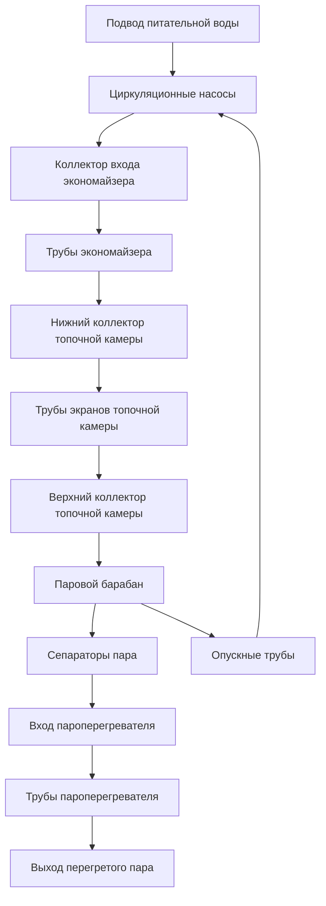
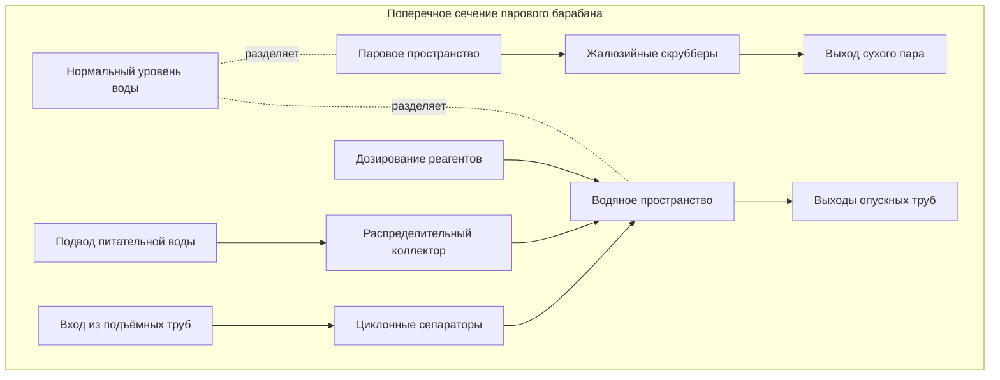

## Основные принципы работы

Водотрубные котлы (water-tube boilers) представляют преобладающую технологию высокопроизводительной генерации пара высокого давления. В них вода циркулирует по трубам, обогреваемым снаружи дымовыми газами. Такая компоновка обеспечивает принципиальное конструктивное преимущество по сравнению с жаротрубными котлами (fire-tube boilers): рабочие давления варьируются от 1 035 кПа до более 22 МПа в энергетических установках.

Ключевое достоинство водотрубной схемы — распределение напряжений. Трубы испытывают окружное (кольцевое) напряжение, линейно зависящее от диаметра, что позволяет работать при высоком давлении с применением труб малого диаметра вместо крупных сосудов давления.

### Анализ окружного напряжения

Окружное напряжение (hoop stress) в цилиндрической трубе при внутреннем давлении определяется по формуле Лапласа:


\sigma_h = \frac{P \cdot d_i}{2 \cdot t}


Где:
- $\sigma_h$ — окружное напряжение, Па
- $P$ — внутреннее давление, Па
- $d_i$ — внутренний диаметр трубы, м
- $t$ — толщина стенки, м

Согласно ASME Section I (Power Boilers) допустимые напряжения составляют 76–138 МПа в зависимости от материала и температуры. Аналогичные требования содержат EN 12952-3 (Water-tube boilers) и ГОСТ 32410-2013.

**Пример расчёта (SI).** Труба наружным диаметром $d_o = 50$ мм, толщиной стенки $t = 4{,}2$ мм, рабочее давление $P = 6{,}9$ МПа. Внутренний диаметр $d_i = 50 - 2 \times 4{,}2 = 41{,}6$ мм $= 0{,}0416$ м.


\sigma_h = \frac{6{,}9 \times 10^6 \times 0{,}0416}{2 \times 0{,}0042} \approx 34{,}2 \text{ МПа}


Запас прочности по ASME составляет более двух раз — конструкция соответствует нормативным требованиям.

Для сравнения: корпус жаротрубного котла диаметром 1 220 мм потребовал бы толщины стенки свыше 51 мм при том же давлении, что наглядно демонстрирует преимущество водотрубной схемы для высокого давления.

## Механизмы циркуляции

Вода циркулирует по трубам котла либо за счёт естественной конвекции (термосифонный эффект), либо посредством механического насоса (принудительная циркуляция, forced circulation). Интенсивность циркуляции критически влияет на теплообмен, качество пара и целостность труб.

### Системы с естественной циркуляцией

Естественная циркуляция (natural circulation) возникает из-за разности плотностей: в необогреваемых опускных трубах (downcomer tubes) находится более тяжёлая вода, а в обогреваемых подъёмных трубах (riser tubes) — лёгкая паро-водяная смесь. Движущий напор:


\Delta P_{\text{circ}} = g \cdot H \cdot \left(\rho_{\text{down}} - \rho_{\text{up}}\right)


Где:
- $\Delta P_{\text{circ}}$ — движущее давление циркуляции, Па
- $g = 9{,}81$ м/с² — ускорение свободного падения
- $H$ — вертикальное расстояние между центрами барабанов, м
- $\rho_{\text{down}}$ — плотность насыщенной воды в опускных трубах, кг/м³
- $\rho_{\text{up}}$ — средняя плотность двухфазной смеси в подъёмных трубах, кг/м³

Плотность двухфазной смеси определяется через паросодержание (steam quality) $x$:


\rho_{\text{up}} = \frac{1}{\dfrac{x}{\rho_g} + \dfrac{1 - x}{\rho_f}}


Где $\rho_g$ и $\rho_f$ — плотности пара и воды при рабочем давлении, кг/м³.

**Пример расчёта (SI).** При давлении насыщения 4,14 МПа: $\rho_f = 733$ кг/м³, $\rho_g = 20{,}2$ кг/м³. Подъёмная труба с паросодержанием $x = 0{,}15$:


\rho_{\text{up}} = \frac{1}{\dfrac{0{,}15}{20{,}2} + \dfrac{0{,}85}{733}} \approx 120 \text{ кг/м}^3


При высоте $H = 9{,}1$ м движущий напор:


\Delta P_{\text{circ}} = 9{,}81 \times 9{,}1 \times (733 - 120) \approx 54\,700 \text{ Па}


Этого давления достаточно для преодоления гидравлических сопротивлений. Кратность циркуляции (circulation ratio) для систем с естественной циркуляцией составляет 5:1–20:1, то есть через котёл прокачивается 5–20 кг воды на каждый килограмм генерируемого пара (ASHRAE Handbook HVAC Systems and Equipment, глава 11).

**Преимущества:**
- Отсутствие вспомогательных насосов и потребления электроэнергии
- Высокая надёжность благодаря саморегулированию
- Малые требования к техническому обслуживанию

**Ограничения:**
- Необходима вертикальная высота не менее 6–8 м
- Применимо при давлении не выше 16,5 МПа
- Медленный отклик на резкие изменения нагрузки

### Системы с принудительной циркуляцией

При принудительной циркуляции центробежные насосы обеспечивают движение воды независимо от термосифонного эффекта с перепадом давления 345–1 035 кПа. Это позволяет достигать более высоких скоростей теплового потока: критический тепловой поток (critical heat flux, CHF) возрастает с массовой скоростью:


q_{\text{кр}} \propto G^{0{,}8}


Где $G$ — массовая скорость, кг/(м²·с). При принудительной циркуляции $G = 1\,000$–$3\,000$ кг/(м²·с) против 300–800 кг/(м²·с) при естественной, что позволяет реализовать удельные тепловые нагрузки свыше 946 кВт/м² (согласно ASHRAE Handbook).

**Применения принудительной циркуляции:**
- Сверхкритические котлы (supercritical boilers) при $P > 22{,}1$ МПа
- Компактные высокопроизводительные конструкции
- Утилизационные котлы (waste heat recovery boilers) с малым температурным напором
- Горизонтальные компоновки испарительных труб
- Прямоточные котлы (once-through boilers)

**Потребление энергии** циркуляционными насосами составляет 0,5–2% от выходной мощности котла; требуется резервирование насосов.

## Конструкция и функции парового барабана

Паровой барабан (steam drum) выполняет несколько функций: разделение пара и воды, сбор генерируемого пара, аккумулирование теплоносителя, химическая обработка котловой воды. Размеры барабана определяются по ASME Section I с учётом эффективности сепарации (EN 12952-5).

### Критерии выбора размера барабана

Минимальный полезный объём барабана:


V_{\text{drum,min}} = \frac{\dot{m}_{\text{steam}} \cdot t_{\text{res}}}{\rho_f}


Где $t_{\text{res}}$ — время пребывания воды, обычно 3–5 с; $\dot{m}_{\text{steam}}$ — производительность котла по пару, кг/с.

**Пример (SI).** Котёл производительностью $\dot{m}_{\text{steam}} = 12{,}6$ кг/с при $P = 4{,}14$ МПа ($\rho_f = 733$ кг/м³), $t_{\text{res}} = 4$ с:


V_{\text{drum,min}} = \frac{12{,}6 \times 4}{733} \approx 0{,}069 \text{ м}^3


Фактический объём барабана принимается в 5–10 раз больше расчётного минимума для обеспечения диапазона регулирования уровня и аварийного запаса. Типичные размеры: диаметр 0,9–1,5 м, длина 3–12 м.

### Многоступенчатая сепарация пара

**Первичная сепарация — гравитационное осаждение.** Скорость осаждения капли по закону Стокса:


v_t = \frac{d_p^2 \cdot (\rho_f - \rho_g) \cdot g}{18 \cdot \mu_g}


При $P = 4{,}14$ МПа капли диаметром 100 мкм оседают со скоростью 0,52 м/с, капли 20 мкм — лишь 0,021 м/с. Первичная сепарация удаляет капли крупнее 100 мкм.

**Вторичная сепарация — циклонные сепараторы (cyclone separators).** Центробежное ускорение 50–100$g$ позволяет отделить капли 10–20 мкм; влажность после циклонов составляет 0,1–0,5% масс.

**Третичная сепарация — жалюзийные скрубберы (chevron demisters).** Каплеотбойники из гофрированных пластин обеспечивают конечную влажность пара 0,05–0,1% масс. (не более 0,5% согласно ASME PTC 4.1, аналог — ГОСТ 20995-75 для котлов по ГОСТ Р 55682).

## Конфигурации трубных систем

Водотрубные котлы выполняются с прямыми или гнутыми трубами, оптимизированными под конкретные производственные и эксплуатационные условия.

### Конструкции с прямыми трубами (straight-tube boilers)

Исторически первый тип: вертикальные или наклонные прямые трубы развальцованы в верхних и нижних коллекторах. Применяются при давлении до 4,1 МПа, уступают место гнутотрубным конструкциям в современных установках.

**Преимущества:** простота осмотра, механической чистки и замены труб, невысокая стоимость изготовления.  
**Ограничения:** необходимость компенсаторов теплового расширения, большой занимаемый объём, термические напряжения в коллекторах.

### Конструкции с гнутыми трубами (bent-tube boilers)

Современные котлы используют трубы, следующие контурам топочной камеры и приваренные к коллекторам или барабанам. Изгибы компенсируют тепловые деформации без расширительных швов.

**Котёл D-образного типа (D-type):**
- Единый паровой барабан над топочной камерой
- Нижние коллекторы у основания
- Производительность 2,5–50 кг/с; давление 1,0–6,2 МПа
- Наиболее распространён в промышленных паровых системах

**Котёл O-образного типа (O-type):**
- Единый барабан над топочной камерой, коллекторы по бокам
- Симметричная компоновка
- Производительность 6,3–75 кг/с; давление 1,0–10,3 МПа

**Котёл A-образного типа (A-type):**
- Два барабана: паровой и грязевой (mud drum)
- Наклонные трубы между барабанами
- Производительность 1,3–12,6 кг/с; компактная компоновка, типична для судовых и мобильных установок

## Сравнение конфигураций


| Конфигурация | Давление, МПа | Производительность, кг/с | Тип циркуляции | Время отклика | Область применения |
|---|---|---|---|---|---|
| Прямые трубы | 1,0–6,2 | 1,3–18,9 | Естественная | Медленное | Устаревшие установки |
| D-тип (гнутые) | 1,0–6,2 | 2,5–50 | Естественная | Среднее | Промышленный пар |
| O-тип (гнутые) | 1,0–10,3 | 6,3–75 | Естественная | Среднее | Энергетика |
| A-тип (гнутые) | 1,0–6,2 | 1,3–12,6 | Естественная | Быстрое | Суда, мобильные |
| Принудительная циркуляция | 4,1–16,5 | 12,6–126 | Принудительная | Быстрое | Энергетика |
| Прямоточные | >16,5 | >63 | Принудительная | Очень быстрое | Сверхкритические |


## Промышленные применения

### Энергетика

Энергетические котлы генерируют пар для паровых турбин мощностью 500–1 000 МВт при производительности по пару 24–55 кг/с. Рабочие параметры по уровням:

- Докритические установки (subcritical): 12,4–16,5 МПа, 538°C
- Сверхкритические (supercritical): 24,1–26,2 МПа, 593°C
- Ультрасверхкритические (ultra-supercritical): >31 МПа, 649°C

### Технологические производства

Химические, нефтехимические и целлюлозно-бумажные производства требуют технологического пара различного давления:

- Высокое давление (4,1–6,2 МПа) — привод турбокомпрессоров
- Среднее (1,0–1,7 МПа) — технологический нагрев
- Низкое (0,1–0,3 МПа) — теплоснабжение зданий

### Когенерация (ТЭЦ)

Установки комбинированного производства теплоты и электроэнергии (combined heat and power, CHP) используют пар высокого давления для генерации электроэнергии с последующим использованием отработанного пара на тепловые нужды. КПД системы ТЭЦ:


\eta_{\text{ТЭЦ}} = \frac{W_{\text{эл}} + Q_{\text{тепл}}}{Q_{\text{топл}}}


Системы ТЭЦ достигают $\eta = 70$–$85\%$ против 35–45% для раздельного производства электроэнергии, что подтверждается расчётами по методике ASHRAE 90.1 и EN 15316-4.

### Централизованное теплоснабжение

Крупные системы централизованного теплоснабжения (district heating) используют водотрубные котлы для генерации высокотемпературной воды при 177–232°C и давлении 1,7–3,4 МПа. Регулирование осуществляется по температурному графику согласно СП 41-01 и СП 60.13330.2020.

## Требования нормативных документов

### ASME Section I (Power Boilers)

Водотрубные котлы при рабочем давлении выше 0,1 МПа подпадают под действие ASME Boiler and Pressure Vessel Code (BPVC) Section I.

**Проектирование:**
- Расчёт максимально допустимого рабочего давления (maximum allowable working pressure, MAWP) по Part PG
- Минимальная толщина стенки с учётом припуска на коррозию
- Квалификация сварных соединений по Section IX
- Пропускная способность предохранительных клапанов — 100% максимальной нагрузки

**Материалы:**
- Обечайки барабана: сталь SA-516 Grade 70 или SA-299
- Экранные трубы: SA-178 Grade A (низкое давление), SA-210 Grade A1 (высокое)
- Трубы пароперегревателей: SA-213 T11, T22, T91 для высоких температур
- Коллекторы: бесшовные трубы SA-106 Grade B

**Испытания и контроль:**
- Гидростатическое испытание при 1,5 × MAWP
- Радиографический контроль продольных швов барабана
- Присутствие уполномоченного инспектора (Authorized Inspector) при изготовлении
- Регистрация в National Board

### Европейские и российские нормы

- EN 12952-1…-18 (Water-tube boilers) — общие требования, расчёт прочности, контроль качества
- EN 303-1…-7 — котлы теплоснабжения
- EN 12831 — расчёт тепловых нагрузок
- СП 60.13330.2020 — отопление, вентиляция и кондиционирование воздуха
- ГОСТ Р 55682.1…-15 (IDT EN 12952) — водотрубные котлы

## Заключение

Водотрубные котлы обеспечивают превосходную производительность при высоком давлении благодаря эффективному распределению напряжений в трубах малого диаметра. Конструкции с естественной циркуляцией покрывают большинство промышленных применений до 16,5 МПа; принудительная циркуляция расширяет диапазон до сверхкритических параметров. Выбор конфигурации (D-, O- или A-тип) определяется требуемым давлением, производительностью, характеристиками переходных режимов и требованиями ASME Section I, EN 12952 или СП 60.13330.
