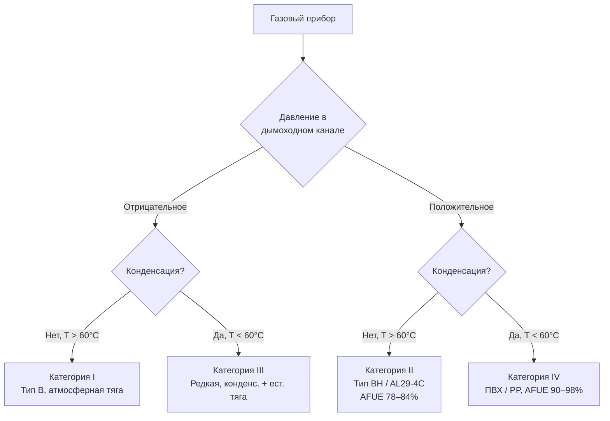

## Общая характеристика

Приборы категории II (category II appliances) — это газовое оборудование, работающее при положительном статическом давлении в вентиляционном соединителе (vent connector) при температуре дымовых газов выше 60 °C без конденсации. Типичный диапазон температур выхлопа составляет 121–204 °C. В системе применяется индуцированная (induced draft) или принудительная (forced draft) тяга: вентилятор создаёт давление 25–130 Па по всей системе дымоудаления. К этой категории относятся печи и котлы средней эффективности с AFUE (annual fuel utilization efficiency) 78–84 %, превосходящие по показателям атмосферные приборы категории I благодаря точному управлению тягой и оптимизации коэффициента избытка воздуха (excess air ratio).

Ключевая особенность категории II — положительное давление, требующее герметичных соединений и коррозионностойких материалов, способных удерживать горячие газы под давлением без утечек в помещение. Классификация регулируется стандартами ANSI Z21.47/Z21.47a, NFPA 54 (National Fuel Gas Code), в России — ГОСТ Р 52499 и СП 60.13330.2020.

## Физические принципы работы

Вентилятор индуцированной тяги преодолевает гидравлическое сопротивление теплообменника (heat exchanger) и вентиляционной системы, обеспечивая положительное давление в соединителе. Статическое давление распределяется по закону:


\Delta P_{\text{вент}} = \rho_{\text{газ}} \cdot g \cdot h_{\text{экв}} + \sum \xi_i \cdot \frac{\rho_{\text{газ}} \cdot v^2}{2}


где $\rho_{\text{газ}}$ — плотность дымовых газов (≈ 0,5 кг/м³ при 150 °C), $h_{\text{экв}}$ — эквивалентная высота дымохода (м), $\xi_i$ — коэффициенты местного сопротивления фитингов, $v$ — скорость газа (м/с).

Точка росы водяного пара в продуктах сгорания природного газа составляет 40–50 °C. При рабочей температуре выхлопа 150 °C система функционирует выше этого порога. Однако при переходных режимах — пуске, останове — возможна локальная конденсация с образованием кислотного конденсата (pH 2–4), что требует применения дренажей и кислотостойких материалов.

## Конструктивные особенности

### Конфигурация вентилятора индуцированной тяги

При конфигурации индуцированной тяги (induced draft fan) вентилятор располагается после теплообменника по ходу газов. Это создаёт слегка отрицательное давление в камере сгорания (−5…−15 Па), предотвращающее выброс (spillage) продуктов сгорания в помещение, и одновременно положительное давление в вентиляционном соединителе. Такая схема предпочтительна для жилых приборов как более безопасная при разгерметизации.

### Материалы вентиляции


| Тип материала | Диаметр, мм | Макс. давление, Па | Применение |
|---|---|---|---|
| Тип BH (двойная стенка, UL 441) | 51–305 | ±1500 | Жилые объекты, категория II |
| UL 1738 (категория II) | 51–254 | ±1250 | Жилые и лёгкие коммерческие |
| Нержавеющая сталь AL29-4C | 76–305 | ±2000 | Горизонтальные прорезки через стену |
| Усиленный алюминий | 63–254 | ±1000 | Внутренние системы |


**Вентиляция типа BH** — двустенная конструкция с внутренней трубкой из алюминия или нержавеющей стали толщиной 0,3–0,4 мм и наружной оболочкой. Расстояние до горючих материалов: 25 мм по вертикали, 51 мм по горизонтали.

**Нержавеющая сталь AL29-4C** по ASTM A240 содержит 29 % Cr и 4 % Mo, что обеспечивает исключительную стойкость к коррозии от кислотного конденсата. Толщина стенки — 0,38–0,46 мм (24–26 gauge) для жилых объектов, 0,64 мм для коммерческих. Секции соединяются механическими хомутами с неопреновыми прокладками или высокотемпературным силиконом.

## Требования к давлению и герметизации

### Контроль статического давления

Переключатели доказательства тяги (pressure proof switches) контролируют работу вентилятора и блокируют розжиг при недостаточном давлении. Типовая уставка срабатывания: 40–80 Па (0,4–0,8 см вод. ст.). При недостижении заданного давления прибор уходит в защитную блокировку (lockout).

### Методы герметизации соединений

Все соединения вентиляционного канала должны быть газонепроницаемы:
- механические хомуты из нержавеющей стали с прокладками;
- высокотемпературный силикон (до 280 °C);
- специализированные герметики для HVAC (UL Listed);
- сварные соединения MIG/TIG для нержавеющей стали.

### Испытание герметичности при вводе в эксплуатацию

1. **Дымовой тест (smoke test)**: визуализация утечек при работающем вентиляторе;
2. **Измерение давления**: положительное давление во всех точках подключения — +40…+100 Па;
3. **Измерение CO**: концентрация монооксида углерода в механическом помещении и смежных зонах не должна превышать 35 мг/м³ (ASHRAE).

## Расчёт вентиляционного канала

### Подбор диаметра и длины

Падение давления в вентиляционном канале определяется по формуле Дарси–Вейсбаха (Darcy–Weisbach):


\Delta P = f \cdot \frac{L}{D} \cdot \frac{\rho v^2}{2} + \sum \Delta P_{\text{фит}}


где $f$ — коэффициент трения Дарси, $L$ — длина канала (м), $D$ — внутренний диаметр (м), $\rho$ — плотность газа (кг/м³), $\sum \Delta P_{\text{фит}}$ — суммарные потери в фитингах.

**Пример расчёта.** Прибор тепловой мощностью 50 кВт, вентиляционный канал типа BH длиной 15 м диаметром 76 мм. Плотность дымовых газов при 150 °C ≈ 0,5 кг/м³, скорость ≈ 5 м/с, $f$ ≈ 0,02, местные потери (два колена 90°) $\sum \xi = 1,8$:


\Delta P = 0{,}02 \cdot \frac{15}{0{,}076} \cdot \frac{0{,}5 \cdot 25}{2} + 1{,}8 \cdot \frac{0{,}5 \cdot 25}{2} \approx 49 + 11 = 60 \text{ Па}


Вентилятор должен обеспечивать не менее 250–400 Па с учётом запаса и сопротивления теплообменника.

### Уклоны и дренаж конденсата

- Горизонтальные участки: уклон не менее 0,64 см на 0,3 м (≈ 2 %) в сторону прибора для самотёчного дренажа;
- точки сбора конденсата с дренажными линиями из ПВХ, полипропилена или нержавеющей стали;
- нейтрализация конденсата известью или щелочными реагентами до pH ≥ 6,5 перед сбросом в канализацию согласно СП 31.13330.

## Требования к концевому терминалу

### Параметры выходного устройства


| Параметр | Нормативное значение | Источник |
|---|---|---|
| Минимальная скорость выхлопа | 450 м/мин | NFPA 54 |
| Высота над кровлей (вертикаль) | ≥ 0,6 м | NFPA 54 |
| Расстояние от окон и дверей | ≥ 0,6 м | NFPA 54 |
| Расстояние от воздухозаборников вентиляции | ≥ 0,6 м | IMC |


Горизонтальный терминал через боковую стену допустим при отсутствии близлежащих окон; обязательна гидроизоляция и противопожарная разделка. Колпак терминала не должен ограничивать расход более чем на 10 % от номинального.

## Система управления и защиты

### Управление скоростью вентилятора

В модулирующих системах (modulating burner) скорость вентилятора изменяется пропорционально нагрузке горелки, поддерживая избыток воздуха в пределах 3–5 %. Альтернатива — вентилятор фиксированной скорости с барометрическим байпасным демпфером (barometric bypass damper), регулирующим давление.

### Переключатели безопасности


| Устройство | Функция | Уставка |
|---|---|---|
| Переключатель тяги (draft switch) | Блокировка розжига при давлении < 40 Па | 40–80 Па |
| Переключатель выброса (rollout switch) | Отключение при пролёте пламени | T > 85 °C на корпусе |
| Ограничитель температуры (limit switch) | Защита от перегрева воздушного потока | 60–65 °C на выходе |


### Продувки

- **Предварительная продувка (pre-purge)**: 15–30 с работы вентилятора перед розжигом;
- **Постпродувка (post-purge)**: 5–15 мин после останова горелки для охлаждения теплообменника и удаления остатков продуктов сгорания.

## Применение в системах ОВК

### Типовые приборы и характеристики

**Тепловые агрегаты с принудительной подачей воздуха (forced-air furnaces):**
- тепловая мощность 20–100 кВт;
- КПД по AFUE 80–84 %;
- вентиляция типа BH или AL29-4C диаметром 51–152 мм.

**Газовые конвекторы и встроенные нагреватели (unit heaters):**
- мощность 10–50 кВт;
- применение: подвалы, гаражи, технические помещения;
- горизонтальный терминал через стену предпочтителен в зонах с высоким ветровым давлением.

## Нормативная база

### Международные стандарты
- **ANSI Z21.47/Z21.47a** — классификация приборов и требования к вентиляции (США);
- **NFPA 54** — Национальный кодекс природного газа (США);
- **ASHRAE 103** — методика испытания КПД газовых печей;
- **EN 297** — безопасность газовых котлов (Европа).

### Российские нормативы
- **ГОСТ Р 52499–2005** — безопасность приборов на газообразном топливе;
- **СП 60.13330.2020** (актуализация СНиП 41-01-2003) — отопление, вентиляция и кондиционирование;
- **ГОСТ Р 52284–2004** — бытовые газовые приборы.

## Практические рекомендации

### Проектные параметры


| Параметр | Диапазон | Примечание |
|---|---|---|
| Температура выхлопа | 121–204 °C | Зависит от КПД теплообменника |
| Статическое давление | 40–130 Па | На выходе вентилятора |
| Диаметр канала | 51–305 мм | По мощности и длине |
| Макс. эквивалентная длина | 30–50 м | Для жилых объектов |
| Шаг опор горизонт. участков | 1,2–1,8 м | — |
| Минимальный уклон | 0,64 см / 0,3 м | К точке дренажа |
| Расстояние до горючих (тип BH) | 25 мм верт. / 51 мм гориз. | UL 441 |


### Типичные ошибки монтажа

1. **Применение типа B вместо BH** — тип B не рассчитан на положительное давление и деградирует в течение нескольких сезонов.
2. **Негерметичные соединения** — утечки продуктов сгорания могут привести к отравлению CO; обязательна проверка дымом.
3. **Отсутствие дренажа конденсата** — кислотный конденсат разрушает металл канала за 2–4 года.
4. **Превышение эквивалентной длины** — вентилятор не может поддерживать заданное давление; срабатывает блокировка по давлению тяги.
5. **Неверное расположение терминала** — близость к окнам или воздухозаборникам ведёт к попаданию выхлопа в помещение при ветровом давлении.

### Техническое обслуживание

- ежегодная проверка соединений и герметичности;
- очистка рабочего колеса вентилятора от пыли;
- проверка и калибровка переключателя доказательства тяги;
- измерение CO при начале каждого отопительного сезона;
- замена воздушных фильтров печи (влияет на рабочую точку вентилятора).

## Сравнение с приборами других категорий





Категория II занимает промежуточное положение: достигает более высокой эффективности, чем атмосферные приборы категории I, при менее высоких капитальных затратах на вентиляцию по сравнению с конденсационными приборами категории IV. Это делает её актуальной при модернизации существующих систем без перехода на конденсационный режим.

---

Приборы категории II требуют комплексного инженерного подхода: герметичной вентиляции с положительным давлением, коррозионностойких материалов и надёжной системы защитных блокировок. Соответствие ANSI Z21.47, NFPA 54, ГОСТ Р 52499 и СП 60.13330 обеспечивает безопасную долгосрочную эксплуатацию с исключением риска выброса продуктов сгорания в помещение.
