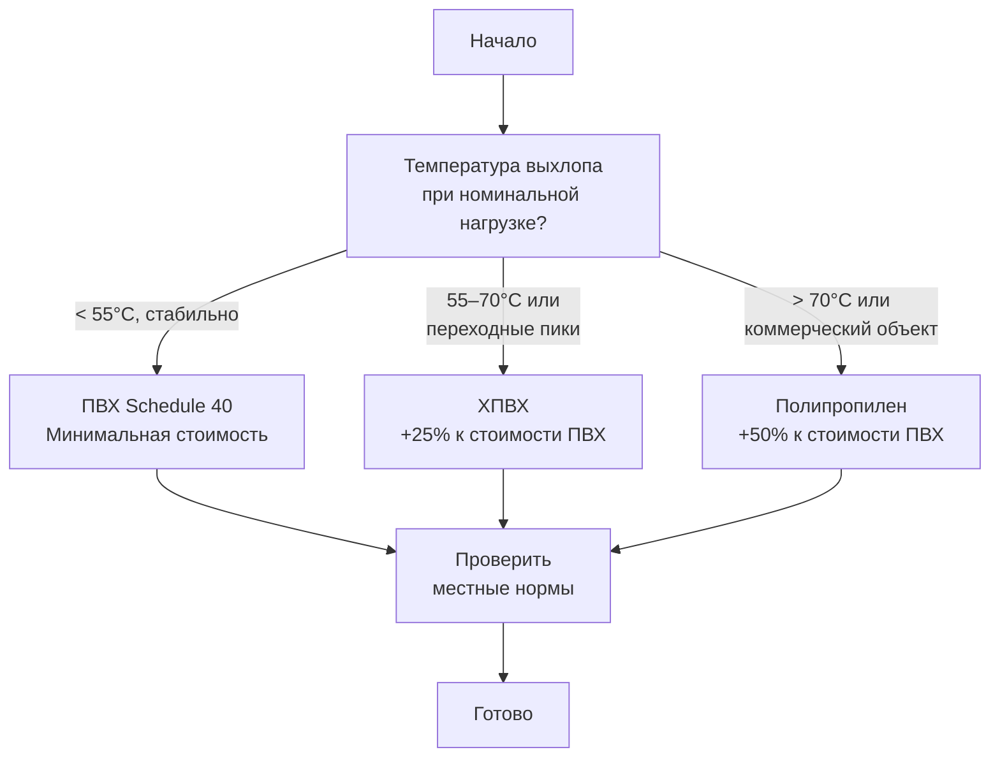

## Общая характеристика

Приборы категории IV (category IV appliances) — высокоэффективное конденсационное газовое оборудование с КПД по AFUE (annual fuel utilization efficiency) 90–98 %, работающее при положительном давлении в вентиляционном канале и принудительной тяге. Дымовые газы охлаждаются ниже 60 °C, что позволяет применять пластиковые материалы: ПВХ (PVC), ХПВХ (CPVC) и полипропилен (PP) — вместо традиционной металлической облицовки.

Категория IV охватывает большинство современных жилых и коммерческих газовых котлов, тепловых агрегатов и водонагревателей мощностью от 10 кВт до нескольких МВт. Принудительная тяга позволяет гибко маршрутизировать вентиляционный канал независимо от гравитационного напора. Экономия энергии по сравнению с неконденсационным оборудованием категорий I и II составляет 15–25 %.

## Физика конденсационного режима

Эффективность категории IV достигается за счёт охлаждения дымовых газов ниже точки росы водяного пара и рекуперации скрытой теплоты конденсации. Для природного газа точка росы составляет ≈ 57 °C. Суммарный тепловой баланс:


Q_{\text{total}} = Q_{\text{sensible}} + Q_{\text{latent}} = \dot{m} \cdot c_p \cdot \Delta T + \dot{m}_{\text{H}_2\text{O}} \cdot L_v


где:
- $Q_{\text{sensible}}$ — явная теплота охлаждения газов, кДж/ч;
- $Q_{\text{latent}}$ — скрытая теплота конденсации (≈ 2450 кДж/кг воды);
- $\dot{m}$ — массовый расход дымовых газов, кг/с;
- $c_p$ — удельная теплоёмкость ≈ 1,05 кДж/(кг·К);
- $L_v$ — удельная теплота парообразования воды.

Вторичный теплообменник (secondary heat exchanger) изготавливается из нержавеющей стали 316L, покрытого алюминия или инженерного пластика, поскольку кислотный конденсат (pH 2–4) агрессивен к обычной стали и меди.

**Объём образующегося конденсата:** ≈ 3,8 л на 293 МДж подведённой энергии при сжигании природного газа. Для котла 30 кВт при 8000 ч работы в год — 400–600 л конденсата за сезон.

## Принудительная тяга и положительное давление

Вентилятор наддува или вентилятор дымовых газов (flue gas fan) создаёт статическое давление 50–250 Па во всей системе, преодолевая сопротивление теплообменников и вентиляционного канала. Преимущества положительного давления:

- **Независимость от условий в здании**: вытяжные устройства, камины и вентиляторы не влияют на тягу;
- **Гибкая маршрутизация**: горизонтальные участки длиной до 30 м, множество поворотов без ограничений по высоте;
- **Надёжная герметичность**: при правильной установке продукты сгорания не могут проникнуть в помещение.

Датчики статического давления контролируют давление в канале. При падении ниже номинала (< 30 Па) микропроцессорный контроллер прерывает работу горелки, сигнализируя о засоре или отказе вентилятора.

Вентиляторы с EC-моторами (electronically commutated motors) регулируют частоту вращения пропорционально нагрузке горелки, снижая энергопотребление вентилятора на 30–50 % по сравнению с однооборотными конструкциями. Типовое энергопотребление: 50–150 Вт при номинальной нагрузке.

## Материалы вентиляции: ПВХ, ХПВХ, полипропилен, АБС

### ПВХ (поливинилхлорид, PVC Schedule 40)


| Параметр | Значение |
|---|---|
| Макс. непрерывная температура | 60 °C |
| Макс. кратковременная температура | 66 °C |
| Рабочее давление | до 1000 кПа |
| Диаметр номинальный | 25–100 мм |
| Шаг опор (горизонтальные участки) | 0,9–1,2 м |
| Тепловое расширение | ≈ 0,35 мм/м на 10 К |


ПВХ — экономичный вариант при гарантированно низкой температуре выхлопа. Соединения выполняются сваркой растворителем (solvent cement), создающей химическое слияние по всей толщине стенки. При длинных участках (> 5 м) необходимы S-образные компенсаторы теплового расширения.

### ХПВХ (хлорированный ПВХ, CPVC)


| Параметр | Значение |
|---|---|
| Макс. непрерывная температура | 93 °C |
| Макс. кратковременная температура | 100 °C |
| Рабочее давление | до 1000 кПа |
| Стоимость относительно ПВХ | +20–40 % |


ХПВХ рекомендуется при возможных переходных повышениях температуры при пуске или работе на высокой нагрузке. Соединения выполняются специальным ХПВХ-цементом — ПВХ-цемент несовместим и ослабляет соединения.

### Полипропилен (PP)


| Параметр | Значение |
|---|---|
| Макс. непрерывная температура | 110 °C |
| Макс. кратковременная температура | 120 °C |
| Тепловое расширение | ≈ 0,15 мм/м на 10 К |
| Методы соединения | сварка горячим воздухом, компрессионные фитинги |
| Стоимость относительно ПВХ | +30–60 % |


Сварка горячим воздухом при 300–400 °C создаёт монолитные соединения прочностью 110–130 % от основного материала. Механические компрессионные фитинги упрощают монтаж на месте, но требуют регулярной проверки затяжки.

Полипропилен — обязательный выбор для коммерческих установок с высокими нагрузками и систем, работающих в холодном климате.

### АБС (акрилонитрилбутадиенстирол, ABS)

Применяется там, где ударная стойкость важнее температурного запаса (макс. 60 °C). Соединения — ABS-специфическим растворителем. Перед применением необходима проверка местных строительных норм: ряд юрисдикций ограничивает АБС по классу дымообразования.

## Конденсат: дренаж и нейтрализация

### Объём конденсата


\dot{V}_{\text{конд}} = \dot{m}_{\text{газов}} \cdot x_{\text{влаги}} / \rho_{\text{воды}}


где $x_{\text{влаги}}$ — массовая доля водяного пара в дымовых газах (≈ 0,2 кг/кг). pH конденсата: 2,0–4,0 вследствие растворённых NO₂, N₂O₅ и следов SO₂.

### Гидравлические затворы

Гидравлические затворы (condensate traps / сифоны) глубиной 50–76 мм предотвращают прорыв дымовых газов через дренажную линию при всех рабочих давлениях:


h_{\text{затвор}} \geq \frac{\Delta P_{\text{макс}}}{\rho_{\text{воды}} \cdot g}


При $\Delta P_{\text{макс}}$ = 250 Па: $h_{\text{затвор}} \geq 250 / (1000 \cdot 9{,}81) = 0{,}025$ м = 25 мм. Для переходных режимов рекомендуется запас до 76 мм.

### Нейтрализация кислотного конденсата

Прямой сброс кислотного конденсата в канализацию запрещён (требование pH ≥ 5,5–6,5). Нейтрализаторы содержат щелочные материалы:


2\,\text{H}^+ + \text{CaCO}_3 \rightarrow \text{Ca}^{2+} + \text{H}_2\text{O} + \text{CO}_2\uparrow



| Мощность прибора, кВт | Объём сосуда, л | Загрузка CaCO₃, кг | Периодичность замены |
|---|---|---|---|
| 20–30 | 4 | 2,3 | 1–2 года |
| 50–60 | 8 | 4,5 | 1 год |
| > 100 | 20–100 | непрерывное дозирование | По pH-монитору |


Альтернативы CaCO₃: гидроксид кальция Ca(OH)₂ (быстрее реагирует), карбонат магния MgCO₃.

## Расчёт вентиляционного канала

### Подбор диаметра

Рекомендуемая скорость газов 4–6 м/с. Диаметр:


d = \sqrt{\frac{4 \cdot Q_{\text{объём}}}{\pi \cdot v}}


**Пример.** Котёл 30 кВт, КПД 95 %, объёмный расход дымовых газов ≈ 0,06 м³/с, скорость $v$ = 5 м/с:


d = \sqrt{\frac{4 \cdot 0{,}06}{\pi \cdot 5}} = \sqrt{0{,}0153} \approx 0{,}124 \text{ м} \approx 125 \text{ мм}


Выбирается стандартный диаметр 125 мм.

### Расчёт потерь давления

По формуле Дарси–Вейсбаха (Darcy–Weisbach):


\Delta P = f \cdot \frac{L}{d} \cdot \frac{\rho \cdot v^2}{2} + \sum \zeta_i \cdot \frac{\rho \cdot v^2}{2}


где $f$ ≈ 0,015–0,025 (ПВХ, гладкая поверхность), $\rho$ ≈ 0,6–0,8 кг/м³ при 60 °C, $\zeta$ = 0,9–1,2 для колена 90°.

**Типовые потери для котла 20–30 кВт (Ø 100 мм):**


| Элемент | Потери давления, Па |
|---|---|
| Прямой участок 5 м | 20–30 |
| Колено 90° | 15–25 |
| Выход с дефлектором | 30–50 |
| Итого | 65–105 |


Вентилятор должен развивать статическое давление не менее 150–200 Па с запасом на загрязнение.

### Типовые размеры по мощности


| Мощность, кВт | Диаметр канала, мм | Мощность вентилятора, Вт |
|---|---|---|
| 10–20 | 75–80 | 50–80 |
| 20–40 | 100–125 | 80–120 |
| 40–80 | 125–160 | 120–200 |
| 80–150 | 160–200 | 200–350 |


## Применение в системах отопления

### Жилой сектор

- **Высокоэффективные газовые тепловые агрегаты (furnaces)**: AFUE 95–98 %, мощность 10–60 кВт;
- **Конденсационные котлы**: мощность 15–100 кВт; часто в модульных каскадных системах;
- **Комбинированные системы** (отопление + горячее водоснабжение): коэффициент рекуперации > 0,9.

### Коммерческий и промышленный сектор

- **Модульные каскадные котлы**: от 50 кВт до 10 МВт; управление по ведущему/ведомому алгоритму;
- **Водонагреватели для бассейнов**: 50–200 кВт;
- **Централизованное теплоснабжение**: нейтрализация конденсата выполняется централизованно.

Срок окупаемости дополнительных инвестиций в конденсационное оборудование по сравнению с неконденсационным — 3–7 лет при среднеевропейских ценах на газ.

## Нормативная база

### Международные стандарты
- **ASHRAE 90.1** — минимальный AFUE 90 % для газовых котлов в климатических зонах 4–8;
- **ASHRAE Handbook — HVAC Systems and Equipment** — расчёт вентиляции конденсационных котлов;
- **EN 297 / EN 298** — безопасность газовых котлов и водонагревателей;
- **NFPA 54** — минимальные расстояния от выходного устройства: ≥ 300 мм от окна/двери, ≥ 300 мм по вертикали.

### Российские нормативы
- **ГОСТ 31841** — безопасность и эффективность газовых котлов;
- **СП 60.13330.2020** (актуализация СНиП 41-01-2003) — отопление, вентиляция и кондиционирование;
- **ГОСТ Р 58379–2019** — энергетическая эффективность газовых котлов отопления;
- **СП 31.13330.2020** — требования к сбросу конденсата в канализацию (pH ≥ 6,5).

## Выбор материала вентиляции: алгоритм





## Типичные ошибки монтажа и меры устранения

1. **Смешивание ПВХ-цемента и ХПВХ**: ослабляет соединения; решение — маркировать трубы и использовать правильный цемент.
2. **Недостаточные опоры**: провисание более 5 мм создаёт карманы конденсата; опоры каждые 0,9–1,2 м.
3. **Отсутствие компенсаторов**: на участках ПВХ длиной > 5 м S-образная петля каждые 5–10 м.
4. **Неправильный уклон дренажа**: горизонтальные участки с нулевым или обратным уклоном — конденсат не стекает; уклон ≥ 0,6 см/30 см.
5. **Отсутствие нейтрализатора**: прямой сброс кислотного конденсата нарушает экологические требования и разрушает канализационные трубы.

## Испытание и ввод в эксплуатацию

- **Испытание под давлением**: 1,5 × рабочее давление в течение 10 мин без падения давления;
- **Анализ дымовых газов**: CO < 50 ppm, O₂ = 3–8 % при номинальной нагрузке;
- **Дренаж конденсата**: визуальный контроль расхода, pH ≥ 5,5 на выходе нейтрализатора;
- **Функциональная проверка вентилятора**: статическое давление 50–200 Па при номинальной нагрузке;
- **Документирование**: чек-лист ввода в эксплуатацию, паспорт установки.

---

Приборы категории IV представляют собой оптимальный выбор для новых и реконструируемых систем газового отопления во всех климатических зонах. Сочетание высокого КПД, гибкости пластиковой вентиляции и надёжной принудительной тяги обеспечивает соответствие требованиям ASHRAE 90.1, EN 297, СП 60.13330 и экологическим нормам при минимальных эксплуатационных затратах.
