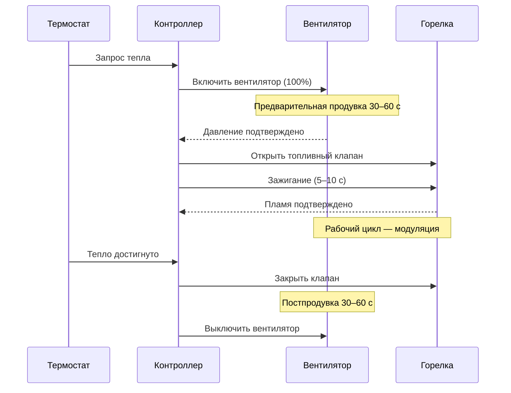

## Общая характеристика

Системы принудительной вентиляции (power vent systems) применяют механические вентиляторы для создания управляемой тяги, преодолевая сопротивление вентиляционной системы и обеспечивая надёжную эвакуацию продуктов сгорания независимо от естественной плавучести (buoyancy) и атмосферных условий. Технология позволяет располагать отопительные приборы в зонах с неудобной естественной тягой, использовать протяжённые горизонтальные участки и гибко маршрутизировать вентиляцию в условиях ограниченного пространства.

Принудительная вентиляция охватывает две основные конфигурации:
- **индуцированная тяга (induced draft)** — вентилятор расположен после теплообменника по ходу газов;
- **принудительная тяга (forced draft)** — вентилятор расположен перед горелкой.

Механическое усиление тяги критично для высокоэффективных конденсационных котлов, где сопротивление вторичного теплообменника исключает полагание на естественную конвекцию.

## Физические принципы механической тяги

Вентилятор развивает статическое давление, преодолевая суммарное сопротивление системы:


\Delta P_{\text{вент}} = \Delta P_{\text{горелка}} + \Delta P_{\text{теплообм}} + \Delta P_{\text{канал}} + \Delta P_{\text{фитинги}}


Для газовых котлов типичное суммарное сопротивление: 150–300 Па; для конденсационных котлов с модулированной горелкой: 250–500 Па.

Объёмный расход вентилятора определяется потребностью в воздухе для горения:


Q_{\text{воздуха}} = \dot{V}_{\text{топлива}} \times n_{\text{стехиом}} \times (1 + \xi)


где $\dot{V}_{\text{топлива}}$ — расход топлива (м³/ч при нормальных условиях, 0 °C, 101,3 кПа), $n_{\text{стехиом}}$ ≈ 10 м³ воздуха на 1 м³ природного газа, $\xi$ = 0,10–0,30 — коэффициент избытка воздуха.

**Пример.** Газовый котёл 24 кВт, расход газа ≈ 2,7 м³/ч, избыток воздуха 20 %:


Q_{\text{воздуха}} = 2{,}7 \times 10 \times 1{,}2 = 32{,}4 \text{ м}^3/\text{ч} \approx 0{,}009 \text{ м}^3/\text{с}


## Конфигурация индуцированной тяги

Вентилятор индуцированной тяги устанавливается после теплообменника, вытягивая продукты сгорания из камеры в вентиляционный канал. Давление в камере сгорания — слегка отрицательное (−5…−25 Па), что предотвращает выброс и способствует входу первичного воздуха горения.

**Преимущества:**
- конструкция прибора остаётся на низком давлении — упрощаются уплотнения и лючки;
- простая модернизация существующих котлов без переделки горелочного блока;
- удобное управление расходом через модуляцию скорости вентилятора.

**Требования к конструкции вентилятора:**
- корпус и рабочее колесо из коррозионностойких материалов — литой алюминий, нержавеющая сталь;
- работоспособность при температурах дымовых газов 150–400 °C;
- центробежные лопатки с обратным загибом для устойчивости к частицам и максимального КПД;
- гибкий термостойкий соединительный патрубок, изолирующий электродвигатель от высокотемпературного воздействия.

## Конфигурация принудительной тяги

Вентилятор принудительной тяги нагнетает воздух для горения через камеру сгорания и теплообменник. Вентилятор работает в условиях окружающего воздуха, что снижает требования к материалам.

**Преимущества:**
- компактное размещение в корпусе прибора;
- широкий выбор стандартных коммерческих воздуходувок;
- простое управление подачей воздуха.

**Требования:**
- камера сгорания и все соединения герметичны, выдерживают положительное давление 50–150 Па;
- люки доступа, смотровые окна и фланцы горелки оснащены высокотемпературными прокладками;
- системы принудительной тяги комплектуются автоматическими ограничителями тяги.

## Переключатели доказательства давления

Переключатели доказательства давления (pressure proof switches / draft switches) — критические устройства безопасности, контролирующие наличие тяги до разрешения работы горелки. Реагируют на дифференциальное давление между системой вентиляции и атмосферой.


| Параметр | Типовое значение |
|---|---|
| Диапазон уставки срабатывания | 5–30 Па (0,05–0,30 см вод. ст.) |
| Гистерезис | 2–5 Па |
| Время отклика | 1–3 с |
| Номинальный ток контакта | 5–10 А при 24 В переменного тока |


**Принцип действия:** трубопровод высокого давления подключается к камере сгорания или вентиляционному патрубку, низкого давления — к атмосфере. При достаточной тяге гибкая мембрана замыкает контакт. Горелка получает разрешение на розжиг только после подтверждения давления; потеря давления во время работы немедленно отключает горелку.

**Требования к монтажу трубопровода датчика:**
- уклон, исключающий скопление конденсата, блокирующего передачу давления;
- защита от механических повреждений и перегибов;
- диаметр соединительного трубопровода 3–4 мм.

## Автоматические ограничители тяги

Ограничители тяги (automatic vent dampers) — подвижные заслонки в вентиляционном патрубке, закрывающиеся в паузах между циклами горелки. Снижают резервные потери тепловой энергии на 5–15 % за счёт предотвращения конвективного обратного потока тёплого воздуха через систему.

**Типы:**

1. **Электроприводной ограничитель** — наиболее надёжный. Соленоид или электродвигатель открывает заслонку при начале цикла; концевой переключатель подтверждает полное открытие до розжига. Время открытия 3–5 с.

2. **Термический ограничитель** — биметаллическая полоса открывается от теплоты газов. Применяется ограниченно из-за задержки отклика.

3. **Воздухозависимый ограничитель** — открывается давлением потока вентилятора или перепадом давления горелки.

Ограничитель не должен увеличивать суммарное сопротивление системы более чем на 20–30 Па; при необходимости скорректировать подбор вентилятора.

## Система управления безопасностью

### Многоуровневая защита

**Датчик пламени (ионизационный или фотодатчик):** контролирует наличие пламени. При потере пламени топливный клапан перекрывается в течение 0,5–1,0 с. Повторный розжиг — после сброса блокировки оператором.

**Предохранительные термостаты (limit switches):**
- на выходе теплообменника: уставка 85–95 °C;
- на вентиляционном патрубке: уставка 80–90 °C;
- отключают горелку при чрезмерной температуре, указывающей на недостаточный расход воздуха или засор канала.

**Датчик засора канала:** фиксирует дифференциальное давление между входом и выходом канала. Срабатывает при повышении перепада на 100–200 Па сверх номинала (лёд, гнёзда птиц, конструктивные повреждения).

**Датчик воздуха для горения (в герметичных системах):** подтверждает поток воздуха через воздухозаборный трубопровод до разрешения розжига.

## Последовательность электрического управления





**Блокировки безопасности:**
- запрет розжига при давлении ниже уставки;
- немедленное отключение при потере пламени;
- отключение при превышении температурных уставок;
- отключение при срабатывании датчика засора.

## Расчёт параметров вентилятора


Q = \frac{\dot{V}_{\text{топлива}} \cdot n_{\text{стехиом}} \cdot (1 + \xi)}{3600}


Статическое давление вентилятора определяется по суммарному сопротивлению системы с запасом 20–30 %:


\Delta P_{\text{вент}} = (\Delta P_{\text{теплообм}} + \Delta P_{\text{канал}} + \Delta P_{\text{фитинги}}) \times 1{,}25


**Пример.** Конденсационный котёл 30 кВт: $\Delta P_{\text{теплообм}}$ = 150 Па, $\Delta P_{\text{канал}}$ = 80 Па, $\Delta P_{\text{фитинги}}$ = 50 Па; с запасом $\Delta P_{\text{вент}}$ = 280 × 1,25 = 350 Па. Выбирается вентилятор с рабочей точкой 350 Па при расходе ≈ 36 м³/ч.

## Требования к монтажу

- **Виброизоляция**: жёсткое крепление вентилятора на виброизолирующих подставках (neoprene mounts), предотвращающее передачу вибрации на конструкцию здания;
- **Гибкие соединительные патрубки**: компенсируют тепловое расширение и гасят вибрацию между вентилятором и жёстким каналом;
- **Дренаж конденсата**: точки сбора в нижних точках системы с подключением к нейтрализатору;
- **Электропитание**: провод надлежащего сечения по IEC 60364-5-52 или NEC Article 430; выключатель в пределах 1,5 м от прибора;
- **Трубопровод переключателей давления**: Ø 3–4 мм, защищён от перегибов и механических повреждений.

## Ввод в эксплуатацию

1. Визуальная проверка крепления, соединений и герметичности;
2. проверка направления вращения рабочего колеса (стрелка на корпусе);
3. тестирование переключателей давления вакуумным насосом — проверка порогов срабатывания и отпускания;
4. имитация неисправностей (отключение вентилятора, потеря давления) с подтверждением отключения горелки;
5. измерение статического и динамического давления при номинальной нагрузке;
6. проверка времени предварительной и постпродувки;
7. документирование параметров в паспорте установки.

## Нормативная база


| Стандарт | Область применения |
|---|---|
| ASHRAE 62.2 | Минимальные объёмы вентиляции жилых зданий (США) |
| EN 13384-1 / EN 13384-2 | Расчёт тяги и сопротивления дымоходов (Европа) |
| EN 15316 (серия) | Методика расчёта энергопотребления систем отопления |
| СП 89.13330.2012 | Котельные установки (Россия, актуализация СНиП II-35-76) |
| СП 60.13330.2020 | Отопление, вентиляция и кондиционирование (Россия) |
| ГОСТ 32220 | Водогрейные газовые котлы (Россия) |


## Практические параметры проектирования


| Параметр | Диапазон |
|---|---|
| Статическое давление вентилятора | 150–500 Па |
| Избыток воздуха | 10–30 % от теоретического |
| Температура газов на выходе (неконденсационные) | 150–250 °C |
| Температура газов на выходе (конденсационные) | 50–70 °C |
| Отрицательное давление в камере сгорания (induced draft) | −5…−25 Па |
| Положительное давление (forced draft) | 20–100 Па |
| Гистерезис переключателя давления | 2–5 Па |
| Время отклика защиты | 1–3 с |


## Типичные ошибки и меры устранения

1. **Завышенный вентилятор**: создаёт избыточное давление, нарушающее герметичность уплотнений; правильно — подобрать по суммарному сопротивлению с запасом 25 %.
2. **Трубопровод датчика без уклона**: скопление конденсата блокирует передачу давления; решение — монтаж с уклоном к прибору.
3. **Пропуск проверки давления**: последовательность управления должна обязательно включать доказательство давления до розжига.
4. **Игнорирование технического обслуживания**: деградация уплотнений вентилятора и заклинивание переключателей давления приводят к отказам безопасности; ежегодная проверка обязательна.

---

Правильно спроектированная и установленная система принудительной вентиляции в соответствии с EN 13384, СП 89.13330 и требованиями производителя обеспечивает безопасную, энергоэффективную и надёжную работу отопительного оборудования в широком диапазоне климатических условий и конфигураций зданий.
