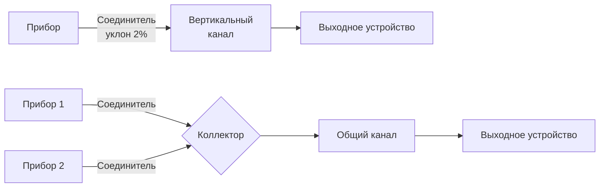

## Общая характеристика

Проектирование системы дымоудаления охватывает инженерные принципы и методологии расчёта, обеспечивающие надёжное и безопасное удаление продуктов сгорания из приборов, работающих на органическом топливе. Грамотное проектирование балансирует между адекватной тягой, минимальными капитальными затратами, соответствием нормам и долгосрочной надёжностью в переменных условиях эксплуатации.

Проектные решения определяются типом и категорией прибора, видом топлива, геометрией здания, климатическими условиями и требованиями к выходному устройству. Систематическое применение термодинамических принципов, эмпирических данных пропускной способности и полевого опыта обеспечивает надёжные установки на весь срок службы оборудования.

Нормативная база: NFPA 54 (ANSI Z223.1) для газовых приборов, NFPA 31 для жидкотопливных, EN 13384-1 для европейских объектов, СП 60.13330.2020 и СП 89.13330.2012 в России.

## Теория естественной тяги

Естественная тяга (natural draft) основана на силах плавучести (buoyancy), возникающих из разности плотностей горячих дымовых газов и холодного атмосферного воздуха. Теоретическое давление тяги:


\Delta P_{\text{тяга}} = \rho_a \cdot g \cdot H \cdot \left(1 - \frac{T_a}{T_g}\right)


где $\rho_a$ — плотность наружного воздуха (кг/м³), $g$ = 9,81 м/с², $H$ — высота дымохода (м), $T_a$ и $T_g$ — абсолютные температуры воздуха и газов (К).

В практических единицах (Па) для быстрого расчёта:


\Delta P \approx 0{,}034 \cdot H \cdot P_{\text{атм}} \cdot \left(\frac{1}{T_a} - \frac{1}{T_g}\right) \times 1000


**Пример.** Дымоход $H$ = 6 м, $T_g$ = 200 °C (473 К), $T_a$ = 20 °C (293 К):


\Delta P = 1{,}2 \cdot 9{,}81 \cdot 6 \cdot \left(1 - \frac{293}{473}\right) = 70{,}6 \cdot 0{,}380 \approx 26{,}8 \text{ Па}


Располагаемая тяга должна преодолевать суммарное сопротивление системы с запасом не менее 30 %:


\Delta P_{\text{тяга}} \geq 1{,}3 \times \sum \Delta P_{\text{сопротивление}}


Потери давления рассчитываются по Дарси–Вейсбаху:


\Delta P_{\text{трения}} = f \cdot \frac{L}{D} \cdot \frac{\rho_g \cdot v^2}{2}


где $f$ — коэффициент трения (0,015–0,025 для гладких стальных каналов), $L$ — длина (м), $D$ — диаметр (м), $\rho_g$ — плотность дымовых газов (кг/м³), $v$ — скорость (м/с).

## Классификация систем дымоудаления


| Категория прибора | Давление в канале | Конденсация | Применяемые материалы |
|---|---|---|---|
| I | Отрицательное | Нет | Тип B (двустенный), кирпичный дымоход |
| II | Положительное | Нет | Тип BH, нержавеющая сталь AL29-4C |
| III | Отрицательное | Да | Тип B-1, AL29-4C, нержавеющая 316L |
| IV | Положительное | Да | ПВХ, ХПВХ, полипропилен, нержавеющая 316L |


**Однодымоходные системы** (single-appliance venting) соединяют один прибор с отдельной системой — упрощают проектирование и исключают взаимодействие приборов.

**Общие дымоходы** (common venting) объединяют несколько приборов в один канал. Требуют анализа пропускной способности при всех комбинациях нагрузок и соответствия дополнительным требованиям NFPA 54 по ориентации соединителей.

## Методы расчёта пропускной способности

### Табличный метод (NFPA 54 Appendix G)

Табличный метод предоставляет значения максимальной входной мощности прибора для стандартных конфигураций. Параметры таблиц:
- тип прибора (с колпаком, без колпака, принудительная тяга);
- диаметр канала;
- высота канала;
- длина и конфигурация соединителя.

Таблицы основаны на эмпирических испытаниях и включают консервативные запасы. Прямое применение требует совпадения параметров установки с условиями таблицы; интерполяция требует инженерного суждения.

### Инженерный расчёт (EN 13384-1)

Инженерный расчёт обеспечивает гибкость для нестандартных конфигураций. Итеративное решение:

1. Задать диаметр канала — принять начальное значение;
2. рассчитать скорость газов и потери давления;
3. рассчитать располагаемую тягу с учётом потери температуры по высоте;
4. проверить условие: $\Delta P_{\text{тяга}} \geq 1{,}3 \times \sum \Delta P_{\text{потери}}$;
5. при невыполнении — увеличить диаметр или высоту; повторить.

Консервативное проектирование сохраняет запас пропускной способности 25–40 % выше максимальной нагрузки прибора.

## Проектирование дымоходного соединителя

Соединитель (connector / vent connector) связывает прибор с вертикальным каналом. Недостаточное сечение создаёт чрезмерное сопротивление; завышенное — способствует конденсации из-за низкой скорости газов и избыточных потерь тепла.

**Правила проектирования соединителя:**
- диаметр ≥ диаметру выходного патрубка прибора; увеличение на один стандартный типоразмер допустимо на коротких участках;
- максимальная длина горизонтального соединителя — 75 % высоты вертикального канала при атмосферной тяге;
- минимальный уклон 0,6 см на 30 см в направлении канала;
- каждое колено 90° эквивалентно ≈ 1,5 м прямой трубы по сопротивлению;
- минимизировать количество поворотов — каждый снижает располагаемую тягу.





## Выбор материала и совместимость

**Одностенные металлические соединители** (оцинкованная сталь ≥ 0,5 мм, нержавеющая сталь ≥ 0,4 мм) — для коротких соединителей в доступных местах. Расстояние до горючих: 150 мм.

**Тип B (двустенный)** — снижает расстояние до 25 мм. Применение: приборы категории I.

**Нержавеющая сталь AL29-4C / 316L** — для конденсационных и высокотемпературных систем.

**Пластиковые системы (ПВХ, ХПВХ, PP)** — исключительно для категории IV (конденсационные, положительное давление).

**Критические требования совместимости:**
- кирпичные дымоходы обязаны иметь сертифицированный вкладыш при подключении газовых приборов;
- переходы между материалами требуют совместимых переходных фитингов;
- в рамках сертифицированных систем использовать только компоненты одного производителя.

## Оптимизация конфигурации

**Предпочтительные конфигурации:**
- прямой вертикальный маршрут с минимальными смещениями — максимизирует тягу при минимальном сопротивлении;
- неизбежные смещения располагать в нижних участках, где температура и скорость газов наиболее высоки;
- несколько малых смещений предпочтительнее одного большого горизонтального участка.

**Внутренняя vs. наружная прокладка:**


| Аспект | Внутренняя прокладка | Наружная прокладка |
|---|---|---|
| Потери температуры газов | Минимальные | Значительные без изоляции |
| Тяга | Лучше | Хуже без утепления |
| Риск конденсации | Низкий | Высокий без утепления |
| Согласование с конструкцией | Сложнее | Проще |
| Доступ для обслуживания | Требует шахты | Удобнее снаружи |


При внутренней прокладке шахта дымоудаления вмещает канал с учётом расстояний и компенсаторов теплового расширения.

## Требования к выходному устройству (терминалу)

Место выхода дымохода существенно влияет на производительность системы через ветровые эффекты и поля давления здания.

**Минимальные высоты:**
- 0,6 м выше точки прохода через кровлю;
- 0,6 м выше кровли (или препятствия) в пределах 3 м по горизонтали;
- дополнительная высота при крутых уклонах или высоких соседних строениях.

**Расстояния от проёмов** (NFPA 54):
- 0,6–1,2 м от окон, дверей и воздухозаборников естественной вентиляции;
- 2,4 м от механических воздухозаборников.

**Выбор колпака терминала:** балансирует защиту от осадков и ветровых нагрузок против ограничения тяги. Свободная площадь колпака — не менее 3–4 × площади сечения канала. Ветрозащитные конфигурации колпака применяются при высокой экспозиции и открытых установках.

## Верификация и испытания системы

### Ввод в эксплуатацию

1. **Измерение тяги**: в нескольких точках (у прибора, в соединителе, в канале) — количественная оценка запасов и выявление ограничений;
2. **Испытание на выброс (spillage test)**: при наихудших условиях — все вытяжные устройства включены, холодный пуск, максимальная мощность;
3. **Дымовой тест**: визуализация утечек в соединениях;
4. **Анализ дымовых газов**: CO < 100 ppm, CO₂ = 8–10 % (природный газ) при полной нагрузке;
5. **Измерение температур**: проверка потерь тепла и риска конденсации;
6. **Документирование базовых параметров**: для последующего сравнения при техническом обслуживании.

### Ежегодное обслуживание

- повторная проверка тяги и выброса после изменений здания или замены оборудования;
- изменения, влияющие на перепад давления в здании или добавляющие мощность вытяжки, требуют полной повторной верификации;
- протоколирование результатов испытаний в паспорте установки.

## Нормативная база

- **NFPA 54 (ANSI Z223.1)** — газовые приборы: Appendix G — таблицы пропускной способности;
- **ASHRAE Handbook — HVAC Systems and Equipment** — расчёт и применение систем дымоудаления;
- **ASHRAE 90.1** — требования к энергоэффективности систем отопления;
- **EN 13384-1** — метод расчёта пропускной способности и тяги, однодымоходные системы (Европа);
- **EN 13384-2** — многодымоходные системы (Европа);
- **EN 15316-4-1** — расчёт энергопотребления систем отопления на горелочном оборудовании;
- **СП 60.13330.2020** — отопление, вентиляция и кондиционирование (Россия);
- **СП 89.13330.2012** — котельные установки (Россия);
- **ГОСТ 9817–2021** — требования безопасности газовых приборов.

---

Систематическое проектирование систем дымоудаления с применением инженерных методов расчёта, верификацией при вводе в эксплуатацию и документированием параметров в соответствии с NFPA 54, EN 13384 и СП 60.13330 обеспечивает безопасную, надёжную и долговечную эксплуатацию теплогенерирующего оборудования во всех климатических условиях.
