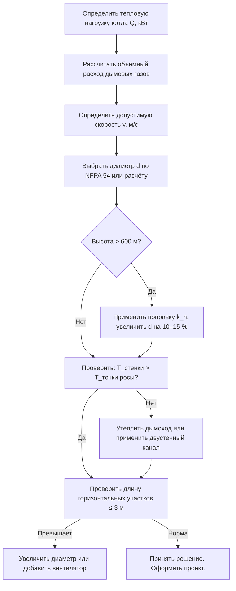

Расчёт сечений дымовых и вентиляционных каналов — критическая стадия проектирования систем отопления (HVAC), от которой зависит безопасность, энергоэффективность и надёжность котельного оборудования. Ошибочный подбор диаметра, недостаточная высота или избыточное количество колен приводят к неполному удалению продуктов сгорания, обратной тяге (backdraft) и накоплению угарного газа CO и диоксида азота NO₂ в жилых помещениях. Действующая нормативная база охватывает NFPA 54 (США и Канада), EN 1856 (Европа), СП 60.13330 и ГОСТ Р 30494 (Россия), а также рекомендации ASHRAE Handbook — HVAC Systems and Equipment.

## Физические принципы

### Естественная тяга

Движущая сила естественной тяги (natural draft) — разность плотностей горячего дымового газа и холодного наружного воздуха:


\Delta P_{\text{тяга}} = \rho_{\text{воздух}} \cdot g \cdot H \cdot \left(1 - \frac{\rho_{\text{дым}}}{\rho_{\text{воздух}}}\right)


где:
- $\rho_{\text{воздух}}$ — плотность наружного воздуха, кг/м³
- $\rho_{\text{дым}}$ — плотность дымовых газов, кг/м³
- $H$ — высота дымохода (stack height), м
- $g = 9{,}81$ м/с² — ускорение свободного падения

При температуре дыма 150 °C и наружном воздухе −10 °C разность плотностей составляет около 0,57 кг/м³, что при высоте 10 м обеспечивает располагаемое давление порядка 55 Па.

### Сопротивление системы

Полное аэродинамическое сопротивление (system resistance) определяется потерями на трение и местными сопротивлениями:


\Delta P_{\text{сопр}} = \lambda \cdot \frac{L}{d_{\text{экв}}} \cdot \frac{\rho v^2}{2} + \sum_i \zeta_i \cdot \frac{\rho v^2}{2}


где:
- $\lambda$ — коэффициент Дарси–Вейсбаха (Darcy friction factor)
- $L$ — длина канала, м
- $d_{\text{экв}}$ — эквивалентный диаметр, м
- $v$ — средняя скорость газа, м/с
- $\zeta_i$ — коэффициенты местных сопротивлений (колена, переходы, коллектор)

Для ламинарного режима (Re < 2300) $\lambda = 64/Re$; для турбулентного — формула Муди. В дымоходах обычен переходный режим при Re = 5 000–30 000; применяют $\lambda \approx 0{,}025$–$0{,}04$.

## Методы расчёта

### Табличный метод NFPA 54

Стандарт NFPA 54 «Национальный кодекс по топливному газу» (National Fuel Gas Code) содержит таблицы минимального внутреннего диаметра одностенного стального дымохода в зависимости от тепловой нагрузки котла и высоты дымохода. Таблицы справедливы для газовых приборов с атмосферной горелкой (atmospheric burner) при нормальных атмосферных условиях на высоте до 600 м н.у.м.


| Тепловая нагрузка, кВт | Высота дымохода, м | Минимальный диаметр, мм |
|---|---|---|
| 17,6 | 3,0–6,0 | 76 |
| 35,2 | 3,0–6,0 | 102 |
| 58,6 | 6,0–12,0 | 127 |
| 87,9 | 9,0–15,0 | 152 |
| 146,5 | 12,0–18,0 | 203 |


Таблицы не учитывают высоту над уровнем моря; при высоте более 600 м требуется поправочный коэффициент (см. ниже).

### Расчёт объёмного расхода дымовых газов

При известной тепловой нагрузке котла $Q_{\text{котёл}}$ (кВт) и температурном перепаде дыма $\Delta T$ (К):


Q_{\text{газ}} = \frac{Q_{\text{котёл}} \cdot 3600}{c_p \cdot \rho \cdot \Delta T}


где $c_p \approx 1{,}01$ кДж/(кг·К) — удельная теплоёмкость дымовых газов, $\rho$ — плотность при рабочей температуре (кг/м³).

**Пример.** Котёл $Q_{\text{котёл}} = 58{,}6$ кВт, температура дыма на выходе 150 °C, наружный воздух 0 °C. Плотность газа при 150 °C: $\rho = 1{,}293 \times 273/(273+150) \approx 0{,}834$ кг/м³. $\Delta T = 150$ К.

$$Q_{\text{газ}} = \frac{58{,}6 \times 3600}{1{,}01 \times 0{,}834 \times 150} \approx 1675 \text{ м}^3\text{/ч}$$

### Подбор диаметра по скорости

При рекомендованной скорости дымовых газов $v$ диаметр канала:


d = \sqrt{\frac{4 Q_{\text{газ}}}{\pi v \cdot 3600}}



| Тип тяги | Скорость, м/с | Примечание |
|---|---|---|
| Естественная (natural draft) | 1,5–2,5 | Минимум для предотвращения конденсации |
| Принудительная (forced draft) | 3,0–5,0 | Ограничено шумом и потерями |


**Пример (продолжение).** При $Q_{\text{газ}} = 1675$ м³/ч и $v = 2{,}0$ м/с:

$$d = \sqrt{\frac{4 \times 1675}{3{,}14 \times 2{,}0 \times 3600}} \approx 0{,}122 \text{ м} \approx 125 \text{ мм}$$

Результат совпадает с табличным значением NFPA 54 (127 мм) — расхождение в пределах стандартного ряда.

### Подбор вентилятора при принудительной вентиляции

Электрическая мощность вентилятора (fan power):


P_{\text{вент}} = \frac{Q_{\text{газ}} \cdot \Delta P_{\text{сист}}}{\eta_{\text{вент}}}


где $\eta_{\text{вент}} = 0{,}60$–$0{,}75$ — КПД осевого вентилятора (axial fan).

## Ограничения горизонтальных участков и колен

NFPA 54 ограничивает эквивалентную длину горизонтальных секций: для одиночного газового прибора при высоте дымохода 3–6 м — не более 3 м. Каждое колено на 90° эквивалентно 0,5–1,5 м прямого канала; максимальное количество колен — три. Углы поворота не менее 45° снижают аэродинамическую сепарацию (flow separation).

Российская практика по СП 60.13330 дополнительно требует, чтобы горизонтальный участок дымохода для газовых котлов имел уклон не менее 0,01 в сторону котла для отвода конденсата.

## Поправка на высоту над уровнем моря

На высоте более 600 м плотность воздуха снижается и располагаемая тяга уменьшается. Поправочный коэффициент:


k_h = \frac{\rho_h}{\rho_0} \approx \frac{P_h}{P_0}


где $P_h$ — атмосферное давление на высоте $h$, $P_0 = 101{,}325$ кПа — давление на уровне моря.


| Высота, м | $k_h$ | Увеличение диаметра |
|---|---|---|
| 600 | 0,93 | базовый |
| 1000 | 0,88 | +10 % |
| 1500 | 0,83 | +12 % |
| 2000 | 0,78 | +15 % |


NFPA 54 предписывает: при $k_h < 0{,}95$ (высота > 600 м) диаметр дымохода увеличивают на 10–15 %. EN 303 применяет аналогичный подход.

## Подбор коллектора (сборного дымовода)

Коллектор (plenum, manifold) объединяет несколько приборов в один дымоход. Его сечение:


A_{\text{колл}} \geq 1{,}25 \sum_{i} A_i


где $A_i$ — площадь сечения каналов отдельных приборов, м². Коэффициент 1,25 учитывает смешение газов и потери при слиянии потоков. Скорость в коллекторе — 1,5–2,5 м/с.

## Диаграмма проектирования системы





## Проверка на конденсацию

Температура внутренней поверхности дымохода должна превышать точку росы дымовых газов (dew point). Для природного газа точка росы составляет 55–60 °C; при сжигании дизельного топлива — 50–55 °C. При прокладке через неотапливаемые зоны (чердак, наружная стена) необходимо применять двустенные теплоизолированные каналы (double-wall insulated flue).

Минимальная скорость в дымоходе 1,5 м/с обеспечивает непрерывный вынос влаги и предотвращает кратковременную конденсацию при переходных режимах.

## Применение в отечественной практике

СП 60.13330.2020 «Отопление, вентиляция и кондиционирование воздуха» устанавливает следующие требования:

- Для бытовых газовых котлов мощностью до 100 кВт применяется естественная тяга; диаметр подбирается по NFPA 54 с поверкой на допустимые скорости и конденсацию.
- Для промышленных котельных суммарной мощностью более 100 кВт — принудительная вытяжка с регулируемым дымососом (induced draft fan).
- В приморских регионах с частыми перепадами барометрического давления применяют запас по сечению 20–30 %.

ГОСТ Р 30494-2016 «Здания жилые и общественные. Параметры микроклимата в помещениях» нормирует предельное содержание CO в жилых помещениях — не более 3 мг/м³; соответствующая проверка производится при сдаче объекта в эксплуатацию.

## Нормативная база

- **NFPA 54:2021** — National Fuel Gas Code; табличный метод подбора для газовых приборов
- **EN 1856-1:2009** — Chimneys. Requirements for metal chimneys
- **EN 303** — Heating boilers; вентиляционные требования к котлам
- **ASHRAE Handbook — HVAC Systems and Equipment** — глава по дымоудалению и расчёту тяги
- **СП 60.13330.2020** (актуализированная редакция СНиП 41-01-2003) — отопление, вентиляция и кондиционирование
- **ГОСТ Р 30494-2016** — параметры микроклимата в помещениях

## Практические рекомендации

- Минимальная скорость дымовых газов — 1,5 м/с для предотвращения конденсации.
- Длина горизонтальных участков — не более 3 м при однозначной естественной тяге.
- При прокладке через холодные зоны применять двустенные теплоизолированные воздуховоды.
- На высотах более 600 м н.у.м. увеличивать диаметр на 10–15 % относительно табличного значения.
- Типовые диапазоны диаметров: 76–152 мм для бытовых газовых котлов 17,6–58,6 кВт; 152–254 мм для промышленных установок.
- Использовать программные калькуляторы производителей для проверки при сложных геометриях с несколькими коленами.
