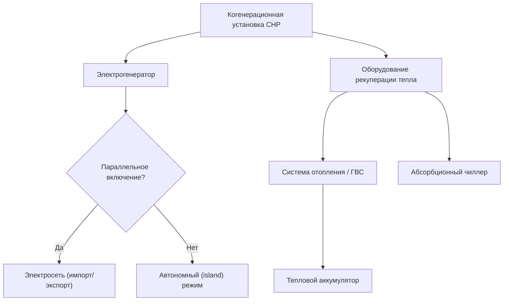

Системы комбинированного производства тепла и электроэнергии (CHP, Combined Heat and Power), называемые в отечественной практике когенерационными установками или мини-ТЭЦ, обеспечивают одновременную выработку электрической и тепловой энергии из одного первичного топлива. Интегрированный подход принципиально отличается от раздельного производства: вместо сброса отходящего тепла в окружающую среду оно направляется на отопление, горячее водоснабжение (ГВС) или технологические процессы. Суммарный КПД когенерационных установок достигает 70–90 % против 45–55 % для схем раздельного производства.

## Термодинамические основы

Фундаментальное преимущество когенерации вытекает из второго начала термодинамики: обычные электростанции преобразуют в электричество лишь 33–40 % химической энергии топлива, отвергая 60–67 % в виде тепловых потерь. Когенерационные установки утилизируют значительную часть этого тепла.

### КПД первого закона


\eta_I = \frac{W_{\text{эл}} + Q_{\text{тепл}}}{Q_{\text{топл}}}


где $W_{\text{эл}}$ — электрическая мощность (Вт), $Q_{\text{тепл}}$ — утилизированная тепловая мощность (Вт), $Q_{\text{топл}}$ — тепловая мощность сожжённого топлива на основе низшей теплоты сгорания (Вт). Типичные значения $\eta_I$ для систем CHP — 70–85 %.

### Эксергетический анализ (КПД второго закона)

Поскольку электроэнергия и низкопотенциальное тепло имеют разную термодинамическую ценность, анализ эксергии (exergy analysis) даёт объективную оценку:


\eta_{II} = \frac{W_{\text{эл}} + Q_{\text{тепл}}\!\left(1 - \dfrac{T_0}{T_h}\right)}{Q_{\text{топл}}\!\left(1 - \dfrac{T_0}{T_{\text{пл}}}\right)}


где $T_0$ — температура окружающей среды (К), $T_h$ — температура подачи тепла (К), $T_{\text{пл}}$ — адиабатическая температура пламени (≈ 2200 К для природного газа). Для горячей воды 90 °C (363 К) при $T_0 = 283$ К эксергетный коэффициент тепла составляет $(1 - 283/363) = 0{,}22$.

### Коэффициент мощность-тепло (Power-to-Heat Ratio)


\text{PHR} = \frac{W_{\text{эл}}}{Q_{\text{тепл}}}


Значение PHR зависит от технологии первичного двигателя и определяет пригодность системы для конкретного объекта: от 0,2–0,4 для паровых турбин противодавления до 1,5–2,2 для твёрдооксидных топливных элементов (SOFC).

## Технологии первичных двигателей


| Технология | Диапазон мощности | КПД электр., % | КПД тепловой, % | PHR |
|---|---|---|---|---|
| Поршневой ДВС (газ/дизель) | 100 кВт – 10 МВт | 32–42 | 40–50 | 0,7–1,0 |
| Газовая турбина простого цикла | 1 – 300 МВт | 25–35 | 45–55 | 0,5–0,8 |
| Микротурбина (microturbine) | 30 – 300 кВт | 25–30 | 45–55 | 0,5–0,7 |
| Паровая турбина противодавления | 0,5 – 50 МВт | 15–25 | 60–70 | 0,2–0,4 |
| Топливный элемент PAFC | 200 кВт – 1 МВт | 40–42 | 40–50 | 0,9–1,1 |
| Топливный элемент SOFC | 100 кВт – 10 МВт | 50–60 | 25–35 | 1,5–2,2 |


Поршневые двигатели внутреннего сгорания (reciprocating engines) доминируют в диапазоне до 10 МВт благодаря высокой электрической эффективности и относительно низким капитальным затратам. Выхлопные газы выходят при 400–500 °C и пригодны для получения горячей воды и низконапорного пара. Газовые турбины обеспечивают высокотемпературный выхлоп (450–600 °C), позволяющий вырабатывать пар высокого давления и использовать двухступенчатые абсорбционные чиллеры (absorption chillers). Микротурбины компактны и малошумны, однако имеют более низкую электрическую эффективность.

Топливные элементы (fuel cells) электрохимически преобразуют топливо в электричество с минимальным горением, достигая наивысших значений электрической эффективности (40–60 %) и наименьших выбросов, однако остаются наиболее капиталоёмкими.

## Оборудование рекуперации тепла

Основные источники утилизируемого тепла в поршневом двигателе:

- **Выхлопные газы** — 30–50 % от энергии топлива; используются котлы-утилизаторы (HRSG, Heat Recovery Steam Generator) или экономайзеры.
- **Рубашка охлаждения** — 20–30 % от энергии топлива; температура теплоносителя 80–95 °C; теплообменники подают тепло в контур отопления или ГВС.
- **Масло и интеркулер** — 5–15 % от энергии топлива; низкотемпературное тепло 40–60 °C для тепловых насосов или вентиляции.

Паровые котлы-утилизаторы обеспечивают генерацию пара при давлении от 100 кПа до 4100 кПа. Минимальная температура уходящих газов (stack temperature) ограничена точкой кислотной росы (acid dew point): для природного газа — 121–149 °C, для дизельного топлива — 160 °C.

## Режимы интеграции с энергосистемой





**Параллельная работа с сетью (grid-parallel)** — наиболее распространённая конфигурация: обеспечивает максимальную надёжность, позволяет импортировать мощность в периоды дефицита и экспортировать излишки. Требует согласования с IEEE 1547 и EN 50160.

**Автономный режим (island mode)** — объект отключён от сети; система CHP должна точно следовать электрической нагрузке с быстродействием управления 10–50 мс.

**Тепловой аккумулятор (thermal storage)** буферизирует несоответствие между тепловой выработкой CHP и нагрузкой объекта, повышая коэффициент использования до 70–90 %.

## Экономическая эффективность

### Экономия энергии

Эффективность использования топлива (Fuel Utilization Efficiency, FUE) в сравнении с раздельным производством:


\text{FUE} = \frac{W_{\text{эл}} + Q_{\text{тепл}}}{W_{\text{эл}}/\eta_{\text{сеть}} + Q_{\text{тепл}}/\eta_{\text{котёл}}}


где $\eta_{\text{сеть}} \approx 0{,}35$–$0{,}40$ — КПД сетевой генерации, $\eta_{\text{котёл}} \approx 0{,}80$–$0{,}90$ — КПД котла.

**Пример.** Поршневой ДВС 1 МВт: $W_{\text{эл}} = 1$ МВт, $Q_{\text{тепл}} = 1{,}2$ МВт, $\eta_I = 0{,}77$. При $\eta_{\text{сеть}} = 0{,}35$ и $\eta_{\text{котёл}} = 0{,}85$:

$$\text{FUE} = \frac{1 + 1{,}2}{1/0{,}35 + 1{,}2/0{,}85} = \frac{2{,}2}{2{,}857 + 1{,}412} = 0{,}515$$

Установка CHP требует лишь 51,5 % первичной энергии, которую потребило бы раздельное производство — экономия 48,5 %.

### Срок окупаемости


T_{\text{окуп}} = \frac{C_{\text{уст}}}{S_{\text{год}} - C_{\text{ТО,год}}}


где $C_{\text{уст}}$ — капитальные затраты на установку, $S_{\text{год}}$ — годовая экономия на энергоносителях, $C_{\text{ТО,год}}$ — годовые затраты на техническое обслуживание (без топлива). Проекты со сроком окупаемости 3–7 лет считаются привлекательными.

## Экологические показатели

Когенерация снижает удельные выбросы CO₂ по сравнению с раздельным производством за счёт повышенной эффективности. Сокращение выбросов:


\Delta \text{CO}_2 = \left(\frac{W_{\text{эл}}}{\eta_{\text{сеть}}} + \frac{Q_{\text{тепл}}}{\eta_{\text{котёл}}}\right) \cdot EF_{\text{сеть+котёл}} - \frac{W_{\text{эл}} + Q_{\text{тепл}}}{\eta_{\text{CHP}}} \cdot EF_{\text{CHP}}


где $EF$ — удельный коэффициент выбросов CO₂, кг/ГДж. Для природного газа $EF = 53{,}1$ кг CO₂/ГДж (по низшей теплоте сгорания). Снижение выбросов CO₂ при когенерации на природном газе типично составляет 30–60 % по сравнению с эталонной схемой раздельного производства.

Выбросы NOₓ контролируются горелками с предварительным смешением (lean premixed combustion), водоводяным или паровым впрыском, а при необходимости — системами селективного каталитического восстановления (SCR — Selective Catalytic Reduction).

## Нормативная база

- **ASHRAE 90.1-2022** — Energy Standard for Buildings; требования к КПД систем CHP и управлению нагрузками
- **ASHRAE Handbook — HVAC Systems and Equipment** — раздел по когенерации и первичным двигателям
- **EN 15316-4-4:2017** — методология расчёта систем CHP в зданиях
- **EN 50160:2010** — характеристики напряжения в системах электроснабжения
- **IEEE 1547:2018** — стандарт параллельного подключения распределённых источников энергии
- **СП 60.13330.2020** — отопление, вентиляция и кондиционирование воздуха
- **СП 124.13330.2016** — тепловые сети; температурные графики и схемы подключения
- **СП 41-01-95** — санитарные нормы для котельных установок
