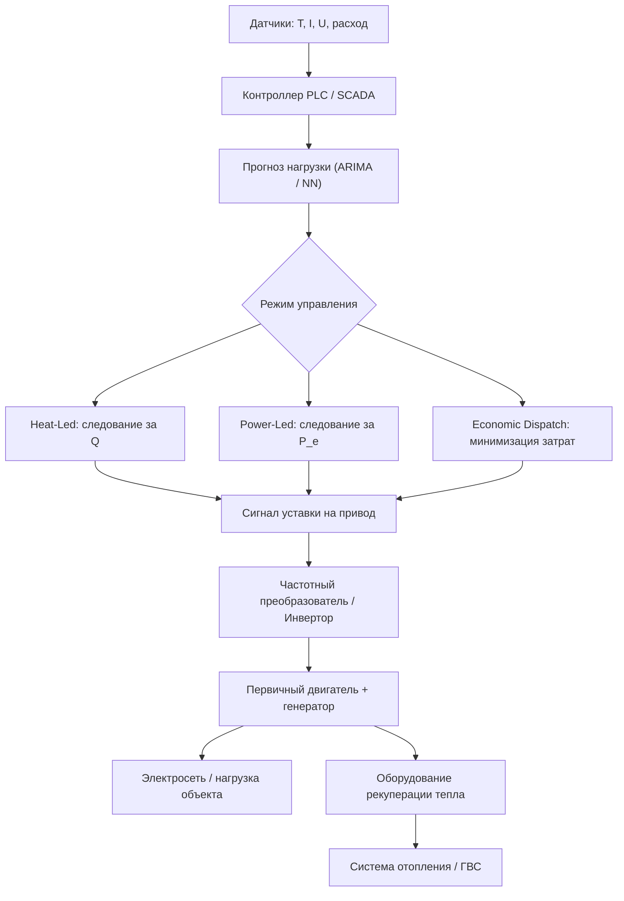

Интеграция систем управления когенерационных установок (CHP — Combined Heat and Power) решает ключевую задачу современной распределённой генерации: координацию электрической и тепловой нагрузок, синхронизацию с внешней электросетью, обеспечение качества электроэнергии и экономическую оптимизацию режимов работы в реальном времени. Согласно ASHRAE 90.1 и IEEE 1547, системы управления CHP обязаны обеспечивать координацию с системой энергоменеджмента здания (BMS — Building Management System), автоматическое переключение на резервный режим и соблюдение нормируемых параметров электроэнергии.

## Физические принципы управления

Оптимальная работа когенерационной установки требует непрерывного мониторинга и балансирования трёх ключевых параметров.

### Электрическая мощность


P_e = U \cdot I \cdot \cos\varphi


где $U$ — напряжение (В), $I$ — ток (А), $\cos\varphi$ — коэффициент мощности (power factor).

### Тепловая мощность


Q = \dot{m} \cdot c_p \cdot \Delta T


где $\dot{m}$ — массовый расход теплоносителя (кг/с), $c_p$ — удельная теплоёмкость (кДж/(кг·К)), $\Delta T$ — перепад температур теплоносителя (К).

### Общий КПД установки


\eta_{\text{total}} = \frac{P_e + Q}{Q_{\text{топл}}}


Система управления оптимизирует работу установки, максимизируя $\eta_{\text{total}}$ при соблюдении ограничений по температурным режимам теплопотребителей: 60–80 °C для отопления, 40–50 °C для ГВС (по СП 60.13330).

## Компоненты системы управления

### Прогнозирование и слежение за тепловой нагрузкой

Датчики температуры прямой и обратной линий контура отопления / ГВС устанавливаются с разрешением не хуже 0,5 °C (ISO 4125). Система измеряет:
- температуру на выходе из теплообменника (heat exchanger outlet);
- температуру в обратной линии для расчёта $\Delta T$;
- расход теплоносителя с погрешностью ±2 % (электромагнитный или ультразвуковой расходомер).

Интервал дискретизации — 5–30 с для быстрого отклика на изменения нагрузки.

### Слежение за электрической нагрузкой

Многофункциональные счётчики (power quality monitors) фиксируют:
- активную мощность $P_e$ (Вт);
- реактивную мощность $Q_r$ (ВАр);
- коэффициент мощности $\cos\varphi$;
- гармонические составляющие до 50-й (по EN 61000-4-7);
- несимметрию напряжения между фазами — допуск ≤ 3 % по ГОСТ 32144-2014.


| Параметр | Норматив | Метод коррекции |
|---|---|---|
| Напряжение сети | ±10 % от номинала | Регулятор AVR |
| Частота (нормальный режим) | ±0,2 Гц | Регулятор частоты вращения |
| THD напряжения | ≤ 5 % | LC-фильтры, активные фильтры |
| Дисбаланс напряжения | ≤ 3 % | Управление фазировкой нагрузок |
| Коэффициент мощности | ≥ 0,95 | Конденсаторные батареи или APF |


### Синхронизация с сетью (grid synchronization)

При параллельном включении (grid-parallel mode) обязательно обеспечить:
- совпадение фазы, частоты и напряжения генератора CHP с параметрами сети;
- плавное включение с ограничением броска тока не более 5 номинальных значений;
- допуск по частоте ±0,5 Гц и по напряжению ±5 В перед замыканием выключателя.

Современные контроллеры применяют векторное управление в системе координат dq (dq-frame vector control) с временем отклика 10–50 мс.

### Автоматический переключатель ATS

При срабатывании защиты по перенапряжению, перетоку в сеть (reverse power) или потере синхронизма система отключает генератор от сети за 10–100 мс (IEEE 1547, EN 50160). Автоматический переключатель (ATS — Automatic Transfer Switch) переводит критичные нагрузки на резервный источник за время ≤ 200 мс.

### Соединительные панели (параллельные выключатели)

Статические (тиристорные) или механические переключатели обеспечивают:
- параллельное включение нескольких генераторов;
- пропорциональное распределение нагрузок между установками;
- синхронизацию с допуском ±30 В по напряжению и ±0,5 Гц по частоте.

Схема должна соответствовать EN 60947-6 (низковольтная коммутационная аппаратура).

## Стратегии управления нагрузкой

### Режим следования за тепловой нагрузкой (Heat-Led Mode)

Генератор работает для удовлетворения теплового спроса; выработанная электроэнергия потребляется локально или отдаётся в сеть. Режим эффективен при высоком годовом спросе на отопление и ГВС — климатические зоны I–III по СП 131.13330.

### Режим следования за электрической нагрузкой (Power-Led Mode)

Приоритет — снижение пиковых платежей за электроэнергию или повышение надёжности снабжения. Избыточное тепло аккумулируется в баках-аккумуляторах (5–50 м³, температура 60–80 °C).

### Режим экономической оптимизации (Economic Dispatch)

Система анализирует тарифы на электроэнергию и газ и решает задачу линейного программирования:


\min \bigl(C_{\text{газ}} \cdot Q_{\text{топл}} + C_{\text{сеть}} \cdot P_{\text{сеть}}\bigr)


где $C_{\text{газ}}$ — стоимость газа (руб./(кВт·ч)), $C_{\text{сеть}}$ — тариф на электроэнергию (руб./(кВт·ч)), $P_{\text{сеть}}$ — мощность, поступающая из сети (Вт).

## Расчёт оптимальной электрической мощности

При известной суммарной тепловой нагрузке $Q_{\text{total}}$ и тепловом КПД блока $\eta_Q$ (0,55–0,65 для ДВС):


P_{e,\text{opt}} = Q_{\text{total}} \cdot \frac{\eta_e}{\eta_Q}


где $\eta_e = 0{,}35$–$0{,}42$ — электрический КПД генератора.

**Пример.** Жилой дом: $Q_{\text{total}} = 300$ кВт, $\eta_Q = 0{,}60$, $\eta_e = 0{,}38$.

$$P_{e,\text{opt}} = 300 \times \frac{0{,}38}{0{,}60} = 190 \text{ кВт}$$

Оптимальная электрическая мощность установки — 190 кВт при условии обеспечения всего теплового спроса от CHP.

## Предиктивное управление

Контроллер на базе моделей ARIMA или нейронных сетей прогнозирует нагрузку на горизонте 24 ч с шагом 15 мин. Входные данные:
- температура наружного воздуха (погодные сервисы, точность ±1 °C);
- день недели и праздники;
- время суток;
- исторические данные потребления за 7–30 дней.

Выходной сигнал — рекомендуемая мощность $P_{e,\text{rec}}(t)$, которая передаётся на инвертор или частотный преобразователь двигателя.

## Применение в системах ОВК

### Многоквартирные жилые здания

Установка мощностью 50–150 кВт электрических обеспечивает отопление, ГВС и электроснабжение. Требования к системе управления:
- прогноз суточного графика спроса по профилям проживающих;
- поддержание температуры в контуре отопления 60–70 °C (ΔT = 10–15 К);
- включение резервного котла при $T_{\text{нар}} < -15$ °C (для зоны I).

Типовая экономия электроэнергии: 20–25 % по сравнению с раздельной генерацией.

### Офисные и коммерческие здания

Установки мощностью 100–300 кВт работают в режиме Power-Led, снижая пиковые платежи. Минимальная пиковая мощность — не более 80 % контрактной мощности.

### Районные мини-ТЭЦ

Когенерационные установки 500–2000 кВт в составе мини-ТЭЦ координируют работу нескольких генераторов, аккумулятора тепла (30–100 м³) и тепловых сетей. Температура подачи — 80–90 °C для минимизации потерь (СП 124.13330).

## Диаграмма архитектуры управления





## Нормативная база


| Стандарт | Область применения |
|---|---|
| ASHRAE 90.1-2022 | Энергосбережение в зданиях; требования к CHP и управлению нагрузками |
| IEEE 1547:2018 | Параллельное подключение распределённых источников к электросети |
| EN 50160:2010 | Характеристики напряжения в публичных электросетях |
| EN 61000-4-7 | Измерение гармоник и интергармоник |
| ГОСТ 32144-2014 | Электромагнитная совместимость; нормы качества электроэнергии |
| СП 124.13330.2016 | Тепловые сети; параметры теплоносителя |
| СП 60.13330.2020 | Отопление, вентиляция и кондиционирование воздуха |


## Практические рекомендации


| Параметр | Рекомендуемое значение | Примечание |
|---|---|---|
| Интервал дискретизации датчиков | 10–30 с | Для стабильного управления |
| Диапазон регулирования мощности | 30–100 % | Ниже 30 % — неэффективно |
| Гистерезис вкл./откл. | 3–5 кВт | Предотвращение тактования |
| Допуск синхронизации (частота) | ±0,5 Гц | IEEE 1547 |
| Допуск синхронизации (напряжение) | ±10 % | EN 50160 |
| Время переключения на резервное питание | ≤ 200 мс | Критичные нагрузки |


Система управления должна быть отказоустойчивой (fault-tolerant): при выходе из строя основного контроллера автоматический переход в режим «по расписанию» с фиксированной мощностью — не более 5 мин. Обязательно ведение журнала событий (логирование включений, ошибок синхронизации, аварийных отключений) для ретроспективного анализа эффективности.
