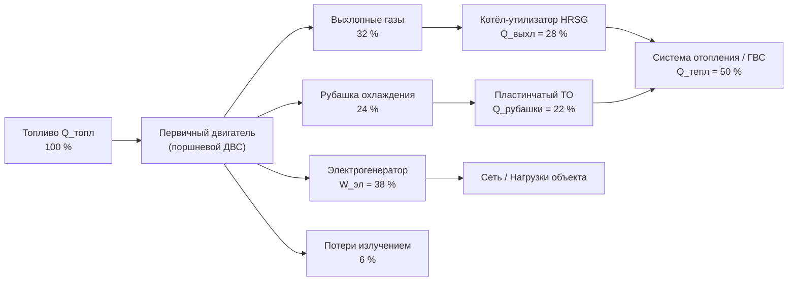

Когенерация принципиально меняет термодинамическое обоснование распределённой генерации: вместо сброса отходящего тепла в атмосферу оно направляется на нужды отопления, горячего водоснабжения (ГВС) или технологических процессов. Понимание термодинамических принципов, управляющих работой ТЭЦ, обеспечивает точное прогнозирование характеристик, обоснованный выбор технологии и реалистичную экономическую оценку.

## Энергетический баланс и КПД первого закона

Первый закон термодинамики требует сохранения энергии в системе CHP. Химическая энергия топлива преобразуется в электрическую работу, полезное тепло и неизбежные потери:


Q_{\text{топл}} = W_{\text{эл}} + Q_{\text{тепл}} + Q_{\text{пот}}


где $Q_{\text{топл}}$ — энергия топлива по низшей теплоте сгорания (Вт), $W_{\text{эл}}$ — чистая электрическая мощность (выход генератора за вычетом собственных нужд), $Q_{\text{тепл}}$ — утилизированная тепловая мощность, подводимая к объекту, $Q_{\text{пот}}$ — неизбежные потери через излучение, конвекцию и уходящие газы.

КПД первого закона:


\eta_I = \frac{W_{\text{эл}} + Q_{\text{тепл}}}{Q_{\text{топл}}} = \eta_{\text{эл}} + \eta_{\text{тепл}}


Электрическая эффективность $\eta_{\text{эл}} = W_{\text{эл}}/Q_{\text{топл}}$ составляет 25–45 % в зависимости от технологии; тепловая — $\eta_{\text{тепл}} = Q_{\text{тепл}}/Q_{\text{топл}}$ — 30–60 %. Типичные значения $\eta_I$ для систем CHP — 70–85 %, тогда как обычные электростанции преобразуют в электричество лишь 33–40 % энергии топлива.

Важное замечание: в расчёт $Q_{\text{тепл}}$ включается только тепло, реально потреблённое объектом. Тепловая энергия, выработанная сверх спроса и не утилизированная, не вносит вклада в КПД и снижает экономическую эффективность установки.

## Эксергетический анализ и КПД второго закона

КПД первого закона рассматривает все формы энергии одинаково, не принимая во внимание, что электроэнергия термодинамически ценнее низкотемпературного тепла. Эксергетический анализ (exergy analysis) устраняет это ограничение, определяя максимальную теоретическую работу, извлекаемую из каждого энергетического потока.

Эксергия тепловой энергии зависит от температуры подачи:


Ex_{\text{тепл}} = Q_{\text{тепл}} \cdot \left(1 - \frac{T_0}{T_h}\right)


где $T_0$ — температура окружающей среды (К), $T_h$ — абсолютная температура подачи тепла (К).

КПД второго закона:


\eta_{II} = \frac{W_{\text{эл}} + Q_{\text{тепл}}\!\left(1 - \dfrac{T_0}{T_h}\right)}{Q_{\text{топл}}\!\left(1 - \dfrac{T_0}{T_{\text{пл}}}\right)}


где $T_{\text{пл}} \approx 2200$ К — адиабатическая температура пламени для природного газа.

**Пример.** Горячая вода 93 °C (366 К) при $T_0 = 278$ К ($5$ °C): эксергетный коэффициент тепла $(1 - 278/366) = 0{,}24$. Пар 204 °C (477 К): коэффициент $(1 - 278/477) = 0{,}42$ — в 1,75 раза выше, что подтверждает бо́льшую термодинамическую ценность высокотемпературного тепла.

Типичный $\eta_{II}$ для систем CHP — 35–50 %, что значительно ниже $\eta_I$, однако объективнее отражает качество преобразования энергии.

## Коэффициент мощность-тепло (Power-to-Heat Ratio, PHR)


\text{PHR} = \frac{W_{\text{эл}}}{Q_{\text{тепл}}} = \frac{\eta_{\text{эл}}}{\eta_{\text{тепл}}}


PHR — фундаментальная характеристика технологии первичного двигателя, определяющая пригодность системы для конкретного объекта.


| Первичный двигатель | КПД электр., % | КПД тепл., % | PHR |
|---|---|---|---|
| Поршневой ДВС (газ) | 32–42 | 40–50 | 0,7–1,0 |
| Газовая турбина простого цикла | 25–35 | 45–55 | 0,5–0,8 |
| Газовая турбина передовая | 35–42 | 40–50 | 0,8–1,2 |
| Микротурбина | 26–33 | 45–55 | 0,5–0,7 |
| Паровая турбина противодавления | 15–25 | 60–70 | 0,2–0,4 |
| Топливный элемент PAFC | 40–42 | 40–50 | 0,9–1,1 |
| Топливный элемент SOFC | 50–60 | 25–35 | 1,5–2,2 |


Согласование PHR системы CHP с соотношением электрической и тепловой нагрузки объекта максимизирует использование выработанной энергии. Больница с нагрузкой 2000 кВт электр. и 2930 кВт тепловых (PHR = 0,68) хорошо соответствует поршневому ДВС или простой газовой турбине. Центр обработки данных с минимальными тепловыми нагрузками (PHR > 5) требует абсорбционного охлаждения для формирования теплового потребителя.

## Эффективность использования топлива (Fuel Utilization Efficiency, FUE)

FUE сравнивает расход топлива системы CHP с эталонной схемой раздельного производства:


\text{FUE} = \frac{W_{\text{эл}} + Q_{\text{тепл}}}{W_{\text{эл}}/\eta_{\text{сеть}} + Q_{\text{тепл}}/\eta_{\text{котёл}}}


где $\eta_{\text{сеть}} \approx 0{,}35$–$0{,}40$ — КПД сетевой генерации (маргинальный), $\eta_{\text{котёл}} \approx 0{,}80$–$0{,}90$ — КПД котла.

**Пример.** Система CHP с $\eta_I = 0{,}77$, $\eta_{\text{сеть}} = 0{,}35$, $\eta_{\text{котёл}} = 0{,}85$, равные электрический и тепловой выходы ($W_{\text{эл}} = Q_{\text{тепл}}$):

$$\text{FUE} = \frac{1 + 1}{1/0{,}35 + 1/0{,}85} = \frac{2}{2{,}857 + 1{,}176} = 0{,}496$$

CHP требует лишь 49,6 % первичной энергии раздельного производства — **экономия топлива 50,4 %**.

## Методики определения размеров установок

### Стратегия 1: Следование за тепловой нагрузкой (Heat-Led)

Тепловой выход CHP согласуется с базовой тепловой нагрузкой объекта; установка работает непрерывно, покрывая минимальный тепловой спрос, а пиковое тепло обеспечивается котлом. Электрический выход определяется PHR выбранной технологии.

Базовая тепловая мощность из кривой продолжительности нагрузок:


Q_{\text{CHP}} = Q_{\text{тепл,min}} \cdot f_{\text{раб}}


где $Q_{\text{тепл,min}}$ — минимальная тепловая нагрузка, $f_{\text{раб}} \approx 0{,}90$–$0{,}95$ — целевая доля работы (с учётом периодов обслуживания).

### Стратегия 2: Следование за электрической нагрузкой (Power-Led)

Электрический выход согласуется с нагрузкой объекта; тепловое восстановление — ценный побочный продукт. Подход оправдан при высоких тарифах на электроэнергию или жёстких требованиях надёжности. Возможен избыток тепла при ограниченном тепловом спросе.

### Стратегия 3: Гибридная оптимизация (Hybrid Optimization)

Одновременная оптимизация электрической и тепловой экономики по критерию максимума ЧПС (NPV):


\text{ЧПС} = \sum_{t=1}^{n} \frac{E_{\text{эл}}(P) \cdot c_{\text{эл}} + Q_{\text{тепл}}(P) \cdot c_{\text{тепл}} - C_{\text{топл}}(P) - C_{\text{ТО}}(P)}{(1+r)^t} - C_{\text{кап}}(P)


где мощность системы $P$ влияет на все операционные параметры. Численная оптимизация определяет мощность, максимизирующую ЧПС за весь срок проекта.

### Коэффициент использования мощности (Capacity Factor, CF)


CF = \frac{\text{Годовая выработка, кВт·ч}}{P_{\text{ном}} \times 8760 \text{ ч/год}}


Системы CHP с $CF > 0{,}70$ в целом достигают привлекательной экономики. Низкие значения CF указывают на завышение мощности относительно базовых нагрузок.

## Режимы работы

**Базовая работа (base load operation):** постоянная мощность 24/7, удовлетворяющая минимальные нагрузки; дополнительное оборудование покрывает пиковые периоды. Режим максимизирует использование CHP и упрощает управление.

**Следование за нагрузкой (load following):** мощность CHP модулируется для отслеживания переменных нагрузок; требует диапазона регулирования от 30 до 100 % (ниже 30 % — экономически неэффективно).

**Параллельная работа с сетью (grid-parallel):** электрическое подключение к энергоснабжающей организации позволяет импортировать дефицит и экспортировать излишки. Максимальная надёжность; при параллельной работе необходимо соблюдение IEEE 1547 и ГОСТ 32144.

**Автономный режим (island mode):** объект электрически изолирован; CHP должна точно соответствовать нагрузке через быстродействующее управление. Обеспечивает энергетическую безопасность при сбоях сети.

**Режим только электроэнергии (power-only):** всё тепло сбрасывается; экономически оправдан только при высоком спреде искры (цена электроэнергии минус стоимость газа на эквивалентной энергетической основе).

## Ключевые метрики производительности

### Расход тепла (Heat Rate, HR)


HR = \frac{Q_{\text{топл}}}{W_{\text{эл}}} \quad \text{[кДж/(кВт·ч)]}


Расход тепла — обратная величина электрической эффективности: $\eta_{\text{эл}} = 3600/HR$. Установки комбинированного цикла достигают $HR \approx 6200$ кДж/(кВт·ч) ($\eta_{\text{эл}} = 58\%$); небольшие поршневые ДВС — 8500–10 000 кДж/(кВт·ч).

### Эффективная электрическая эффективность


\eta_{\text{эл,эфф}} = \frac{W_{\text{эл}} + Q_{\text{тепл}}/\eta_{\text{котёл,реф}}}{Q_{\text{топл}}}


**Пример.** ДВС: $\eta_{\text{эл}} = 0{,}38$, $\eta_{\text{тепл}} = 0{,}45$, $\eta_{\text{котёл,реф}} = 0{,}85$:

$$\eta_{\text{эл,эфф}} = 0{,}38 + \frac{0{,}45}{0{,}85} = 0{,}38 + 0{,}53 = 0{,}91$$

Установка CHP преобразует 91 % энергии топлива в эквивалент электроэнергии — в 2,5 раза выше, чем традиционная электростанция.

### Коэффициент использования тепла (Heat Utilization Factor, UF)


UF = \frac{Q_{\text{исп}}}{Q_{\text{восст}}}


где $Q_{\text{исп}}$ — реально потреблённое тепло, $Q_{\text{восст}}$ — восстановленная тепловая мощность. Высокие значения ($UF > 0{,}85$) свидетельствуют о хорошей тепловой интеграции.

Комбинированная метрика истинной системной эффективности:


\eta_{\text{сист}} = \eta_I \times UF


Установка с $\eta_I = 0{,}78$ и $UF = 0{,}60$ даёт $\eta_{\text{сист}} = 0{,}47$ — не лучше раздельного производства. Тепловая интеграция критична для реализации преимуществ когенерации.

## Диаграмма энергетического баланса





Суммарный КПД: $\eta_I = 38 + 50 = 88\%$ при условии полной утилизации тепла.

## Нормативная база

- **ASHRAE 90.1-2022** — Energy Standard for Buildings; требования к КПД систем CHP
- **ASHRAE Handbook — HVAC Systems and Equipment** — глава о когенерации и первичных двигателях
- **EN 15316-4-4:2017** — методология расчёта систем CHP в зданиях
- **IEEE 1547:2018** — параллельное подключение распределённых источников энергии
- **СП 60.13330.2020** — отопление, вентиляция и кондиционирование воздуха
- **СП 124.13330.2016** — тепловые сети; параметры теплоносителя и схемы подключения
- **ГОСТ 32144-2014** — нормы качества электрической энергии
