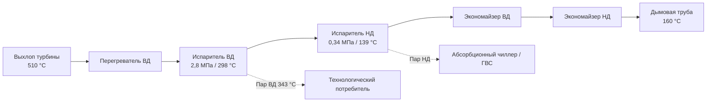

Оборудование рекуперации тепла улавливает тепловую энергию из потоков отходящего тепла первичных двигателей и подаёт её при полезных температурах и давлениях для отопления, охлаждения и технологических нужд. Качество тепловой интеграции принципиально определяет суммарный КПД системы CHP: хорошо спроектированные установки восстанавливают 50–70 % энергии топлива. Выбор и расчёт оборудования требует детального анализа тепловых потоков, уровней температур, нагрузок объекта и экономических компромиссов между глубиной рекуперации и капитальными затратами.

## Рекуперация тепла выхлопных газов

### Доступная тепловая мощность

Выхлопные газы содержат наибольший единичный тепловой поток — обычно 30–50 % от энергии топлива при температурах 177–538 °C в зависимости от типа первичного двигателя.


Q_{\text{дост}} = \dot{m}_{\text{выхл}} \cdot c_p \cdot (T_{\text{выхл,вх}} - T_{\text{тр,min}})


где $\dot{m}_{\text{выхл}}$ — массовый расход выхлопных газов (кг/с), $c_p \approx 1{,}09$ кДж/(кг·К), $T_{\text{тр,min}}$ — минимально допустимая температура уходящих газов (°C).

Температура уходящих газов (stack temperature) ограничена снизу точкой кислотной росы (acid dew point) — температурой конденсации серной кислоты H₂SO₄ на поверхностях теплообменника. Для природного газа с содержанием серы до 1 ppm: $T_{\text{тр,min}} = 121$–$149$ °C. Топлива с высоким содержанием серы (дизель, мазут) требуют $T_{\text{тр,min}} = 160$–$177$ °C.

**Оценка точки кислотной росы:**


T_{\text{КР}} = \frac{1000}{2{,}276 - 0{,}0294\lg(p_{\text{SO}_3}) - 0{,}0858\lg(p_{\text{H}_2\text{O}})} \quad \text{[К]}


### Эффективность теплообменника


\varepsilon_{\text{ТО}} = \frac{Q_{\text{восст}}}{Q_{\text{дост}}} = \frac{T_{\text{выхл,вх}} - T_{\text{выхл,вых}}}{T_{\text{выхл,вх}} - T_{\text{тр,min}}}


Хорошо спроектированные системы рекуперации достигают $\varepsilon = 0{,}75$–$0{,}90$.

## Паровые котлы-утилизаторы (HRSG — Heat Recovery Steam Generator)

HRSG извлекают тепловую энергию из выхлопа газовой турбины или поршневого двигателя для генерации пара при давлениях от 103 кПа до 4100 кПа. Устройство включает три последовательных секции: экономайзер, испаритель, пароперегреватель.

### Производительность по пару


\dot{m}_{\text{пар}} = \frac{\dot{m}_{\text{выхл}} \cdot c_p \cdot (T_{\text{выхл,вх}} - T_{\text{выхл,вых}})}{h_{\text{пар}} - h_{\text{пв}}}


**Пример.** Газовая турбина: $\dot{m}_{\text{выхл}} = 22\,680$ кг/ч при 510 °C. Производство пара при 1034 кПа (175 °C, $h = 2791$ кДж/кг) из питательной воды при 104 °C ($h = 438$ кДж/кг). Охлаждение выхлопа до 177 °C:

$$\dot{m}_{\text{пар}} = \frac{22\,680 \times 1{,}09 \times (510 - 177)}{2791 - 438} = \frac{8\,230\,000}{2353} \approx 3498 \text{ кг/ч}$$

Это соответствует тепловой мощности около 2,3 МВт.

### Точка защипа (Pinch Point)

Точка защипа (pinch point) — минимальная разность температур между потоком выхлопных газов и температурой насыщения пара в точке начала кипения. Значения 11–22 °C уравновешивают требования к площади теплопередачи и достижимую глубину рекуперации.


| Точка защипа, °C | Относительное производство пара | Глубина рекуперации, % | Относительная площадь ТО |
|---|---|---|---|
| 28 | 1,00 | 79,6 | 1,00 |
| 22 | 1,06 | 82,0 | 1,18 |
| 17 | 1,13 | 83,9 | 1,42 |
| 11 | 1,22 | 85,8 | 1,78 |
| 6 | 1,34 | 87,2 | 2,35 |


Экономический оптимум обычно приходится на точку защипа 14–19 °C.

### Многодавленческие HRSG

Двух- и трёхдавленческие HRSG включают несколько уровней давления для улучшения рекуперации по всему диапазону температур выхлопа. Секция высокого давления работает вблизи выхода турбины; секции промежуточного и низкого давления — на охлаждённом газе. Это повышает общую рекуперацию на 8–15 % по сравнению с однодавленческой конструкцией.





### Дополнительное сжигание топлива (Supplementary Firing)

Богатый кислородом выхлоп газовых турбин (15–18 % O₂) поддерживает дополнительное сжигание без внешнего воздуха. Расход дополнительного топлива для повышения температуры от $T_{\text{выхл}}$ до $T_{\text{цел}}$:


\dot{m}_{\text{топл,доп}} = \frac{\dot{m}_{\text{выхл}} \cdot c_p \cdot (T_{\text{цел}} - T_{\text{выхл}})}{\eta_{\text{гор}} \cdot Q_{\text{нр}}}


где $\eta_{\text{гор}} \approx 0{,}98$–$0{,}99$ — КПД горелки, $Q_{\text{нр}}$ — низшая теплота сгорания (46,4 МДж/кг для природного газа). Дополнительное сжигание увеличивает тепловую выработку, но снижает суммарный электрический КПД системы.

## Экономайзеры и рекуперация тепла горячей воды

Экономайзеры охлаждают выхлопные газы для нагрева воды или гликолевых растворов для отопления, ГВС или низкотемпературных технологических процессов.

Расчёт по логарифмической средней разности температур:


Q = U \cdot A \cdot \Delta T_{\text{лм}}



\Delta T_{\text{лм}} = \frac{(T_{г,вх} - T_{х,вых}) - (T_{г,вых} - T_{х,вх})}{\ln\!\dfrac{T_{г,вх} - T_{х,вых}}{T_{г,вых} - T_{х,вх}}}


**Пример.** Противоточная конфигурация: горячий выхлоп вход 427 °C / выход 177 °C, нагрев воды с 60 °C до 93 °C:

$$\Delta T_{\text{лм}} = \frac{(427 - 93) - (177 - 60)}{\ln(334/117)} = \frac{334 - 117}{\ln(2{,}85)} = \frac{217}{1{,}047} \approx 207 \text{ °C}$$

Коэффициенты теплопередачи для теплообменников выхлоп–вода: 45–85 Вт/(м²·К).

## Рекуперация тепла рубашки охлаждения ДВС

Теплообменники рубашки охлаждения (jacket water heat recovery) передают тепло от контура охлаждения двигателя (82–99 °C) через пластинчатые теплообменники (PHE — Plate Heat Exchanger) в систему ГВС или отопления. Этот источник обеспечивает 20–30 % от энергии топлива.


Q_{\text{рубашки}} = \dot{m}_{\text{охл}} \cdot c_p \cdot (T_{\text{вых}} - T_{\text{вх}})


Типичные параметры: расход охлаждающей жидкости 13–25 л/с, перепад температур по двигателю 8–11 °C, что даёт 1,8–4,1 МВт тепловой мощности для установки 1 МВт.

## Интеграция абсорбционных чиллеров

Абсорбционные чиллеры (absorption chillers) преобразуют утилизированное тепло в холодопроизводительность, расширяя применение CHP на объекты с потребностью в охлаждении. Это позволяет создавать системы тригенерации (CCHP — Combined Cooling, Heating and Power).


\text{COP}_{\text{абс}} = \frac{Q_{\text{охл}}}{Q_{\text{тепло,вх}}}



| Тип | Источник тепла | COP | Холодопроизводительность |
|---|---|---|---|
| Одноступенчатый (вода–LiBr) | Горячая вода 83–121 °C | 0,65–0,75 | 50 кВт – 5 МВт |
| Двухступенчатый (вода–LiBr) | Вода 149–182 °C или пар 0,7–1,0 МПа | 1,1–1,4 | 100 кВт – 15 МВт |
| Трёхступенчатый | Вода > 204 °C | 1,6–1,8 | 1–10 МВт |


**Пример.** Поршневой ДВС 1 МВт, тепловая выработка $Q_{\text{тепл}} = 2{,}93$ МВт, двухступенчатый чиллер COP = 1,2:

$$Q_{\text{охл}} = Q_{\text{тепл}} \times \text{COP} = 2{,}93 \times 1{,}2 = 3{,}52 \text{ МВт холода}$$

В летний период установка производит 1 МВт электроэнергии, обеспечивает 3,52 МВт охлаждения здания и выводит остаток тепла в тепловой аккумулятор — суммарный КПД использования топлива достигает 85 %.

## Тепловые аккумуляторы

Тепловые аккумуляторы (thermal storage) буферируют несоответствие между тепловой выработкой CHP и нагрузкой объекта, повышая коэффициент использования установки.

### Ёмкость бака горячей воды


Q_{\text{акк}} = \rho \cdot V \cdot c_p \cdot \Delta T


**Пример.** Бак 37,9 м³ (10 000 гал.), температурный перепад 22 °C (от 82 °C до 60 °C):

$$Q_{\text{акк}} = 1000 \times 37{,}9 \times 4{,}18 \times 22 = 3{,}49 \text{ ГДж}$$

Для системы CHP 1 МВт с тепловым восстановлением 2,93 МВт этот объём обеспечивает автономность около 1,3 ч.

### Типы тепловых аккумуляторов

- **Бак горячей воды (sensible heat):** прост в монтаже, эффективен для отопительных систем 60–90 °C
- **Аккумулятор насыщенной воды (steam accumulator):** высокая плотность хранения за счёт скрытой теплоты; позволяет покрывать кратковременные паровые пики
- **Ледяной аккумулятор (ice storage):** для охлаждения; теплота плавления 335 кДж/кг обеспечивает компактность; лёд производится ночью при низком электрическом тарифе

## Управление системой рекуперации тепла

Байпасные клапаны (bypass dampers) направляют долю выхлопа в дымовую трубу, когда тепловой спрос ниже выработки — предотвращает перегрев теплообменников. Система управления давлением в паровых системах обеспечивает работу HRSG при допустимых параметрах при переходных процессах. Мониторинг температуры уходящих газов предотвращает опускание ниже точки кислотной росы: при снижении $T_{\text{тр}}$ ниже безопасного минимума открывается байпас.

## Оптимизация глубины рекуперации

Оптимальная глубина рекуперации уравновешивает капитальные затраты на теплообменники и годовую экономию:


\frac{\Delta C_{\text{кап}}}{\Delta Q_{\text{восст}}} \leq \frac{1}{c_{\text{энерг}} \cdot n \cdot \text{DF}}


где $c_{\text{энерг}}$ — стоимость вытесненного топлива (с поправкой на КПД котла), $n$ — срок проекта (лет), DF — дисконтирующий множитель.

При цене газа 420 руб./ГДж, КПД котла 0,85 и сроке 20 лет с $r = 12\%$ предельная рентабельность дополнительной рекуперации составляет приблизительно 40 000 руб./(МВт·ч дополнительной мощности в год).

Глубина рекуперации более 85 % обычно требует непропорциональных капитальных затрат. Большинство экономически оптимальных решений ориентируются на $\varepsilon = 0{,}70$–$0{,}85$.

ASHRAE Standard 90.1 устанавливает минимальные требования эффективности системы CHP: суммарный КПД (электрический + тепловой) не менее 60 % для систем до 10 МВт и 70 % для более крупных.

## Нормативная база

- **ASHRAE 90.1-2022** — минимальные требования к системам CHP и рекуперации тепла
- **ASHRAE Handbook — HVAC Systems and Equipment** — проектирование HRSG и теплообменников
- **EN 15316-4-4:2017** — методология расчёта оборудования рекуперации тепла CHP
- **ASME PTC 4.4** — стандарт испытаний производительности котлов-утилизаторов
- **EN 303:2017** — котлы-утилизаторы; конструктивные требования
- **СП 60.13330.2020** — отопление, вентиляция и кондиционирование
- **СП 124.13330.2016** — тепловые сети; температурные графики
