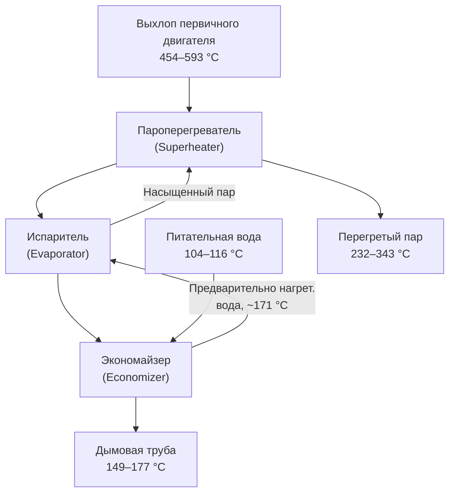

Системы утилизации теплоты выхлопных газов извлекают тепловую энергию из продуктов сгорания первичного двигателя — наибольший единичный поток утилизируемого тепла в установках CHP. Температуры выхлопа газовых турбин составляют 454–593 °C в зависимости от конструкции и нагрузки; поршневых двигателей — 371–482 °C. Эти высокотемпературные потоки позволяют генерировать пар в диапазоне давлений от насыщенного низкого давления (250 кПа, $T_{\text{нас}} = 127$ °C) до перегретого пара высокого давления (4100 кПа, $T_{\text{нас}} = 252$ °C). Термодинамический потенциал рекуперации ограничен снизу точкой кислотной росы — фундаментальным конструктивным ограничением всех систем утилизации тепла выхлопных газов.

## Термодинамическая основа рекуперации тепла

### Доступная тепловая мощность

Из первого закона термодинамики, применённого к охлаждающемуся газовому потоку:


Q_{\text{дост}} = \dot{m}_{\text{выхл}} \cdot c_p \cdot (T_{\text{выхл,вх}} - T_{\text{тр,min}})


где $\dot{m}_{\text{выхл}}$ — массовый расход выхлопных газов (кг/с), $c_p \approx 1{,}09$ кДж/(кг·°C) при 200–540 °C, $T_{\text{тр,min}}$ — минимально допустимая температура уходящих газов (°C).

### Точка кислотной росы (Acid Dew Point)

Сера в топливе окисляется при горении в SO₂, затем частично — в SO₃. При контакте с водяным паром образуется серная кислота, конденсирующаяся на поверхностях теплообменника ниже точки кислотной росы:


\text{SO}_3 + \text{H}_2\text{O} \rightarrow \text{H}_2\text{SO}_4


Температура точки кислотной росы:


T_{\text{КР}} = \frac{1000}{2{,}276 - 0{,}0294\lg(p_{\text{SO}_3}) - 0{,}0858\lg(p_{\text{H}_2\text{O}})} \quad \text{[К]}


Для природного газа с содержанием серы 0,1–0,6 ppm(об.): $T_{\text{КР}} = 121$–$143$ °C. Консервативное проектирование поддерживает $T_{\text{тр}} > 149$ °C для природного газа; для дизельного топлива и мазута — 160–177 °C. Нержавеющая сталь 316L допускает снижение до 121–149 °C при работе на природном газе с содержанием серы менее 1 ppm.

### Фактическая рекуперированная мощность


Q_{\text{восст}} = \varepsilon \cdot Q_{\text{дост}} = \varepsilon \cdot \dot{m}_{\text{выхл}} \cdot c_p \cdot (T_{\text{выхл,вх}} - T_{\text{тр,min}})


Типичный диапазон $\varepsilon = 0{,}70$–$0{,}90$ для хорошо спроектированных котлов-утилизаторов.

## Конфигурация котла-утилизатора HRSG

HRSG состоит из трёх последовательных секций теплопередачи, расположенных по принципу противотока: перегреватель (наиболее горячий), испаритель, экономайзер (наиболее холодный).





### Секция экономайзера

Экономайзер предварительно нагревает питательную воду от температуры деаэратора (104–116 °C) до приближения к температуре насыщения. Тепловая нагрузка:


Q_{\text{эк}} = \dot{m}_{\text{пв}} \cdot (h_{\text{пв,вых}} - h_{\text{пв,вх}})


Требуемая площадь теплообмена:


A_{\text{эк}} = \frac{Q_{\text{эк}}}{U_{\text{эк}} \cdot \Delta T_{\text{лм,эк}}}


**Пример.** Противоток: газ вход 271 °C / выход 166 °C; вода вход 110 °C / выход 177 °C (приближение 8 °C к $T_{\text{нас}} = 185$ °C):

$$\Delta T_{\text{лм,эк}} = \frac{(271 - 177) - (166 - 110)}{\ln(94/56)} = \frac{94 - 56}{\ln(1{,}679)} = \frac{38}{0{,}518} \approx 73 \text{ °C}$$

Коэффициенты теплопередачи для секции экономайзера: $U = 57$–$102$ Вт/(м²·°C).

### Секция испарителя

Испаритель генерирует насыщенный пар при постоянном давлении и температуре. Производительность по пару:


\dot{m}_{\text{пар}} = \frac{Q_{\text{исп}}}{h_g - h_f} = \frac{Q_{\text{исп}}}{h_{\text{fg}}}


Для пара при 1,0 МПа: $T_{\text{нас}} = 179$ °C, $h_f = 762$ кДж/кг, $h_g = 2778$ кДж/кг, $h_{\text{fg}} = 2016$ кДж/кг.

### Секция пароперегревателя

Пароперегреватель повышает температуру пара выше насыщения. Степень перегрева 28–111 °C увеличивает энергосодержание и позволяет использовать пар для высокотемпературных технологических процессов.


Q_{\text{пп}} = \dot{m}_{\text{пар}} \cdot (h_{\text{пар,пп}} - h_g)


## Анализ точки защипа (Pinch Point Analysis)

Точка защипа (pinch point, PP) — минимальная разность температур между профилем выхлопных газов и кривой нагрева пара на входе в испаритель:


T_{\text{газ,зщп}} = T_{\text{нас}} + \Delta T_{\text{зщп}}


Значения $\Delta T_{\text{зщп}} = 11$–$22$ °C уравновешивают требования к площади теплообмена и достижимую глубину рекуперации. Меньшая точка защипа увеличивает рекуперацию, но требует непропорционально большей площади ТО из-за поведения логарифмической средней разности температур.

**Пример.** HRSG производительностью пара при 1,0 МПа ($T_{\text{нас}} = 179$ °C), выхлоп 45 359 кг/ч при 510 °C, $\Delta T_{\text{зщп}} = 17$ °C. Питательная вода 110 °C. Целевая температура уходящих газов 166 °C.

Температура газа в точке защипа:
$$T_{\text{газ,зщп}} = 179 + 17 = 196 \text{ °C}$$

Нагрузка экономайзера (охлаждение газа от 196 °C до 166 °C):
$$Q_{\text{эк}} = 45\,359 \times 1{,}09 \times (196 - 166) / 3600 \approx 412 \text{ кВт}$$

Нагрузка испарителя (охлаждение газа от $T_{\text{газ,вх,исп}}$ до 196 °C) — подбирается итерационно из условия полного испарения питательной воды.

Общая тепловая эффективность HRSG:
$$\varepsilon = \frac{T_{\text{выхл,вх}} - T_{\text{тр}}}{T_{\text{выхл,вх}} - T_{\text{КР}}} = \frac{510 - 166}{510 - 149} = 0{,}954 / 1{,}00 \approx 0{,}824$$

## Многодавленческие HRSG

Двух- и трёхдавленческие HRSG охватывают более широкий диапазон температур выхлопа, повышая общую рекуперацию на 8–15 %:

- **Пар высокого давления:** 2,8 МПа ($T_{\text{нас}} = 231$ °C), перегрев до 343 °C — для промышленных потребителей
- **Пар низкого давления:** 0,34 МПа ($T_{\text{нас}} = 139$ °C) — для абсорбционных чиллеров или ГВС

## Дополнительное сжигание (Supplementary Firing)

Выхлоп газовых турбин содержит 15–18 % O₂, что поддерживает дополнительное сжигание без подачи воздуха. Форсунки (duct burners) устанавливаются перед пароперегревателем.

Расход дополнительного топлива для повышения температуры выхлопа с $T_{\text{выхл}}$ до $T_{\text{цел}}$:


\dot{m}_{\text{доп}} = \frac{\dot{m}_{\text{выхл}} \cdot c_p \cdot (T_{\text{цел}} - T_{\text{выхл}})}{\eta_{\text{гор}} \cdot Q_{\text{нр}}}


**Пример.** Повышение температуры с 510 °C до 816 °C при расходе выхлопа 45 359 кг/ч:

$$\dot{m}_{\text{доп}} = \frac{(45\,359/3600) \times 1{,}09 \times (816 - 510)}{0{,}98 \times 46\,400} = \frac{12{,}60 \times 306}{45\,472} \approx 0{,}085 \text{ кг/с природного газа}$$

Это соответствует ≈ 3,9 МВт дополнительного потребления топлива (по низшей теплоте сгорания).

## Конструктивные аспекты экономайзера

Оребрённые трубки (finned tubes) увеличивают площадь теплопередачи со стороны газа. Коэффициент теплопередачи:


\frac{1}{UA} = \frac{1}{h_g A_g} + \frac{\ln(r_o/r_i)}{2\pi k L} + \frac{1}{h_w A_w}


Сопротивление со стороны газа доминирует: $h_g = 45$–$85$ Вт/(м²·°C); $h_w = 2270$–$4550$ Вт/(м²·°C) для турбулентного потока воды. Это объясняет эффективность оребрения.

Плотность рёбер 1,2–2,0 шт./см уравновешивает интенсификацию теплопередачи и склонность к загрязнению (fouling). Факторы загрязнения 0,0002–0,0004 м²·°C/Вт закладываются в расчёт; очистка — пароструйная продувка.

## Мониторинг производительности

Измеренная утилизация тепла:


Q_{\text{изм}} = \dot{m}_{\text{пар}} \cdot (h_{\text{пар}} - h_{\text{пв}}) + \dot{m}_{\text{прод}} \cdot (h_{\text{прод}} - h_{\text{пв}})


Снижение КПД рекуперации более 5 % относительно проектного значения требует расследования: загрязнение, утечки труб, нарушение управления.

Периодические испытания по ASME PTC 4.4 (ежегодно или раз в два года) подтверждают соответствие гарантийным параметрам производителя.

## Нормативная база

- **ASHRAE 90.1-2022** — минимальные требования к КПД систем CHP
- **ASHRAE Handbook — HVAC Systems and Equipment** — расчёт HRSG и экономайзеров
- **ASME PTC 4.4** — Performance Test Code for Gas Turbine Heat Recovery Steam Generators
- **EN 12952** — котлы с водотрубными панелями; требования к конструкции
- **EN 303:2017** — котлы-утилизаторы; испытания и паспортизация
- **СП 60.13330.2020** — отопление, вентиляция и кондиционирование
- **СП 89.13330.2016** — котельные установки
