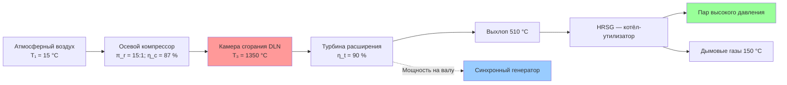

Газовые турбины преобразуют энергию топлива в механическую мощность на валу посредством непрерывных процессов сжатия, сгорания и расширения по циклу Брайтона. Эти машины доминируют в приложениях когенерации мощностью выше 5 МВт — промышленные газовые турбины достигают более 300 МВт в конфигурациях комбинированного цикла. Высокотемпературный и высокомассовый поток выхлопных газов делает газовые турбины особенно пригодными для выработки пара высокого давления и работы в комбинированном цикле с достижением общего КПД когенерации свыше 80 %. Согласно ASHRAE Handbook HVAC Systems and Equipment, газотурбинные системы ТЭЦ применяются на объектах с устойчивым спросом на тепловую и электрическую энергию.

## Классификация газовых турбин по мощности

Газовые турбины делятся на четыре категории мощности, каждая из которых оптимизирована под специфические приложения когенерации.

**Микротурбины (30–500 кВт)** используют одноступенчатые радиальные компрессоры и турбины с рекуператорами для предварительного нагрева воздуха горения отходящим теплом. Электрический КПД составляет 26–33 %; 90–95 % тепловой энергии выхлопа доступно для рекуперации. Воздушные подшипники (air bearings) исключают масляную смазку и снижают трудозатраты на техническое обслуживание. Высокоскоростная работа (50 000–120 000 об/мин) требует силовой электроники для преобразования высокочастотного выхода генератора в стандартную сетевую частоту.

**Промышленные турбины малой мощности (0,5–10 МВт)** используют многоступенчатые осевые компрессоры со степенью сжатия 10–18 и достигают КПД простого цикла 28–35 %. Модульные системы интегрируют турбину, генератор, систему управления и вспомогательное оборудование в защитных корпусах.

**Промышленные турбины среднего класса (10–50 МВт)** работают при КПД простого цикла 30–38 % со степенью сжатия 15–25. Повышенные температуры сгорания (1250–1400 °C) и улучшенный КПД компонентов оправдывают более высокую сложность и стоимость.

**Турбины большой мощности (50–300+ МВт)** достигают КПД простого цикла 38–42 % и КПД комбинированного цикла 55–62 %. Монокристаллические лопатки турбины и сложные системы охлаждения обеспечивают температуры сгорания до 1500 °C.

## Термодинамика цикла Брайтона

Газовые турбины работают по циклу Брайтона: изотропное сжатие — подвод теплоты при постоянном давлении — изотропное расширение. КПД идеального цикла:


\eta_\text{Brayton} = 1 - \frac{1}{\pi_r^{(\gamma-1)/\gamma}}


где $\pi_r$ — степень сжатия компрессора, $\gamma \approx 1{,}4$ для воздуха. Газовая турбина со степенью сжатия 15 имеет теоретический КПД:


\eta_\text{Brayton} = 1 - \frac{1}{15^{0{,}286}} = 0{,}465 \quad (46{,}5\ \%)


Реальные газовые турбины работают при более низком КПД из-за потерь в компонентах:


\eta_\text{actual} = \eta_\text{ideal} \cdot \eta_\text{compressor} \cdot \eta_\text{turbine} \cdot \eta_\text{combustor} \cdot \eta_\text{mech}


При типичных КПД компонентов — компрессор 85–90 %, турбина 88–92 %, камера сгорания 99 %, механизм 98–99 % — фактический КПД простого цикла составляет 25–42 % в зависимости от мощности и уровня технологии.

Удельная мощность на выходе (specific work output) растёт со степенью сжатия и температурой на входе в турбину $T_3$:


w_\text{net} = c_p T_1 \left[\pi_r^{(\gamma-1)/\gamma}(r_t - 1) - (\pi_r^{(\gamma-1)/\gamma} - 1)\right]


где $r_t = T_3/T_1$ — температурное отношение. Повышение температуры на входе в турбину на каждые 50 °C улучшает КПД простого цикла примерно на 2 процентных пункта, что достигается за счёт передовых материалов с тепловыми барьерными покрытиями (TBC — Thermal Barrier Coating) и плёночного охлаждения лопаток.

## Конструкция и характеристики компонентов

**Осевой компрессор** состоит из 10–20 ступеней вращающихся и неподвижных лопаток. Каждая ступень повышает давление на 10–25 %, суммарная степень сжатия достигает 10–40. Компрессор потребляет 50–70 % брутто-мощности турбины, поэтому его КПД критически влияет на системный КПД. Регулируемые направляющие лопатки входа (IGV — Inlet Guide Vanes) и переменные лопатки статора расширяют диапазон устойчивой работы, предотвращая помпаж (surge) при пуске и при частичной нагрузке.

**Камера сгорания** сжигает топливо при постоянном давлении, повышая температуру до максимально допустимой. Сухие малоэмиссионные горелки DLN (Dry Low NOₓ) предварительно смешивают топливо и воздух в обеднённой смеси ($\varphi = 0{,}5$–$0{,}6$) для снижения пиковой температуры пламени и подавления образования теплового NOₓ. Обеднённое предварительное смешение требует тщательного управления для предотвращения обратного удара пламени (flashback) и нестабильности горения.

**Турбина** извлекает энергию из высокотемпературного газа через 2–5 ступеней расширения. Первая ступень испытывает наибольшие тепловые и механические нагрузки. Лопатки из монокристаллических никелевых суперсплавов (single-crystal superalloy) с воздушным охлаждением позволяют работать при температурах газа на 150–200 °C выше точки плавления металла лопатки.

## Системы рекуперации тепла — HRSG

Выхлопные газы содержат 50–65 % энергии топлива при температурах 450–600 °C. Котёл-утилизатор HRSG извлекает эту энергию для производства пара. Многодавленческие HRSG (однодавленческий, двухдавленческий или трёхдавленческий) максимизируют рекуперацию во всём диапазоне температур выхлопа.

Рекуперируемая тепловая мощность:


\dot{Q}_\text{recovery} = \dot{m}_\text{exh} \cdot c_p \cdot (T_\text{exh,in} - T_\text{stack})


**Пример расчёта.** Газовая турбина мощностью 5 МВт, расход выхлопа $\dot{m}_\text{exh} = 22\,600$ кг/ч, температура выхлопа на входе $T_\text{exh,in} = 510$ °C, температура дымовых газов на выходе из HRSG $T_\text{stack} = 150$ °C, $c_p = 1{,}05$ кДж/(кг·К):


\dot{Q}_\text{recovery} = \frac{22\,600}{3600} \cdot 1{,}05 \cdot (510 - 150) = 2380\ \text{кВт}


При электрической мощности 5000 кВт и расходе топлива 30 МВт общий КПД когенерации:


\eta_\text{CHP} = \frac{5000 + 2380}{30\,000} = 0{,}246 + 0{,}079 = 0{,}325 \rightarrow 82\ \%\ \text{при полной утилизации}


Точнее: с учётом дополнительных тепловых потоков полный КПД когенерации достигает 80–85 % согласно ASHRAE Handbook.

Пинч-точка (pinch point) — разница температур выхлопа и насыщения пара в данной точке — ограничивает максимальное давление генерируемого пара. При приближении пинч-точки 17 °C и давлении пара 1,0 МПа (температура насыщения 180 °C) выхлоп не должен опускаться ниже 197 °C в зоне испарения. Трёхдавленческие HRSG устраняют значительную разницу температур между ступенями высокого и низкого давления, повышая рекуперацию тепла ещё на 5–10 %.

Дополнительное сжигание (supplemental firing) в HRSG повышает производство пара путём сжигания дополнительного топлива в богатом кислородом выхлопе: выхлоп содержит 15–17 % O₂, что позволяет дожигание до 760–870 °C без подачи дополнительного воздуха. Дополнительное сжигание снижает соотношение PHR и обеспечивает операционную гибкость при сезонных изменениях теплового спроса.

## Охлаждение впускного воздуха

Выходная мощность и КПД газовой турбины снижаются с повышением температуры окружающего воздуха, поскольку уменьшается плотность воздуха и массовый расход компрессора:


\frac{P_2}{P_1} \approx \frac{\rho_2}{\rho_1} = \frac{T_1}{T_2}


Турбина мощностью 10 МВт при ISO-условиях (15 °C) выдаёт лишь 8,5 МВт при 35 °C — потеря мощности 15 %. Три основные технологии охлаждения впускного воздуха (inlet air cooling) восстанавливают утраченную мощность:

**Испарительное охлаждение (evaporative cooling)** — распыление воды в воздушный поток или смоченные среды снижают температуру до температуры влажного термометра. Прирост мощности 8–15 % в условиях жаркого сухого климата; в влажном климате потенциал ограничен 3–5 %.

**Холодильное охлаждение (chilled water cooling)** — механические или абсорбционные холодильники снижают температуру на 10–20 °C, увеличивая выход на 15–30 %. Паразитная нагрузка механического охлаждения потребляет 10–20 % прироста мощности; абсорбционные чиллеры, использующие отходящее тепло турбины, устраняют эту потерю.

**Аккумулирование льда (ice storage)** — наработка льда в ночные часы и его плавление в пиковые часы обеспечивает 2–4 часа охлаждения впускного воздуха без паразитной нагрузки в пиковый период. Экономика этого подхода определяется дифференциалом тарифов.

Экономическое обоснование охлаждения впуска требует сопоставления капитальных затрат с тарифом на пиковую мощность (обычно выше 200–400 $/кВт·год) с учётом местного климата и режима работы турбины.

## Конфигурации комбинированного цикла

Системы комбинированного цикла (combined cycle) добавляют паровую турбину нижнего цикла к газовой турбине верхнего цикла, достигая КПД 50–62 %:


W_\text{CC} = W_\text{GT} + W_\text{ST}


Паровая турбина обычно производит 30–50 % мощности газовой турбины в зависимости от конфигурации HRSG и параметров пара. Например, газовая турбина 40 МВт с паровой турбиной 15 МВт работает при КПД комбинированного цикла 55 % против 35 % простого цикла.


| Конфигурация | Электрический КПД | Тепловой выход | Общий КПД | PHR |
|---|---|---|---|---|
| Простой цикл | 28–36 % | 50–60 % | 78–90 % | 0,5–0,7 |
| Комбинированный цикл без когенерации | 50–60 % | Минимальный | 52–62 % | > 10 |
| Комбинированный цикл когенерации | 45–52 % | 30–35 % | 75–85 % | 1,3–1,7 |


## Характеристики при частичных нагрузках

Газовые турбины демонстрируют существенную деградацию КПД при частичной нагрузке. При 50 % нагрузки КПД снижается на 5–10 процентных пунктов относительно номинала. Основные причины:

- снижение КПД компрессора при внепроектных расходах;
- уменьшение степени сжатия при снижении частоты вращения;
- рост удельных вспомогательных потерь;
- неэффективность камеры сгорания при пониженных температурах пламени.

Переменные направляющие лопатки входа (IGV) и переменные лопатки статора частично компенсируют эти потери. Двухвальные турбины (two-shaft turbines) разделяют газогенератор и силовую турбину, допуская независимую оптимизацию частоты вращения и улучшая КПД при частичных нагрузках на 2–4 процентных пункта.

Тепловая ставка (heat rate) — расход топлива на кВт·ч — при 50 % нагрузки возрастает на 25–40 % относительно номинала, что экономически ограничивает работу при низких нагрузках.

Примечательно, что температура выхлопа при частичной нагрузке повышается: из меньшего количества выхлопа извлекается меньше работы. Турбина с выхлопом 510 °C при полной нагрузке выдаёт 565 °C при 50 % нагрузки. Это позволяет HRSG сохранять высокое качество пара при снижении его расхода, что частично компенсирует снижение КПД в когенерационном режиме.

## Контроль выбросов

Образование теплового NOₓ (thermal NOₓ) по механизму Зельдовича экспоненциально зависит от температуры:


\dot{n}_\text{NOx} \propto \exp\!\left(-\frac{38\,000}{T}\right)


где температура $T$ — в кельвинах. Эта сильная зависимость направляет все стратегии контроля выбросов на снижение пиковой температуры пламени.

**DLN-горелки** предварительно смешивают топливо и воздух в обеднённой смеси при $\varphi = 0{,}5$–$0{,}6$, снижая пиковую температуру пламени с 2200 К до 1700–1900 К. Результат: NOₓ 25–60 ppm при 15 % O₂ против 150–250 ppm у диффузионных горелок.

**Системы SCR** (Selective Catalytic Reduction) вводят аммиак или карбамид в выхлоп выше по потоку от катализатора:


4\,\text{NO} + 4\,\text{NH}_3 + \text{O}_2 \rightarrow 4\,\text{N}_2 + 6\,\text{H}_2\text{O}


SCR снижает NOₓ на 80–95 % — до менее 5 ppm. Реактор SCR размещается в HRSG при оптимальной температуре 315–400 °C.

**Впрыск воды или пара** в камеру сгорания снижает NOₓ до 0,03–0,06 г/МВт·ч, но ухудшает КПД на 2–3 процентных пункта из-за потребления деминерализованной воды.

Выбросы CO и несгоревших углеводородов минимизируются окислительными катализаторами при температурах выхлопа выше 232 °C; для хорошо спроектированных камер сгорания CO < 20 ppm. Выбросы CO₂ при сжигании природного газа: 200–260 г/кВт·ч (простой цикл), 150–190 г/кВт·ч (комбинированный цикл) — в 1,7 раза ниже, чем у угольной генерации.

## Требования к техническому обслуживанию

Техническое обслуживание газовых турбин структурировано по уровням в зависимости от наработки, числа пусков и качества топлива:


| Вид обслуживания | Интервал, ч | Содержание | Продолжительность |
|---|---|---|---|
| Осмотр горячего тракта (бороскопия) | 8 000–12 000 | Осмотр без разборки; мелкий ремонт | 1–7 сут |
| Основной осмотр | 24 000–48 000 | Полная разборка; замена лопаток, горелок, уплотнений | 2–4 нед |
| Водяная промывка компрессора | Онлайн — ежедневно; оффлайн — ежеквартально | Удаление отложений; восстановление КПД | 1–4 ч |
| Замена лопаток первой ступени | 24 000–48 000 | Наивысшие тепловые и механические нагрузки | В составе основного осмотра |


Загрязнение компрессора снижает производительность на 2–8 % за 3–6 месяцев работы. Автоматизированная онлайн-промывка сохраняет производительность при минимальных простоях.

Каждый цикл пуска-останова эквивалентен 2–4 часам работы с точки зрения расхода ресурса лопаток из-за термических напряжений при нагреве и охлаждении.

Суммарные затраты на техническое обслуживание составляют 0,10–0,36 цент/кВт·ч за жизненный цикл турбины; более крупные машины достигают нижней границы благодаря эффекту масштаба. Установки комбинированного цикла работают при более низких температурах выхлопа, продлевая ресурс горячего тракта на 20–40 % по сравнению с простым циклом.

Для микротурбин воздушные подшипники исключают масло; основные задачи обслуживания — замена воздушного фильтра каждые 1000–2000 ч и очистка рекуператора каждые 8000–16 000 ч. Полная замена модуля производится при 40 000–60 000 ч.

## Нормативные документы

- ASHRAE Handbook — HVAC Systems and Equipment, Chapter 7: Cogeneration Systems
- ASHRAE Standard 90.1: Energy Standard for Buildings
- EN 15316: Системы отопления в зданиях
- СП 60.13330.2020: Отопление, вентиляция и кондиционирование воздуха
- ISO 3977: Gas turbines — Procurement
- EN 303-1: Котлы отопительные — характеристики
