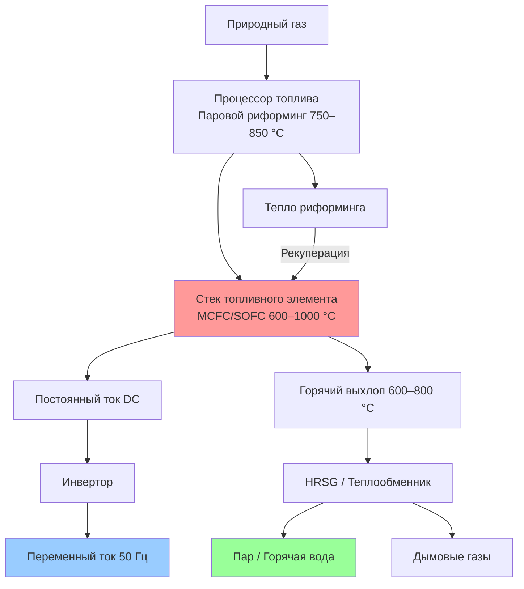

Топливные элементы (fuel cells) электрохимически преобразуют химическую энергию топлива непосредственно в электричество без термодинамического цикла сгорания, достигая электрического КПД 40–60 % при одновременном производстве высококачественной тепловой энергии. Отсутствие ограничений цикла Карно, минимальное число движущихся частей и ультранизкие выбросы делают топливные элементы привлекательными для объектов, где приоритет отдаётся высокому КПД, качеству электроэнергии и экологическим показателям, несмотря на более высокие капитальные затраты по сравнению с технологиями сгорания. Согласно ASHRAE Handbook HVAC Systems and Equipment, топливные элементы всё шире применяются в когенерационных системах для коммерческих и промышленных объектов.

## Электрохимические принципы и термодинамическая эффективность

Топливные элементы работают путём электрохимического окисления водорода на аноде и восстановления кислорода на катоде:


\text{H}_2 + \tfrac{1}{2}\text{O}_2 \rightarrow \text{H}_2\text{O} + \text{электрическая энергия} + \text{тепло}


Максимальный теоретический КПД основан на свободной энергии Гиббса (Gibbs free energy), а не на пределе Карно:


\eta_\text{max} = \frac{\Delta G}{\Delta H} = \frac{-237\ \text{кДж/моль}}{-286\ \text{кДж/моль}} = 0{,}83


Этот теоретический предел 83 % превышает КПД Карно для низкотемпературных тепловых машин, что объясняет превосходный электрический КПД топливных элементов. Практические потери от перенапряжений электродов (overpotentials), ионного сопротивления и диффузионных ограничений снижают реальный КПД до 40–60 %.

Напряжение элемента под нагрузкой:


V_\text{cell} = E_\text{rev} - \eta_\text{act} - \eta_\text{ohmic} - \eta_\text{conc}


где $E_\text{rev} = 1{,}23$ В — обратимый потенциал при 25 °C; $\eta_\text{act}$ — активационные потери (кинетика электродов); $\eta_\text{ohmic}$ — омические потери электролита и контактов; $\eta_\text{conc}$ — концентрационные потери при истощении реагентов у поверхности электрода. Перенапряжения нарастают с плотностью тока, формируя компромисс между напряжением (КПД) и удельной мощностью.

## Типы топливных элементов и рабочие характеристики

### Фосфорнокислые топливные элементы — PAFC

PAFC (Phosphoric Acid Fuel Cell) работают при температуре 150–220 °C на жидком фосфорнокислотном электролите. Это наиболее коммерчески зрелая технология для распределённой генерации. Системы PAFC достигают электрического КПД 40–42 % с тепловым выходом при 60–82 °C, пригодным для горячего водоснабжения или пара низкого давления.

PAFC требуют водородосодержащего топлива, получаемого паровым риформингом природного газа (steam reforming):


\text{CH}_4 + \text{H}_2\text{O} \rightarrow 3\,\text{H}_2 + \text{CO}



\text{CO} + \text{H}_2\text{O} \rightarrow \text{H}_2 + \text{CO}_2


Процессор топлива работает при 750–850 °C, обеспечивая дополнительный тепловой выход. Суммарный КПД когенерации достигает 80–85 %.

### Расплавленно-карбонатные топливные элементы — MCFC

MCFC (Molten Carbonate Fuel Cell) работают при 600–650 °C на расплавленном карбонатном электролите. Высокая температура устраняет необходимость в катализаторах из драгоценных металлов и обеспечивает внутренний риформинг природного газа непосредственно на аноде:


\text{CH}_4 + \text{H}_2\text{O} \rightarrow 4\,\text{H}_2 + \text{CO}_2


Системы MCFC достигают электрического КПД 47–50 % с тепловым выходом при 400–650 °C, пригодным для пара высокого давления или абсорбционного охлаждения. Высокое качество теплового выхода делает MCFC особенно привлекательным для промышленных когенерационных приложений.

### Твёрдооксидные топливные элементы — SOFC

SOFC (Solid Oxide Fuel Cell) работают при 600–1000 °C с твёрдым керамическим электролитом на основе иттрий-стабилизированного диоксида циркония (YSZ — Yttria-Stabilized Zirconia). Очень высокая температура обеспечивает внутренний риформинг, топливную гибкость и электрический КПД 50–60 %.

Горячий выхлоп SOFC (600–800 °C) может приводить в действие газовую турбину нижнего цикла в гибридных конфигурациях (SOFC-GT hybrid), достигая совокупного электрического КПД около 70 %. Гибриды SOFC-GT представляют самую высокоэффективную технологию распределённой генерации из существующих.

### Протонообменные мембранные топливные элементы — PEMFC

PEMFC (Proton Exchange Membrane Fuel Cell) работают при 60–100 °C на полимерной мембране. Низкая рабочая температура обеспечивает быстрый запуск и хорошую динамику, пригодные для транспортных и портативных применений. Тепловой выход 60–80 °C ограничивает когенерационные приложения в зданиях. Электрический КПД составляет 40–50 %.

## Соотношения электрической и тепловой мощности


| Тип | Электрический КПД | Тепловой выход | Температура теплового выхода | PHR (электр./тепло) |
|---|---|---|---|---|
| PEMFC | 40–50 % | 40–50 % | 60–80 °C | 0,9–1,1 |
| PAFC | 40–42 % | 42–45 % | 60–82 °C | 0,90–0,95 |
| MCFC | 47–50 % | 30–35 % | 400–650 °C | 1,4–1,6 |
| SOFC | 50–60 % | 25–30 % | 600–800 °C | 1,8–2,2 |


Высокий электрический КПД MCFC и SOFC означает меньшее количество отходящего тепла и более высокий PHR. Эти технологии предпочтительны для объектов с преобладающими электрическими нагрузками и высокотемпературными тепловыми потребностями.

**Пример расчёта — система PAFC 400 кВт.** При электрическом КПД 41 % и расходе топлива $\dot{Q}_\text{fuel} = 400/0{,}41 = 976$ кВт тепловой выход:


\dot{Q}_\text{thermal} = \dot{Q}_\text{fuel} \cdot \eta_\text{thermal} = 976 \cdot 0{,}43 = 420\ \text{кВт}


При температуре теплового выхода 71 °C этого достаточно для теплоснабжения коммерческого здания площадью 5600–9300 м² согласно нормам EN 12831 и СП 60.13330.

## Подготовка топлива и гибкость по видам топлива

Паровой риформинг преобразует природный газ в водород при 700–850 °C:


\text{CH}_4 + \text{H}_2\text{O} \leftrightarrow 3\,\text{H}_2 + \text{CO} \quad (\Delta H = +206\ \text{кДж/моль})


Эндотермичность реакции требует подвода тепла, которое обычно обеспечивается сжиганием части топлива или катодным выхлопом. CO претерпевает конверсию по реакции водяного газа (water-gas shift):


\text{CO} + \text{H}_2\text{O} \leftrightarrow \text{H}_2 + \text{CO}_2


Низкотемпературные топливные элементы (PAFC, PEMFC) требуют снижения содержания CO ниже 10–50 ppm во избежание отравления катализатора. Высокотемпературные топливные элементы (MCFC, SOFC) допускают CO и могут окислять его непосредственно на аноде. Внутренний риформинг в MCFC и SOFC упрощает систему подготовки топлива и улучшает КПД за счёт интеграции эндотермической реакции в стек для управления температурой.

Биогаз и возобновляемые виды топлива могут питать топливные элементы при надлежащей очистке. Соединения серы должны быть удалены до уровня ниже 1–10 ppm для предотвращения отравления катализатора и деградации электролита. Применяются активированный уголь, слои оксида цинка или биологическое обессеривание.

## Выбросы и экологические характеристики

Топливные элементы производят минимальные выбросы критических загрязнителей, поскольку химическое окисление происходит электрохимически, а не путём высокотемпературного сгорания. Образование теплового NOₓ требует температур выше 760 °C, что значительно превышает рабочие температуры PAFC и PEMFC.

Выбросы NOₓ систем PAFC — 0,005–0,015 кг/МВт·ч, что на порядок ниже, чем у газовых двигателей (0,1–0,2 кг/МВт·ч). Выбросы CO остаются ниже 0,005 кг/МВт·ч.

Выбросы CO₂ определяются КПД системы. Система PAFC с $\eta_e = 40$ % при топливе с удельными выбросами CO₂ 56,1 кг/ГДж:


m_{\text{CO}_2} = \frac{3{,}6\ \text{МДж/кВт·ч}}{0{,}40} \times 56{,}1\ \frac{\text{кг}}{\text{ГДж}} = 505\ \frac{\text{кг CO}_2}{\text{МВт·ч}}


Для сравнения: газовые двигатели с $\eta_e = 36$ % — около 560 кг CO₂/МВт·ч. При вытеснении котельного тепла когенерацией чистое снижение выбросов CO₂ достигает 30–50 % по сравнению с раздельной генерацией.

## Деградация стека и механизмы отказов

Напряжение стека топливного элемента постепенно снижается в процессе эксплуатации из-за спекания катализатора, потери электролита и деградации материалов. Типичные скорости деградации:

- PAFC: 0,1–0,2 % на 1000 ч; ресурс стека 40 000–60 000 ч
- MCFC: 0,15–0,25 % на 1000 ч; ресурс стека 30 000–50 000 ч
- SOFC: 0,1–0,3 % на 1000 ч при непрерывной работе; при частых термических циклах — до 1,0 % на 1000 ч

Для SOFC термический цикл является главным фактором деградации: несоответствие коэффициентов теплового расширения между керамическими материалами вызывает микротрещины при температурных переходах, что диктует работу преимущественно в режиме базовой нагрузки.

Неравномерность напряжения элементов в стеке — индикатор проблем. Допустимое отклонение от средневзвешенного напряжения не должно превышать 50 мВ; большее отклонение свидетельствует о неравномерном распределении потока, дефектах мембраны или деградации электрода.

## Динамический отклик и следование нагрузке

Динамика топливных элементов определяется типом технологии:

- **PEMFC**: быстрый отклик (секунды) благодаря малой тепловой массе и высокой электрохимической кинетике
- **PAFC**: отклик за 30–60 с
- **MCFC**: регулировка нагрузки за 5–15 мин
- **SOFC**: 15–30 мин для значительных изменений нагрузки

Гибридные системы с аккумуляторами или суперконденсаторами улучшают динамический отклик: накопитель обеспечивает мгновенный отклик, а топливный элемент медленно регулирует выход. Такая конфигурация позволяет оказывать сетевые услуги — регулирование частоты и срезание пиков нагрузки.

## Интеграция с системами здания и определение мощности

Системы когенерации на топливных элементах оптимально интегрируются на объектах с устойчивой базовой электрической нагрузкой и совпадающими тепловыми нагрузками. Высокий PHR благоприятствует объектам с существенными электрическими требованиями относительно тепловых потребностей.

Мощность топливного элемента следует выбирать по минимальной базовой электрической нагрузке, а не по пиковой: система при коэффициенте использования 90–100 % максимизирует экономический эффект и минимизирует деградацию от термических циклов. Для объекта со средней электрической нагрузкой 1430 кВт и пиком 2150 кВт рекомендуемая установленная мощность составляет 1300–1430 кВт.

Высокотемпературный выхлоп MCFC и SOFC приводит в действие парогенераторы для промышленных процессов. Система MCFC мощностью 1 МВт производит 2,1–2,6 кг/с насыщенного пара при 1,0 МПа. Выхлоп SOFC при 600–800 °C может генерировать перегретый пар или приводить абсорбционные холодильники для тригенерации (электроэнергия — теплоснабжение — охлаждение).

## Экономический анализ и области применения

Капитальные затраты на топливные элементы варьируются в зависимости от технологии и мощности:

- PAFC: 4000–5000 $/кВт (при установках 400 кВт)
- MCFC: 5000–6000 $/кВт (масштаб МВт)
- SOFC: 6000–7000 $/кВт (снижается с ростом объёмов производства)

Сроки простой окупаемости составляют 8–15 лет. При высоких тарифах на электроэнергию (> 0,15 $/кВт·ч), существенных платежах за мощность и круглогодичных тепловых нагрузках срок окупаемости сокращается до 5–8 лет с учётом доступных субсидий.

Наиболее выгодные области применения:

- центры обработки данных с круглосуточной базовой нагрузкой и умеренной потребностью в охлаждении
- больницы с постоянными электрическими нагрузками и потребностью в горячем водоснабжении
- промышленные объекты с технологическим паром при 1,0–2,8 МПа
- университетские кампусы с системами теплоснабжения и хладоснабжения
- очистные сооружения сточных вод с источником биогаза
- лаборатории с требованиями к чистоте питания и минимальным уровням вибрации

## Требования к техническому обслуживанию

Трудозатраты на техническое обслуживание значительно ниже, чем у установок сгорания, благодаря минимальному числу движущихся частей. Основные виды обслуживания:

- замена воздушного фильтра: ежеквартально или ежегодно
- замена слоя десульфуризации топлива: ежегодно
- обслуживание системы охлаждения: 2 раза в год
- замена катализатора риформера: каждые 3–5 лет
- замена или восстановление стека: каждые 7–15 лет

Затраты на техническое обслуживание составляют 0,5–1,5 цент/кВт·ч — ниже, чем у поршневых двигателей.

## Нормативные документы

- ASHRAE Handbook — HVAC Systems and Equipment, Chapter 7: Cogeneration Systems
- ASHRAE Standard 90.1: Energy Standard for Buildings
- EN 15316: Системы отопления в зданиях
- СП 60.13330.2020: Отопление, вентиляция и кондиционирование воздуха
- IEC 62282: Fuel cell technologies
- DOE Combined Heat and Power Technology Fact Sheet: Fuel Cells
